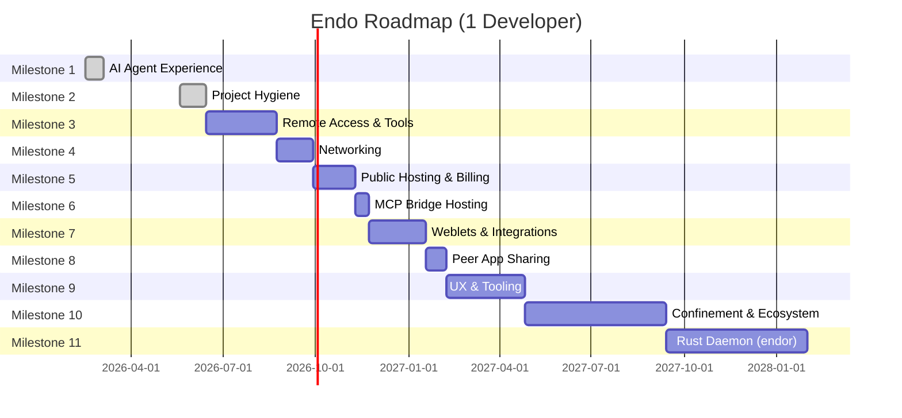

# Endo Design Documents

*Historical groom notes ("Layered on ...") and superseded totals now live in
[`ARCHIVE.md`](ARCHIVE.md). This index keeps only the single current-totals block
below; record each grooming pass by appending its note to `ARCHIVE.md` — do not
layer new groom notes at the top of this file.*

*Recently added or revised:
[ironhorse-daemon-acceptance-sequencing](ironhorse-daemon-acceptance-sequencing.md)
(added 2026-09-14; the ordering proposal for the daemon SES and worker-protocol
acceptance scope PR #1263 fenced off — fifteen architecture-review findings in
six phases, re-verified against tree `65902a8f` rather than carried forward from
the review, which found eight of the fifteen rows already closed or landed and
collapsed the confinement track that was to gate the SES bar into one ungated
Intl residue plus one outstanding F056 Fix clause, leaving two hard gates in six
phases; decides
F127's open question in favour of documenting the `Array.fromAsync` checkpoint
refusal on `PersistentMachine` rather than carrying its rows),
[hosted-agent-broker-oauth](hosted-agent-broker-oauth.md) (added 2026-09-08 and
revised 2026-09-09; credential custody for hosted agent sessions — a broker-held
refreshing OAuth credential with expiry tracking, single-flight exchange, a
generation-checked write-ahead refresh intent, rotate-only write-back, and
account binding — together with the sourced finding on which vendor
subscription modes a proxy may hold a credential for),
[daemon-secret-manager](daemon-secret-manager.md) (added 2026-09-03 and revised
2026-09-09; a singleton, capability-authorized manager for arbitrary secret
bytes, with management facets under the special `@secrets` directory and
individual `SecretBlob` capabilities in the ordinary `secrets` pet store;
uses existing `lookup` and `marshal` formulas, supports replacement,
revocation, metadata-only audit, and a value-blind Secret Blobs Space, and
leaves OAuth, signing, brokers, and consumer-specific policy to layers above
it),
[npm-registry-as-directory-tree](npm-registry-as-directory-tree.md) (added
2026-08-29; supersedes the bespoke `EndoRegistry` capability with an enumerable
registry root, non-enumerable npm and scope lookup hubs, enumerable exact-version
directories, and immutable package-content trees; specifies identical Node and
Endor adapters over their existing mechanics and a readable-tree fixture seam),
[npm-dev-publisher-attenuation](npm-dev-publisher-attenuation.md) (added
2026-07-30; capability-secure npm development publishing: an agent-facing
registry proxy whose entire accepted mutation vocabulary is dev-release-shaped
(explicit package allowlist, prerelease versions, exactly one `dev-*`
dist-tag), gated by attenuated `PublishGrant` capabilities, plus a deterministic
promotion service holding the only upstream npm token, independently
revalidating and promoting byte-identical artifacts with crash-safe
at-least-once semantics, quarantine, and hash-chained audit ledgers; reconciled
with [registry-capability](registry-capability.md) and
[endor-npm-registry-proxy](endor-npm-registry-proxy.md) as the write-path
sibling; demo target `npm.minion.town`),
[endor-registry-proxy-worker](endor-registry-proxy-worker.md) (added
2026-08-06; an XS-hosted JavaScript mapping phase over a virtual read-only CAS
package graph, using compartment-mapper's shared package resolver to emit a
source-only archive; replaces Endor's handwritten `main` / `exports` /
`imports` runtime resolver and establishes one top-level packaged-application
fixture corpus for Node, compartment-mapper, and Endor),
[daemon-endor-sqlite-iterate-streaming](daemon-endor-sqlite-iterate-streaming.md) (added 2026-08-06; a native XS SQLite cursor, `hostSqliteStmtNext(stmt)`, and hardened `StatementSync.iterate(...params)` parity path that binds once and yields one decoded row per host call; the manager pet-store loads its required in-memory map directly from that iterator without a transient all-rows array),
[cbor-encode-decode](cbor-encode-decode.md) (added 2026-07-30;
packaging refactor that splits `@endo/cbor` into `@endo/cbor/encode`
and `@endo/cbor/decode` subpath exports over an internal
`internals.js` holding the shared `canonicalInfo`, `CANONICAL_NAN`,
and the `UINT64_BOUND`/`UINT32_BOUND` domain bounds, so a decoding
consumer retains no encoding machinery and an encoding consumer
retains no decoding machinery; the root `.` re-export is preserved
(`export *` from both halves, whose export name sets are disjoint);
no signature, canonicality, or number-domain change; follow-up to
kriskowal's approving review of
endojs/endo-but-for-bots#885),
[conservative-regexp-subset](conservative-regexp-subset.md) (added 2026-07-10,
revised 2026-07-29; settles review choices: block-determinism safety,
builder-selected corpus-backed limits, whole-string plus contains/composition
modes, XS `xsre` / #600 native direction, and the shared
Node/compartment-mapper `endor` package-export condition; revised 2026-07-15;
pivots the proposed `@endo/regexp` contract to a complete RFC 9485 I-Regexp
parse plus Unicode-independent, resource-safe profile validation; JavaScript
delegates only validated patterns as a ponyfill, while a single fixed corpus
specifies the future Rust backend and an Endor condition must omit the
JavaScript implementation from the import graph),
[ocapn-iroh-netlayer](ocapn-iroh-netlayer.md) (added 2026-07-13,
**Complete** with its implementation; `@endo/ocapn-iroh`, an iroh 1.0
QUIC netlayer for `@endo/ocapn` — the OCapN designator is the peer's
iroh `EndpointId`, dialed through iroh discovery/relays into a mutually
authenticated encrypted QUIC connection carrying netstring-framed OCapN
messages under the `ocapn/netstring/0` ALPN; `@number0/iroh` is optional
and injectable so CI tests run against an in-memory mock, with a
real-endpoint integration test gated behind `ENDO_IROH_INTEGRATION=1`),
[thixotrope](thixotrope.md) (added 2026-07-16, rewritten 2026-09-08;
`@endo/thixotrope` is an orthogonally persistent object-capability machine with an OCapN comms hub,
XS and Ironhorse worker engines, durable guest references and listeners, a persistent workspace,
application installation, and retention diagnostics.
The main design describes current architecture and delivery limitations; potential upgrades,
revocation mechanisms, and persistence-boundary experiments live in the package's designs directory),
[endor-git-bindings](endor-git-bindings.md) (added 2026-07-15,
revised 2026-08-14 after the Minion Town Git-remote review;
a daemon-private, local-only `GitCas` boundary in M11 (Rust Daemon
`endor`) for in-process Git object and compare-and-swap ref
operations over pinned, statically linked libgit2, deliberately distinct from
Endor's SHA-256 `ContentStore`; Zig compiles and cross-links the vendored C
source for the Windows, macOS, and Linux release matrix, while a shared
`rust/endor-git` contract and fixture corpus keep Minion Town's smart-HTTP
service aligned; summary table, M11 row, dependency graph, estimate, totals,
and timeline synced),
[cbor-codec](cbor-codec.md) (added 2026-07-12; shared canonical-CBOR
primitive codec `@endo/cbor` at `packages/cbor/`: hardened functional
write/read primitives for the RFC 8949 subset that slot-machine
(PR #124's `packages/slots/src/cbor.js`) and ocapn
(`packages/ocapn/src/cbor/{encode,decode}.js`) both re-implement
today (canonical minimal-length heads, definite-length byte strings
and arrays, null/simple values, uint heads, strict EOF discipline),
plus the ocapn-only grammar (text strings, maps, tags 2/3 bignums,
float64 with canonical NaN); canonical-always writers with
optionally-strict readers, number-domain heads guarded by
safe-integer checks, byte identity with `rust/endo/slots` enforced by
a shared golden-vector fixture; ocapn keeps its `CborWriter` /
`CborReader` classes and OCapN policy as a consuming adapter, slots
drops its private copy post-#124, daemon `envelope.js` is an optional
third adopter; follow-up to kriskowal's review of
endojs/endo-but-for-bots#124),
[agentry-git-eval-scenarios](agentry-git-eval-scenarios.md)
(added 2026-07-08, revised 2026-07-09 and 2026-07-17; distilled git-rebase-session
evidence into a trimmed three-scenario `@endo/agentry` git code-mode
eval set: `stage-and-commit`, buildable `conflict-rebase`, and
`stack-surgery` as the involved centerpiece whose fixture/scorer land
behind a pending row while live activation depends on
agentry-git-verb-gaps for cherry-pick, amend, reword, autosquash, and
conflict-side selection; its bounded-read section now names the
ReadableBlob `fetch`/`rangeRead`/`rangeReadText` contract as the
filesystem/blob realization of sed-like reads and leaves rendered Git
outputs plus remote exo propagation as follow-ups),
[exo-google-sheets](exo-google-sheets.md) (added 2026-07-06; Google
Sheets connector: `@endo/exo-google-sheets` presents one spreadsheet
(optionally one tab) as passable `Spreadsheet` / `SpreadsheetWriter` /
`SpreadsheetControl` facets over CapTP, with hidden-facet write
attenuation per daemon-mount-capabilities, A1 ranges as confined
selectors, copyable cell scalars under `UNFORMATTED_VALUE`,
header-keyed `readRecords` sugar, batched reads/writes, an in-exo
quota throttle with structured quota errors, and a polling `follow`
change feed that swaps to Drive push channels once endoclaw-webhooks
lands; backed by a plain `@endo/google-sheets` REST client that takes
an injected fetch power (in production the endoclaw-oauth `OAuth`
exo's fetch, over the endoclaw-network-fetch allowlist substrate) so
neither package ever touches a token; first concrete instance of the
M7 OAuth-integration pattern and a template for Gmail / Calendar
siblings),
[sturdy-refs-endor-syscall](sturdy-refs-endor-syscall.md) (added
2026-06-23; design 2 of 2 in a competing pair addressing the
maintainer's directive on PR #500 to land SturdyRefs in
`@endo/pass-style` and thread them through the daemon's
pet-name-path surface; this design rejects worker-local SturdyRef
retention and proposes daemon-side ephemeral retention plus a new
`endor` worker syscall (`retain` / `release`) for cross-turn
retention, contrasting with the parallel `FinalizationRegistry`-
based plan in the sibling design),
[chat-inventory-create-menu](chat-inventory-create-menu.md) (added
2026-06-02, revised 2026-06-08; `+` button at the bottom of the
inventory in Chat opens a pop-over menu listing whole-cloth item
types (filesystem mount, scratch space, passable value, structured
value, new agent); the new-agent flow is a three-pane wizard for
harness selection (Lal / Fae / Genie, surfaced as transitional
until the unified harness lands), inference-source selection
(provider by name, URL hidden; auto-detect for Ollama with model
discovery and download, API-key paste for Anthropic / OpenAI /
OpenRouter, "Ollama Remote" disclosure for a remote daemon, OAuth
deferred to endopi § Phases 3-4), and endowment selection over the
nine-row daemon-capability-bank roster (today: `@fs` mount cap
shippable; the other eight as documented placeholders); subsumes
endo-gateway-mcp's `+ Add agent` Chat affordance as the parent
flow; revised 2026-06-08 to reflect the maintainer's directive
that Chat absorbs the provisioning entry point: lal-fae's
daemon-side substrate persists, but provisioning moves into Chat
via the root host agent pet store, the `@root` endowment, and a
sibling `chat-inventory-encrypted-formulas` design for credential
storage),
[endo-agent-tools](endo-agent-tools.md) and
[agentry-agent-builder](agentry-agent-builder.md) (added 2026-06-03,
rewritten concise 2026-06-25 and reconciled with shipped code: the
#416 pair. `@endo/agent-tools` specifies
the method-guard tool record (now the canonical `ToolRecord`, with the
`Filesystem` read tool reconciled onto it in #523) and the wire-schema
contract, with one petstore the system of record at two granularities
(per-call tool mode, per-session code mode); code mode's TypeScript
declaration renderer landed in #524 (build-time codegen, gated against the
guards). The consuming `@endo/agentry` `defineAgent` is the builder for
building your own lal (dogfooded by reconstructing lal), capped at the
eval-vs-optimize distinction the git code-mode eval harness draws; its core
(single-call `defineAgent` plus the two code-mode presets) landed in #517,
with the wider attenuation/wire/compaction surface still aspirational),
[registry-capability](registry-capability.md) (added 2026-06-02, deprecated
2026-08-29; the shipped bespoke `EndoRegistry` method-call shape and migration
record, superseded by [npm-registry-as-directory-tree](npm-registry-as-directory-tree.md)),
[mvs-resolver](mvs-resolver.md) (added 2026-06-02; layer 2 of 4:
Go-like Minimum Version Selection adapted to JS package versioning,
the resolution-path question (eager single-pass, no per-import
roundtrips), and the lockfile-out-of-scope stance with a sketch of
how lockfile honoring slots in as a constraint pass),
[snapshot-mapper](snapshot-mapper.md) (added 2026-06-02; layer 3 of 4:
`mapSnapshot` in `packages/daemon/`, `makeMountReadPowers`, the
compartment-mapper archive-precedent layout of top-level
`compartment-map.json` plus peer directories named by package, and the
npm-shape <-> compartment-map-shape translation table),
[daemon-worker-import-from-mount](daemon-worker-import-from-mount.md)
(added 2026-05-22, revised 2026-06-02; restructured into layer 4 of 4
(integration layer) after kriskowal CHANGES_REQUESTED on #358; the
original 1164-line monolith is repurposed; this layer carries
`makeFromPackage` host method, `makeFromMount` dispatcher, worker
dispatch body, CLI shape, XS bridging, and the architecture diagram
that stitches the three preceding layers),
[gateway-package](gateway-package.md) (added 2026-05-22, revised
2026-06-29 for root-owned system-service lifecycle, `endo gateway`
start/stop/log, and the 8920 HTTP default per PR #343 review;
overarching `@endo/gateway` package design integrating the
gateway/weblet/Noise cluster across ten feature subsystems),
[daemon-git-next-steps](daemon-git-next-steps.md) (added 2026-05-27,
reframed 2026-05-29, slimmed 2026-06-03 to its forward-looking kernel;
the version-controlled filesystem loop milestone
roadmap over the canonical git trio — the north-star agent loop
(provide workspace -> read/list/edit -> status/diff -> commit -> pull/push
-> inspect history via `filesystemAt(ref)`) and an explicit
content/versioning/network/historical-read/bulk-storage layer split.
The genuinely-future work is now `- [ ]` items: the worked end-to-end
bot-fork reference flow, the `provideGitClone` bootstrap + identity
boundary (-> a future `daemon-git-clone.md`), and the
`tree(ref)`/`filesystemAt(ref)` reconciliation into one canonical
vocabulary (a focused edit to `daemon-git-capability`). The agent-tools
layer is deferred to #416; shipped-code follow-ups live in issue #378),
[daemon-git-capability](daemon-git-capability.md) (added 2026-05-18,
revised 2026-05-29; implementation progress section reads the trio as
shipped (Phases 0-5 + bulk-archive via #364/#365/#367), keeps the
pin-algorithm caching forward-design note, and points the fix/test/
legibility follow-ups to issue #378),
[daemon-git-remotes](daemon-git-remotes.md) (added 2026-05-18, revised
2026-05-29; implementation progress section reads #365 + #368 as shipped,
keeps the `LC_ALL=C` and porcelain-flag-gating design spec and the
`setUrl` / Windows-port forward-design, and points the fix/test/
legibility follow-ups to issue #378),
[daemon-mount-capabilities](daemon-mount-capabilities.md) (added
2026-05-18, revised 2026-05-20; concrete completion plan for
`EndoMount`, mount-scoped entry descriptors as values, snapshotting,
and trusted physical-backing provenance as a hidden Exo facet),
[patterns-diagnostic-feedback](patterns-diagnostic-feedback.md) (added
2026-05-19, revised 2026-05-20; opt-in
`@endo/patterns/explain-mismatch.js` submodule with a Rust-compiler-style
indented line-art renderer that reads the existing `applyLabelingError`
cause chain),
[endopi](endopi.md) (added 2026-05-15;
comparative analysis of the pi agent harness against endo's daemon +
chat + familiar + cli; sibling of `endoclaw.md`; spins out eight
gap-closing designs prefixed `endopi-*`),
[hardened-text-codecs-shim](hardened-text-codecs-shim.md)
(added 2026-05-06; permits `TextEncoder`/`TextDecoder` in SES intrinsics),
[hardened-url-shim](hardened-url-shim.md) (added 2026-05-06; vetted-shim
treatment for the `URL` constructor and `URLSearchParams`).*

*Earlier additions: [daemon-make-archive](daemon-make-archive.md) (added
2026-04-23), [filesystem-watchers](filesystem-watchers.md) (added
2026-05-07), [endo-posix-sandbox](endo-posix-sandbox.md) (added
2026-05-07; roadmap-calibration record for the `packages/sandbox` branch),
[exo-zip-package](exo-zip-package.md) (added 2026-05-08; PR #128 reshape
blocker), [pass-style-promise](pass-style-promise.md) (added 2026-05-10;
synthesizes endojs/endo#1312 and endojs/endo#1652 for issue #168),
[trust-on-first-bind](trust-on-first-bind.md) (added 2026-05-08;
shared capability-policy adapter referenced by HTTP client and browser
controller designs; addendum to PR #144 HttpClient),
[break-dev-dependency-cycles](break-dev-dependency-cycles.md) (added
2026-05-11; synthetic test-package factoring to retire the workspace
devDep SCC; follow-up to PR #121; Cuts 2-4 merged via PRs #209, #210,
#211 with Cut 5 open as PR #247),
[cli-http-client](cli-http-client.md) (added 2026-05-09; PR #144 design
revision under `endo http` subcommand tree),
[retention-path-notation](retention-path-notation.md) (added 2026-05-10;
PR #151 row-format unblocker; sibling of
[daemon-retention-paths](daemon-retention-paths.md)),
[cli-store-verb-text-modes](cli-store-verb-text-modes.md) (added
2026-05-08; reshape blocker for PR #128),
[unhandled-rejection-display](unhandled-rejection-display.md) (added
2026-05-10; impl landed via PR #187 closing issue #171),
[cli-edit-verb](cli-edit-verb.md) (added 2026-05-08; sibling of PR #153
`cli-store-verb-text-modes`; hashline patches for AI agents),
[ocapn-noise-session-reconnect](ocapn-noise-session-reconnect.md) (added
2026-05-14; amends [ocapn-noise-network](ocapn-noise-network.md) with a
meta-TCP session layer per erights' 2026-05-14 framing on liveness and
reconnect),
[forge-gap-analysis](forge-gap-analysis.md) (added 2026-05-20;
exploratory reference comparing `antoinezambelli/forge` to Endo's
LLM-agent stack).*

## Summary

| Design | Created | Updated | Status |
|--------|---------|---------|--------|
| [hosted-agent-broker-oauth](hosted-agent-broker-oauth.md) | 2026-09-08 | 2026-09-09 | In Progress |
| [gateway-sites-publication](gateway-sites-publication.md) | 2026-07-20 | 2026-07-20 | Proposed |
| [npm-dev-publisher-attenuation](npm-dev-publisher-attenuation.md) | 2026-07-30 | 2026-08-29 | Proposed |
| [cap-std-watch](cap-std-watch.md) | 2026-07-18 | 2026-07-18 | Proposed |
| [store-write-file](store-write-file.md) | 2026-07-15 | 2026-07-15 | Not Started |
| [buffered-channel-exo-stream-consolidation](buffered-channel-exo-stream-consolidation.md) | 2026-07-06 | 2026-07-24 | **Complete** |
| [endo-fs-backend-seam](endo-fs-backend-seam.md) | 2026-05-28 | 2026-05-28 | **Complete** |
| [chat-color-schemes](chat-color-schemes.md) | 2026-02-26 | 2026-02-26 | **Complete** |
| [cli-store-verb-text-modes](cli-store-verb-text-modes.md) | 2026-05-08 | 2026-05-18 | In Progress |
| [cli-edit-verb](cli-edit-verb.md) | 2026-05-08 | 2026-08-23 | In Progress |
| [chat-command-bar](chat-command-bar.md) | 2026-03-02 | 2026-03-02 | **Complete** |
| [chat-components](chat-components.md) | 2026-03-02 | 2026-03-02 | **Complete** |
| [chat-high-contrast-mode](chat-high-contrast-mode.md) | 2026-02-26 | 2026-02-26 | **Complete** |
| [chat-invariants](chat-invariants.md) | 2026-03-02 | 2026-03-02 | **Complete** |
| [chat-per-space-color-scheme](chat-per-space-color-scheme.md) | 2026-02-26 | 2026-02-26 | **Complete** |
| [chat-focus-message](chat-focus-message.md) | 2026-03-04 | 2026-05-19 | **Complete** |
| [chat-markdown-render](chat-markdown-render.md) | 2026-03-03 | 2026-05-19 | **Complete** |
| [chat-pending-commands](chat-pending-commands.md) | 2026-03-11 | 2026-07-20 | **Complete** |
| [chat-playwright-smoke](chat-playwright-smoke.md) | 2026-05-06 | 2026-05-18 | **Complete** |
| [chat-rename-dismiss-to-clear](chat-rename-dismiss-to-clear.md) | 2026-03-03 | 2026-05-19 | **Complete** |
| [chat-slot-slash-commands](chat-slot-slash-commands.md) | 2026-04-23 | 2026-05-06 | Proposed |
| [chat-view-edit-commands](chat-view-edit-commands.md) | 2026-03-21 | 2026-05-19 | **Complete** |
| [chat-edit-message-ui](chat-edit-message-ui.md) | 2026-05-05 | 2026-05-05 | Not Started |
| [chat-inventory-create-menu](chat-inventory-create-menu.md) | 2026-06-02 | 2026-06-14 | Not Started |
| [chat-reply-chain-visualization](chat-reply-chain-visualization.md) | 2026-02-23 | 2026-02-28 | Deprecated |
| [chat-spaces-home](chat-spaces-home.md) | 2026-03-02 | 2026-03-02 | **Complete** |
| [chat-spaces-gutter](chat-spaces-gutter.md) | 2026-02-21 | 2026-02-26 | **Complete** |
| [chat-spaces-inbox](chat-spaces-inbox.md) | 2026-02-21 | 2026-02-24 | **Complete** |
| [chat-test-coverage](chat-test-coverage.md) | 2026-03-02 | 2026-03-02 | **Complete** |
| [floot-daemon-owned-turns](floot-daemon-owned-turns.md) | 2026-08-10 | 2026-09-07 | **Complete** |
| [daemon-256-bit-identifiers](daemon-256-bit-identifiers.md) | 2026-02-24 | 2026-03-02 | **Complete** |
| [daemon-agent-network-identity](daemon-agent-network-identity.md) | 2026-03-02 | 2026-03-18 | In Progress |
| [daemon-agent-tools](daemon-agent-tools.md) | 2026-03-02 | 2026-08-06 | In Progress |
| [agent-follow-stream-tool](agent-follow-stream-tool.md) | 2026-05-12 | 2026-08-31 | Proposed |
| [daemon-ocapn-external-connectivity](daemon-ocapn-external-connectivity.md) | 2026-05-21 | 2026-05-21 | In Progress |
| [daemon-commands-as-messages](daemon-commands-as-messages.md) | 2026-03-11 | 2026-03-11 | Not Started |
| [daemon-capability-bank](daemon-capability-bank.md) | 2026-02-15 | 2026-09-03 | Not Started |
| [daemon-secret-manager](daemon-secret-manager.md) | 2026-09-03 | 2026-09-09 | Implemented (local backend) |
| [daemon-checkin-checkout](daemon-checkin-checkout.md) | 2026-03-17 | 2026-05-19 | **Complete** |
| [daemon-capability-filesystem](daemon-capability-filesystem.md) | 2026-02-15 | 2026-05-19 | Reference |
| [daemon-content-store-gc](daemon-content-store-gc.md) | 2026-03-20 | 2026-05-08 | **Complete** |
| [daemon-git-capability](daemon-git-capability.md) | 2026-05-18 | 2026-07-06 | In Progress |
| [exo-git-follow-root-advancement](exo-git-follow-root-advancement.md) | 2026-07-29 | 2026-08-24 | Proposed |
| [daemon-git-remotes](daemon-git-remotes.md) | 2026-05-18 | 2026-05-29 | In Progress |
| [daemon-git-next-steps](daemon-git-next-steps.md) | 2026-05-27 | 2026-06-03 | In Progress |
| [endo-content-locators-magnet-urn](endo-content-locators-magnet-urn.md) | 2026-07-10 | 2026-07-10 | Not Started |
| [endo-fs-from-git](endo-fs-from-git.md) | 2026-05-28 | 2026-05-28 | In Progress |
| [daemon-message-streaming](daemon-message-streaming.md) | 2026-03-26 | 2026-07-22 | **Complete** (PR #125: `editMessage`, `messageHistory`, `done`; supersedes the retired `streamReply` sketch) |
| [daemon-mount](daemon-mount.md) | 2026-03-20 | 2026-05-27 | In Progress |
| [daemon-mount-capabilities](daemon-mount-capabilities.md) | 2026-05-18 | 2026-05-27 | **Complete** |
| [daemon-worker-import-from-mount](daemon-worker-import-from-mount.md) | 2026-05-22 | 2026-06-02 | Not Started |
| [registry-capability](registry-capability.md) | 2026-06-02 | 2026-08-29 | Deprecated |
| [npm-registry-as-directory-tree](npm-registry-as-directory-tree.md) | 2026-08-29 | 2026-08-29 | Not Started |
| [mvs-resolver](mvs-resolver.md) | 2026-06-02 | 2026-06-02 | Not Started |
| [snapshot-mapper](snapshot-mapper.md) | 2026-06-02 | 2026-06-02 | Not Started |
| [filesystem-watchers](filesystem-watchers.md) | 2026-05-07 | 2026-05-07 | Not Started |
| [platform-fs](platform-fs.md) | 2026-03-18 | 2026-05-19 | **Complete** |
| [fs-interface-reconciliation](fs-interface-reconciliation.md) | 2026-06-18 | 2026-06-19 | In Progress |
| [fs-interface-consolidation](fs-interface-consolidation.md) | 2026-06-18 | 2026-07-15 | In Progress |
| [daemon-capability-persona](daemon-capability-persona.md) | 2026-02-16 | 2026-02-24 | Not Started |
| [daemon-cross-peer-gc](daemon-cross-peer-gc.md) | 2026-03-07 | 2026-04-29 | **Complete** |
| [daemon-retention-paths](daemon-retention-paths.md) | 2026-04-30 | 2026-05-19 | In Progress (PR #284) |
| [retention-path-notation](retention-path-notation.md) | 2026-05-10 | 2026-05-19 | Reference |
| [runtime-container-fs-mount](runtime-container-fs-mount.md) | 2026-08-10 | 2026-09-08 | **Complete** |
| [sturdy-refs-endor-syscall](sturdy-refs-endor-syscall.md) | 2026-06-23 | 2026-06-26 | Not Started |
| [daemon-rename-to-manager](daemon-rename-to-manager.md) | 2026-05-04 | 2026-05-05 | Not Started |
| [daemon-guest-eval-simplification](daemon-guest-eval-simplification.md) | 2026-03-21 | 2026-05-04 | **Implemented** |
| [daemon-docker-selfhost](daemon-docker-selfhost.md) | 2026-03-02 | 2026-03-02 | Not Started |
| [daemon-capability-bus](daemon-capability-bus.md) | 2026-02-25 | 2026-04-11 | In Progress |
| [daemon-sqlite-shutdown-checkpoint](daemon-sqlite-shutdown-checkpoint.md) | 2026-08-06 | 2026-08-06 | Not Started |
| [daemon-endo-rust-sqlite](daemon-endo-rust-sqlite.md) | 2026-04-14 | 2026-08-06 | **Complete** |
| [daemon-endor-sqlite-iterate-streaming](daemon-endor-sqlite-iterate-streaming.md) | 2026-08-06 | — | Proposed |
| [daemon-xs-worker-debugger](daemon-xs-worker-debugger.md) | 2026-04-14 | 2026-04-15 | In Progress |
| [daemon-endor-architecture](daemon-endor-architecture.md) | 2026-04-16 | 2026-04-16 | Active |
| [daemon-xs-worker-snapshot](daemon-xs-worker-snapshot.md) | 2026-04-15 | 2026-04-16 | In Progress |
| [daemon-rust-xs-performance](daemon-rust-xs-performance.md) | 2026-04-16 | 2026-04-16 | Active |
| [daemon-xs-worker-metering](daemon-xs-worker-metering.md) | 2026-04-17 | 2026-04-17 | **Complete** |
| [daemon-debug-worker-restart](daemon-debug-worker-restart.md) | 2026-04-17 | 2026-04-17 | Not Started |
| [daemon-cas-management](daemon-cas-management.md) | 2026-04-17 | 2026-04-17 | In Progress |
| [endor-git-bindings](endor-git-bindings.md) | 2026-07-15 | 2026-08-14 | Proposed |
| [ironhorse-snapshot-schema](ironhorse-snapshot-schema.md) | 2026-09-08 | — | Reference |
| [ironhorse-snapshot-schema-surgery](ironhorse-snapshot-schema-surgery.md) | 2026-09-08 | 2026-09-08 | Reference |
| [ironhorse-snapshot-schema-gc](ironhorse-snapshot-schema-gc.md) | 2026-09-08 | 2026-09-08 | Proposed |
| [ironhorse-snapshot-schema-debugging](ironhorse-snapshot-schema-debugging.md) | 2026-09-08 | 2026-09-08 | Proposed |
| [ironhorse-snapshot-store-seam](ironhorse-snapshot-store-seam.md) | 2026-08-06 | 2026-09-14 | In Progress |
| [ironhorse-debugger-recovery-and-uncaught](ironhorse-debugger-recovery-and-uncaught.md) | 2026-08-12 | 2026-08-14 | Proposed |
| [ironhorse-known-defects](ironhorse-known-defects.md) | 2026-09-04 | 2026-09-07 | Reference |
| [ironhorse-engine-trait-research](ironhorse-engine-trait-research.md) | 2026-09-08 | — | Reference |
| [ironhorse-w6-decisions](ironhorse-w6-decisions.md) | 2026-09-09 | 2026-09-13 | Active |
| [ironhorse-daemon-acceptance-sequencing](ironhorse-daemon-acceptance-sequencing.md) | 2026-09-14 | 2026-09-14 | Proposed |
| [ironhorse-ses-compartment-equivalence](ironhorse-ses-compartment-equivalence.md) | 2026-09-15 | 2026-09-15 | Proposed |
| [ironhorse-quiescent-gc](ironhorse-quiescent-gc.md) | 2026-09-10 | 2026-09-10 | **Complete** |
| [ironhorse-engine](ironhorse-engine.md) | 2026-07-02 | 2026-09-15 | Approved |
| [ironhorse-meter-opcode-cost-instrumentation](ironhorse-meter-opcode-cost-instrumentation.md) | 2026-07-05 | 2026-09-09 | In Progress |
| [ironhorse-test262-convergence](ironhorse-test262-convergence.md) | 2026-07-05 | 2026-09-08 | In Progress |
| [ironhorse-proper-tail-calls](ironhorse-proper-tail-calls.md) | 2026-09-17 | — | Proposed |
| [test262-fixture-consolidation](test262-fixture-consolidation.md) | 2026-08-06 | 2026-08-14 | In Progress |
| [platform-neutral-hash](platform-neutral-hash.md) | 2026-07-22 | 2026-08-12 | In Progress |
| [conservative-regexp-subset](conservative-regexp-subset.md) | 2026-07-10 | 2026-07-29 | Not Started |
| [ironhorse-panic](ironhorse-panic.md) | 2026-08-17 | 2026-09-07 | Proposed |
| [endor-run-expanded](endor-run-expanded.md) | 2026-04-17 | 2026-08-27 | In Progress |
| [endor-npm-registry-proxy](endor-npm-registry-proxy.md) | 2026-04-17 | 2026-08-01 | **Complete** |
| [endor-registry-proxy-worker](endor-registry-proxy-worker.md) | 2026-08-06 | — | Proposed |
| [daemon-make-archive](daemon-make-archive.md) | 2026-04-23 | 2026-04-24 | In Progress |
| [daemon-form-request](daemon-form-request.md) | 2026-02-25 | 2026-03-02 | **Complete** |
| [endoclaw](endoclaw.md) | 2026-03-03 | 2026-03-03 | Reference |
| [endopi](endopi.md) | 2026-05-15 | 2026-06-25 | Reference |
| [endopi-edit-tool](endopi-edit-tool.md) | 2026-05-15 | 2026-07-10 | In Progress |
| [endopi-jsonl-transcript-format](endopi-jsonl-transcript-format.md) | 2026-05-15 | 2026-05-15 | Proposed |
| [endopi-provider-registry-and-oauth](endopi-provider-registry-and-oauth.md) | 2026-05-15 | 2026-05-15 | Proposed (partially satisfied by `packages/genie`) |
| [endopi-skills-markdown-format](endopi-skills-markdown-format.md) | 2026-05-15 | 2026-05-15 | Proposed |
| [endopi-prompt-templates](endopi-prompt-templates.md) | 2026-05-15 | 2026-05-15 | Proposed |
| [endopi-iterative-compaction](endopi-iterative-compaction.md) | 2026-05-15 | 2026-05-15 | Proposed (partially satisfied by `packages/genie`) |
| [endopi-stdio-rpc-bridge](endopi-stdio-rpc-bridge.md) | 2026-05-15 | 2026-05-15 | Proposed |
| [endopi-extension-package-manifest](endopi-extension-package-manifest.md) | 2026-05-15 | 2026-05-15 | Proposed |
| [endoclaw-browser](endoclaw-browser.md) | 2026-03-03 | 2026-03-03 | Not Started |
| [endoclaw-channel-bridges](endoclaw-channel-bridges.md) | 2026-03-03 | 2026-03-03 | Not Started |
| [endoclaw-network-fetch](endoclaw-network-fetch.md) | 2026-03-03 | 2026-07-13 | Superseded by [endo-fetch](endo-fetch.md) |
| [endo-fetch](endo-fetch.md) | 2026-07-13 | 2026-07-13 | Not Started |
| [endoclaw-notifications](endoclaw-notifications.md) | 2026-03-03 | 2026-03-03 | Not Started |
| [endoclaw-oauth](endoclaw-oauth.md) | 2026-03-03 | 2026-03-03 | Not Started |
| [endoclaw-proactive-messages](endoclaw-proactive-messages.md) | 2026-03-03 | 2026-03-03 | Not Started |
| [endoclaw-skill-registry](endoclaw-skill-registry.md) | 2026-03-03 | 2026-03-03 | Not Started |
| [endoclaw-timer](endoclaw-timer.md) | 2026-03-03 | 2026-07-10 | Superseded by [endo-reminder](endo-reminder.md) |
| [endo-reminder](endo-reminder.md) | 2026-07-10 | 2026-07-10 | Not Started |
| [endoclaw-voice](endoclaw-voice.md) | 2026-03-03 | 2026-03-03 | Not Started |
| [endoclaw-webhooks](endoclaw-webhooks.md) | 2026-03-03 | 2026-03-03 | Not Started |
| [daemon-locator-terminology](daemon-locator-terminology.md) | 2026-02-24 | 2026-05-10 | In Progress |
| [daemon-os-sandbox-plugin](daemon-os-sandbox-plugin.md) | 2026-02-15 | 2026-03-19 | Superseded by [endo-posix-sandbox](endo-posix-sandbox.md) |
| [endo-posix-sandbox](endo-posix-sandbox.md) | 2026-05-07 | 2026-05-07 | In Progress (Phase 3) |
| [daemon-value-message](daemon-value-message.md) | 2026-03-02 | 2026-03-03 | **Complete** |
| [daemon-web-gateway](daemon-web-gateway.md) | 2026-03-11 | 2026-03-11 | **Complete** |
| [daemon-weblet-application](daemon-weblet-application.md) | 2026-02-24 | 2026-02-25 | Not Started |
| [exo-google-sheets](exo-google-sheets.md) | 2026-07-06 | 2026-07-06 | Proposed |
| [exo-zip-package](exo-zip-package.md) | 2026-05-08 | 2026-05-08 | Proposed (PR #154 open questions resolved) |
| [familiar-bundled-agents](familiar-bundled-agents.md) | 2026-03-02 | 2026-03-05 | **Complete** |
| [familiar-chat-weblet-hosting](familiar-chat-weblet-hosting.md) | 2026-02-14 | 2026-02-26 | Not Started |
| [familiar-daemon-bundling](familiar-daemon-bundling.md) | 2026-02-14 | 2026-03-05 | **Complete** |
| [familiar-electron-shell](familiar-electron-shell.md) | 2026-02-14 | 2026-02-26 | **Complete** |
| [familiar-gateway-migration](familiar-gateway-migration.md) | 2026-02-14 | 2026-02-26 | **Complete** |
| [familiar-localhttp-protocol](familiar-localhttp-protocol.md) | 2026-02-24 | 2026-02-25 | In Progress (partially implemented) |
| [familiar-unified-weblet-server](familiar-unified-weblet-server.md) | 2026-02-14 | 2026-05-06 | In Progress |
| [formula-inspector](formula-inspector.md) | 2026-02-14 | 2026-06-13 | In Progress |
| [gateway-bearer-token-auth](gateway-bearer-token-auth.md) | 2026-03-02 | 2026-03-06 | **Implemented** |
| [hardened-text-codecs-shim](hardened-text-codecs-shim.md) | 2026-05-04 | 2026-05-04 | Not Started |
| [hardened-url-shim](hardened-url-shim.md) | 2026-05-04 | 2026-05-04 | Not Started |
| [inventory-cancel-and-liveness](inventory-cancel-and-liveness.md) | 2026-02-14 | 2026-03-13 | Not Started |
| [inventory-drag-and-drop](inventory-drag-and-drop.md) | 2026-02-14 | 2026-02-24 | Not Started |
| [inventory-grouping-by-type](inventory-grouping-by-type.md) | 2026-02-14 | 2026-06-28 | In Progress |
| [lal-fae-form-provisioning](lal-fae-form-provisioning.md) | 2026-03-02 | 2026-03-05 | **Complete** |
| [lal-reply-chain-transcripts](lal-reply-chain-transcripts.md) | 2026-02-26 | 2026-03-05 | **Complete** |
| [lal-transcript-memory-management](lal-transcript-memory-management.md) | 2026-03-05 | 2026-03-05 | Not Started |
| [ocapn-iroh-netlayer](ocapn-iroh-netlayer.md) | 2026-07-13 | 2026-07-13 | **Complete** |
| [ocapn-network-transport-separation](ocapn-network-transport-separation.md) | 2026-02-14 | 2026-02-24 | In Progress |
| [ocapn-noise-cryptographic-review](ocapn-noise-cryptographic-review.md) | 2026-02-14 | 2026-02-24 | Not Started |
| [ocapn-noise-key-only-session-boundary](ocapn-noise-key-only-session-boundary.md) | 2026-07-18 | 2026-07-19 | Proposed |
| [ocapn-noise-network](ocapn-noise-network.md) | 2026-02-14 | 2026-05-18 | **Complete** |
| [ocapn-noise-session-reconnect](ocapn-noise-session-reconnect.md) | 2026-05-14 | 2026-05-19 | Proposed |
| [thixotrope](thixotrope.md) | 2026-07-16 | 2026-09-08 | In Progress |
| [ocapn-tcp-for-test-extraction](ocapn-tcp-for-test-extraction.md) | 2026-02-14 | 2026-02-24 | Not Started |
| [ocapn-tcp-syrup-framing](ocapn-tcp-syrup-framing.md) | 2026-04-23 | 2026-05-06 | Not Started |
| [syrup-frame](syrup-frame.md) | 2026-05-04 | 2026-05-06 | Deprecated |
| [cbor-frame](cbor-frame.md) | 2026-05-04 | 2026-07-15 | Implemented (PR #288) |
| [cbor-codec](cbor-codec.md) | 2026-07-12 | 2026-07-28 | Phase 1 implemented |
| [trust-on-first-bind](trust-on-first-bind.md) | 2026-05-08 | 2026-05-10 | Reference |
| [outliner-design-doc](outliner-design-doc.md) | 2026-03-17 | 2026-03-18 | In Progress |
| [patterns-diagnostic-feedback](patterns-diagnostic-feedback.md) | 2026-05-19 | 2026-05-20 | Proposed |
| [base64-native-fallthrough](base64-native-fallthrough.md) | 2026-04-23 | 2026-05-18 | **Complete** |
| [hardener-indexed-cardinality](hardener-indexed-cardinality.md) | 2026-08-24 | 2026-08-25 | Proposed |
| [ci-no-npm-lifecycle](ci-no-npm-lifecycle.md) | 2026-04-23 | 2026-05-18 | **Complete** |
| [break-dev-dependency-cycles](break-dev-dependency-cycles.md) | 2026-05-11 | 2026-06-15 | **Complete** (on `llm`) |
| [cli-http-client](cli-http-client.md) | 2026-05-09 | 2026-07-13 | Proposed (PR #144 design revision; formula packaging superseded in part by [endo-fetch](endo-fetch.md)) |
| [endor-bus-tui](endor-bus-tui.md) | 2026-04-23 | 2026-04-23 | Not Started |
| [endor-native-zip-xs](endor-native-zip-xs.md) | 2026-07-22 | 2026-07-22 | Proposed |
| [endor-tui](endor-tui.md) | 2026-04-23 | 2026-04-23 | Not Started |
| [hex-package](hex-package.md) | 2026-04-23 | 2026-05-18 | **Complete** |
| [endo-bytes](endo-bytes.md) | 2026-05-08 | 2026-05-10 | Implemented |
| [endo-gateway-mcp](endo-gateway-mcp.md) | 2026-05-29 | 2026-05-29 | Not Started |
| [endo-claude](endo-claude.md) | 2026-08-16 | 2026-08-16 | Not Started |
| [endo-workflow](endo-workflow.md) | 2026-08-17 | 2026-09-02 | In Progress |
| [floot-admin-deploy-workflows](floot-admin-deploy-workflows.md) | 2026-08-18 | 2026-09-07 | In Progress |
| [hosted-endo-self-update-loop](hosted-endo-self-update-loop.md) | 2026-08-07 | 2026-09-08 | **Complete** |
| [gateway-package](gateway-package.md) | 2026-05-22 | 2026-06-29 | Proposed (absorbs the removed endo-gateway design) |
| [agent-tools-mount-fs-tools](agent-tools-mount-fs-tools.md) | 2026-06-01 | 2026-06-25 | Superseded |
| [endo-agent-tools](endo-agent-tools.md) | 2026-06-03 | 2026-06-25 | In Progress |
| [agentry-agent-builder](agentry-agent-builder.md) | 2026-06-03 | 2026-08-18 | In Progress |
| [agentry-git-verb-gaps](agentry-git-verb-gaps.md) | 2026-07-08 | 2026-08-05 | In Progress |
| [agentry-git-eval-scenarios](agentry-git-eval-scenarios.md) | 2026-07-08 | 2026-07-17 | Not Started |
| [genie-integration](genie-integration.md) | 2026-05-02 | 2026-08-27 | Largely realized (retrospective; genie retired) |
| [unhandled-rejection-display](unhandled-rejection-display.md) | 2026-05-10 | 2026-05-18 | **Complete** |
| [ui-view-not-driver](ui-view-not-driver.md) | 2026-08-10 | 2026-09-07 | Proposed |
| [weblet-next](weblet-next.md) | 2026-03-24 | 2026-03-24 | Reference |
| [workers-panel](workers-panel.md) | 2026-02-14 | 2026-02-24 | Not Started |
| [pass-style-promise](pass-style-promise.md) | 2026-05-10 | 2026-05-10 | Proposed |
| [namehub-interface-unification](namehub-interface-unification.md) | 2026-05-07 | 2026-05-07 | Proposed |
| [forge-gap-analysis](forge-gap-analysis.md) | 2026-05-20 | 2026-05-20 | Reference (exploratory) |
| [captp-error-identification](captp-error-identification.md) | 2026-07-02 | 2026-07-02 | Proposed |
| [daemon-engo-supervisor](daemon-engo-supervisor.md) | 2026-02-25 | 2026-02-25 | Not Started |
| [daemon-locator-reference](daemon-locator-reference.md) | 2026-03-18 | 2026-05-10 | Reference |
| [endo-fs-seam-review-followups](endo-fs-seam-review-followups.md) | 2026-06-18 | 2026-06-18 | **Complete** |
| [http-confine](http-confine.md) | 2026-07-08 | 2026-07-08 | Proposed |
| [inter-package-plain-re-exports](inter-package-plain-re-exports.md) | 2026-06-27 | 2026-06-27 | Not Started |
| [intra-package-plain-re-exports](intra-package-plain-re-exports.md) | 2026-06-26 | 2026-06-30 | Not Started |
| [notifier-pubsub-migration](notifier-pubsub-migration.md) | 2026-06-23 | 2026-06-26 | Proposed |
| [platform-range-and-tree-reads](platform-range-and-tree-reads.md) | 2026-07-12 | 2026-07-12 | In Progress |
| [readableblob-range-attenuation](readableblob-range-attenuation.md) | 2026-07-22 | 2026-07-22 | Proposed |
| [unredacted-stack-sanctioned-ses-api](unredacted-stack-sanctioned-ses-api.md) | 2026-07-02 | 2026-07-10 | Proposed |
| [worker-rust-xs](worker-rust-xs.md) | 2026-03-23 | 2026-03-23 | Not Started |
| [outliner-design-doc-2](outliner-design-doc-2.md) | 2026-07-22 | 2026-07-22 | Proposed (research note) |
| [outliner_drag_and_drop](outliner_drag_and_drop.md) | 2026-07-22 | 2026-07-22 | Proposed (research note) |
| [OUTLINER_INTERACTION_PATTERNS](OUTLINER_INTERACTION_PATTERNS.md) | 2026-07-22 | 2026-07-22 | Reference (research note) |
| [threading-research-overview](channel%20threads/threading-research-overview.md) | 2026-07-22 | 2026-07-22 | Reference (research note) |
| [type-1-chat-spec](channel%20threads/type-1-chat-spec.md) | 2026-07-22 | 2026-07-22 | Reference (research note) |
| [type-2-chat-spec](channel%20threads/type-2-chat-spec.md) | 2026-07-22 | 2026-07-22 | Reference (research note) |
| [type-3-chat-spec](channel%20threads/type-3-chat-spec.md) | 2026-07-22 | 2026-07-22 | Reference (research note) |
| [app-sharing-milestone](app-sharing-milestone.md) | 2026-06-01 | 2026-06-01 | Proposed |
| [familiar-deep-link-invitations](familiar-deep-link-invitations.md) | 2026-06-01 | 2026-06-01 | Proposed |
| [endo-app-sharing](endo-app-sharing.md) | 2026-06-01 | 2026-06-01 | Proposed |
| [familiar-app-ui-hosting](familiar-app-ui-hosting.md) | 2026-06-01 | 2026-06-01 | Proposed |
| [ses-import-attributes](ses-import-attributes.md) | 2026-05-14 | 2026-05-15 | Draft |

**Current totals (2026-09-10, quiescent GC design added):** 49 Complete/Implemented, 37 In Progress, 49 Not Started, 39 Proposed, 2 Active, 15 Reference, 3 Deprecated, 1 Draft, 4 Superseded, 1 Approved (`ironhorse-engine`), plus [cbor-codec](cbor-codec.md) at *Phase 1 implemented* and [genie-integration](genie-integration.md) at *Largely realized* (202 designs). The quiescent GC design adds one Not Started item within existing M11 IronHorse/store scope; no critical-path or timeline change is assigned. The schema index and surgery record add two Reference documents; GC and debugging add two Proposed documents. The 2026-09-09 pass moves IronHorse calibration from Not Started to In Progress based on its C1 scaffold; it adds no implementation estimate or critical-path change. This supersedes every count above, including the running **Totals:** line; the buckets are reproducible by tallying the Status column of the summary table. The 2026-09-08 pass flips [runtime-container-fs-mount](runtime-container-fs-mount.md) from In Progress to **Complete** (In Progress 37 → 36, Complete 48 → 49): the floot session wiring landed on the attested hosted backend, where an attach is a declared, kernel-proved `9p` row of the slice policy applied by a deferred recreate, rather than waiting on the Claude CLI runtime. The 2026-09-07 pass added it (In Progress), the session-guest attach of held filesystem capabilities into a Claude sandbox slice under `/mnt/`: the attach registrar, the 9P bridge, and the `ClaudeClient` slice-recreate path landed together, so In Progress went 36 → 37 and the design count 196 → 197. The 2026-08-29 rolling index refresh established the counts this line adjusts. This pass added six previously-unindexed design files to the summary table: the Ironhorse trio [ironhorse-engine](ironhorse-engine.md) (Approved), [ironhorse-meter-opcode-cost-instrumentation](ironhorse-meter-opcode-cost-instrumentation.md) (Not Started), and [ironhorse-test262-convergence](ironhorse-test262-convergence.md) (In Progress) — also folded into the M11 (Rust Daemon `endor`) table alongside their `ironhorse-snapshot-store-seam` / `ironhorse-debugger-recovery-and-uncaught` siblings — plus [platform-neutral-hash](platform-neutral-hash.md) (In Progress), [conservative-regexp-subset](conservative-regexp-subset.md) (Not Started), and [readableblob-range-attenuation](readableblob-range-attenuation.md) (Proposed). It also reconciled stale Status cells against each design file's own Status field: the four-layer importLocation stack ([daemon-worker-import-from-mount](daemon-worker-import-from-mount.md), [registry-capability](registry-capability.md), [mvs-resolver](mvs-resolver.md), [snapshot-mapper](snapshot-mapper.md)) Proposed -> Not Started (applying the 2026-07-10 flip the prose above already recorded but the table never carried); the git trio ([daemon-git-capability](daemon-git-capability.md), [daemon-git-remotes](daemon-git-remotes.md), [daemon-git-next-steps](daemon-git-next-steps.md)) Proposed -> In Progress (accepted 2026-07-11, phases landed); [daemon-agent-network-identity](daemon-agent-network-identity.md) and [daemon-locator-terminology](daemon-locator-terminology.md) Not Started -> In Progress; [agentry-git-verb-gaps](agentry-git-verb-gaps.md) and [endopi-edit-tool](endopi-edit-tool.md) Proposed -> In Progress; and [endo-fs-seam-review-followups](endo-fs-seam-review-followups.md) Proposed -> **Complete**. The 2026-08-23 pass flips [cli-edit-verb](cli-edit-verb.md) from Proposed to In Progress because its daemon-side pure core landed in #796. The 2026-09-14 pass adds [ironhorse-daemon-acceptance-sequencing](ironhorse-daemon-acceptance-sequencing.md) (Proposed) to the summary table, the M11 table, the dependency graph and the estimates table. It sequences scope already counted under `ironhorse-engine` roadmap stage 4 and the `daemon-endo-rust-sqlite` host-powers row, so it adds one Proposed item and no critical-path, milestone-total or timeline change. Its estimate is quoted calibrated (7–10.75 weeks) with the raw sum beside it, and it does not price the `ses_boot.js` bundling decision its stage-4 phase depends on. That pass did not re-tally the buckets in this line, which have drifted from the summary table since 2026-09-10; a grooming pass owes the recount. The 2026-09-15 pass adds [ironhorse-ses-compartment-equivalence](ironhorse-ses-compartment-equivalence.md) (Proposed) to the summary table, the M11 table, the dependency graph and the estimates table, and corrects the `ses_boot.js` description in the sequencing design's estimate row against measurement. It is a handoff document for scope already counted under `ironhorse-engine` roadmap stage 4, so it adds one Proposed item and no estimate, critical-path, milestone-total or timeline change. It likewise does not re-tally the buckets; the recount remains owed. A same-day revision rewrote that document's conclusions against measurement rather than inference — the SES shim already runs on IronHorse in `test-thixotrope-ironhorse`, and the two realm profiles exclude each other — and landed one confinement fix in `ironhorse-vm`. Status and milestone are unchanged; no estimate, critical-path or timeline change is assigned. That revision also amended [ironhorse-engine](ironhorse-engine.md) (Updated 2026-09-13 → 2026-09-15, Status unchanged at Approved): roadmap stage 4's first acceptance clause is marked met, its deliverable column now presents the native route as a choice rather than the plan, and the "XS implements SES natively" paragraph gains the binding nuance — only `Compartment` is a realm intrinsic, and the endor daemon installs none of the other four.

**Addendum (2026-09-08):** the summary table gains
[hosted-endo-self-update-loop](hosted-endo-self-update-loop.md) (**Complete**),
carried from `feat/hosted-endo-management` as a record of the implemented pin
surface rather than the original proposal. The buckets above are *not* adjusted
for it, because a tally of the Status column no longer reproduces them
independently of this addition — the column now holds 217 rows against a stated
201 designs, in more Status spellings than the buckets name. Re-deriving the
totals from the table is the subject of a separate pass
([#1146](https://github.com/endojs/endo-but-for-bots/pull/1146)); this entry
deliberately leaves the arithmetic to it rather than adjusting numbers it cannot
reproduce.
The same pass also gains
[hosted-agent-broker-oauth](hosted-agent-broker-oauth.md) (In Progress), the
hosted-agent broker's OAuth credential lifecycle and the record of why both
vendor subscription modes stay closed; its buckets are left to #1146 for the
same reason.

The 2026-08-25 update adds [hardener-indexed-cardinality](hardener-indexed-cardinality.md) (Proposed), increasing Proposed from 36 to 37 and the design count from 191 to 192.

**2026-08-27 (PR #89 refresh):** re-adds [genie-integration](genie-integration.md) as a *retrospective* (+1 design -> 192). `@endo/genie` was retired (`42bc7d516`, 2026-08-13), so the survey is trimmed to what its three headline facets became — the pi engine as `@endo/agentry`, memory as `EndoDirectory`/`Mount` over `@endo/platform/fs/extended`, and scheduling as the `@endo/reminder` plugin ([endo-reminder](endo-reminder.md), superseding [endoclaw-timer](endoclaw-timer.md)) — plus the residual `lal`/`fae` consolidation backlog.

The 2026-08-27 rebase adds [exo-git-follow-root-advancement](exo-git-follow-root-advancement.md) (Proposed), increasing Proposed from 37 to 38 and the design count from 192 to 193.

The 2026-08-29 rebase adds [npm-dev-publisher-attenuation](npm-dev-publisher-attenuation.md) (Proposed), increasing Proposed from 38 to 39 and the design count from 193 to 194.

The 2026-09-01 rebase adds [endo-workflow](endo-workflow.md) (Proposed) to M3, increasing Proposed from 39 to 40 and the design count from 194 to 195.

The same 2026-09-01 pass flips [endo-workflow](endo-workflow.md) from Proposed to **In Progress** (implementation landed as `packages/workflow`), so Proposed returns 40 -> 39.

The 2026-09-03 update adds
[daemon-secret-manager](daemon-secret-manager.md) to M10.
Its local backend and Secret Blobs Space are implemented; operation-journal,
XS encryption-power, and production KMS/HSM hardening remain.
Its estimate decomposes the existing `daemon-capability-bank` secret-storage
slice and does not increase the milestone aggregate.

This update flips [endor-npm-registry-proxy](endor-npm-registry-proxy.md) in M11
from In Progress to **Complete** (finish line reverified 2026-08-01), so
Complete/Implemented goes 48 -> 49 and In Progress 36 -> 35; the design count is
unchanged.

The 2026-09-07 port of the machine-admin deploy wiring adds
[floot-admin-deploy-workflows](floot-admin-deploy-workflows.md) (In Progress)
to M3 as a dependent of [endo-workflow](endo-workflow.md), so In Progress
goes 35 -> 36 and the design count increases by one.
Its estimate is the deploy half of the workflow reference flow and does not
change the milestone's critical path.

The 2026-09-08 port adds
[hosted-endo-self-update-loop](hosted-endo-self-update-loop.md) (**Complete**)
to M3 as a dependent of
[floot-admin-deploy-workflows](floot-admin-deploy-workflows.md): the revision
pin those charts operate on. It arrives already implemented — the capability
landed with #1115 and its wiring with #1203 — so it adds no remaining work and
does not change the milestone's critical path. See the addendum under the
summary table for why the bucket counts are left to a separate pass.

## Roadmap

### Execution lead: Minion Town federation experiment

The Minion Town experiment is the leading execution path. It is an integration
spine across milestones, not a new dependency-free milestone: deliver MCP
access, OAuth, tool calls, and daemon guests first; then prove federation over
OCapN by whatever viable transport is available; then carry the validated
daemon workload into `endor` for compute and storage metering.

| Order | Roadmap slice | Owning milestone and dependencies |
|---|---|---|
| 1 | MCP endpoint, OAuth credential flow, agent tool calls, and daemon guests | M3 and M6: `endo-gateway-mcp`, `endopi-provider-registry-and-oauth`, `daemon-agent-tools`, `endo-agent-tools`, `agentry-agent-builder` |
| 2 | Cross-host federation | M4: OCapN transport separation, network identity, and any viable OCapN netlayer; M5 deployment supplies the public Minion Town edge |
| 3 | Metered compute and storage | M11: `endor` architecture, Rust/XS worker, supervisor, and metering designs, informed by the federated workload |

The existing milestone sequence remains the dependency order. Work outside this
spine remains planned and is selected when it is a prerequisite or when the
spine is blocked.

### Unattended design routing

These documents are now explicit roadmap inputs. A row belongs with the
milestone whose work it enables; research notes remain references rather than
inventing implementation commitments.

| Design | Roadmap home | Role in that work |
|---|---|---|
| `inter-package-plain-re-exports`, `intra-package-plain-re-exports` | M2 | Package-hygiene cleanup before cross-package capability work. |
| `http-confine`, `platform-range-and-tree-reads`, `endo-fs-seam-review-followups` | M3 | HTTP and readable-tree foundations for tools and daemon guests. |
| `captp-error-identification`, `daemon-locator-reference` | M4 | CapTP identity and locator semantics for federation. |
| `notifier-pubsub-migration`, `unredacted-stack-sanctioned-ses-api` | M10 | Shared ecosystem surface and confinement diagnostics. |
| `hosted-agent-broker-oauth` | M5 | Which credential bills a hosted agent session, and who holds it. Records why both vendor subscription modes stay closed. |
| `daemon-engo-supervisor`, `worker-rust-xs` | M11 | Supervisor and native worker path for `endor`. |
| `hardener-indexed-cardinality` | Out of milestone | Localized `master`-based hardener performance work; no roadmap dependency or critical-path effect. |
| `outliner-design-doc-2`, `outliner_drag_and_drop`, `OUTLINER_INTERACTION_PATTERNS`, `threading-research-overview`, `type-1-chat-spec`, `type-2-chat-spec`, `type-3-chat-spec` | M9 | UX research inputs, held as reference until an owned Chat or Outliner implementation slice needs them. |

### Dependency Graph

```mermaid
flowchart TD
    subgraph Daemon Core
        d256[daemon-256-bit-identifiers<br/><i>COMPLETE</i>]
        dloc[daemon-locator-terminology]
        dnet[daemon-agent-network-identity]
        d256 --> dloc
        d256 --> dnet
    end

    subgraph Daemon Messaging
        dform[daemon-form-request<br/><i>COMPLETE</i>]
        dval[daemon-value-message<br/><i>COMPLETE</i>]
        dcmd[daemon-commands-as-messages]
        dform --> dval
        dform --> dcmd
        dval --> dcmd
    end

    subgraph LLM Agents
        laltx[lal-reply-chain-transcripts<br/><i>COMPLETE</i>]
        lalfp[lal-fae-form-provisioning<br/><i>COMPLETE</i>]
        fagent[familiar-bundled-agents<br/><i>COMPLETE</i>]
        dtools[daemon-agent-tools<br/><i>IN PROGRESS</i>]
        deval[daemon-guest-eval-simplification<br/><i>IMPLEMENTED</i>]
        afollow[agent-follow-stream-tool<br/><i>PROPOSED</i>]
        eat[endo-agent-tools]
        eagentry[agentry-agent-builder]
        agvg[agentry-git-verb-gaps]
        ageval[agentry-git-eval-scenarios]
        eclaude[endo-claude]
        dform --> lalfp
        dval --> lalfp
        laltx --> lalfp
        lalfp --> fagent
        fbund --> fagent
        dgit --> dtools
        dtools --> fagent
        dtools --> deval
        dbank --> deval
        lalfp --> deval
        dtools --> afollow
        lalfp --> afollow
        dtools -.-> eat
        eat --> eagentry
        dgit --> agvg
        agvg --> ageval
        eagentry --> ageval
        eat --> ageval
        eat --> eclaude
    end

    subgraph Ironhorse Snapshot Schema
        ihengine[ironhorse-engine]
        ihstore[ironhorse-snapshot-store-seam]
        ihschema[ironhorse-snapshot-schema<br/><i>REFERENCE</i>]
        ihsurgery[ironhorse-snapshot-schema-surgery<br/><i>REFERENCE</i>]
        ihgc[ironhorse-snapshot-schema-gc<br/><i>PROPOSED</i>]
        ihdebug[ironhorse-snapshot-schema-debugging<br/><i>PROPOSED</i>]
        ihengine --> ihstore --> ihschema
        ihschema --> ihsurgery
        ihschema --> ihgc
        ihschema --> ihdebug
        ihw6[ironhorse-w6-decisions]
        ihquiet[ironhorse-quiescent-gc<br/><i>COMPLETE</i>]
        ihw6 --> ihquiet
        ihstore --> ihquiet
        ihseq[ironhorse-daemon-acceptance-sequencing<br/><i>PROPOSED</i>]
        ihengine --> ihseq
        ihw6 --> ihseq
        ihstore --> ihseq
        ihses[ironhorse-ses-compartment-equivalence<br/><i>PROPOSED</i>]
        ihseq --> ihses
        ihengine --> ihses
        ihw6 --> ihses
    end

    subgraph Familiar
        fbund[familiar-daemon-bundling<br/><i>COMPLETE</i>]
        fweb[familiar-unified-weblet-server<br/><i>IN PROGRESS</i>]
        flhttp[familiar-localhttp-protocol<br/><i>IN PROGRESS</i>]
        fchat[familiar-chat-weblet-hosting]
        dci[daemon-checkin-checkout<br/><i>COMPLETE</i>]
        dapp[daemon-weblet-application]
        exozip[exo-zip-package]
        fbund --> fweb --> fchat
        fweb --> dapp
        fchat --> dapp
        flhttp --> fchat
        dci --> dapp
        exozip --> dci
        exozip --> dapp
    end

    subgraph Remote Access
        gauth[gateway-bearer-token-auth]
        gpkg[gateway-package]
        ddock[daemon-docker-selfhost]
        ewebhook[endoclaw-webhooks]
        gauth --> gpkg
        onoise --> gpkg
        gpkg --> ddock
        fbund --> ddock
        gauth --> ewebhook
    end

    subgraph Agent Capabilities
        ereminder[endo-reminder]
        efetch[endo-fetch base]
        cfetch[confined-fetch]
        eoauth[endoclaw-oauth]
        enotify[endoclaw-notifications]
        eproactive[endoclaw-proactive-messages]
        ebrowser[endoclaw-browser]
        ebridge[endoclaw-channel-bridges]
        eskill[endoclaw-skill-registry]
        evoice[endoclaw-voice]
        esheets[exo-google-sheets]
        eworkflow[endo-workflow<br/><i>IN PROGRESS</i>]
        efdeploy[floot-admin-deploy-workflows<br/><i>IN PROGRESS</i>]
        eselfupd[hosted-endo-self-update-loop<br/><i>COMPLETE</i>]
        ebroker[hosted-agent-broker-oauth<br/><i>IN PROGRESS</i>]
        efetch --> cfetch
        cfetch --> eoauth
        ereminder --> eproactive
        eoauth --> ebridge
        eoauth --> eproactive
        eoauth --> esheets
        eoauth -.-> ebroker
        ereminder -.-> eworkflow
        eworkflow --> efdeploy
        efdeploy --> eselfupd
    end

    subgraph OCapN
        onet[ocapn-network-transport-separation<br/><i>IN PROGRESS</i>]
        otcp[ocapn-tcp-for-test-extraction]
        orev[ocapn-noise-cryptographic-review]
        onoise[ocapn-noise-network<br/><i>COMPLETE</i>]
        oiroh[ocapn-iroh-netlayer<br/><i>COMPLETE</i>]
        onet --> oiroh
        okey[ocapn-noise-key-only-session-boundary]
        oreconn[ocapn-noise-session-reconnect]
        oortho[thixotrope<br/><i>IN PROGRESS</i>]
        docapn[daemon-ocapn-external-connectivity<br/><i>IN PROGRESS</i>]
        onet --> otcp --> onoise
        orev --> onoise
        dnet --> onoise
        onoise --> okey
        okey --> gpkg
        onoise --> oreconn
        okey --> oreconn
        orev --> oreconn
        onoise --> oortho
        oreconn --> oortho
        onet --> docapn
        onoise --> docapn
        oreconn --> docapn
        dnet --> docapn
    end

    subgraph Chat UX
        cpend[chat-pending-commands<br/><i>COMPLETE</i>]
        cvedit[chat-view-edit-commands<br/><i>COMPLETE</i>]
        cemui[chat-edit-message-ui]
        cliedit[cli-edit-verb]
        finsp[formula-inspector]
        invgt[inventory-grouping-by-type]
        dcmd --> cpend
        dmount --> cvedit
        dmount --> cliedit
        dmstream[daemon-message-streaming<br/><i>COMPLETE</i>] --> cemui
        invgt --> finsp
        cicmenu[chat-inventory-create-menu]
        dmount --> cicmenu
        cscheme[chat-color-schemes<br/><i>COMPLETE</i>]
        cspace[chat-per-space-color-scheme<br/><i>COMPLETE</i>]
        chc[chat-high-contrast-mode<br/><i>COMPLETE</i>]
        cscheme --> cspace --> chc
        cscheme --> chc
    end

    subgraph Capability System
        dsand[endo-posix-sandbox<br/><i>IN PROGRESS</i>]
        pfs[platform-fs<br/><i>COMPLETE</i>]
        dfs[daemon-capability-filesystem<br/><i>REFERENCE</i>]
        dmount[daemon-mount<br/><i>IN PROGRESS</i>]
        dmcap[daemon-mount-capabilities]
        dgit[daemon-git-capability]
        dgitfollow[exo-git-follow-root-advancement]
        dgitremote[daemon-git-remotes]
        dgitnext[daemon-git-next-steps]
        dfsw[filesystem-watchers]
        dcsgc[daemon-content-store-gc]
        dpers[daemon-capability-persona]
        dsecret["daemon-secret-manager<br/><i>IMPLEMENTED (LOCAL)</i>"]
        dbank[daemon-capability-bank]
        icancel[inventory-cancel-and-liveness]
        dmkar[daemon-make-archive<br/><i>IN PROGRESS</i>]
        dwimp[daemon-worker-import-from-mount<br/><i>integration layer</i>]
        dwicap[registry-capability<br/><i>DEPRECATED</i>]
        nrtree[npm-registry-as-directory-tree]
        dwimvs[mvs-resolver]
        dwisnap[snapshot-mapper]
        ernpm[endor-npm-registry-proxy<br/><i>COMPLETE</i>]
        npubatten[npm-dev-publisher-attenuation<br/><i>PROPOSED</i>]
        erworker[endor-registry-proxy-worker<br/><i>PROPOSED</i>]
        ercas[daemon-cas-management<br/><i>IN PROGRESS</i>]
        dsql[daemon-endo-rust-sqlite<br/><i>COMPLETE</i>]
        dsqli[daemon-endor-sqlite-iterate-streaming<br/><i>PROPOSED</i>]
        egitcas[endor-git-bindings<br/><i>PROPOSED</i>]
        errun[endor-run-expanded<br/><i>IN PROGRESS</i>]
        pfs --> dfs
        pfs --> dmount
        dmount --> dmcap
        dmcap --> dgit
        dgit --> dgitfollow
        pfs --> dgitfollow
        dfsw --> dgitfollow
        dgit --> dgitremote
        dgit --> dgitnext
        dgitremote --> dgitnext
        pfs --> dci
        pfs --> dfsw
        dmount --> dfsw
        dmount --> dtools
        dgitremote --> dtools
        enetfetch -.-> dtools
        enetfetch --> dgitremote
        dmount --> dcsgc
        dsecret --> dbank
        dsand --> dbank
        dfs --> dbank
        dpers --> dbank
        dbank --> icancel
        dwicap -.-> nrtree
        pfs --> nrtree
        ernpm --> nrtree
        nrtree --> dwimvs
        nrtree --> dwisnap
        dwimvs --> dwisnap
        nrtree --> dwimp
        dwimvs --> dwimp
        dwisnap --> dwimp
        dwicap -.-> npubatten
        ernpm -.-> npubatten
        dmount --> nrtree
        dmcap --> nrtree
        dmkar --> nrtree
        ernpm --> erworker
        errun --> erworker
        dmkar --> erworker
        errun -.-> dwimp
        ercas --> dwicap
        ercas --> egitcas
        dsql --> dsqli
        egitcas -.-> dgit
    end

    subgraph App Sharing Cut
        aship[app-sharing-milestone<br/><i>PROPOSED</i>]
        adeep[familiar-deep-link-invitations<br/><i>PROPOSED</i>]
        ashare[endo-app-sharing<br/><i>PROPOSED</i>]
        auihost[familiar-app-ui-hosting<br/><i>PROPOSED</i>]
        onoise --> adeep
        dnet --> adeep
        adeep --> aship
        exozip --> ashare
        dci --> ashare
        dapp --> auihost
        fweb --> auihost
        fchat --> auihost
        ashare --> auihost
        auihost --> aship
        fbund --> aship
    end

    %% Cross-subgraph edge stated at top level, after both endpoints are
    %% defined in their own subgraphs, so it does not relocate
    %% endo-posix-sandbox (dsand, Capability System) into LLM Agents by
    %% first-mention.
    dsand --> eclaude

    %% endo-workflow (eworkflow, Agent Capabilities) composes the daemon
    %% form/request mail, agentry agents, and the git loop; top-level for
    %% the same first-mention reason.
    dform --> eworkflow
    eagentry --> eworkflow
    dgitnext -.-> eworkflow
```

### Milestones

Milestones are numbered in approach order: M1 first, M11 last. Each
milestone's dependencies all live in earlier milestones (a finer-grained
bucketing was introduced in the 2026-06-03 renumbering pass per
maintainer directive on PR #400 to satisfy this invariant). Work that
is entrained by the **hosted-Gateway-service north star** sequences
earlier; work not entrained by that north star defers to later
milestones. The 2026-06-02 cross-cutting cuts (Peer App Sharing,
formerly "Milestone A"; MCP Bridge Hosting, formerly "Milestone B")
are now numbered as ordinary milestones (M8 and M6 respectively).

#### Milestone 1: Downloadable AI Agent Experience

(Was **Milestone 0** before the 2026-06-03 renumbering pass.)

**Goal:** A Familiar application suitable for use on at least one
platform that folks can download and use to interact with an agent using
their own API key and local capabilities.

| Design | Status | Notes |
|--------|--------|-------|
| ~~daemon-256-bit-identifiers~~ | **Complete** | Core migration done |
| ~~daemon-form-request~~ | **Complete** | Fields as ordered array, CLI, Chat UI |
| ~~daemon-value-message~~ | **Complete** | `value` type, persistence, `submit()` delivery, Chat rendering, standalone `sendValue`, `send-value` CLI, daemon tests all done |
| ~~lal-reply-chain-transcripts~~ | **Complete** | Phases 1-4 implemented; Phase 5 (memory management) deferred as out-of-scope |
| ~~familiar-daemon-bundling~~ | **Complete** | esbuild bundles, Node download, Forge integration |
| ~~lal-fae-form-provisioning~~ | **Complete** | Manager/worker split, form-based config, inbox-replay recovery |
| ~~familiar-bundled-agents~~ | **Complete** | esbuild bundles, resource paths, env vars, daemon-node.js provisioning |

**Exit criterion:** There is a Familiar application suitable for use on
at least one platform that folks can download and use to interact with an
agent using their own API key and local capabilities.

**Actual duration:** 18 active work days (Feb 15 – Mar 5), primarily 1
developer (128 of 201 commits). 7 designs completed. Original estimate
was 3-4 days for the final item; revised to 0 remaining.

---

#### Milestone 2: Project Hygiene

(Was **Milestone ½** before the 2026-06-03 renumbering pass.)

**Goal:** Build-system and shared-library hygiene that does not deliver
user-facing capability on its own but unblocks (or cleans the substrate
for) the capability work in Milestone 3 (formerly M1). Extracted from
M1 (now M3) on 2026-05-14 once it became clear that several rows in
that table satisfied the two-question criterion: (a) not user-facing
capability, and (b) prereq or substrate-cleanup for the next milestone's
capability work. Surfacing them as a separate bucket lets M3's "Remote
Access and Coding Capabilities" exit-criterion remain readable as a
capability list rather than a capability-plus-hygiene mix.

| Design | Status | Notes |
|--------|--------|-------|
| ~~endo-bytes~~ | **Implemented** | New `@endo/bytes` package for portable `Uint8Array` helpers (`concatBytes`, `bytesEqual`, `bytesFromText`, `bytesToText`); retires duplicates in `cli`, `ocapn`, and `daemon` (PR #142); follow-up `bytesToImmutable`/`bytesFromImmutable` in 94ffbd401; ocapn refactor in PR #223; buffer-utils inlining in PR #227 |
| ~~chat-playwright-smoke~~ | **Complete** | Build-and-load smoke for the Chat bundle in the `browser-tests` job; PRs #91 (design), #94 (impl), #95+#104 (harden/import fixes) |
| ~~hex-package~~ | **Complete** | `@endo/hex` ponyfill shipped; consumer migration landed via `kriskowal-hex` follow-ups; synthetic `@endo/hex-test` lands Cut 2 of break-dev-dependency-cycles (PR #211) |
| ~~break-dev-dependency-cycles~~ | **Complete** (on `llm`) | Synthetic test-package factoring retires the workspace devDep SCC on `llm`: Cut 2 (`@endo/hex-test`, PR #211), Cut 3 (`@endo/zip` devDep delete, PR #209), Cut 4 (`@endo/harden-test`, PR #210), Cut 5 (`@endo/eventual-send-test`, PR #247), and Cut 1 (`@endo/ses-test`, PR #261) have all landed on `llm`. Verified 2026-06-15: combined dep+devDep SCC count is 0; self-loop count is 0; `scripts/check-dependency-cycles.sh 0` passes. The upstream-ferry mirror PR #235 against master is the master-side mirror of the same cuts and is M2-orthogonal — the cycle is broken on the project branch and the substrate noise is gone |
| ~~ci-no-npm-lifecycle~~ | **Complete** | `.yarnrc.yml` pins `enableScripts: false` and CI installs with `yarn install --immutable`; PR #126 merged 2026-05-15 (master-base mirror staged as PR #250) |
| ~~base64-native-fallthrough~~ | **Complete** | `@endo/base64` dispatches to `Uint8Array.fromBase64` / `toBase64` when available; landed on `llm` via `actual/master` merge (commit `7325bbe15`, from `endojs/endo#3216`) |

**Exit criterion:** The shared byte/encoding/test-helper libraries are
factored out of per-package duplicates (`@endo/bytes`, `@endo/hex` fully
migrated, `@endo/base64` native fast paths). The workspace devDep cycle
is dissolved so turbo's `^build` form prints no cycle warning. The CI
posture is hardened against npm lifecycle scripts. The Chat bundle has
a build-and-load smoke gate. None of these are user-visible features
on their own; together they remove substrate noise that otherwise
accompanies every M3 capability commit.

**Status:** **Complete** on `llm` as of 2026-06-15. All six rows above
are Complete or Implemented on the project branch. The remaining
upstream-ferry effort (PR #235 mirroring the cuts to master) is
tracked separately and is not a blocker for M2's exit criterion on
`llm`.

---

#### Milestone 3: Remote Access and Coding Capabilities

(Was **Milestone 1** before the 2026-06-03 renumbering pass. The
gateway-package implementation stack and the MCP-bridge endpoint live
here because they are the substrate the hosted-Gateway-service north
star is built on. The 2026-09-03 groom pass re-worded this milestone —
the first unfinished one, M1 and M2 being Complete — to name the
**client-side bridge** capabilities as its now-first priority; see the
block immediately below and [`ARCHIVE.md`](ARCHIVE.md) for the note.)

**Goal:** Self-host a daemon with Docker, remote control it via local
Familiar or hosted Chat with bearer token auth. Claw-like coding
capabilities available to agents. **First priority: close the
client-side MCP/CapTP bridge bottleneck** (below) so getting code and
state across the MCP-daemon boundary no longer requires an external LLM
hand-marshaling bytes.

**Client-side bridge (top priority, carved 2026-09-03).** A liaison
session on 2026-09-02/03, building a live counter on a minion.town clip,
hit a concrete, reproducible bottleneck: getting one artifact across the
MCP/CapTP bridge required either hand-typing tens of thousands of base64
characters into a tool call (which corrupted mid-copy and had to be
discarded) or reverse-engineering the CapTP wire protocol to hand-write a
~10 KB client narrow enough to transcribe. Both are present-day
bottlenecks in the **same class** — *get code/state across the
MCP-daemon boundary without an external LLM hand-marshaling bytes* — and
both are already designed, not yet built. This milestone now names both
halves and their directly-dependent companions as its first-to-land work:

- **The capability-addressed git remote** — `git push` becomes the way to
  get an artifact into an Endo directory (no MCP-tool-call byte marshaling
  at all). Maintainer-mandated (@kriskowal, 2026-08-11). Design home is
  `kriscendobot/minion.town` `designs/git-remote-capability.md` (PR
  [#41](https://github.com/kriscendobot/minion.town/pull/41), merged
  2026-08-18); its § 12 named the endo-side follow-on as "named but not
  actioned." That follow-on is exactly the git trio already in this
  milestone (`daemon-git-capability`, `daemon-git-remotes`,
  `daemon-git-next-steps`) plus the `daemon-agent-tools` `makeGitRemoteTool`
  push tier (#705), and its Rust smart-HTTP backing is
  [endor-git-bindings](endor-git-bindings.md) (home M11, revised
  2026-08-14 after this Minion Town review — the shared `rust/endor-git`
  contract backs Minion Town's smart-HTTP adapter). Read-side companion is
  the landed `git-content-substrate` (minion.town #39) this reframes.
- **The confined in-guest agent** — an agent running *inside* a guest,
  acting with normal tools directly on the daemon side, instead of an
  external agent marshaling everything across the bridge by value. This is
  [endo-claude](endo-claude.md) (**moved here from M6** by this groom; see
  the M6 pointer) — a confined `claude -p` that *is* an Endo guest's
  inference engine, reaching only that one guest's facet as its whole tool
  surface. Confinement core in flight as PR
  [#1015](https://github.com/endojs/endo-but-for-bots/pull/1015) (open
  draft); the child-guest provisioning half is `endo-claude-agents-capability`,
  PR [#1102](https://github.com/endojs/endo-but-for-bots/pull/1102) (open
  draft), which composes with #1015 and provisions Claude-backed child
  guests without granting guests credentials.

These two halves solve the two directions of the same bottleneck and lead
this milestone; the remaining M3 rows below (gateway substrate, mount,
docker-selfhost, the rest of agent-tools) keep their places behind them.

| Design | Status | Notes |
|--------|--------|-------|
| ~~gateway-bearer-token-auth~~ | **Implemented** | Agent ID as bearer token, rate limiting, CIDR filtering |
| gateway-package | Proposed | `@endo/gateway` package integrating gateway/weblet/Noise; absorbs the prior endo-gateway design (removed 2026-05-29 per PR #343 review). **Implementation in flight as the gateway-package stack:** overarching design PR [#343](https://github.com/endojs/endo-but-for-bots/pull/343); phases [#388](https://github.com/endojs/endo-but-for-bots/pull/388) UDS bootstrap, [#389](https://github.com/endojs/endo-but-for-bots/pull/389) admin, [#392](https://github.com/endojs/endo-but-for-bots/pull/392) `/ocapn-cbor-np` WS, [#393](https://github.com/endojs/endo-but-for-bots/pull/393) relay policy, [#394](https://github.com/endojs/endo-but-for-bots/pull/394) Git-HTTP, [#395](https://github.com/endojs/endo-but-for-bots/pull/395) AppsNameHub, [#396](https://github.com/endojs/endo-but-for-bots/pull/396) ResourceLedger, [#397](https://github.com/endojs/endo-but-for-bots/pull/397) Familiar-bundled fallback all open. **Phase 10 (Feature 9 HTTPS proxy compat) and Phase 11 (Feature 10 OS packaging) pending.** Per-host system-service HTTP virtual hosting for OCapN, lifting hosting out of the per-user daemon, is now Feature 4 + Feature 6 + Feature 7 of this package; closes issue #173, unblocks PR #134. |
| endo-gateway-mcp | Not Started | MCP JSON-RPC termination on the gateway; bearer-token -> formula-id -> Endo agent tools. Design merged today (PR [#376](https://github.com/endojs/endo-but-for-bots/pull/376)). Strategic-early for the MCP-bridge milestone (M6): the gateway-as-MCP-bridge endpoint, gated on gateway-package phases 2/7/8 (UDS bootstrap, AppsNameHub, ResourceLedger) but not on phases 10/11. |
| daemon-docker-selfhost | Not Started | Dockerfile, state persistence, network exposure, Chat hosting |
| daemon-agent-tools | In Progress | Capability-layer map and build sequence for the M3 "Claw-like coding capabilities" pillar, reconciled 2026-07-06 against the landed mount/git trio and re-swept 2026-08-06 for package management. Filesystem, Shell, local-git, and remote-git tool groups shipped: file tools list/edit/stat (#614, Phase 1), the `Shell` capability + `makeShellTool` (#615, Phase 2a/2b), mount-bridged git `status`/`add` (#616), and the `makeGitRemoteTool` push tier (#705), on top of `@endo/agent-tools` #523/#524. The **Network (HTTP)** tier maps the landed `HttpClient`/`HttpClientControl` capability from `@endo/exo-http-client` over `@endo/http-confine` (#566). The **Package management** tier maps portable reader, safe-installer, and project-executor facets (#948), the daemon-backed base-session design (#949), the grant-sensitive agent-tools projection (#950), and the optional backend design (#953). Remaining phased work: the sandbox shell engine (Phase 2c, gated on `endo-posix-sandbox`), the `makeHttpTool` binding and plugin provisioning (Phase 3.6), and the Phase 4 worked loop. |
| agent-follow-stream-tool | Proposed | `monitor`/`cancelMonitor` for lal/fae over passable async iterators; mirrors Claude Code's `Monitor` mental model; subscription handle is the pet name the agent assigns |
| endo-agent-tools | In Progress | `@endo/agent-tools`: method-guard tools over a confined workspace. The canonical `ToolRecord` (`makeTool`), the confinement axis plus attenuation levers, the git authority tiers (read / write / push), and capability args as camelCase petnames resolved against the guest petstore via `E(powers).lookup`, bound host-side with `storeIdentifier` / `storeValue` (no opaque handle, no bespoke registry). `Filesystem`-targeted file tools over `@endo/platform/fs/extended` read the live worktree and history through one cap; #523 reconciled the FS read tool onto the canonical `ToolRecord`. One petstore is the system of record at two granularities (per-call tool mode, per-session code mode); petname-for-caps plus SmallCaps-for-data are complementary. Wire schemas are hand-authored and pinned to the live guard by a divergence gate; #524 shipped the code-mode TypeScript declaration renderer (build-time codegen, two paths, gated against the guards). Realizes the package `endo-gateway-mcp` named; supersedes [agent-tools-mount-fs-tools](agent-tools-mount-fs-tools.md). Sibling of `@endo/agentry`'s `defineAgent` builder ([agentry-agent-builder](agentry-agent-builder.md)) |
| agentry-agent-builder | In Progress | `@endo/agentry` `defineAgent`: the agent builder that lets someone build their own lal (dogfooded by reconstructing lal itself). Core landed in #517: a single-call `defineAgent(config)` returning a maker function (the powerless definition is the maker's closure; calling the maker with a powers handle is the powered stage), a module in #308's optimizer and eval package, keeping the exo `define*`/`make*` spirit (no separate `makeAgent(template, powers)` export). Primary interaction mode is code-mode `evaluate` over petname-bound endowments (not a multi-interface cli/sdk/web export); discrete `arg0`-style tools are kept as a distinct second mode. Code-mode result rendering uses the real SmallCaps marshaller (`@endo/marshal`), not `JSON.stringify`. #902 adds generated declarations for daemon mount, Git, and Git-remote globals; the Pi-independent `code-mode-provisioning` subpath maps plain session policy to a retained daemon guest and selects those matching declarations, with versioned non-secret reconstruction data. #965 unifies standalone assembly and retained provisioning onto one trusted capability-and-declaration grant representation: a `grants` list minted only by the trusted minter, whose declarations are derived from the live authority's recognized posture (same-vat Git and Filesystem instance testers, no forgeable registry and no caller-supplied declaration), with `globals` reduced to a derived compatibility view; lookup-backed `workspace` and `git` powers resolve through the asynchronous `makeCodeModeAgentFromLookup` so posture validation still sees a live capability. Shipped config is `{ model, instructions, tools, endow }`: `model` folds in the provider (profile string / `provider/modelId` / concrete pi-ai `Model`), `instructions` is the system prompt, and the credential key resolves through a `Credentials` seam (`makeEnvCredentials`) plus the `endow` hook. No `harness` abstraction (one pi loop via `@earendil-works/pi-agent-core` v0.79.0; code-mode guest code is confined in a fresh Endo Compartment per #297). #517 ships the two code-mode presets `makeCodeModeAgent` / `makeCodeModeGitLoopAgent` (`@endo/agentry/code-mode`), each wrapping `defineAgent({ model, instructions, tools: [toPiAgentTool(...)] })`. The SmallCaps renderer lives in `@endo/agent-tools/adapters/smallcaps.js`. Aspirational (not in #517): declarative tool selection plus attenuation (functions-of-cap), define-time wire-schema derivation (`Tool.parameters` plus MCP `inputSchema`), a `compaction` selector (pi-default or genie's observer/reflector pair), `prompts.steering`, a `discovery` axis, and per-harness `define(Lal\|Genie)Agent` preset bundles (fae deprioritized, keeps its own loop). Capped at the eval-vs-optimize distinction the git code-mode eval harness draws. Drives the #404 wizard's Submit (which calls the maker); wires the `Filesystem` plus Git capabilities into the #370 loop |
| agentry-git-verb-gaps | Proposed | Narrow local-git history-editing verb set for the agentry `stack-surgery` eval lane: `cherryPick`, `commit({ amend })`, `reword`, `rebase({ autosquash })`, and `checkoutConflict`. Depends on `daemon-git-capability`; the downstream `agentry-git-eval-scenarios` `stack-surgery` edge lands with that design's README node. |
| agentry-git-eval-scenarios | Not Started | Small canonical git code-mode eval set for `@endo/agentry`: trim to `stage-and-commit`, `conflict-rebase`, and `stack-surgery`; rework PR #526 in place as the buildable conflict leg; rework PR #626 in place so its fixture and scorer land behind a pending live row, with live activation depending on agentry-git-verb-gaps for cherry-pick, amend, reword, autosquash, and conflict-side selection; name ReadableBlob `fetch`, `rangeRead`, and `rangeReadText` as the sed-like filesystem/blob path; retain rendered Git output bounds and remote exo propagation as follow-ups; and score outcomes by final state and authority boundary, never command sequence. |
| ~~platform-fs~~ | **Complete** | `@endo/platform/fs` — shared types, content store, tree adapters; landed on `llm` (initial commit `e0dda06fb` + PR #122 review cycle fixups) |
| daemon-capability-filesystem | Reference | `Dir`/`File` capabilities sketch retained as reference; narrower mount slice ships via daemon-mount |
| ~~daemon-content-store-gc~~ | **Complete** | Content-store pruning and scratch-mount directory cleanup at GC time; landed in PR #99 |
| daemon-mount | In Progress | Phases 1-3, 5 on `llm` (commit `e22f71327`); symlink confinement, 20 integration tests; Phase 4 (sub-mounts, snapshot) in PR #135 open, mount extensions in PR #127 open, `followNameChanges` in PR #277 open |
| daemon-mount-capabilities | Proposed | Complete `EndoMount`: snapshot bridge, mount-scoped descriptors, `makeFile` sibling, entry overloads on `has`/`stat`/`lookup`, trusted backing provenance |
| daemon-worker-import-from-mount | Proposed | **Integration layer** of a four-layer stack (decomposed 2026-06-02 per kriskowal CHANGES_REQUESTED on #358). `makeFromPackage(mountName)` daemon-worker entry that runs a `package.json`-rooted `EndoMount` through `compartment-mapper.importLocation`; this layer carries `makeFromMount` dispatcher, worker dispatch body, CLI shape, XS bridging, architecture diagram. Sibling of `daemon-make-archive` § Phase 7 (`makeFromTree` for `compartment-map.json`-rooted trees) |
| registry-capability | Deprecated | Shipped bespoke `EndoRegistry.resolve` / `fetch` / `lookup` / `list` capability shape; retained as a migration record and superseded by `npm-registry-as-directory-tree` |
| npm-registry-as-directory-tree | Not Started | Re-incarnate `@registry` as an enumerable registry root containing non-enumerable npm/scope hubs, enumerable exact-version directories, and immutable package-content trees; identical Node and Endor adapters over existing mechanics |
| mvs-resolver | Proposed | Layer 2 of 4. JS reference implementation of Go-like Minimum Version Selection adapted to npm versioning (greatest mentioned minor per major; major-version coexistence admitted). Eager single-pass resolution shape (no per-import bus roundtrips). Lockfile honoring deferred as a follow-up constraint pass |
| snapshot-mapper | Proposed | Layer 3 of 4. `mapSnapshot` lane in `packages/daemon/` that translates `(RegistryResolution, EndoMount)` into a `CompartmentMap` via `compartment-mapper`'s package-descriptor walker (one new extension point in `compartment-mapper`). `makeMountReadPowers` and the compartment-mapper archive-precedent layout (top-level `compartment-map.json` plus peer directories named by package; `<name>@<version>/` for registry-resolved entries, bare `<name>/` for workspace members) |
| daemon-git-capability | Proposed | Revised git design over `EndoMount` / `EndoMountEntry`; `tree(ref)` and `readOnly()` both live on the `Git` cap |
| exo-git-follow-root-advancement | Proposed | Extends `@endo/platform/fs` with tree identity, atomic method-call transactions, high-level patches, and separate lossless-change / lossy-latest root followers; `GitStage` adds tentative commit metadata and a mutable root whose explicit `commit()` advances the corresponding Git followers |
| daemon-git-remotes | Proposed | MVP remote-git companion: fetch / pull / push composed from local `Git`, bounded HTTPS transport, endpoint policy, and credential caps |
| daemon-git-next-steps | Proposed | The version-controlled filesystem loop milestone over the canonical trio: north-star agent loop (provide workspace -> read/list/edit -> status/diff -> commit -> pull/push -> inspect history via `filesystemAt(ref)`) and the content/versioning/network/historical-read/bulk-storage layer split. Open `- [ ]` work: worked bot-fork reference flow, `provideGitClone` + identity boundary (-> `daemon-git-clone.md`), `tree(ref)`/`filesystemAt(ref)` reconciliation. The linked-worktree worked example is complete. Agent-tools layer deferred to #416 |
| **git-remote-capability** *(minion.town #41)* | **Complete** (design) / Not Started (endo impl) | **Client-side bridge, top priority (carved 2026-09-03).** The capability-addressed git remote: `git push` into an Endo directory over a capability URL, so an artifact crosses the bridge with no MCP-tool-call byte marshaling. Design lives in `kriscendobot/minion.town` `designs/git-remote-capability.md` (PR [#41](https://github.com/kriscendobot/minion.town/pull/41), merged 2026-08-18; spec only). Its § 12 endo-side follow-on **is** the git trio above + the `daemon-agent-tools` `makeGitRemoteTool` push tier (#705); the Rust smart-HTTP backing is `endor-git-bindings` (home M11). Cross-repo companion row; counted in its home repo, listed here as the design driving this milestone's git substrate. |
| **endo-claude** | Not Started | **Client-side bridge, top priority (carved 2026-09-03; moved here from M6).** A confined `claude -p` that *is* an Endo guest's inference engine, reaching only that one guest's facet as its whole tool surface — the in-guest agent that acts directly on the daemon side instead of marshaling everything across the bridge by value. Confinement is a **combination** of Claude Code flags (`--bare` + `--strict-mcp-config` + `--setting-sources ""` + `--tools ""` + `--disable-slash-commands`), a membership-validated facet-derived `mcp__<server>__<tool>` allow-list, never `--resume`, inside a required `@endo/claude-sandbox` OS slice. Confinement core in flight as PR [#1015](https://github.com/endojs/endo-but-for-bots/pull/1015) (open draft: `@endo/claude` + `@endo/claude-sandbox`, 56 passing tests, per design PR #995). Consumes the `@endo/agent-tools` MCP-adapter projection (`endo-agent-tools`, this milestone) as its prerequisite — its true dependency lives here, which is why the 2026-09-03 groom moved it from M6 into M3. |
| **endo-claude-agents-capability** | Proposed | **Client-side bridge, top priority (carved 2026-09-03).** The provisioning half of the confined in-guest agent: a portable Endo capability for provisioning Claude-backed child guests without granting guests credentials, arbitrary host access, or authority over unrelated guest namespaces (namespace-scoped recursive factory facets, per-account-family credential sources, single-use per-child leases, durable revocation, fail-closed restart). Composes with `endo-claude` (#1015). Design in flight as PR [#1102](https://github.com/endojs/endo-but-for-bots/pull/1102) (open draft), requested in the minion.town #64 maintainer review; separates Endo's generic daemon/factory work from Minion Town's account UX/credential custody. |
| filesystem-watchers | Not Started | `EndoMount.followNameChanges` parity with `EndoDirectory`; Node `fs.watch` adapter on `FilePowers` |
| daemon-locator-terminology | Not Started | Clean locator API; unblocked |
| daemon-rename-to-manager | Not Started | Rename `daemon.js`/`Daemon`/`MignonicPowers` to `manager.js`/`Manager`/`WorkerPowers` to align JS with Rust `endor` nomenclature |
| daemon-xs-worker-snapshot | In Progress | XS heap snapshot/restore; Phases 1-2 implemented — streaming CAS write/read, suspend/resume supervisor integration, CBOR control verbs; 12 passing tests; Phase 2 integration test and ephemeral GC roots remaining |
| endo-reminder (supersedes endoclaw-timer) | Not Started | **Strategic:** Core capability concern — SES removes `setTimeout`/`setInterval`; the message scheduler is the only way agents get scheduled execution. Prerequisite for proactive behavior. Redrafted per PR #609 review as the unconfined plugin `@endo/reminder` over the virtual file system. |
| endo-fetch (supersedes endoclaw-network-fetch) | Not Started | **Strategic:** `HttpClient` with origin allowlist. Self-hosted agents need outbound HTTP; foundation for OAuth and all external integrations. The landed capability is `@endo/exo-http-client` over `@endo/http-confine` (#566). Provisioning uses an unfettered `@endo/fetch` base, endowed with a state directory to `@endo/confined-fetch`, which exposes the policy-bound client ([endo-fetch](endo-fetch.md)); `makeHttpTool` follows in [`daemon-agent-tools`](daemon-agent-tools.md) Phase 3.6. |
| endo-workflow | In Progress | `@endo/workflow`: durable, composable workflow system — pure statechart kernel (charts as passable pattern-guarded data) + unconfined service plugin (reminder packaging); runs journal as numbered marshals in pet stores (mailbox-store idiom), revive via `@pins`, effect via durable mail `ask`s and idempotency-keyed `invoke`s; journal = attributed audit log; snapshot status + seq-cursored `follow`; `space-workflow` UI. Motivating use case: agent-implements → multi-reviewer → CI → operator-approval → merge over the git stack ([endo-workflow](endo-workflow.md)). **Phases 1–4 + follow feeds + hardening round + `space-workflow` UI landed** (kernel, service, mail asks, composition, redaction/hash-chain/fail-loud/factories, Chat space, adversarial-review hardening; 81 tests incl. the feature-change flow with a mid-CI restart over a fake daemon agent); remaining: CLI verbs, live-substrate reference flow. Formula-type graduation path named; composes with agentry agents, forms, reminder, and the git trio. |
| floot-admin-deploy-workflows | In Progress | The first production chart set for `@endo/workflow`: Floot's `machine-admin` preset proposes Endo releases and NixOS configuration changes as durable, operator-approved runs of the `endo-release` / `nixos-config-change` charts instead of driving the root-equivalent `NixosAdmin` caplet from prose ([floot-admin-deploy-workflows](floot-admin-deploy-workflows.md)). **Engine (#1029), performer (#1115), charts (#1118/#1191), and the wiring landed** — `@endo/workflow/setup.js`, factory-host grants and one proposal-only connection per chart from `floot-factory-setup.js`, the preset, prompt, and versioned prompt migration; remaining: the bounded `release-operator` preset (phase 4) and the gated change loop in front of the pin (phase 5). |
| hosted-endo-self-update-loop | **Complete** | The revision pin the deploy charts operate on: `NixosAdmin.getEndoRev` / `stageRev` / `prebuildRev` make the pinned Endo commit part of the host configuration, so a generation rollback restores the revision with it, and staging is compensable by restaging what it reported replacing ([hosted-endo-self-update-loop](hosted-endo-self-update-loop.md)). **Capability landed with #1115, wiring with #1203**; the privileged applier is an installation concern specified by `packages/space-nixos-admin/PROTOCOL.md`, not Endo code. |
| ~~daemon-cross-peer-gc~~ | **Complete** | Replaced the proposed CRDT-of-pet-stores with a one-way retention-set sync per peer connection (`retention-accumulator.js`, `EndoGateway.followRetentionSet`, SQLite `retention` table). Solves the GC gap; bidirectional shared namespace deferred as YAGNI. |
| ~~daemon-guest-eval-simplification~~ | **Implemented** | Eval-proposal handshake removed; guest eval delegates directly to `formulateEval`. Type-system cleanup and regression test in PR #92. |

**Exit criterion:** Someone can self-host a daemon with our Docker image
and remote control it, by whatever means, using a local Familiar or a
Chat interface hosted by the Daemon itself online. If using Chat, the
user must be able to present their bearer token (the id of their root
agent) in the URL anchor, so that the Chat UI can submit this over
WebSocket to the Daemon's Gateway, in order to establish the root or
home profile. Agents have scheduled execution and confined outbound HTTP.
**And (client-side bridge, first priority): an artifact crosses the
MCP-daemon boundary without an external LLM hand-marshaling bytes — a
capability-addressed `git push` lands it into an Endo directory
([git-remote-capability](https://github.com/kriscendobot/minion.town/pull/41)
+ the git trio and `daemon-agent-tools` push tier), and a confined
in-guest agent ([endo-claude](endo-claude.md) #1015 + its child-guest
provisioning #1102) acts with normal tools directly on the daemon side
rather than marshaling everything across by value.**

**Estimated duration (1 dev):** 4-5 weeks (the two carved client-side
bridge halves add ~1-1.5 weeks for `endo-claude` — moved here from M6 —
plus the git-remote endo follow-on, sequenced first)

---

#### Milestone 4: Networking

(Was **Milestone 2** before the 2026-06-03 renumbering pass. Networking
precedes the public-hosting and MCP-bridge milestones because
`daemon-agent-network-identity` is the keypair side that gateway
identity bonding (M5) and the MCP-bridge cut (M6) build on.)

**Goal:** Secure peer connections via OCapN-Noise, locator format
finalized.

| Design | Status | Notes |
|--------|--------|-------|
| ocapn-network-transport-separation | In Progress | Foundation for transport abstraction |
| ocapn-tcp-for-test-extraction | Not Started | Clean separation before Noise |
| ocapn-tcp-syrup-framing | Not Started | Comma-less netstring variant (`@endo/syrups`) on a distinct `tcp+syrups` netlayer identifier |
| syrups | Deprecated | Consolidated with PR 29's `@endo/syrups` (same shape: `Uint8Array` chunks in, `Uint8Array`-delimited messages out); see [`ocapn-tcp-syrup-framing.md`](ocapn-tcp-syrup-framing.md) |
| cbor-frame | Implemented (PR #288) | `@endo/cbor-frame` reader/writer for length-prefixed CBOR byte strings; peer of `@endo/syrup-frame` and `@endo/netstring` |
| cbor-codec | Phase 1 implemented | Shared canonical-CBOR primitive codec (`@endo/cbor`) extracted from `packages/ocapn/src/cbor` and PR #124's `packages/slots/src/cbor.js`; also serves the M11 `endor` slot-machine line; complement of the framing package `@endo/cbor-frame` (impl PR #288) |
| cbor-encode-decode | Not Started | Split `@endo/cbor` into `@endo/cbor/encode` and `@endo/cbor/decode` subpath exports with an internal `internals.js` for the shared `canonicalInfo`/`CANONICAL_NAN`/bounds; root `.` re-export preserved; follow-up to kriskowal's review of #885 |
| ocapn-noise-cryptographic-review | Not Started | External review coordination |
| daemon-agent-network-identity | Not Started | Per-agent keypairs for network identity |
| daemon-ocapn-external-connectivity | In Progress | Daemon adopts `@endo/ocapn` for the daemon-to-daemon peer edge; retires the bespoke `EndoNetwork`/`EndoGreeter`/`RemoteControl` CapTP peer stack. Worker, CLI, and web-gateway edges stay CapTP. Satisfies the daemon-integration half of the M4 exit criterion (implementation in-flight: PRs #340, #684, #688, #693) |
| ~~ocapn-noise-network~~ | **Complete** | Noise IK netlayer for OCapN landed via PR #137 (merged 2026-05-08), consolidating the stacked PRs #111 (CBOR codec) + #112 (Noise IK netlayer) + #113 (transport tests) |
| ~~ocapn-iroh-netlayer~~ | **Complete** | iroh 1.0 QUIC netlayer for `@endo/ocapn` (`@endo/ocapn-iroh`): dial-by-EndpointId with discovery/relays, netstring framing under the `ocapn/netstring/0` ALPN, standard `op:start-session`; implemented with the design |
| thixotrope | In Progress | OCapN comms hub owned by Thixotrope; XS and Ironhorse SQLite workers; snapshot/journal recovery; persistent guest objects, answers, and listeners; local supervisor, application installation, observable inventory, and vat retention diagnostics. Layered durable acceptance and outbox recovery are implemented in protocol v2; the application admission API remains separate design work. Potential mechanisms are tracked separately in the package designs. |

**Exit criterion:** Two Endo daemons can connect securely over
OCapN-Noise. Locator format supports node identification via agent
keypairs.

**Estimated duration (1 dev):** 4-5 weeks (existing milestone estimate).
The Thixotrope worker engines are implemented; remaining delivery-contract work has not been
re-estimated.

---

#### Milestone 5: Public Hosting and Billing

(Was **Milestone 7** before the 2026-06-03 renumbering pass. Pulled
earlier in the sequence because the hosted-Gateway-service north star
is what this milestone delivers; its dependencies on `gateway-package`
(M3) and `daemon-agent-network-identity` (M4) are all earlier.)

Originally created 2026-06-02 as part of the MCP-bridge rebucket
pass. The designs below are either in review (the AWS stack) or are
named gaps that need fresh design work (OAuth bonding, key
recovery/rotation, Stripe adapter). This milestone is the home for
designs about **operating the gateway as a hosted service**, distinct
from M3's "build the gateway package and ship a self-host story".

| Design | Status | Notes |
|--------|--------|-------|
| gateway-package | Proposed | Overarching `@endo/gateway` package design; PR [#343](https://github.com/endojs/endo-but-for-bots/pull/343) open. **Home milestone is M3 (counted there for effort accounting); listed here as the substrate this milestone is built on.** |
| gateway-packaging-ci | Proposed | CI workflow that builds and signs OS package artifacts; PR [#356](https://github.com/endojs/endo-but-for-bots/pull/356) stacked sibling |
| gateway-aws-deployment | Proposed | AWS deployment automation (EC2 + ALB + Packer AMI + Terraform); PR #356 stacked sibling |
| gateway-aws-attuned | Proposed | AWS-native substitutes for five gateway subsystems (S3 CAS, DynamoDB state, Nitro Enclave key custody, Route53 routing, control-plane/data-plane fleet split); PR #356 stacked sibling |
| gateway-oauth-bonding *(gap)* | — | **Design gap.** Bond an OAuth identity (Google, GitHub, Microsoft) to a public-key identity so a user can sign in with an external account. Distinct from [endoclaw-oauth](endoclaw-oauth.md) (agent-side OAuth client, in M7) and [endopi-provider-registry-and-oauth](endopi-provider-registry-and-oauth.md) (LLM-provider OAuth). |
| gateway-key-recovery *(gap)* | — | **Design gap.** Operator-side bearer-token re-issue conditioned on OAuth-proof-of-identity; narrower than the removed endo-gateway Open Question 1 (Pass-Invariant-Eq), whose material is now folded into [gateway-package](gateway-package.md), and which stays open as the broader follow-up of [daemon-agent-network-identity](daemon-agent-network-identity.md). |
| gateway-stripe-adapter *(gap)* | — | **Design gap.** Reference adapter for the `verifyPaymentProof` power Phase 8 (PR [#396](https://github.com/endojs/endo-but-for-bots/pull/396)) injected. Webhook signature validation, Stripe-API integration, idempotency, refund handling. May be small enough to live as implementation rather than design, but a short design note pinning the wire shape and failure modes reduces drift risk; recommended as a design file. |
| [hosted-agent-broker-oauth](hosted-agent-broker-oauth.md) | In Progress | Credential custody for hosted agent sessions: `authMode: 'oauth'` in `@endo/hosted-agent`'s provider broker, with expiry, single-flight refresh, a generation-checked write-ahead refresh intent, rotate-only write-back, and account binding, plus the sourced feasibility finding, which differs by vendor: Codex **does** document a path (`chatgptAuthTokens`, where the host owns the ChatGPT auth lifecycle), so that mode is **unproven rather than unavailable** and needs a live session; for Claude Code no vendor exposes the broker role to a third party for an individual subscription. Both modes stay closed here. Answers the "which credential bills this session" half of the metering rows below; distinct from [endoclaw-oauth](endoclaw-oauth.md) (generic agent-side OAuth capability, M7), which it is the bounded inference-only instance of. |
| gateway-resource-classes *(gap, may fold into stripe-adapter)* | — | **Design gap.** Phase 8 (PR #396) names compute (computrons), storage, network, and inference (cogitrons) as the resource classes; the per-class measurement surfaces (what counts as a computron, how cogitrons map to upstream provider tokens, how network bytes are counted across HTTP / WS / OCapN) need per-class spec text. Likely folds into `gateway-stripe-adapter` unless the metering becomes its own work. |

**Exit criterion:** A user signs into a hosted gateway via OAuth,
purchases tokens via Stripe, drives Endo agents via MCP from an
external client (Claude Desktop, Cursor), and recovers their
identity if they lose their bearer token. The MCP-bridge milestone
(M6) is the sequenced path to this exit criterion.

**Estimated duration (1 dev):** 4-6 weeks for the three new designs
(OAuth bonding, key recovery, Stripe adapter) plus the implementation
for each; the gateway-package, packaging-ci, and AWS stack designs are
counted under M3 (gateway-package) or counted-once here (the AWS
stack sits here because it is hosted-service work, not self-host
work). Add the merge cadence of PRs #343 and #356 to this estimate;
both are stacked-PR designs whose merge is gated on review-queue
drain.

---

#### Milestone 6: MCP Bridge Hosting

(Was **Milestone B** (cross-cutting cut) before the 2026-06-03
renumbering pass. Now an ordinary numbered milestone in approach
order; its former "cut sequencing" is preserved as the P0-P4 phase
plan in its slice table, but its constituent slices have homes in M3
(gateway substrate) and M5 (public hosting and billing). M6 itself
owns the MCP-specific work: the `endo-gateway-mcp` design's
implementation (`/mcp` adapter, `@endo/agent-tools` extraction,
bearer-token-to-agent routing) and the end-to-end smoke that proves
the MCP-client-to-Endo-agent round-trip.)

**Goal:** A hosted Endo Gateway that an external LLM client (Claude
Desktop, Cursor, OpenAI-compatible) reaches over MCP JSON-RPC and uses
to drive an Endo agent's tools. The shortest route from today's state
to this end-to-end shape, sequenced as a slice plan spanning M3
(gateway substrate), M5 (public hosting and billing), and M6's own
MCP-termination work.

The shortest-route order is **P0 gateway implementation completion
(M3) -> P1 MCP termination (M6) -> P2 AWS hosting (M5) -> P3 Stripe
billing (M5) -> P4 OAuth bonding + key recovery (M5)**.

| Slice | Home | Status | Notes |
|-------|------|--------|-------|
| **P0**: Gateway implementation stack | M3 | In Progress | 9 of 11 phases open today (PR [#343](https://github.com/endojs/endo-but-for-bots/pull/343) overarching design + PRs [#388](https://github.com/endojs/endo-but-for-bots/pull/388) UDS bootstrap, [#389](https://github.com/endojs/endo-but-for-bots/pull/389) admin, [#392](https://github.com/endojs/endo-but-for-bots/pull/392) `/ocapn-cbor-np` WS, [#393](https://github.com/endojs/endo-but-for-bots/pull/393) relay policy, [#394](https://github.com/endojs/endo-but-for-bots/pull/394) Git-HTTP, [#395](https://github.com/endojs/endo-but-for-bots/pull/395) AppsNameHub, [#396](https://github.com/endojs/endo-but-for-bots/pull/396) ResourceLedger, [#397](https://github.com/endojs/endo-but-for-bots/pull/397) Familiar-bundled fallback). Phase 10 (Feature 9 HTTPS proxy compat) and Phase 11 (Feature 10 OS packaging) pending; **shortest-route blocker on P2.** |
| **P0 gap**: Gateway HTTP listener wire-up | M3 | Gap | The `make({...})` factory in `gateway-package` Phase 1 binds a listener; the on-wire path through the new package is exercised by phases #392 / #394 in unit tests but not yet by an end-to-end smoke covering `Host` header -> AppsNameHub -> user-daemon. Track as a Phase-1 followup PR or roll into Phase 11 (OS packaging) where end-to-end has to work anyway. |
| **P1**: MCP JSON-RPC termination | M6 | Not Started | Design merged today as [endo-gateway-mcp](endo-gateway-mcp.md) (PR [#376](https://github.com/endojs/endo-but-for-bots/pull/376)). Phased: extract `@endo/agent-tools` (refactor `packages/lal/agent.js`) -> bearer-token table + `publishAgent` -> `/mcp` adapter and SSE -> Chat-side affordances. **P1 is gated on M3 gateway-package phases 2 (UDS bootstrap), 7 (admin / AppsNameHub), and 8 (ResourceLedger) but not on 10 or 11.** |
| **P2**: AWS hosting (deployment) | M5 | In Review | [gateway-aws-deployment](gateway-aws-deployment.md) + [gateway-aws-attuned](gateway-aws-attuned.md) + [gateway-packaging-ci](gateway-packaging-ci.md) open as PR [#356](https://github.com/endojs/endo-but-for-bots/pull/356), stacked on PR #343. P2 stands the AWS-deployed gateway up; the AWS-attuned variant (S3 CAS, DynamoDB state, Nitro Enclave key custody, Route53 routing) is a later substitution. |
| **P3**: Stripe billing | M5 | Gap | Phase 8 (PR #396) lands the `ResourceLedger.purchaseTokens(tokens, proof)` contract with an injected `verifyPaymentProof` power; the Stripe-specific adapter (the verifier that the embedder supplies) is **not yet designed**. Out-of-band: the resource taxonomy needs the computron / cogitron / storage / network class split surfaced in the design. |
| **P4 gap**: OAuth bonding to public-key identity | M5 | Gap | Today the agent's 256-bit formula identifier ([gateway-bearer-token-auth](gateway-bearer-token-auth.md)) is the bearer; there is no design for bonding that identity to an OAuth identity provider (Google, GitHub, Microsoft) so a user can sign in with an external account and recover or rotate the underlying key. Distinct from [endoclaw-oauth](endoclaw-oauth.md) (agent-uses-OAuth-as-credential-capability, in M7) and [endopi-provider-registry-and-oauth](endopi-provider-registry-and-oauth.md) (LLM-provider OAuth). |
| **P4 gap**: Key recovery / rotation | M5 | Gap | The removed endo-gateway Open Question 1 (Pass-Invariant-Eq), now folded into [gateway-package](gateway-package.md), names this as a deferred follow-up of [daemon-agent-network-identity](daemon-agent-network-identity.md). For the MCP-bridge use case the recovery shape is narrower than Eq preservation: an operator-side path that re-issues a fresh formula-identifier bearer when the user proves OAuth identity ownership, and a deprecation window for the old bearer. |

The phases admit parallelism: P1 (MCP) and P2 (AWS) are independent
once M3 gateway-package phases 2, 7, 8 land; P3 (Stripe) is
independent of P1 and P2. P4 (OAuth + rotation) is the only slice
that materially extends the user-identity model and is the one most
likely to spawn design churn; sequencing it last keeps the rest of
the milestone from being held by its design cycle.

**The three named design gaps each need a design file before the
implementation slice can be claimed** (all housed in M5 since they
are hosted-service work, not MCP-termination work):

1. `gateway-oauth-bonding.md` (new, M5): the OAuth-to-formula-id
   bonding shape, the user-facing flow, and the daemon-side
   persistence model for bonded identities. References
   [daemon-agent-network-identity](daemon-agent-network-identity.md)
   for the Ed25519 keypair side, [endoclaw-oauth](endoclaw-oauth.md)
   for the OAuth client mechanism (the agent-side credential
   capability is the right substrate to reuse), and
   [gateway-bearer-token-auth](gateway-bearer-token-auth.md) for the
   bearer-token model the bonding decorates.
2. `gateway-key-recovery.md` (new, M5): operator-side bearer-token
   re-issue conditioned on OAuth-proof-of-identity, deprecation
   window for the old bearer, and the audit-log shape. Narrower than
   the Pass-Invariant-Eq follow-up folded from the removed endo-gateway
   design into [gateway-package](gateway-package.md); that question stays
   open as the broader story.
3. `gateway-stripe-adapter.md` (new, M5) or
   rationale-as-implementation-only: the `verifyPaymentProof`
   interface from PR #396 is processor-agnostic; the Stripe adapter
   (webhook signature validation, Stripe-API integration,
   idempotency, refund handling) may be small enough to live as
   implementation rather than design, but a short design note
   recording the wire shape and the failure modes reduces the risk
   of the implementation drifting. Recommended as a design file to
   align with the team's standing preference for
   wire-shapes-pinned-before-code.

**Exit criterion:** A user signs into a hosted Endo Gateway via
OAuth, the gateway provisions an Endo agent for them (or bonds to
their existing key via key recovery), the user purchases compute /
storage / network / inference tokens via Stripe, configures their
MCP client (Claude Desktop, etc.) with the agent's bearer token +
the gateway's `/mcp` URL, and the MCP client successfully calls the
agent's tools.

**Estimated added effort (M6's own MCP-termination work):** ~2 weeks
(~2 weeks for `endo-gateway-mcp` per its phase plan; the constituent
[endo-claude](endo-claude.md) design and its ~1-1.5 weeks moved to M3 with the
2026-09-03 client-side-bridge carve, below). The wider
shortest-route cut spans ~6-9 weeks across M3's P0 remainder
(gateway phases 10 and 11, ~2-3 weeks), M5's P3 Stripe adapter
design + implementation (~1 week), and M5's P4 OAuth bonding + key
recovery designs (~2 weeks design + implementation TBD). M5's P2 AWS
hosting is gated on the merge cadence of PRs #343 and #356, not on
fresh design effort.

**Constituent design: the inverse direction ([endo-claude](endo-claude.md),
added 2026-08-16) — MOVED to M3 by the 2026-09-03 groom (pointer, not a
deletion; its priority is raised there, lowered here).** The P1 slice above
wires an *external* LLM client (Claude Desktop, Cursor) *into* an Endo agent
over the gateway's `/mcp` termination (P0 is gateway implementation, P2 AWS
hosting, P3 Stripe, P4 OAuth). `@endo/claude` is the inverse — a confined
`claude -p` that *is* an Endo guest's inference engine, reaching only that one
guest's facet as its whole tool surface — and it is now one of the two
**client-side bridge** capabilities carved at the head of **M3** (with the
capability-addressed git remote), because its true prerequisite (the
`@endo/agent-tools` MCP-adapter projection, `endo-agent-tools`) lives in M3, and
because a 2026-09-02/03 liaison session was fresh, concrete evidence that the
MCP-daemon-boundary bottleneck it addresses is the first thing to close. See
M3's "Client-side bridge" block for the full statement, the confinement-flag
combination, PR [#1015](https://github.com/endojs/endo-but-for-bots/pull/1015)
(confinement core) and PR
[#1102](https://github.com/endojs/endo-but-for-bots/pull/1102) (child-guest
provisioning). Its own concrete minion.town-box deployment remains a named
follow-on design belonging in `kriscendobot/minion.town`. M6 continues to own
the *external*-client MCP-termination direction (the P1 slice); only the inverse
`@endo/claude` direction moved.

---

#### Milestone 7: Weblets and Integrations

(Was **Milestone 3** before the 2026-06-03 renumbering pass. Moved
later in the sequence because most of its rows -- weblet hosting,
agent-side OAuth, proactive messages, notifications, voice -- are not
entrained by the hosted-Gateway-service north star; they are
self-host/Familiar-experience capabilities that defer behind the
gateway substrate (M3), networking (M4), public hosting (M5), and MCP
bridge (M6).)

**Goal:** Weblet hosting in Familiar and daemon. OAuth-based external
service integrations. Proactive agent behavior. Webhooks for event-driven
automation.

| Design | Status | Notes |
|--------|--------|-------|
| familiar-unified-weblet-server | In Progress | Web-server restructuring |
| familiar-chat-weblet-hosting | Not Started | Iframe hosting, guest profiles |
| ~~daemon-checkin-checkout~~ | **Complete** | `endo ci` / `endo checkin` and `endo co` / `endo checkout` verbs ship in `packages/cli/src/endo.js`; readable-tree <-> filesystem round-trips work. Zip-archive interchange tracked separately under [exo-zip-package](exo-zip-package.md) |
| cli-store-verb-text-modes | In Progress | Reshape blocker for PR #128: unify `endo store` flag scheme across source/sink/representation axes; subsume `write-text`/`read-text`. Design merged in PR #153; implementation in flight in PR #283 (open) |
| cli-edit-verb | In Progress | `endo edit` with hashline patches for AI agents; sibling of `cli-store-verb-text-modes` (PR #153). Design merged in PR #162; tentative builder probe (PR #204, closed) surfaced 12 inline-resolved design gaps; pure core landed in #796 |
| daemon-weblet-application | Not Started | Readable trees, zip archives |
| exo-zip-package | Proposed | `@endo/exo-unzip` (`unzip(bytes) -> ReadableTree`) and `@endo/exo-zip` (`zip(tree) -> bytes`); PR #128 reshape blocker |
| endoclaw-oauth | Not Started | Credential capability — agent uses service without seeing token |
| exo-google-sheets | Proposed | `@endo/exo-google-sheets` Spreadsheet exo facets over a plain `@endo/google-sheets` client riding endoclaw-oauth; first concrete OAuth-integration instance |
| endoclaw-proactive-messages | Not Started | Composes Timer + data caps + send() for briefings/reminders |
| endoclaw-notifications | Not Started | `Notify` exo -> Electron `Notification`; needs daemon<->Electron bridge |
| endoclaw-webhooks | Not Started | Gateway webhook endpoints -> agent inbox as messages |
| endoclaw-voice | Not Started | Web Speech API or Whisper in Chat UI; UI feature only |

**Exit criterion:** Users can install and interact with weblets. Agents
can authenticate to external services (Gmail, Calendar, etc.) via OAuth
capabilities, send proactive briefings on a schedule, and receive
webhook events.

**Estimated duration (1 dev):** 4-6 weeks

---

#### Milestone 8: Peer App Sharing

(Was **Milestone A** (cross-cutting cut) before the 2026-06-03
renumbering pass. Now an ordinary numbered milestone in approach
order; its phased plan (P0 installer -> P1 deep-link -> P2 app +
sandboxed UI -> P3 clone) is preserved as the sequencing inside the
milestone. Its dependencies on networking (M4: ocapn-noise,
daemon-agent-network-identity) and weblet substrate (M7:
exo-zip-package, daemon-checkin-checkout, familiar-unified-weblet-server,
familiar-chat-weblet-hosting, daemon-weblet-application) all live in
earlier milestones, so the dependency invariant is satisfied.)

**Goal:** An end-to-end "make a thing, send it to a friend, they run
it" milestone. Two people install Familiar, become peers by clicking
an `endo://` link (confirmation screen + naming), and share runnable
apps (endo-fs source + endo-fs-exec) either as a live remote
reference or as an independent clone, with the app's UI hosted in a
partial sandbox.

See [app-sharing-milestone](app-sharing-milestone.md) for the
verified current-state analysis and phased plan (P0 installer -> P1
deep-link -> P2 app + sandboxed UI -> P3 clone).

| Design | Status | Pillar | Notes |
|--------|--------|--------|-------|
| app-sharing-milestone | Proposed | — | Milestone roadmap doc; verified current state + P0-P3 plan |
| familiar-deep-link-invitations | Proposed | 2 — connect peers | New: `endo://` capture in shell -> Chat confirm + naming modal -> `host.accept` (daemon `invite`/`accept` already Complete) |
| endo-app-sharing | Proposed | 3 — make & share apps | New: app handle (source + exec + ui + `cloneable`); cross-daemon clone as a single streamed tree-archive into a pluggable durable backing (default zip) vs remote reference — no per-blob hashing |
| familiar-app-ui-hosting | Proposed | 3 — sandboxed UI | New: app UI manifest + sandbox tiers (`isolated`/`connected`/`trusted`) over the weblet substrate |
| ~~familiar-electron-shell~~ | **Complete** | 1 — distributable | The shell being distributed (counted under M1) |
| ~~familiar-daemon-bundling~~ | **Complete** | 1 — distributable | Bundled daemon/Node in the artifact (counted under M1) |
| `familiar-release.md` (MVR plan) | Proposed | 1 — distributable | **Owns Pillar 1.** PR [#231](https://github.com/endojs/endo-but-for-bots/pull/231) (issue #229): G1-G16, **macOS-arm64-first**; P0 adopts it rather than running a competing plan. G-item PRs: [#318](https://github.com/endojs/endo-but-for-bots/pull/318) [#321](https://github.com/endojs/endo-but-for-bots/pull/321) [#319](https://github.com/endojs/endo-but-for-bots/pull/319) [#316](https://github.com/endojs/endo-but-for-bots/pull/316) [#320](https://github.com/endojs/endo-but-for-bots/pull/320) [#323](https://github.com/endojs/endo-but-for-bots/pull/323) [#324](https://github.com/endojs/endo-but-for-bots/pull/324) [#322](https://github.com/endojs/endo-but-for-bots/pull/322) [#317](https://github.com/endojs/endo-but-for-bots/pull/317) [#360](https://github.com/endojs/endo-but-for-bots/pull/360) |
| ~~ocapn-noise-network~~ | **Complete** | 2 — connect peers | Secure transport peers connect over (counted under M4); daemon-to-daemon [#340](https://github.com/endojs/endo-but-for-bots/pull/340) |
| daemon-agent-network-identity | Not Started | 2 — connect peers | Per-agent keypairs behind the locator node key; soft prereq (counted under M4). In-flight as `ocapn-daemon-integration` [#138](https://github.com/endojs/endo-but-for-bots/pull/138)/[#262](https://github.com/endojs/endo-but-for-bots/pull/262); locator v2 [#178](https://github.com/endojs/endo-but-for-bots/pull/178) |
| exo-zip-package | Proposed | 3 — make & share apps | Durable zip backing for clones; in-flight as exo-zip/exo-unzip [#160](https://github.com/endojs/endo-but-for-bots/pull/160) (counted under M7) |
| ~~daemon-checkin-checkout~~ | **Complete** | 3 — make & share apps | Local serialisation the clone generalises (counted under M7) |
| familiar-unified-weblet-server | In Progress | 3 — sandboxed UI | Virtual-host serving for app UIs (counted under M7) |
| familiar-chat-weblet-hosting | Not Started | 3 — sandboxed UI | In-Chat iframe pane + chrome/guest barrier (counted under M7) |
| daemon-weblet-application | Not Started | 3 — sandboxed UI | Serve readable-tree files + powers over CapTP (counted under M7) |

**Exit criterion:** A non-developer installs a signed Familiar build,
clicks an `endo://` invite from a friend, confirms and names that
peer, then receives a shared app — opening it either as a live remote
reference or, when the author marked it cloneable, as their own
independent copy — with the app's UI running in a partial sandbox.

**Estimated added effort (the three new designs; existing
constituents counted under their home milestones):** ~2-3 weeks, plus
the P0 release-hardening track (signing/notarization/auto-update/
Windows-CI) which is operational rather than a design item.

---

#### Milestone 9: UX Polish and Agent Tooling

(Was **Milestone 4** before the 2026-06-03 renumbering pass. Defers
behind the gateway substrate and the peer-sharing milestone because
UX polish work is not entrained by the hosted-Gateway-service north
star.)

**Goal:** Polished Chat experience, developer observability.

| Design | Status | Notes |
|--------|--------|-------|
| ~~chat-reply-chain-visualization~~ | Deprecated | Superseded by chat-focus-message |
| chat-pending-commands | **Complete** | Pending commands region, unlocked command bar; PR #133 merged to `llm` 2026-07-13 (re-opened from #43) |
| chat-slot-slash-commands | Not Started | Slash commands (e.g. `/js`) inside slot inputs; daemon-side transient pinning until retained by the outer formula |
| daemon-commands-as-messages | Not Started | Commands as self-addressed messages with reply results; subsumes pending region |
| inventory-cancel-and-liveness | Not Started | Cancel button with liveness indicator, coalesced watcher protocol |
| inventory-grouping-by-type | In Progress | UI grouping, collapsible sections |
| inventory-drag-and-drop | Not Started | HTML5 DnD handlers |
| formula-inspector | In Progress | Single Chat surface: a Value modal back face reached via `F` key, modal-header gear icon, or directly from inventory-row gear icon; back face is read-only at this stage. Host-only `getFormula(identifier)` daemon method (replaces `@info` name hub); `endo inspect` CLI; promise-formula view subscribes and integrates with error-tracing. Consolidates the earlier `chat-value-modal-formula-view` proposal. Daemon and CLI cuts shipping in `endojs/endo-but-for-bots#440`; chat-side cut deferred (chat-package shape impasse). |
| workers-panel | Not Started | Metrics, sparklines (retention-paths section factored out into `daemon-retention-paths`) |
| daemon-retention-paths | In Progress | Host-only `listRetentionPaths` / `followRetentionPaths`, `endo paths` CLI, Chat paths panel; Phase 1 forwarded as PR #284 (open) |
| retention-path-notation | Reference | Notation + bulk-collection sketch captured for reference; not a forward-looking proposal |
| ~~chat-view-edit-commands~~ | **Complete** | `/view` (alias `/cat`) and `/edit` blob commands shipped in `packages/chat/command-registry.js` with the Monaco-backed viewer/editor at `packages/chat/blob-viewer.js`; landed via direct-to-`llm` commit `ae2b074ac` plus typography / language-mode refinements |
| chat-edit-message-ui | Not Started | `/edit` slash command, `e` focus shortcut, hover pencil for editing previously sent messages; revision-history panel |
| chat-inventory-create-menu | Not Started | `+` button at the top of the inventory; pop-over menu to create whole-cloth inventory items (mounts, scratch spaces, passable / structured values, agents); three-pane wizard for the new-agent flow (harness, inference source by name with Ollama-model discovery and download, endowments over the nine-row capability-bank roster); subsumes `endo-gateway-mcp`'s `+ Add agent` Chat-UI affordance; provisioning entry point migrates from the daemon into Chat via the root host agent pet store, the `@root` endowment, and a sibling encrypted-formula-store design |
| lal-transcript-memory-management | Not Started | Durable transcript nodes outliving dismissed messages |
| patterns-diagnostic-feedback | Proposed | Opt-in `@endo/patterns/explain-mismatch.js` submodule; non-throwing `explainMismatch({ specimen, pattern, format? })` (mirrors `matches`'s boolean shape) returns a rendered diagnostic string or `undefined`; compact line-per-mismatch default (sized for AI-agent token economy) or opt-in Rust-compiler-style expanded form; zero cost to the production matcher path (submodule appears nowhere on its import graph) |
| namehub-interface-unification | Proposed | Interface refactor so `EndoMount` and `NameHub` share a `ReadableNameHubInterface`; deferred companion to `filesystem-watchers` |

**Exit criterion:** Chat UI feature-complete for current design scope.
Commands are non-blocking with visible pending state. Developer tools
(inspector, workers panel) available. Inventory shows liveness with
inline cancel. Agent transcript memory is bounded.

**Estimated duration (1 dev):** 5-7 weeks

---

#### Milestone 10: Capability Confinement and Ecosystem

(Was **Milestone 5** before the 2026-06-03 renumbering pass. Defers
further behind the gateway substrate because process sandboxing,
browser automation, and channel bridges are not on the critical path
to a hosted Gateway service.)

**Goal:** Full capability bank for AI agent confinement. Browser
automation. Channel bridges to external messaging platforms. Plugin
ecosystem.

| Design | Status | Notes |
|--------|--------|-------|
| ~~daemon-os-sandbox-plugin~~ | Superseded | Replaced by `endo-posix-sandbox`; retained as historical proposal |
| endo-posix-sandbox | In Progress | Phases 0-1 shipped, Phases 2 + 3 in flight on `bots-ssh/jcorbin-sandbox-paths`; Phase 4 (macOS via lima + Apple Containerization) and Phase 6 (Windows via WSL2) compose the same in-guest backend pattern |
| daemon-capability-persona | Not Started | Epithets and delegation |
| daemon-secret-manager | Implemented (local backend) | Singleton manager for arbitrary secret bytes; management under `@secrets`, read capabilities in the ordinary `secrets` pet store, existing lookup/marshal formulas, live inventory-path metadata, replacement, revocation, post-revocation deletion with retained audit, and a value-blind Secret Blobs Space; no ACL |
| daemon-capability-bank | Not Started | Integrates all capability categories |
| endoclaw-browser | Not Started | Playwright-backed `Browser` exo with origin allowlist |
| endoclaw-channel-bridges | Not Started | `chat` SDK (Vercel) adapters for Slack, Telegram, Discord, etc. |
| endoclaw-skill-registry | Not Started | Skills directory — capability-aware plugin index |
| npm-dev-publisher-attenuation | Proposed | Capability-attenuated npm dev-release publishing: an agent-facing proxy accepting only allowlisted packages with prerelease versions under `dev-*` dist-tags (behind `PublishGrant` capabilities), and a deterministic promoter (no agent/LLM in path) holding the only upstream npm token, revalidating and promoting byte-identical artifacts with hash-chained audit ledgers. Write-path sibling of the registry-capability / endor-npm-registry-proxy read stack; demo target `npm.minion.town`. Owns the staging boundary and outbound promoter for the chronological `llm` source layer in llm-dev-publish (PR #853), which supplies the FIFO ordering, commit-derived prerelease versions, and manifest recovery; the two designs reconcile into one continuous dev-publishing system |

**Exit criterion:** AI coding agent runs with principle of least
authority enforced — sandboxed processes, confined filesystem, auditable
identity. Browser automation available for web research and form filling.
Agents reachable from external messaging platforms via channel bridges.

**Estimated duration (1 dev):** 8-12 weeks

---

#### Milestone 11: Rust Daemon (`endor`)

(Was **Milestone 6** before the 2026-06-03 renumbering pass. Stays
last in the sequence: research-heavy Rust port that does not feed the
hosted-Gateway-service north star.)

**Goal:** Begin the Rust re-implementation of the Endo daemon, targeting
a terminal-first experience.
Workers are still XS-based, but the host daemon, its bus, and its primary
user interface move to Rust.

| Design | Status | Notes |
|--------|--------|-------|
| daemon-sqlite-shutdown-checkpoint | Not Started | Expose one idempotent database `close()` and require process-level suspension, graceful shutdown, and state-directory handoff to complete the full last-connection close on both Node (better-sqlite3) and Rust+XS (rusqlite). This makes file-level snapshot and cross-supervisor handoff single-file-safe without an explicit checkpoint pragma, and pins the crash-path recovery-on-open contract. A planned measurement will decide whether to set `journal_size_limit`. Answers the pet-store design's open question per PR #124 review. |
| endor-git-bindings | Proposed | Daemon-private local Git object/ref storage over pinned, statically linked libgit2; Zig cross-builds the vendored C source for Windows, macOS, and Linux, and the shared `rust/endor-git` contract plus fixtures also backs Minion Town's smart-HTTP adapter. The local-only baseline excludes network transports and keeps Git object IDs distinct from `ContentStore` SHA-256 roots. |
| [ironhorse-snapshot-schema](ironhorse-snapshot-schema.md) | Reference | Index of schema perspectives and shared logical requirements; links performance follow-up to F106/F122. No new physical schema selected. |
| [ironhorse-snapshot-schema-surgery](ironhorse-snapshot-schema-surgery.md) | Reference | Existing upgrade experiments and schema requirements, with fixture-specific limits and compatibility gaps. |
| [ironhorse-snapshot-schema-gc](ironhorse-snapshot-schema-gc.md) | Proposed | Collector-oriented schema requirements and measurements; implementation remains part of the existing Ironhorse/store program. |
| [ironhorse-snapshot-schema-debugging](ironhorse-snapshot-schema-debugging.md) | Proposed | Read-only graph, Chrome heap export, and optional debugger adapters; no implemented integration claimed. |
| [ironhorse-quiescent-gc](ironhorse-quiescent-gc.md) | **Complete** | Whole-machine collection requires quiescence; production exact collection and refusal/recovery tests retain consumer cadence and GC integrity checks. |
| ironhorse-snapshot-store-seam | In Progress | Paged heap-store persistence for IronHorse with transactional checkpoints and validated resume. See the design Status section for implementation history and open gates. |
| endor-registry-proxy-worker | Proposed | Map Rust-acquired CAS package graphs in a separate XS worker using `@endo/compartment-mapper`; replace handwritten package resolution and share packaged-application fixtures with Node and compartment-mapper. |
| ironhorse-debugger-recovery-and-uncaught | Proposed | Recovers the Ironhorse debugger row (roadmap stage 7) that left the branch before PR #600 merged, and lands break-on-uncaught-exceptions natively. Recovery recommendation: a fresh `builder` re-deriving against current `llm` (not a `weaver` cherry-pick) — the three unreachable slices (`2b6a8d7070`/`6bac90c221`/`8024ee3f55`) predate a wholesale `endor-* -> ironhorse-*` crate rename and a 505-commit interpreter rewrite, so they are reference material, not a mergeable branch; slice 1 (`ironhorse-debug` protocol core) ports nearly verbatim, slice 2's VM seam re-derives against today's `interp.rs`. Break-on-uncaught uses the structural predicate `jumps.is_empty()` plus a one-byte target-opcode peek for finally-only handlers (no bytecode change, oracle-locked to `fxTryNodeCode`), the `uncaughtExceptions` pseudo-breakpoint (option A, matching the already-shipped client), and a `caught` attribute on `<break>`. Gating prerequisite: Ironhorse's engine-raised errors must first unwind through the jump chain (verified: they `return Halt::Throw` inline with no raise helper, so `try/catch` cannot catch an engine `TypeError`). Folds the three `BreakpointTable` parity nits into slice 1's re-land. The Endo debugger client, not xsbug, is the protocol compatibility target; C-XS receives no new work and retires once Ironhorse reaches parity. The required modes are exactly `none`, `uncaught`, and `all`; caught-only breaking is out of scope. Supersedes the break-on-uncaught section of daemon-xs-worker-debugger for the Ironhorse engine. |
| ironhorse-panic | Proposed | Separates the **Ironhorse panic** from the **Slot Machine recovery boundary**. Ironhorse classifies an uncatchable vat/worker termination no `try`/`catch`, promise handler, or engine path can intercept: `Halt::StackOverflow` and `Halt::MeterAbort` are existing panic/abort conditions, while `is_panic()` plus `Halt::Panic(PanicKind)` generalize the family. Its prospective `Machine` seam reports `ExecutionOutcome::Quiesced`, `Uncaught`, or `Panicked` but owns no durable commit. Slot Machine owns the worker snapshots and watermarks, per-worker SQLite WAL transcript, host-call records and logical handles, outbound-message embargo, crank commit/discard, restore, and replay. Debugger panics use a distinct `<panic>` message, orthogonal to `setExceptionBreakMode`. The off-by-default reference-error Coda captures the fault PC before unwind. |
| daemon-endor-sqlite-iterate-streaming | Proposed | One-row-at-a-time XS SQLite iterator, preserving the existing value mapping while avoiding the pet-store startup result-array allocation. |
| endor-tui | Not Started | TUI entry point for `endor`: Chat UI in terminal idiom, and an integrated stepping debugger for XS workers (XS `mxDebug` protocol) |
| endor-bus-tui | Not Started | Bus-protocol verbs for worker-owned TUI regions, XS handle API, Exo/CapTP wrapper |
| endor-native-zip-xs | Proposed | Raw-DEFLATE host functions selected by `@endo/zip` under `-C xs`, with bounded inflation and snapshot ABI update |
| ironhorse-engine | Approved | XS-to-Rust engine design with a current nine-stage Status ledger. The engine architecture guide maps the nine crates and four seams; historical acceptance narratives live in the engine CHANGELOG. |
| [ironhorse-daemon-acceptance-sequencing](ironhorse-daemon-acceptance-sequencing.md) | Proposed | Ordering proposal for the daemon SES and worker-protocol acceptance scope that PR #1263 fenced off, read against the 2026-09-06 architecture review and re-verified against tree `65902a8f`. Names the fifteen findings inside the fence and puts them in six phases: type the `MachineError`/`StoreError` channel (F157), extract the engine trait (F068/F069/F159), the Intl residue (F062), daemon powers as service adapters onto the landed `register_host_callable` registry (F054 host leg, F144), the SES bundle bar (F054 SES leg, F059), the CBOR worker envelope (F127), and a forward-looking reconciliation pass over the seams those phases change. Re-verifying against the tree rather than carrying the review's columns forward found eight of the fifteen rows already closed or landed — F054's host leg and F144 with PR #1263's work, and F056, F061, F155, F156, F033 and F059 before this design was written, six of which its own first draft misread as open. The confinement track that was to gate the SES bar is therefore discharged, and only two transitions are hard gates (1 → 3 and 3 → 5); the SES bar is ungated and can start on day one. Two adversarial reviews of the first draft produced most of those corrections, including that `run_worker`'s named stage-4 acceptance criterion (the side-table ledger's HardenState/Modules/Functions rows) no longer matches a ledger with zero `Pending` rows, `HardenState` reclassified `InArena`, and no `Modules` row at all — so Phase 4 has to write an acceptance criterion rather than inherit one. Decides F127's open question: document the `Array.fromAsync` refusal on `PersistentMachine` rather than carry the rows. Adds no scope to this milestone — Phase 4 is `ironhorse-engine` roadmap stage 4 and Phase 3 is the `daemon-endo-rust-sqlite` host-powers row, both already counted. |
| [ironhorse-ses-compartment-equivalence](ironhorse-ses-compartment-equivalence.md) | Proposed | Three-way equivalence between SES's `lockdown`/`Compartment`, XS's native implementation (`xsLockdown.c`, `fx_Compartment` in `xsModule.c`) and IronHorse's, written as the handoff for Phase 4 of the sequencing design and measured rather than assumed. The tree holds three configurations, not one: the endor daemon never calls `lockdown()` at all, `thixotrope-xs-worker` installs XS's native one, and `thixotrope-ironhorse-worker` already runs the **real SES shim on IronHorse** and gets a working guest `lockdown` and `Compartment` from it. So the central question is not whether to implement SES natively but which of two mutually exclusive realm profiles the daemon takes: `Interp::new()` leaves the intrinsics mutable and the shim repairs and freezes them, while `Machine::new()` freezes them at construction and the shim's `repairIntrinsics` then aborts with `invalid descriptor`. That turned out to be the timing, not the API: `Machine::unfrozen_with_start_global_names` and `Machine::lock_down` separate the freeze from construction, so the shim profile keeps the multi-compartment Rust API and the choice becomes which `lockdown` the daemon wants rather than which API it can have. All three shapes are pinned by `ironhorse-vm/tests/ses_boot_intrinsics.rs`. Also reads `fx_lockdown`'s five steps as the specification a native route would implement, and finds IronHorse already does the last and widest of the five. One fix landed with it: the three non-global evaluator constructors were pinned to the default realm, so a compartment could read and write the default global's bindings through `Object.getPrototypeOf(function*(){}).constructor`. Adds no scope — it is the equivalence detail behind `ironhorse-engine` roadmap stage 4, already counted there. |
| ironhorse-meter-opcode-cost-instrumentation | In Progress | Feature-gated C1 histogram and work-model scaffolding exists. Timing, normalization, object-code firewall proof and the calibration loop remain open; current release weights are frozen XS-derived estimates. |
| ironhorse-test262-convergence | In Progress | Completion-phase milestone (per kriskowal's PR #600 directive): converge the bespoke per-stage corpus into test262-style cases and the dual-run harness into an `xst` analogue (`ironhorse-xst`). The bounded, resumable whole-tree reporting instrument has landed; language-surface convergence remains gated on the remaining `ironhorse-engine` build stages and promotes nothing ahead of them. |

**Exit criterion:** `endor` runs as a second-seat daemon against the same
state directory as the Node daemon, exposes a fully functional Chat TUI
over its bus, and can attach to an XS worker's debugger.
Worker-authored TUI regions compose into the same layout.

**Estimated duration (1 dev):** 13-17 weeks (research-heavy; Rust port
includes codec, mailbox, supervisor, and terminal rendering substrates).
The quiescent GC restriction is a 2–4 developer-day refinement within existing
IronHorse/store scope, not additive to this milestone estimate.
No critical-path or Gantt change is assigned until its caller audit changes that scope.

---

### Size and Time Estimates

#### Calibration round 2026-05-20

Light-touch calibration over the six days since the 2026-05-14 round.
The bench-week was dominated by design-only PRs and CI / package-uniformity
chores rather than new implementation work; the per-size ratios from the
2026-05-14 round (S 0.7, M 1.2, L 1.3, XL 1.3 conservative) carry forward
unchanged.

**Sample.**
Implementation-bearing PRs merged on `endojs/endo-but-for-bots` between
2026-05-14 and 2026-05-20: `#148` (`@endo/sandbox` confining `@endo/genie`
tools, L, 6 days), `#293` (`feat(lal)` deterministic provider replay, S,
~1 day), `#294` (`feat(fae)` deterministic replay + smoke coverage, S,
~1 day), `#291` (chore tmp-dir cleanup, S, hours), `#292` (`fix(lal)`
preserve tool-call history, S, hours), `#126` (`ci-no-npm-lifecycle`
implementation, S, 1 day), `#255` (CI Guix-cache iteration, S, 1 day),
`#245` (SECURITY.md uniformity, S, hours). Counts toward the cumulative
table: S +7, M +0, L +0 (the `#148` L sample was already folded into the
2026-05-14 round as the second L data point).
Design-only PRs merged in the same window (`#265` endopi raft, `#299`
chat-rename-dismiss-to-clear status, `#304` status-only sweep, plus a
clutch of dependabot bumps) measure CI plus review latency, not effort,
and are excluded from the per-size sample per the prior round's
methodology.

**Headline ratio.**
Median actual / estimate ratio across the post-2026-05-14 S batch: **0.8**.
S-sized work continues to undershoot estimates by a similar margin to
the prior round; no per-size bucket moved enough to warrant a multiplier
revision.

**Per-size velocity (completed implementation PRs, cumulative through
2026-05-20).**

| Size | N  | Median estimate | Median actual | Ratio |
|------|----|-----------------|---------------|-------|
| S    | 25 | 1.0 d           | 0.7 d         | 0.70  |
| M    | 10 | 2.5 d           | 3.0 d         | 1.20  |
| L    | 2  | 7.0 d           | 8.5 d         | 1.21  |
| XL   | 0  | n/a             | n/a           | n/a   |

S bucket grows from 18 to 25 observations; median holds at 0.7 d.
M and L buckets unchanged from the 2026-05-14 round.
XL still has no completed sample.

**Per-milestone aggregate.**

| Milestone | Completed designs | Median actual | Median estimate | Ratio |
|-----------|-------------------|---------------|-----------------|-------|
| M0        | 7                 | 3.0 d         | 2.5 d           | 1.20  |
| M½        | 5 (after 2026-05-19 sweep moved `base64-native-fallthrough`, `ci-no-npm-lifecycle`, `hex-package` to Complete on top of the original two) | 1.0 d | 1.0 d | 1.00 |
| M1        | 8 (impl, post-M½ extraction)          | 1.0 d | 1.0 d | 1.00 |

**Review-queue latency (the binding constraint, updated).**
The 2026-04-23/04-24 forwarded batch (`#122`–`#135`) has now been open
27 days at median. Two members (`#127` mount extensions, `#135` mount
Phase 4) have had review activity in the past week; the rest remain
unreviewed. The post-2026-05-14 batch of new PRs (`#256` through `#311`,
mostly opened in the 2026-05-17 / 2026-05-18 windows) is too young to
contribute a median yet, but the in-flight backlog is now ~30 open PRs
on `endojs/endo-but-for-bots` (up from ~14 at the 2026-05-14 round). The
review-queue carry remains at 2 weeks per milestone in the table above;
it may widen on the next pass if the backlog continues to grow without
proportional drain.

**Recalibration applied.**

- All per-size multipliers from 2026-05-14 carry forward unchanged.
- Per-milestone effort totals re-summed against the reconciled Items
  remaining count (47 active rows across M½..M6 against the 41 the
  prior summary reported); M3's effort widens from 5-7 weeks to 6-8
  weeks reflecting the three additional Proposed rows that the prior
  summary did not absorb.
- Per-milestone totals: review-queue carry kept at 2 weeks since the
  in-flight backlog has not drained and is growing.

#### Calibration round 2026-05-14

Recalibrated against observed PR-merge velocity over the seven days since
the 2026-05-08 round.

**Sample.**
N = 13 new S-sized implementation PRs merged on `endojs/endo-but-for-bots`
since 2026-05-08 (`#142`, `#146`, `#159`, `#161`, `#167`, `#187`, `#209`,
`#210`, `#211`, `#221`, `#225`, `#232`, `#245`) plus 3 new M-sized
(`#214`, `#227`, `#121`) and 1 new L-sized (`#148`).
The prior round's 14 reference points carry forward; the cumulative S
bucket now has 18 observations, M has 10, L has 2.
PRs were matched to designs via branch slug, the design-doc-to-impl
`Refs:` body convention, and (for the recreated-under-bot pattern)
the "Forwarded from #N" body line that points back at the original.

**Headline ratio.**
Median actual / estimate ratio across the post-2026-05-08 batch: **0.9**.
The smaller S-bucket fixes (CI bumps, SECURITY.md uniformity, single-file
adapters) merged within 1-2 days; the M cross-package refactors
(`#214` Familiar bundle, `#227` buffer-utils inlining, `#121` turborepo)
ran 2-6 days; the single L (`#148` `@endo/sandbox` confining `@endo/genie`
tools) ran 6 days at ~15K LOC.
S-sized work continues to undershoot estimates; M and L stay near the
prior multipliers.

**Per-size velocity (completed implementation PRs, cumulative through
2026-05-14).**

| Size | N  | Median estimate | Median actual | Ratio |
|------|----|-----------------|---------------|-------|
| S    | 18 | 1.0 d           | 0.7 d         | 0.70  |
| M    | 10 | 2.5 d           | 3.0 d         | 1.20  |
| L    | 2  | 7.0 d           | 8.5 d         | 1.21  |
| XL   | 0  | n/a             | n/a           | n/a   |

S-sized designs continue to land faster than estimated; the median rose
slightly (0.6 -> 0.7 d) because the post-2026-05-08 batch includes several
multi-package S items that ran 1-2 days.
M-sized designs hold at ~20% over.
The L bucket now has two points (`daemon-make-archive` at ~11 days and
`@endo/sandbox` confining `@endo/genie` tools at ~6 days); the median
falls from 10.7 d to 8.5 d.
XL has no completed sample yet.

**Per-milestone aggregate.**

| Milestone | Completed designs | Median actual | Median estimate | Ratio |
|-----------|-------------------|---------------|-----------------|-------|
| M0        | 7                 | 3.0 d         | 2.5 d           | 1.20  |
| M½        | 2 (endo-bytes, chat-playwright-smoke) | 1.0 d | 1.0 d | 1.00 |
| M1        | 8 (impl, post-M½ extraction)          | 1.0 d | 1.0 d | 1.00 |

**Review-queue latency (the binding constraint, updated).**
The 14 impl PRs forwarded under the bot in the 2026-04-23/04-24 batch
(`#122`–`#135`) remained open as of 2026-05-14, now at a median
elapsed-since-original-branch of **21 days**.
Two members of that batch (`#127` mount extensions, `#125` editMessage)
have had review activity in the past week; the rest remain unreviewed.
For a queue this deep, additive review-queue weeks remain a more honest
correction than multiplying per-design estimates.
The post-2026-05-08 PRs that merged quickly (S and M batch) were
out-of-band cleanups and design-only PRs that did not enter the review
queue tail.

**Recalibration applied.**

- S-sized estimates left at 1 day (still mildly conservative; observed
  median 0.7 d).
- M-sized estimates kept at the 1.2x bump (observed ratio 1.20 unchanged).
- L-sized estimates relaxed from 1.5x to 1.3x (observed ratio 1.21 with
  N=2; the new `@endo/sandbox` confining point pulled the median
  inward).
- XL estimates left at 1.3x for lack of data.
- Per-milestone totals: review-queue carry kept at 2 weeks since the
  in-flight backlog has not drained.

#### Estimation Methodology

Recalibrated on 2026-03-02 using observed velocity from 15 active work days
(Feb 15 – Mar 2) by one full-time developer.

1. **Velocity measurement:** Analyzed git history on the `llm` branch from
   2026-02-15 to 2026-03-02:
   - Active work days with commits: 15 out of 16 calendar days
   - Commit frequency: ~9 commits per active work day (138 commits / 15 days)
   - LOC throughput: ~500-2500 lines per day depending on feature type
   - Completed designs in period: 14 (from 0 to 14 complete)

2. **Completed reference points** (actuals, one developer):

   | Feature | LOC | Days | LOC/day |
   |---------|-----|------|---------|
   | `chat-spaces-gutter` + `chat-spaces-inbox` | ~2500 | 1 | 2500 |
   | `familiar-electron-shell` + `familiar-gateway-migration` | ~6700 | 2 | 3350 |
   | `chat-color-schemes` + `per-space` + `high-contrast` | ~1300 | 1 | 1300 |
   | `daemon-256-bit-identifiers` | ~390 | 1 | 390 |
   | `daemon-form-request` (full pipeline: types, daemon, CLI, Chat UI, tests) | ~3400 | 5 | 680 |
   | `lal-reply-chain-transcripts` (phases 1-4) | ~800 | 2 | 400 |

3. **Key observations:**
   - **UI-heavy features** (Chat components, spaces) have the highest LOC/day
     because the code is relatively straightforward DOM manipulation.
   - **Cross-cutting daemon features** (forms, value messages) are slower per
     LOC because they touch types, interfaces, mail, host, guest, CLI, and
     Chat — many files with small coordinated changes. ~500-700 LOC/day.
   - **Architectural refactors** (256-bit identifiers) are fast when the scope
     is well-defined. ~400 LOC/day but only 1 day total.
   - The original Feb 24 estimates assumed ~200-300 LOC/day. Actual velocity
     is 2-3x higher. The original estimates significantly overstated duration.

4. **Recalibrated size categories:**

   | Size | LOC Impact | Duration (1 dev) | Description |
   |------|------------|-------------------|-------------|
   | S | < 500 | 1 day | Localized changes, single subsystem |
   | M | 500-1500 | 2-3 days | Multiple files, moderate complexity |
   | L | 1500-3000 | 1-1.5 weeks | Architectural changes, new subsystems |
   | XL | > 3000 | 2-3 weeks | Cross-cutting, platform-specific, or research-heavy |

#### Per-Design Estimates

Milestone column uses the post-2026-06-03 renumbering (M1-M11 in
approach order). Items previously bucketed as "0", "½", "A", or "B"
have been remapped: 0 -> 1, ½ -> 2, 1 -> 3, 2 -> 4, 3 -> 7, 4 -> 9,
5 -> 10, 6 -> 11, 7 -> 5, A -> 8, B -> 6.

| Design | Size | Estimate | Milestone | Notes |
|--------|------|----------|-----------|-------|
| ironhorse-quiescent-gc | S | 2–4 developer days, provisional | M11 | Admission, caller/test migration, and review within existing GC scope; excludes a new allocator-budget project. |
| ironhorse-daemon-acceptance-sequencing | XL | 7–10.75 developer weeks calibrated (5.5–8.5 raw) | M11 | Sum of the design's own per-phase sizes: M (typed error channel) + L (engine trait) + L (service adapters) + XL (SES bundle bar) + L (worker envelope) + S (reconciliation), with one ungated S (the Intl residue) outside it. Raw sum 28–42.5 developer days; the quoted figure applies this table's per-size multipliers (S 0.7, M 1.2, L 1.3, XL 1.3) as the other XL rows here do. Dominated by the SES bar. Its largest unknown was a scoping call this estimate did not price — `ses_boot.js`, ledgered `boot:ses-lockdown-bundle` — and the 2026-09-15 measurement settles it: 70 KB from `@endo/compartment-mapper`'s `makeBundle`, not a ~1 MB rollup artifact, carrying no `lockdown`, and now generated in the `test-ironhorse-oracle` CI lane. The remaining unknown is the one [ironhorse-ses-compartment-equivalence](ironhorse-ses-compartment-equivalence.md) opens rather than closes: whether guest-visible SES is required at all. The SES bar is `ironhorse-engine` roadmap stage 4 and is already counted there; this row sequences that scope rather than adding to it, so no milestone total or timeline change is assigned. |
| ironhorse-ses-compartment-equivalence | — | not estimated; a handoff, not an implementation target | M11 | The document's first question is which of two mutually exclusive realm profiles the daemon's Ironhorse worker takes — the native freeze, or the SES shim that `thixotrope-ironhorse-worker` already runs on IronHorse today. The two answers point at different crates: the shim route's work is in the daemon's boot script and `polyfills.js`, not in `ironhorse-vm` at all. Deferring the freeze removed the API cost that made the two exclusive, so the gap between them is narrower than first recorded. Sizing before that is answered would price the wrong project. It does shrink the input to the XL `ironhorse-daemon-acceptance-sequencing` row above, whose dominant unknown — the `ses_boot.js` bundling call — is now settled. No milestone total or timeline change. |
| ironhorse-snapshot-schema | XS | <1 day, documentation only | M11 | Index delivered; 0 remaining documentation effort. No separate runtime project. |
| ironhorse-snapshot-schema-surgery | XS | <1 day, documentation consolidation | M11 | Existing experiment evidence relocated; 0 remaining consolidation effort. |
| ironhorse-snapshot-schema-gc | XS | <1 day, requirements document | M11 | Analysis delivered; collector implementation estimate deferred until proposal selection, within Ironhorse/store planning. |
| ironhorse-snapshot-schema-debugging | XS | <1 day, research document | M11 | Analysis delivered; exporter/adapter implementation estimate deferred until compatibility prototype scope is selected. |
| ~~daemon-256-bit-identifiers~~ | — | — | 1 | ✅ Complete (1 day actual) |
| ~~daemon-form-request~~ | — | — | 1 | ✅ Complete (5 days actual) |
| ~~daemon-value-message~~ | — | — | 1 | ✅ Complete |
| ~~lal-reply-chain-transcripts~~ | — | — | 1 | ✅ Complete (phases 1-4; phase 5 deferred) |
| ~~familiar-daemon-bundling~~ | — | — | 1 | ✅ Complete |
| ~~lal-fae-form-provisioning~~ | — | — | 1 | ✅ Complete (inbox replay handles restart) |
| ~~familiar-bundled-agents~~ | — | — | 1 | ✅ Complete (inline provisioning in daemon-node.js) |
| ~~gateway-bearer-token-auth~~ | — | — | 3 | ✅ Implemented |
| gateway-package | XL | 6-10 weeks | 3 | Overarching `@endo/gateway` package; ten feature subsystems across four phases; absorbs the prior endo-gateway design (removed 2026-05-29 per PR #343 review). XL because cross-cutting (new package extraction from daemon, multiple deployment shapes, UDS bootstrap, public-relay surface). Phase 1 (skeleton + vhost + OCapN WS) is roughly M; phases 2-4 each roughly M-L |
| daemon-docker-selfhost | S-M | 3 days | 3 | Dockerfile, entrypoint, compose; PR #134 forwarded under bot, awaiting review |
| daemon-agent-tools | M-L | 3-4 days | 3 | Re-swept 2026-08-06: Phase 1 file tools (#614), Phase 2a/2b Shell + `makeShellTool` (#615), local mount-bridged git tools (#616), and the `makeGitRemoteTool` push tier (#705) have landed, and the HTTP capability substrate landed via #566. Package management is split across portable facets (#948), the daemon-backed base-session design (#949), the grant-sensitive agent-tools projection (#950), and the optional backend design (#953). Remaining bulk is the `makeHttpTool` binding and plugin provisioning (the `provideHttpClient` daemon wiring is superseded by [endo-fetch](endo-fetch.md)), the sandbox shell engine (gated on `endo-posix-sandbox`), and the Phase 4 worked loop — roughly S-M of the original M-L remains |
| agent-follow-stream-tool | S-M | 3 days | 1 | `monitor`/`cancelMonitor` registry + drain hook in lal/fae; per-subscription ring-drop buffer keyed by the agent-assigned name; Justin frame rendering |
| endo-agent-tools | M-L | 1.5-2 weeks | 3 | `@endo/agent-tools`: the canonical `ToolRecord` (`makeTool`, lifted from genie) plus hand-authored wire schemas pinned to the live guard by a divergence gate (the `Pattern -> JSON Schema` deriver is tabled); `Filesystem`-targeted file tools over `@endo/platform/fs/extended` reading live worktree plus history uniformly. First tools landed (#523 FS read tool, git tools; #524 code-mode declaration renderer). Remaining bulk: the command-tool `Spawner` seam, the push tier, and across-turn cap persistence |
| endo-claude | M | 1-1.5 weeks | 6 | `@endo/claude`: a hermetic `claude -p` (`--bare` + `--mcp-config` + `--strict-mcp-config` + `--setting-sources ""` + `--settings` apiKeyHelper + `--tools ""` fail-closed built-in baseline + `--disable-slash-commands` + a facet-derived, membership-validated `mcp__<server>__<tool>` allow-list, never `--resume`/`--continue`), run inside a **required** `@endo/claude-sandbox` OS slice (a hard dependency on `endo-posix-sandbox`), whose only capability surface is one guest facet's MCP projection. Composes with the `@endo/agent-tools` MCP adapter (prerequisite) for the server side; **extends** `@endo/claude-sandbox`'s `ClaudeCredentials` caplet with a new subscription credential kind (its live kinds `apiKey`/`oauthToken` are both inadmissible under `--bare`, so this is work, not drop-in reuse) for pooling. Bulk is the allow-list generator, the mcp-config renderer, and the credential-pool allocator (allocator-owned occupancy); the projection is not reinvented. Load-bearing residuals: whether a subscription can be presented via apiKeyHelper under `--bare`, and a live negative-**and-positive** confinement test |
| agentry-agent-builder | M | 4-5 days | 3 | `@endo/agentry` `defineAgent` builder: new module in #308's existing package. Composes selection/attenuation/wire-schemas/presets declaratively and binds the confined pi loop. Bulk is the config surface plus preset bundles plus the `prepareArguments` call site; the heavy lifting (tools, schemas) lives in `endo-agent-tools`. Depends on `endo-agent-tools` landing first |
| agentry-git-verb-gaps | S-M | 2-3 days | 3 | Extend the local `Git` surface and generated code-mode declarations with the narrow history-editing verbs required by `stack-surgery`; no broad `reset` |
| agentry-git-eval-scenarios | S-M | 2-3 days for `conflict-rebase`; stack-surgery fixture/scorer now, live row waits on verb-gaps | 3 | Canonical git code-mode eval set for `@endo/agentry`: `stage-and-commit`, `conflict-rebase` with current `Git` and workspace caps, and `stack-surgery` as the dense scenario whose live activation waits on cherry-pick, amend, reword, autosquash, and conflict-side selection. |
| exo-git-follow-root-advancement | M-L | 1-1.5 weeks | 3 | `@endo/platform/fs` tree identity, snapshots, atomic mutators, change/latest followers, high-level patching, and conformance across in-memory/native/composed adapters; `GitStage` tentative metadata, mutable roots, explicit commit, stale-base checks, matching Git followers, declarations, attenuation, and recovery |
| ~~platform-fs~~ | S-M | — | 3 | ✅ Complete; `@endo/platform` package landed on `llm` (commit `e0dda06fb`); PR #122 carried review-cycle fixups |
| daemon-capability-filesystem | L | — | 3 | Reference sketch; narrower mount slice ships via daemon-mount |
| ~~daemon-content-store-gc~~ | S | — | 3 | ✅ Complete (PR #99, ~2 days actual vs 1 day estimate) |
| daemon-mount | M-L | 1.5 weeks | 3 | Mount exo, symlink confinement; Phase 4 in PR #135 forwarded under bot |
| daemon-worker-import-from-mount | S-M | 3-4 days | 3 | **Integration layer** of the four-layer stack (decomposed 2026-06-02). `makeFromPackage` host method + `makeFromMount` dispatcher + CLI `endo run <mount>` / `endo make <mount>` + XS bridging deferral. Driven by the three preceding layers (`registry-capability`, `mvs-resolver`, `snapshot-mapper`); first cut limited to MVS; lockfile honoring deferred. Does not depend on the Rust subsystem (separate lane). |
| ~~registry-capability~~ | S-M | n/a | 3 | Deprecated method-call capability shape; implementation is the compatibility source for the directory-tree adapters |
| npm-registry-as-directory-tree | M-L | 1-1.5 weeks | 3 | Factor `LookupTreeInterface`, add Node and Endor adapters plus shared conformance tests, move MVS and mapper late binding to traversal, and retain a temporary legacy method adapter |
| mvs-resolver | S-M | 3-4 days | 3 | Layer 2 of 4. JS reference MVS algorithm, eager single-pass resolution producing `RegistryResolution` (content-addressed `resolutionHash`). Multi-major coexistence under distinct `<name>@<version>` keys. Lockfile follow-up tracked as constraint-pass insertion point |
| snapshot-mapper | M | 4-5 days | 3 | Layer 3 of 4. `packages/daemon/src/map-snapshot.js` + `packages/daemon/src/worker-import.js` (`makeMountReadPowers`) + small extension point in `packages/compartment-mapper` for the archive-precedent peer-directory layout. The one cross-package change in the four-layer stack |
| ~~filesystem-watchers~~ (design) | S | — | 3 | ✅ Design merged (PR #115); implementation TBD |
| daemon-locator-terminology | S | 1 day | 3 | locator.js + host.js changes |
| daemon-rename-to-manager | S | 1 day | 3 | Mechanical rename; design merged (PR #85); implementation TBD |
| endo-reminder (supersedes endoclaw-timer) | S-M | 3 days | 3 | `@endo/reminder` message-scheduler plugin: reminder delivery, VFS durable store, host-controlled limits, integration-owned revival; core logic ports from PR #609's head |
| ~~daemon-guest-eval-simplification~~ | — | — | 3 | ✅ Implemented (PR #92, ~2 hours actual; well under 1-day estimate) |
| endo-fetch (supersedes endoclaw-network-fetch) | S-M | ~1-2 days | 3 | `@endo/fetch` unconfined base provides direct HTTP; `@endo/confined-fetch` receives that base plus a VFS state directory, adds policy + TOFU persistence through `@endo/exo-http-client`, and revives through `@pins`; `makeHttpTool` binds only the confined client ([`daemon-agent-tools`](daemon-agent-tools.md) Phase 3.6) |
| endo-workflow | L-XL | 2.5-3.5 weeks (phases 1-4: kernel M, service M-L, mail M, composition M; UI space + worked reference flow follow as M-L + M) | 3 | `@endo/workflow` durable workflow system: pure statechart kernel, plugin service with numbered-marshal journals, mail-backed `ask` effects, `@pins` revival, seq-cursored `follow`, `space-workflow`. No daemon changes; effort is concentrated in the kernel semantics, recovery discipline, and the Phase 6 end-to-end acceptance flow. **Phases 1-4 + follow feeds + the hardening rounds + the `space-workflow` UI landed (~2 days actual, 81 tests); CLI verbs and the live-substrate flow carry the remaining M** |
| floot-admin-deploy-workflows | M-L | 1-2 weeks (phases 1-3: service provisioning S, performer reshape M, charts M, preset + prompt S-M; the bounded preset M and the gated loop L follow) | 3 | Floot `machine-admin` deploys as durable `@endo/workflow` runs: `workflow/setup.js`, the settlement-shaped `NixosAdmin` performer, the two deploy charts, factory-host grants with a proposal-only connection per chart, the preset, prompt, and versioned prompt migration. **Phases 0-3 landed across #1029, #1115, #1118/#1191, and the wiring port (~3 days actual); phases 4-5 carry the remaining M + L** |
| hosted-endo-self-update-loop | — | — (landed with #1115 and #1203; documented retrospectively) | 3 | ✅ Complete |
| ~~ci-no-npm-lifecycle~~ | S | — | 2 | ✅ Complete (PR #126 merged 2026-05-15) |
| ~~chat-playwright-smoke~~ | S | — | 2 | ✅ Complete (PRs #91 design, #94 impl, #95+#104 fix; ~16 hours total) |
| ~~base64-native-fallthrough~~ | S | — | 2 | ✅ Complete (via `actual/master` merge, commit `7325bbe15` from `endojs/endo#3216`) |
| ~~hex-package~~ | S-M | — | 2 | ✅ Complete (`@endo/hex` shipped; synthetic `@endo/hex-test` lands as Cut 2 of break-dev-dependency-cycles, PR #211) |
| ~~endo-bytes~~ | S | — | 2 | ✅ Implemented (PR #142): `@endo/bytes` with `concatBytes`, `bytesEqual`, `bytesFromText`, `bytesToText`; follow-up `bytesToImmutable`/`bytesFromImmutable` and ocapn buffer-utils consolidation (PR #227) |
| ~~break-dev-dependency-cycles~~ | M | — | 2 | ✅ Complete on `llm` (all five cut packages exist; SCC count is 0). Cut 1 PR #261, Cut 2 PR #211, Cut 3 PR #209, Cut 4 PR #210, Cut 5 PR #247. PR #235 against master is the upstream-ferry mirror, M2-orthogonal |
| ~~unhandled-rejection-display~~ | S | — | — | ✅ Complete (out-of-milestone diagnostic; PR #187 closes #171). CapTP `CTP_DISCONNECT.reason` now renders structured Error reasons rather than empty `{}` |
| hardener-indexed-cardinality | S | 1 day | — | Out-of-milestone `master`-based optimization: conjoined cardinality-count-plus-last-key-ordering test for the purely indexed TypedArray fast path, regression matrix, and focused benchmark |
| ocapn-network-transport-separation | M-L | 1.5 weeks | 4 | Architectural refactor (M-L bumped 1.2x) |
| ocapn-tcp-for-test-extraction | S-M | 3 days | 4 | Code relocation |
| ocapn-tcp-syrup-framing | S-M | 3 days | 4 | `@endo/syrups` package, new `tcp+syrups` netlayer; design merged (PR #108); impl PR #109 open |
| ~~syrup-frame~~ | — | — | 4 | Consolidated into `ocapn-tcp-syrup-framing` (PR 29); see [`syrup-frame.md`](syrup-frame.md) |
| ~~cbor-frame~~ | — | — | 4 | New `@endo/cbor-frame` package (implemented, PR #288); design merged with syrup framing in PR #86 |
| cbor-codec | S | 2-3 days | 4 | New `@endo/cbor` package plus ocapn and slots migrations; slots adoption gated on PR #124 landing |
| ocapn-noise-cryptographic-review | S | 1 day | 4 | External review coordination |
| thixotrope | M | Not re-estimated | 4 | XS and Ironhorse engines, comms hub, supervisor, and application installation are implemented. Remaining delivery-contract work and package experiments need a new estimate; the earlier XS-adapter estimate is obsolete. |
| daemon-agent-network-identity | S-M | 3 days | 4 | Network registration, locator construction |
| ~~ocapn-noise-network~~ | L | — | 4 | ✅ Complete (PR #137 consolidates stacked PRs #111/#112/#113; merged 2026-05-08) |
| ~~ocapn-iroh-netlayer~~ | M | — | 4 | ✅ Complete (implemented with the design: `@endo/ocapn-iroh`, mock-iroh CI tests plus `ENDO_IROH_INTEGRATION=1`-gated real-endpoint test) |
| ocapn-noise-key-only-session-boundary | M | 3-4 days | 4 | Noise-free key-sniffing relay and independent terminating listener, application-injected OCapN network adapter, static SIGHUP-reloadable route configuration from a loosely coupled Node controller exo, and WebSocket-to-relay handoff migration; Node prototype prepared for a Rust data plane behind a CBOR configuration protocol |
| gateway-packaging-ci | S-M | 3 days | 5 | CI workflow that builds and signs OS package artifacts; PR [#356](https://github.com/endojs/endo-but-for-bots/pull/356) stacked sibling |
| gateway-aws-deployment | M | 4-5 days | 5 | AWS deployment automation; PR #356 stacked sibling |
| gateway-aws-attuned | M-L | 1.5 weeks | 5 | AWS-native substitutes for five gateway subsystems; PR #356 stacked sibling |
| gateway-oauth-bonding *(gap)* | M | 4-5 days | 5 | Design gap; OAuth-to-formula-id bonding (referenced by M6 P4 slice) |
| gateway-key-recovery *(gap)* | S-M | 3 days | 5 | Design gap; operator-side bearer-token re-issue (referenced by M6 P4 slice) |
| gateway-stripe-adapter *(gap)* | S-M | 3 days | 5 | Design gap; reference adapter for `verifyPaymentProof` (referenced by M6 P3 slice) |
| hosted-agent-broker-oauth | S-M | 3 days | 5 | Broker-side OAuth lifecycle (expiry, single-flight refresh, write-ahead refresh intent, rotate-only write-back, account binding, one bounded retry) plus the vendor feasibility finding; landed. Remaining effort is the live acceptance matrix against a real upstream, not further design. |
| endo-gateway-mcp | M | ~2 weeks | 6 | MCP JSON-RPC termination; counted under M6 as the MCP-bridge milestone's own work. Design merged today (PR [#376](https://github.com/endojs/endo-but-for-bots/pull/376)) |
| familiar-unified-weblet-server | M | 3 days | 7 | Web-server restructuring; design revised in PR #100 |
| familiar-chat-weblet-hosting | M | 4-5 days | 7 | Iframe hosting, guest profiles (1.2x bump) |
| ~~daemon-checkin-checkout~~ | S-M | — | 7 | ✅ Complete (`endo ci`/`co` shipped on llm; zip-archive interchange tracked separately under exo-zip-package) |
| cli-edit-verb | S-M | 3 days | 7 | `endo edit` with hashline parser, anchor validator, splice; daemon-side pure core (`@endo/daemon/src/hashline.js`) landed in #796, CLI verb + mount wiring follow-up |
| daemon-weblet-application | M | 4-5 days | 7 | Formula types, gateway serving (1.2x bump) |
| exo-zip-package | S | 1-2 days | 7 | `@endo/exo-unzip` (`unzip(bytes) -> ReadableTree`) and `@endo/exo-zip` (`zip(tree) -> bytes`); PR #128 reshape blocker |
| endoclaw-oauth | S-M | 3 days | 7 | Credential proxy exo, token injection (agent-side OAuth; distinct from gateway-oauth-bonding in M5) |
| exo-google-sheets | M | 4-5 days | 7 | `@endo/google-sheets` plain client (fetch power injected) + `@endo/exo-google-sheets` facets; daemon-integration phase gated on endoclaw-oauth impl |
| endoclaw-proactive-messages | S | 1 day | 7 | Pattern doc: Timer + data caps + send() |
| endoclaw-notifications | S | 1 day | 7 | Electron Notification API, rate-limited exo; needs daemon<->Electron bridge |
| endoclaw-webhooks | S-M | 3 days | 7 | Gateway webhook routes -> inbox messages |
| endoclaw-voice | S | 1-2 days | 7 | Web Speech API in Chat UI |
| ~~chat-reply-chain-visualization~~ | — | — | 9 | Deprecated (superseded by chat-focus-message) |
| chat-pending-commands | S-M | 3 days | 9 | Pending region, unlocked command bar (UI only); PR #133 merged to `llm` 2026-07-13 |
| chat-slot-slash-commands | M | 4-5 days | 9 | Slot-level verb registry, transient-pin extension of `formulateEval`, shared slot-input component (1.2x bump) |
| daemon-commands-as-messages | M-L | 1.5 weeks | 9 | New message type, self-delivery, result replies, Chat rendering |
| inventory-cancel-and-liveness | M | 4-5 days | 9 | Cancel button, indicator states, coalesced watcher exo + daemon hooks |
| inventory-grouping-by-type | S | 1-2 days | 9 | UI grouping |
| inventory-drag-and-drop | S-M | 3 days | 9 | HTML5 DnD; PR #131 forwarded under bot |
| formula-inspector | M | 4-5 days | 9 | Single Chat surface (Value modal back face, gear icon flip plus direct inventory-row entry, read-only at this stage); host-only `getFormula(identifier)` daemon method (removes `@info`); `endo inspect` CLI; promise-formula view with error-tracing integration |
| workers-panel | M | 4-6 days | 9 | Metrics, sparklines |
| daemon-retention-paths | M-L | 1.5 weeks | 9 | Snapshot + subscription daemon API, CLI verb, Chat paths panel; Phase 1 in PR #284 (open) |
| retention-path-notation | — | — | 9 | Reference; notation + bulk-collection sketch captured for future reference |
| ~~chat-view-edit-commands~~ | M | — | 9 | ✅ Complete (direct-to-`llm` commit `ae2b074ac` "Blob view and edit" + refinements; `/view` (alias `/cat`) and `/edit` shipped) |
| chat-edit-message-ui | S-M | 3 days | 9 | `/edit` command, `e` focus shortcut, hover pencil; design merged (PR #88); daemon impl in PR #125 forwarded under bot |
| chat-inventory-create-menu | M-L | 1.5 weeks | 9 | Inventory header `+`, pop-over menu, five item-type modals (mount, scratch, passable, structured, agent), three-pane new-agent wizard (harness / inference source / endowments); Phase 1-3 cover the simpler items, Phases 4-5 cover the agent wizard and endowment delivery, Phase 6 picks up OAuth providers when `endopi-provider-registry-and-oauth` § Phases 3-4 land |
| lal-transcript-memory-management | S | 1 day | 9 | Durable message-to-node mapping, broken chain detection |
| patterns-diagnostic-feedback | S-M | 2-3 days | 9 | New submodule `@endo/patterns/explain-mismatch.js`: internal tracing recursion (non-throwing, reuses `matchHelpers` in place) + dual-format renderer (compact default, expanded opt-in) folded into a single `explainMismatch({ specimen, pattern, format? })` returning a rendered string (~600 lines incl. tests). Single-PR deliverable. Production `@endo/patterns` matcher path unchanged. |
| namehub-interface-unification | S | 1-2 days | 9 | Introduce `ReadableNameHubInterface`; refactor `MountInterface` and inventory-component dispatch; defers mount-entry locator question |
| ~~daemon-os-sandbox-plugin~~ | — | — | 10 | Superseded by `endo-posix-sandbox` |
| endo-posix-sandbox | L-XL | 6-10 weeks remaining | 10 | Phases 0-1 shipped (bwrap on Linux); Phase 2 (podman) and Phase 3 (nested slices) in flight; Phases 1.5, 4, 6 ahead. Per-phase estimates pending PLAN backfill |
| daemon-capability-persona | S-M | 3 days | 10 | Handle extension, epithet tracking |
| daemon-secret-manager | XL | 4-6 weeks | 10 | Endo-native singleton for arbitrary secret bytes, pluggable durable backend, `@secrets` management directory, ordinary `secrets` pet store, existing lookup/marshal formulas, audit, replacement, revocation, restart durability with a recorded crash-reconciliation gap, canary leak tests, and the Secret Blobs Space; capability possession is the only authorization; decomposes the secret-storage slice already included in daemon-capability-bank, so this estimate is not additive to that row |
| daemon-capability-bank | XL | 4-6 weeks | 10 | Integrates all capabilities (XL bumped 1.3x as conservative pending data) |
| endoclaw-browser | M-L | 1.5 weeks | 10 | Playwright-backed, origin-confined; smallest cut in PR #106 |
| endoclaw-channel-bridges | M | 4-5 days | 10 | Vercel `chat` SDK adapters |
| endoclaw-skill-registry | S-M | 3 days | 10 | Skills directory with capability declarations; PR #105 open |
| npm-dev-publisher-attenuation | M | 4-5 days | 10 | Two small deterministic services (proxy ~1.5-2.5k LOC + promoter ~1k) plus demo ops config; no Endo-repo code in the first cut (repo placement is an open question in the design). References to registry-capability / endor-npm-registry-proxy are reconciliation seams, not build dependencies |
| endor-git-bindings | L | 2-3 weeks | 11 | Re-derived up from the pre-revision `M \| 4-5 days` (which sized the pure-Rust `gix` scope): the revision adds unsafe FFI over custom `git_odb_backend`/`git_refdb_backend` callbacks, Miri/sanitizer gates, a four-lane native-run Zig cross-build matrix with a hand-maintained Windows toolchain wrapper, pack resource-bound testing, and ongoing fixture/API sync with a separate external repository. Shared `GitObjectDb` contract, Rust `git2` wrapper, vendored-libgit2 FFI boundary, Endor-tree adapter, corruption coverage, and Zig cross-build checks. Minion Town supplies its own smart-HTTP and CAS-and-SQLite adapters against the same crate and fixtures. |
| endor-registry-proxy-worker | M-L | 1.5-2 weeks | 11 | XS mapper bundle, virtual CAS read powers, normalized package-resolution archive tables, Rust loader simplification, and the three-adapter packaged-application fixture corpus. |
| daemon-endor-sqlite-iterate-streaming | M | 4-5 days | 11 | Native SQLite cursor map, one-row host ABI, hardened shim iterator, lifecycle cleanup, and real XS plus pet-store large-set coverage. |
| endor-tui | XL | 5-8 weeks | 11 | Rust TUI: ratatui/crossterm, concept-map of every Chat component, XS `mxDebug` debugger integration (XL bumped 1.3x) |
| endor-bus-tui | XL | 4-7 weeks | 11 | Bus-verb spec, XS handle API, Exo/CapTP wrapper; cross-worker layout composition (XL bumped 1.3x) |
| endor-native-zip-xs | S-M | 2-3 days | 11 | Pure-Rust raw-DEFLATE host functions, `@endo/zip` `xs` conditional exports, bounded inflation, and XS snapshot callback-table migration |
| endopi | Reference | — | — | Comparative analysis of the pi agent harness against endo; spins out the endopi-* gap-closing designs below |
| endopi-edit-tool | S-M | 3 days | 3 | LLM-friendly oldText/newText edit primitive on `File` capability; reuses [cli-edit-verb](cli-edit-verb.md)'s diff helpers |
| endopi-jsonl-transcript-format | S-M | 3 days | 3 | On-disk JSONL projection of the Lal transcript graph; satisfies endoclaw § *Persistence and Memory*'s "Pi-compatible jsonl files" directive |
| endopi-provider-registry-and-oauth | M | 4-5 days | 3 | Registry shape for LLM providers; subscription OAuth (Claude Pro, ChatGPT Plus, Copilot); cross-provider handoff. Partially satisfied today: `packages/genie` ships `pi-ai`'s full registry plus an ollama adaptor; remaining scope is OAuth + cross-provider handoff + Lal-vs-Genie consolidation. |
| endopi-iterative-compaction | S-M | 3 days | 9 | Auto-compaction algorithm matching Pi's released shape; substrate for [lal-transcript-memory-management](lal-transcript-memory-management.md). Partially satisfied today: `packages/genie`'s observer/reflector subagent pair is a working iterative compactor. |
| endopi-skills-markdown-format | S-M | 3 days | 10 | On-disk SKILL.md format (agentskills.io); paired with [endoclaw-skill-registry](endoclaw-skill-registry.md) |
| endopi-prompt-templates | S | 1-2 days | 9 | Reusable user-prompt scaffolds with `{{var}}` expansion; shares skills' discovery walker |
| endopi-stdio-rpc-bridge | M | 4-5 days | 3 | LF-delimited JSONL RPC for embedding the Lal/Fae agent in another process; short-term shape before `endor-bus-tui` |
| endopi-extension-package-manifest | S-M | 3 days | 10 | `package.json` `endo` keyword bundling guests + skills + prompts + providers in one install |
| app-sharing-milestone | — | — | 8 | Roadmap doc; no implementation of its own (reference for the P0-P3 sequencing) |
| familiar-deep-link-invitations | S-M | 3 days | 8 | `endo://` capture in shell + Chat confirm/naming modal; daemon `invite`/`accept` already Complete |
| endo-app-sharing | M | 4-5 days | 8 | App handle + cross-daemon `endo clone` (hash-verified) vs remote reference (1.2x bump) |
| familiar-app-ui-hosting | M | 4-5 days | 8 | App UI manifest + sandbox tiers over the existing weblet substrate (1.2x bump) |

#### Summary by Milestone

Recalibrated 2026-05-20 by applying per-size median ratios from observed
PR-merge velocity (S: 0.7, M: 1.2, L: 1.3, XL: 1.3 conservative; see the
2026-05-20 calibration round below).
"Plus review queue" reflects the observed 2-week median wait between
ready-to-merge and actually-merged for the in-flight backlog.
Item counts are reconciled against the milestone tables above on the
date of this pass.

| Milestone | Items remaining | Effort Estimate | Plus Review Queue (current rate) |
|-----------|-----------------|-----------------|----------------------------------|
| M1: AI Agent Experience (was M0) | 0 | **Complete** | — |
| M2: Project Hygiene (was M½) | 0 | **Complete** | — |
| M3: Remote Access & Tools (was M1) | 19 (`gateway-package`, `daemon-docker-selfhost`, `daemon-agent-tools`, `endo-agent-tools`, `agentry-agent-builder`, `agentry-git-verb-gaps`, `agentry-git-eval-scenarios`, `exo-git-follow-root-advancement`, `daemon-mount`, `daemon-worker-import-from-mount`, `npm-registry-as-directory-tree`, `mvs-resolver`, `snapshot-mapper`, `filesystem-watchers`, `daemon-locator-terminology`, `daemon-rename-to-manager`, `daemon-xs-worker-snapshot`, `endoclaw-timer`, `endoclaw-network-fetch`) | 9-13 weeks | 11-15 weeks |
| M4: Networking (was M2) | 8 (`ocapn-network-transport-separation`, `ocapn-tcp-for-test-extraction`, `ocapn-tcp-syrup-framing`, `cbor-frame`, `cbor-codec`, `ocapn-noise-cryptographic-review`, `daemon-agent-network-identity`, `thixotrope`) | 5-6 weeks | 6-8 weeks |
| M5: Public Hosting & Billing (was M7) | 4 in-flight on PR #356 stack (`gateway-package` counted under M3; `gateway-packaging-ci`, `gateway-aws-deployment`, `gateway-aws-attuned` counted here) + 3 design gaps (`gateway-oauth-bonding`, `gateway-key-recovery`, `gateway-stripe-adapter`) | 4-6 weeks design + impl | merge cadence of PRs #343 and #356 |
| M6: MCP Bridge Hosting (was Milestone B) | 2 net-new (`endo-gateway-mcp` impl, `endo-claude`); cross-milestone slices in M3 (P0) and M5 (P2/P3/P4 gaps) | ~3-3.5 weeks own work (endo-gateway-mcp ~2 weeks + endo-claude ~1-1.5 weeks) + ~6-9 weeks across P0-P4 | gated by M3 gateway-package phases 2/7/8 merge cadence |
| M7: Weblets & Integrations (was M3) | 12 (`familiar-unified-weblet-server`, `familiar-chat-weblet-hosting`, `cli-store-verb-text-modes`, `cli-edit-verb`, `daemon-weblet-application`, `exo-zip-package`, `endoclaw-oauth`, `exo-google-sheets`, `endoclaw-proactive-messages`, `endoclaw-notifications`, `endoclaw-webhooks`, `endoclaw-voice`) | 6-8 weeks | 8-11 weeks |
| M8: Peer App Sharing (was Milestone A) | 3 net-new (`familiar-deep-link-invitations`, `endo-app-sharing`, `familiar-app-ui-hosting`); existing constituents counted under M3/M4/M7 | 2-3 weeks | 3-5 weeks |
| M9: UX & Tooling (was M4) | 13 (`chat-pending-commands`, `chat-slot-slash-commands`, `daemon-commands-as-messages`, `inventory-cancel-and-liveness`, `inventory-grouping-by-type`, `inventory-drag-and-drop`, `formula-inspector`, `workers-panel`, `daemon-retention-paths`, `chat-edit-message-ui`, `chat-inventory-create-menu`, `lal-transcript-memory-management`, `namehub-interface-unification`) | 9-12 weeks | 11-14 weeks |
| M10: Confinement & Ecosystem (was M5) | 7 (`endo-posix-sandbox`, `daemon-capability-persona`, `daemon-secret-manager`, `daemon-capability-bank`, `endoclaw-browser`, `endoclaw-channel-bridges`, `endoclaw-skill-registry`) | 14-20 weeks | 16-22 weeks |
| M11: Rust Daemon (`endor`) (was M6) | 6 (`endor-git-bindings`, `endor-registry-proxy-worker`, `daemon-endor-sqlite-iterate-streaming`, `endor-tui`, `endor-bus-tui`, `endor-native-zip-xs`) | 15-22 weeks | 17-24 weeks |
| **Total remaining** | **65** + 7 M5 rows (4 in-flight + 3 design gaps) + 2 M6 own-work rows | **~61-83 weeks** + M5 4-6 weeks + M6 ~3-3.5 weeks | **~74-101 weeks** |

The 2026-05-20 reconciliation corrects a counting gap in the prior
snapshot's narrative: M1, M3, and M4 had absorbed new rows since the
2026-05-08 baseline (M1: `endo-gateway` raised 2026-05-13; M3:
`cli-store-verb-text-modes`, `cli-edit-verb`, `exo-zip-package` added
2026-05-08; M4: `daemon-retention-paths`, `retention-path-notation`
added 2026-05-10) that the 2026-05-19 sweep's mechanical decrement did
not pick up. Per-table walk gives M1 10 (not 8), M3 11 (not 8), M4 12
(not 10, including `namehub-interface-unification` added on rebase from
PR #117); the total is 48 (not 41). M3's effort estimate widens from
5-7 weeks to 6-8 weeks reflecting the three additional Proposed rows.
No status flips this pass; the per-design statuses match the 2026-05-19
sweep's reconciliation.

### Timeline

Durations below are the recalibrated effort-side ranges (multiplying by
the per-size ratios from the 2026-05-20 calibration round).
Add ~2 weeks per milestone if the current review-queue depth persists.
M2 (Project Hygiene, was M½) runs in parallel with the early phase of
M3 in practice (it is build-system and library substrate); the table
treats it as a separate row for accounting, but the calendar overlap
means M3's target date does not shift materially once M2's remaining
item lands.
The Gantt anchors M2 to today (2026-05-20) since the M1-to-M2 chain
slipped relative to the original 2026-03-06 anchor; cumulative target
dates project from that anchor at the upper-bound effort.

| Milestone | Duration | Cumulative | Target Date |
|-----------|----------|------------|-------------|
| M1: AI Agent Experience (was M0) | 18 days (actual) | **Complete** | March 5, 2026 |
| M2: Project Hygiene (was M½) | **Complete** | — | 2026-06-15 |
| M3: Remote Access & Tools (was M1) | 8-10 weeks | 8-10 weeks | Late July to early August 2026 |
| M4: Networking (was M2) | 5-6 weeks | 13-16 weeks | Late August to mid September 2026 |
| M5: Public Hosting & Billing (was M7) | 4-6 weeks (designs + impl) + AWS-stack merge cadence | 17-22 weeks | Late September to mid November 2026 (gated by M3 gateway-package merge cadence and PRs #343 / #356) |
| M6: MCP Bridge Hosting (was Milestone B) | ~2 weeks own work | 19-24 weeks | Mid October to late November 2026 (gated by M3 gateway-package phases 2/7/8 merge cadence) |
| M7: Weblets & Integrations (was M3) | 6-8 weeks | 25-32 weeks | Mid December 2026 to mid January 2027 |
| M8: Peer App Sharing (was Milestone A) | 2-3 weeks | 27-35 weeks | Late December 2026 to early February 2027 |
| M9: UX & Tooling (was M4) | 9-12 weeks | 36-47 weeks | Mid February to mid April 2027 |
| M10: Confinement & Ecosystem (was M5) | 14-20 weeks | 50-67 weeks | Late May to early September 2027 |
| M11: Rust Daemon (`endor`) (was M6) | 15-22 weeks | 65-89 weeks | Q3 to Q4 2027 (research-heavy; may run in parallel) |

*M3 and M7 (weblets) are less order-dependent and can be interleaved
once their respective dependencies have landed; the M5/M6 hosted-Gateway
work sequences before M7 because the hosted-Gateway-service north star
drives priority. M1, M2, M3, and M4 form the critical path to the
hosted-Gateway substrate. Weblets prioritized over UX polish (swapped
2026-03-06).
M11 (Rust `endor`) is research-heavy and may run in parallel to later
chat/UX milestones once basic host scaffolding is in place.
M5 and M6 (Public Hosting + MCP Bridge) used to be decoupled from the
critical path; under the 2026-06-03 renumbering they are pulled onto
it explicitly because the hosted-Gateway-service is the north star.*

### Strategic Early Items

Three items are surfaced before their natural milestone (each pulled
into M3, the gateway substrate milestone) because they are
foundational rather than features. Under the 2026-06-03 renumbering,
`endo-gateway-mcp` is no longer listed here because the MCP-bridge
work has its own milestone (M6) and the design proper lives there;
the two surviving Strategic-Early items are core M3 capabilities that
pre-empt later milestones.

| Design | Milestone | Rationale |
|--------|-----------|-----------|
| endo-reminder (was endoclaw-timer) | M3 (was M1) | **Core capability concern.** SES lockdown removes `setTimeout` and `setInterval`. The message scheduler is the *only* mechanism for scheduled agent execution. Prerequisite for proactive messages, monitoring, reminders. Without it, agents are purely reactive. Redrafted as an unconfined plugin per the PR #609 review. |
| endo-fetch (was endoclaw-network-fetch) | M3 (was M1) | **Foundation for all external access.** M3 already does Docker/remote access. A self-hosted agent that cannot reach external APIs is inert. HttpClient with origin allowlist is the minimal network capability. OAuth, channel bridges, and all integrations depend on it. The direct `@endo/fetch` base is explicitly attenuated into `@endo/confined-fetch` with a state directory. |

**Progress as of 2026-06-15 (targeted post-event M2 closure):** The
maintainer's 2026-06-15 directive asked to verify M2 completion on
`llm` (turborepo + cycle elimination). Verified: turborepo is in
place (PR #121 merged; `turbo.json` covers `build`/`lint`/`test`
tasks; `package.json` scripts use `turbo run` indirectly through the
build chain); `break-dev-dependency-cycles` is dissolved on `llm`
(all five `@endo/<pkg>-test` cut packages present: `ses-test`,
`hex-test`, `harden-test`, `eventual-send-test`, plus the `zip`
devDep cleanup; running the cycle detector's graph extraction over
`packages/*/package.json` shows 0 SCCs with more than one member
and 0 self-loops across both prod-only and prod+dev dependency
sets — `scripts/check-dependency-cycles.sh 0` would pass). M2 row
flips to **Complete** in this pass. The upstream-ferry mirror PR
#235 on master remains open as a separate ferry task; that work is
M2-orthogonal because the cycle is already broken on the project
branch. The 2026-06-15 pass is targeted (one row's status flip, one
summary recount); no velocity recalibration, no roadmap
re-projection. Bulletin regen runs in parallel via the journal's
`README.md`.

**Progress as of 2026-06-03 (milestone renumbering pass per maintainer
directive on PR #400):** The maintainer asked for the milestones to
be resequenced starting at 1, incrementing by whole numbers, with
the rule that no dependency of an earlier milestone appears in a
later milestone, and with hosted-Gateway-service work pulled forward
ahead of work not entrained by that north star. The renumbering
maps: M0 -> M1 (Complete), M½ -> M2 (Complete), M1 -> M3 (the gateway
substrate), M2 -> M4 (Networking, contains the keypair side that M5
OAuth bonding builds on), M7 -> M5 (Public Hosting and Billing), the
old cross-cutting "Milestone B" (MCP Bridge Hosting) -> M6 (now a
numbered milestone whose own work is the MCP termination on the
gateway, with constituent slices distributed across M3 and M5), M3 ->
M7 (Weblets and Integrations: agent-side OAuth, weblets, proactive
messages -- not entrained by the gateway north star), the old
cross-cutting "Milestone A" (Peer App Sharing) -> M8 (depends on
networking M4 and weblets M7), M4 -> M9 (UX Polish), M5 -> M10
(Confinement), M6 -> M11 (Rust Daemon). The cuts dissolve as
top-level "cross-cutting" sections; their phased plans survive as
the slice tables inside M6 (was Milestone B) and M8 (was
Milestone A). The Strategic Early Items list drops
`endo-gateway-mcp` because M6 is now the MCP-bridge milestone in its
own right.

**Progress as of 2026-06-02 (full grooming pass: MCP-bridge rebucket):**
The maintainer directive (carried over to the 2026-06-03 renumbering
pass) asked for a rebucket and reprioritize pass that emphasizes the
shortest route to a gateway that can serve as an MCP bridge to Endo
agents, with hosting tentatively on AWS, Stripe integration for
token purchase (computrons / cogitrons / storage / network), and
user identity by public key with OAuth bonding plus key recovery /
rotation. This pass added the MCP Bridge Hosting milestone (then
called Milestone B; now M6) as a cross-cutting cut sequencing slices
across M1 (then), M3 (then), and a new public-hosting M7 (then; now
M5); raised `endo-gateway-mcp` to Strategic Early Items in M1 (then;
now folded into M6 directly); named the gateway-package
implementation stack PRs
[#343](https://github.com/endojs/endo-but-for-bots/pull/343),
[#388](https://github.com/endojs/endo-but-for-bots/pull/388)-[#397](https://github.com/endojs/endo-but-for-bots/pull/397)
in the gateway row (9 of 11 phases open today); and introduced the
Public Hosting and Billing milestone as the home for the AWS stack
(PR [#356](https://github.com/endojs/endo-but-for-bots/pull/356))
and three named design gaps:
`gateway-oauth-bonding.md`, `gateway-key-recovery.md`, and
`gateway-stripe-adapter.md` (plus a likely fold-in for
`gateway-resource-classes.md`). The carry-forward state since the
2026-05-20 grooming pass: PR #345 `@endo/cancel` merged; PR #376
`endo-gateway-mcp` design merged; the gateway-package stack
(phases 1-9 of 11) opened as PRs #343 / #388-#397; the AWS stack
opened as PR #356 stacked on #343; the 2026-06-01 pass added the
Peer App Sharing milestone cut (then Milestone A; now M8). No
per-design status flips this pass beyond the MCP, gateway-package,
and AWS-stack rows; the rebucket is structural rather than
status-reconciling. Open questions for the maintainer surface as a
separate journal `message` entry tagged `GROOM-OPEN-QUESTIONS` per
`skills/groom-open-questions/SKILL.md`.

(The two progress paragraphs below predate the 2026-06-03 renumbering
pass; their milestone references use the pre-renumbering numbering
(M0, M½, M1, M2, M3, M4, M5, M6, M7, Milestone A, Milestone B). See
the 2026-06-03 progress paragraph above for the post-renumbering
mapping.)

**Progress as of 2026-05-20 (full grooming pass):** 39 of 118 designs
complete/implemented, 18 in progress, 47 active backlog rows remaining
across M½..M6. M0 complete. This pass refreshes the milestone-totals
narrative (which had absorbed M1 row `endo-gateway` and M3 rows
`cli-store-verb-text-modes` / `cli-edit-verb` / `exo-zip-package` and
M4 row `daemon-retention-paths` without re-summing) and adds a 2026-05-20
calibration round (per-size multipliers unchanged from 2026-05-14;
cumulative S bucket now 25 observations from 18; review-queue backlog
has grown to ~30 open PRs from ~14, carry remains 2 weeks per milestone).
Mermaid Gantt re-anchored to today (2026-05-20) since the original
2026-03-06 M½ anchor reflects a critical-path slip the prior Gantt had
not absorbed; M1 target shifts from "Mid July to early August" to "Late
July to early August" and downstream milestones cascade similarly.
No per-design status flips this pass; the Status fields match the
2026-05-19 sweep.

**Progress as of 2026-05-14:** 28 of 106 designs complete/implemented, 17 in progress. M0 complete.
The week of 2026-05-08 through 2026-05-14 saw heavy activity on `llm`:
17 implementation PRs merged (`#121` turborepo adoption, `#142`/`#227` `@endo/bytes`
+ buffer-utils consolidation, `#187` CapTP rejection diagnostics closing `#171`,
`#208`/`#214` formula-GC defaults + Familiar bundle unbreak, `#209`/`#210`/`#211`
break-dev-dep-cycles Cuts 2-4, `#225` daemon GC multi-agent test coverage, `#228`/`#245`
SECURITY.md uniformity, `#232` Node 18 drop, `#148` `@endo/sandbox` confining `@endo/genie`
tools), plus 8 design-only PRs merged (`#140` endo-bytes design, `#153` cli-store-verb-text-modes,
`#162` cli-edit-verb, `#163` cli-http-client, `#164` trust-on-first-bind, `#176` unhandled-rejection-display
design, `#181` retention-path-notation, `#199` endo-gateway, `#206` break-dev-dep-cycles).
Recalibration round 2026-05-14 (see Calibration round section above): per-size median actual /
estimate ratios are S 0.7, M 1.2, L 1.3 (relaxed from 1.5 with N=2 now).
**M½ extracted from M1 on 2026-05-14.**
The two new M1 additions from the prior round (`endo-gateway`, `break-dev-dependency-cycles`)
plus four older M1 hygiene rows (`endo-bytes`, `chat-playwright-smoke`, `hex-package`,
`ci-no-npm-lifecycle`, `base64-native-fallthrough`) prompted the question
"is M1 the right home for build-system hygiene?" raised in the prior groom's self-improvement note.
On the two-question criterion (not user-facing capability AND substrate/prereq for M1 capability
work), six rows moved to M½: `endo-bytes` (Implemented), `chat-playwright-smoke` (Complete),
`hex-package`, `break-dev-dependency-cycles`, `ci-no-npm-lifecycle`, `base64-native-fallthrough`.
`endo-gateway` stays in M1 because it is a user-facing capability (per-host HTTP virtual host).
M1's remaining count drops from 14 to 10; M½ holds 4 remaining items (~1-2 weeks effort).
The 14 implementation PRs forwarded under the bot in the 2026-04-23/04-24 batch sit at a median
~21 days open (up from 13.9 days at the prior calibration), so review-queue latency remains the
binding constraint on M1 completion.
18 active work days elapsed (Feb 15 – Mar 5), primarily 1 developer
(128 of 201 commits). Observed throughput: ~9 commits/day, ~500-2500 LOC/day.
`daemon-form-request` and `daemon-value-message` complete (value type,
persistence, `submit()` delivery, standalone `sendValue`, CLI, tests).
`familiar-daemon-bundling` complete (esbuild bundles, Node download,
Forge integration, dev/packaged path resolution all implemented).
`lal-reply-chain-transcripts` complete (phases 1-4 implemented; phase 5
memory management deferred as out-of-scope future work).
`lal-fae-form-provisioning` complete (manager/worker split, form-based
config, restart recovery via inbox replay — no explicit config persistence
needed since `followMessages()` replays all historical submissions).
`familiar-bundled-agents` complete (esbuild bundles for Lal/Fae, resource
paths, env var passthrough, inline guest provisioning in daemon-node.js
using setup.js pattern — Option C instead of Option A from the design doc).

The 2026-09-13 IronHorse update adds single-Realm shared Machine persistence to the
[engine design](ironhorse-engine.md), including explicit host reattachment and the
persistent worker lifecycle and host-callable registration with persisted ABI identities;
its Approved status and scope totals are unchanged.
