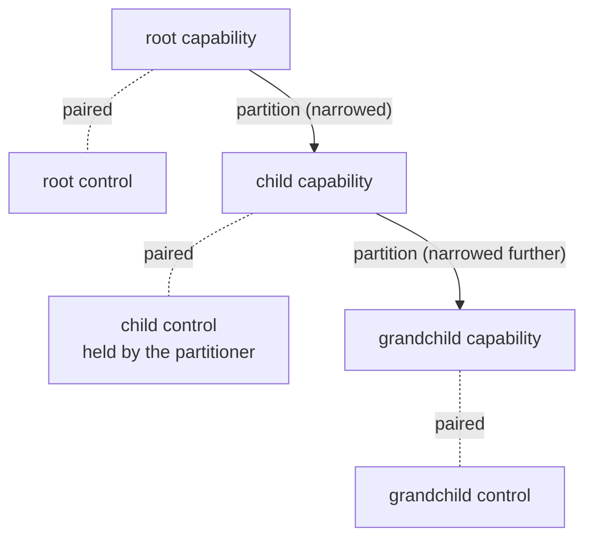

# Caretaker Attenuation (design pattern)

| | |
|---|---|
| **Created** | 2026-07-10 |
| **Author** | Kris Kowal (prompted) |
| **Status** | Reference |
| **Source** | Review of endojs/endo-but-for-bots#621 (kriskowal, 2026-07-10) |

## Summary

**Caretaker attenuation** is the composite of two object-capability
patterns this corpus uses separately, named here so future designs can
invoke it by name instead of re-deriving it:

1. **Caretaker.** A capability is granted as a *pair*: the capability
   itself plus a separable **control facet** that can adjust the
   capability's authority dynamically (narrow it, restore an earlier
   narrowing it made itself, revoke it) without the holder's
   cooperation. The grantor keeps the control; the grantee holds only
   the capability.
2. **Attenuation by partition.** The *holder* of a capability can mint
   a **child capability** carved out of its own, narrower than what it
   holds, and delegate that child onward. Partition is recursive: a
   child's holder can partition again.

The composite closes the loop: a partition mints not a bare child but a
**child pair** (capability plus its own control facet), so every node in
the resulting delegation tree is itself under caretaker control, and the
partitioner becomes the caretaker of its delegate. Both mechanisms are
live at every node at the same time.

## Invariants

A design instantiating this pattern satisfies all of these; the first
two are what make the composite sound.

1. **Monotonicity.** A child's effective authority is always a subset
   of its parent's *current* authority: narrowed from parent to child,
   never widened. This must hold **dynamically**, not just at mint
   time: when an ancestor's caretaker later narrows or revokes, every
   descendant shrinks with it. A live child must never out-live or
   out-scope a shrinking parent.
2. **Enforcement by conjunction, not by snapshot.** The robust
   implementation checks every use against **every ancestor's live
   constraint layer** (the child's own layer AND its parent's AND so on
   to the root), rather than computing a subset intersection once at
   partition time. A snapshot taken at partition time goes stale the
   moment an ancestor's caretaker narrows; conjunction makes invariant
   1 unconditional. It also means partition needs no subset validation:
   a child declaring authority outside its parent's simply finds that
   surplus inert, denied by the ancestor layer.
3. **Controls are per-node and layer-local.** A node's control facet
   adjusts only that node's own constraint layer. Relaxing a node's own
   layer never exceeds the ancestors' conjunction, so no control can
   widen the tree; only the root grantor (a new consent, a re-mint) can
   widen anything.
4. **Revocation is subtree-wise.** Revoking a node severs that node and
   everything partitioned from it, transitively. Under conjunction this
   is structural: descendants' uses pass through the revoked ancestor's
   check and fail.
5. **Delegation is legible, not merely possible.** A holder can always
   delegate opaquely by proxying its capability behind a new exo; the
   pattern does not pretend to prevent that. Making partition
   first-class turns the inevitable into a durable, inspectable,
   revocable tree that composes with the root's lifecycle (refresh,
   revocation, error codes) instead of an ad-hoc wrapper that does not.

## When to apply

Use the composite when a design has both a grantor who must retain
dynamic control (the caretaker half) and holders who need to
re-delegate slices of what they hold without a round-trip to the
grantor (the partition half). Agent-facing powers usually want both: a
host narrows or cuts a grant over time, while an agent carves
sub-grants for sub-agents.

Considered and rejected as the general shape: partition mediated by the
parent's *control* facet rather than the capability itself. That forces
every delegation through the caretaker, which defeats the point of
delegation (the holder can proxy around it anyway, only less legibly).

## Instances

| Design | How it instantiates the pattern |
|--------|--------------------------------|
| [endoclaw-oauth](endoclaw-oauth.md) | First full instance and the round that named the pattern: `OAuth.partition` mints narrowed child `OAuth`/`OAuthControl` pairs under per-request chain conjunction (allowed paths intersect, read-only ORs), composed with the `OAuthTokenControl` root caretaker. |
| [daemon-capability-filesystem](daemon-capability-filesystem.md) | Partial precedent: `Dir`/`DirControl` caretaker pairs plus recursive attenuation (`readOnly()`, `subDir(path)`), though holder-minted children there are bare capabilities, not child pairs. |
| [exo-google-sheets](exo-google-sheets.md) | Caretaker half (`SpreadsheetControl`) over facets narrowed at mint; a connector-level candidate for the full composite. |
| [daemon-capability-persona](daemon-capability-persona.md) | Caretaker half: the `Handle`/`HandleControl` split. |
| [endoclaw-timer](endoclaw-timer.md) | Caretaker half: scheduler control facets with revoke/restore. |

## Prompt

From kriskowal's review of endojs/endo-but-for-bots#621
(2026-07-10):

> This design presumes a capability and a controller facet. This is
> useful because the controller can adjust the attenuation dynamically.
> However, it's also useful for the holder of a capability to partition
> that capability recursively. It is a little complex but possible to
> do both at the same time. That is, allow a capability to partition
> and delegate. It is even possible to produce a child capability and
> controller facet, provided that the capabilities are narrowed from
> parent to child, never expanding.
>
> This is probably a reusable directive we will want to capture in a
> design skill and give it a name for future reference. We are using
> "caretaker" pattern here. We are using "attenuation" there. But we
> are describing composite "caretaker attenuation".
