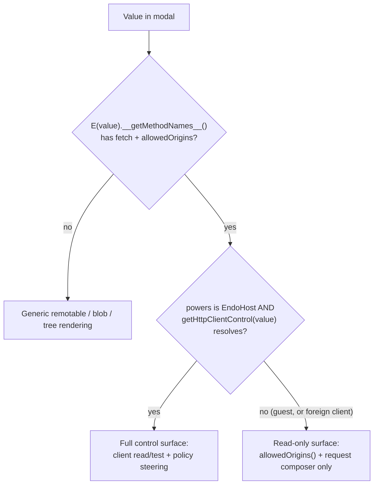
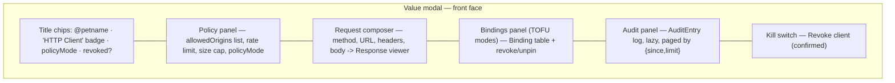

# Chat HTTP Controller UI

| | |
|---|---|
| **Created** | 2026-07-15 |
| **Author** | Kris Kowal (prompted) |
| **Status** | Not Started |

## What is the Problem Being Solved?

The confined outbound-HTTP tier — `@endo/exo-http-client`'s
`HttpClient` / `HttpClientControl` pair (#566), wired through the daemon as
`host.provideHttpClient` / `host.getHttpClientControl` and the `http-client`
formula (#661) — has no UI. A host can mint an `HttpClient`, bind it into a
guest's petstore, and retain the policy-bearing `HttpClientControl`, but the
only surfaces that read or steer it today are the CLI (`endo http`, the
parallel [cli-http-client](cli-http-client.md) track) and the agent-tool
adapter (`makeHttpTool`, #661).

In Chat, an `HttpClient` capability shows up in the inventory like any other
pet-named value, and clicking it opens the [Value modal](formula-inspector.md)
— which renders it as a bare `remotable` tag with no affordances. A host
looking at an HTTP client it granted cannot see what origins the client may
reach, adjust the allowlist or the rate/size limits, inspect or revoke
trust-on-first-bind pins, read the policy-decision audit log, revoke the
client outright, or test a request against the live policy without dropping to
the CLI.

This design makes the Value modal's **front face**, for a value the host
recognizes as an HTTP client, a **control surface** for that client — the
`HttpClient` read/test methods plus, when the host holds the matching
`HttpClientControl`, the full policy-steering surface.

## Grounding in the Current Implementation

### The Value modal (`packages/spaces-util/src/value-component.js`)

`valueComponent($parent, powers, { enterProfile })` returns
`{ showValue, dismissValue, dispose }`. The modal is a flip card:

- **Front (recto) face** renders the passable value. Remotables get a bare tag
  unless `showValue` detects a *specialization*: `isBlobLike(value)` (a
  `text()` method) swaps in an inline blob preview; `isTreeLike(value)`
  (`list`/`lookup`/`sha256`) swaps in a live tree listing. Both detect the
  remotable's shape with `E(value).__getMethodNames__()` and both re-render the
  same `$valueMount` once the async probe resolves.
- **Back (verso) face** renders the value's daemon **formula** record via
  `FormulaView`, reached with the `F` key, the header gear, or the flip button.
  It is deliberately **read-only** (kriskowal, 2026-06-13, on
  [formula-inspector](formula-inspector.md): "While one formula captures state,
  we do not need these to be user editable at this stage of development").

Everything untrusted the modal renders — value content, blob text, formula
property values — reaches the DOM only as escaped text through
`renderConfined` / `valueToVnodes` vnodes, never `.innerHTML`. That
confinement is a load-bearing invariant, not a nicety.

The HTTP control surface is a **third front-face specialization**, structurally
the sibling of the blob and tree specializations: `showValue` probes the
remotable, and on a positive HTTP-client detection renders a dedicated control
panel into `$valueMount` in place of the bare remotable tag. It is a front-face
treatment, *not* a change to the read-only formula back face — the back face
keeps showing the baked policy record (see § Formula back face).

### The HTTP capability (`packages/exo-http-client/src/http-client.js`)

Two facets, split by authority:

```
HttpClient:                         HttpClientControl:
  fetch(url, options?) -> Response     inspect() -> Policy
  allowedOrigins() -> string[]         setAllowedOrigins(origins) / addAllowedOrigin / removeAllowedOrigin
  help() -> string                     setMaxRequestsPerMinute(n) / setMaxResponseBytes(n)
                                        setPolicyMode(mode)
HttpResponse:                          revoke() / isRevoked() -> boolean
  status()/statusText()/ok()           listBindings() -> Binding[]
  headers()/url()/truncated()          revokeBinding(origin) / unpin(origin)
  maxResponseBytes()                   listAuditEntries({since?,limit?}) -> AuditEntry[]
  text() / json()                      help()
  help()
```

`Policy` (the `inspect()` shape) is
`{ allowedOrigins: string[], maxRequestsPerMinute: number, maxResponseBytes:
number, policyMode: string, revoked: boolean }`. `Binding` is `{ target, state
('Pinned-Allow' | 'Pinned-Deny' | 'Revoked'), decidedAt, decidedBy,
decisionMode, note? }`. `AuditEntry` is `{ at, target, fromState, toState,
decisionMode, decidedBy, context? }`. The exos enforce the origin-exactness and
`Number.isSafeInteger` rules; the daemon `normalizeHttpClientPolicy` enforces
the same up front and restricts persisted `policyMode` to `strict` / `tofu-auto`
(#661 review, kriscendobot code panel).

### The daemon wiring (`packages/daemon/src/{host,daemon}.js`, #661)

- `host.provideHttpClient(petName, policy)` mints the pair, binds only the
  **client** into the guest petstore, and retains the **control** host-side.
- `host.getHttpClientControl(clientCap)` recovers the control from the client
  cap via a host-private `WeakMap` (`httpClientControlForClient`), mirroring
  `getGitRemoteController`. It is on the **`EndoHost`** interface guard only —
  guests have no such method.
- The `http-client` formula record is `{ type: 'http-client', policy }` where
  `policy` is the **provision-time** policy. On reincarnation the maker reruns
  `makeHttpClientAndControl({ ...policy })` from that **baked** record and
  re-registers the fresh control in the `WeakMap`.

The last point drives the sharpest design constraint (§ The persistence
boundary).

## Capability and Authority Boundaries

The control surface's power is bounded by *which cap the viewer is looking
through*, and the UI must reflect exactly that — never more.



1. **Client / control split.** The petstore holds the **client**; the
   **control** is host-retained and reachable only through
   `host.getHttpClientControl(clientCap)`, keyed by a host-private `WeakMap`.
   The policy-steering half of the surface therefore appears **only** for a
   host viewing a client **it minted**. This is the same authority split the
   git-remote grant uses, surfaced in the UI for the first time.

2. **`getHttpClientControl` is host-only.** It lives on the `EndoHost` guard,
   not `EndoGuest`. When Chat runs under a guest profile (an "enter profile"
   descent, `enterProfile`), `powers` is a guest and the method is absent → the
   surface degrades to the read-only client view. The UI must feature-detect
   the method, not assume it.

3. **A foreign client yields no control.** A client received over CapTP from a
   peer, or minted by a different host, is not in this host's `WeakMap`, so
   `getHttpClientControl` rejects. The viewer sees `allowedOrigins()` and may
   test `fetch` (subject to the remote policy) but gets no steering controls.
   The rejection is the boundary — the UI treats a rejection as "read-only,"
   never as an error to surface loudly.

4. **Editing bounds is an authority-widening act.** `addAllowedOrigin`,
   `setAllowedOrigins`, `setMaxResponseBytes`, `setMaxRequestsPerMinute`, and
   `setPolicyMode` expand or relax the client's reach. Each edit is an explicit,
   visibly-labelled control action; `revoke()` (irreversible for the session)
   is confirmed before it fires. The surface never widens authority as a side
   effect of merely *viewing*.

5. **`fetch` is already confined.** Exposing a request composer adds no
   authority: every request is re-parsed, exact-origin-matched against the live
   allowlist, rate-limited, size-capped, and run with redirects disabled by the
   exo. An off-allowlist URL fails with the exo's own error; the composer cannot
   exceed the policy it displays.

6. **Response and policy text is untrusted.** Response bodies and headers come
   off the network; `Binding.target` / `decidedBy` / `note` and
   `AuditEntry.decidedBy` come from policy decisions (in TOFU modes, influenced
   by the requesting guest). All of it renders through `renderConfined` vnodes
   as escaped text — the confinement the rest of `value-component` already
   enforces.

### The persistence boundary

`HttpClientControl` mutations act on the **live exo**; the `http-client`
**formula** stores only the provision-time `policy`. Nothing in #661 writes a
live `setAllowedOrigins` / `setMaxResponseBytes` / `setPolicyMode` back into the
formula record, and reincarnation re-bakes from that record. **Therefore live
control edits are session-scoped: they survive until the daemon restarts, then
revert to the provisioned policy.** `revoke()` is likewise a live-exo state bit,
not persisted.

This is a real semantic gap between what the control facet *does* and what a
user editing bounds in a modal will *expect*, and it is the primary open
question below. The UI must not silently imply durability it does not have; see
§ Design Decisions 4 and § Open Questions 1.

## The Design

### Detection

`showValue`, in the same `inferredType === 'remotable'` branch that runs the
blob/tree probes, adds an `isHttpClientLike(value)` probe: `E(value).
__getMethodNames__()` includes both `fetch` and `allowedOrigins`. On a positive
result it renders the control surface into `$valueMount` (replacing the bare
remotable tag), then asynchronously attempts `getHttpClientControl` to decide
read-only vs. full. Detection order: HTTP-client is checked **before**
blob/tree, since the facets are disjoint (an HTTP client has neither `text` nor
`sha256`), so ordering only fixes precedence, not correctness. The probe is
guarded by the same `currentValue === value` staleness check the blob/tree
probes use, so a fast re-`showValue` cannot cross-render.

### Layout

The control surface is one confined Preact component,
`HttpControlSurface`, rendered into `$valueMount`, composed of collapsible
sections (mirroring the inventory's collapsible-section idiom,
[inventory-grouping-by-type](README.md)). All state-bearing sub-panels are
their own components with their own hooks, so a re-probe remounts cleanly.



**1. Header / status.** The existing title chips (`@petname`, unnamed) gain an
"HTTP Client" badge and a compact status line: `policyMode`, `allowedOrigins`
count, and a **Revoked** pill when `isRevoked()` / `inspect().revoked` is true.
Read from `control.inspect()` when available, else from
`client.allowedOrigins()` alone.

**2. Policy panel** (control only). Renders `inspect()`:
- **Allowed origins** — a list; each row has a remove (✕) affordance
  (`removeAllowedOrigin`); an "Add origin" input appends via `addAllowedOrigin`,
  validated client-side against the exo's origin-exactness rule (scheme + host
  [+ port], no path/query/fragment) so a bad entry is rejected before the round
  trip, with the exo error surfaced inline if it still rejects.
- **Max requests / minute** and **Max response bytes** — numeric inputs
  committing via `setMaxRequestsPerMinute` / `setMaxResponseBytes`; both
  validated as positive safe integers client-side.
- **Policy mode** — a `<select>` limited to the daemon-persistable modes
  (`strict`, `tofu-auto`); `tofu-prompt` / `tofu-attenuator` are **shown
  disabled with an explanatory title** because this phase wires no live
  `policyAuthority` and the daemon normalizer refuses them (§ Open Questions 2).

  Read-only viewers (guest / foreign client) see this panel collapsed to the
  `allowedOrigins()` list with no edit affordances and a "read-only (no control
  authority)" note.

**3. Request composer** (client — always present). A form:
`method` (`<select>` over the seven `HTTP_METHODS`), `url` (text), optional
`headers` (key/value rows), optional `body` (textarea, enabled for
POST/PUT/PATCH). "Send" calls `E(client).fetch(url, options)` and renders the
returned live `HttpResponse` remotable in a **Response viewer**:
`status()` + `statusText()` + `ok()` (color-coded), `url()`, a `truncated()`
banner when true (with `maxResponseBytes()`), a `headers()` table, and the body
via `text()` (with a "Parse JSON" toggle calling `json()`). The URL input may
autocomplete from the current `allowedOrigins` to steer the user toward
in-policy requests (advisory only). Response text is confined vnodes.

**4. Bindings panel** (control, TOFU modes only). When `policyMode` is a
`tofu-*` mode, `listBindings()` renders a table (target, state, decidedBy,
decisionMode, `decidedAt` as a relative time, `note`); each row offers
`revokeBinding(origin)` and `unpin(origin)`. Hidden in `strict` mode (no
bindings accrue). Lazily fetched on panel expand.

**5. Audit panel** (control). `listAuditEntries({ since, limit })` renders a
reverse-chronological log (`at`, `target`, `fromState -> toState`,
`decisionMode`, `decidedBy`, `context.method`). Lazily fetched on expand; "Load
older" pages by passing `since` = the oldest shown entry's `at`. Bounded by the
exo's `auditLimit`.

**6. Kill switch** (control). A "Revoke client" button gated behind an inline
confirm ("Revoke — no further requests will succeed"). On confirm, `revoke()`,
then re-`inspect()` to flip the header to the Revoked state and disable the
composer's Send.

### Modal interactions

Per Chat Invariant 2 (Keyboard-Manual Parity) and Invariant 1 (Modeline
Completeness), every action has a pointer affordance and, where it earns an
accelerator, a modeline hint. Enumerated:

| Interaction | Trigger | Facet call | Notes |
|---|---|---|---|
| Open control surface | Click/inspect a client value | `__getMethodNames__`, then `getHttpClientControl` | Automatic on detection |
| Flip to formula (baked policy) | `F` / header gear / flip button | `getFormula(id)` | Existing back face; read-only |
| Add allowed origin | "Add origin" submit | `addAllowedOrigin` | Client-side origin validation first |
| Remove allowed origin | Row ✕ | `removeAllowedOrigin` | |
| Set limits | Numeric input commit (Enter / blur) | `setMaxRequestsPerMinute` / `setMaxResponseBytes` | Positive-safe-integer validation |
| Change policy mode | `<select>` change | `setPolicyMode` | `strict` / `tofu-auto` only |
| Send request | Composer "Send" / ⌘Enter in composer | `fetch` → `HttpResponse` | Bounded by live policy |
| Toggle response body as JSON | "Parse JSON" | `json()` vs `text()` | |
| Expand bindings / audit | Section header click | `listBindings` / `listAuditEntries` | Lazy |
| Revoke a binding / unpin | Binding-row buttons | `revokeBinding` / `unpin` | TOFU modes |
| Load older audit entries | "Load older" | `listAuditEntries({ since })` | Paging |
| Revoke client | "Revoke client" → confirm | `revoke` | Irreversible for the session |
| Close | `Esc` / Close / backdrop | — | Invariant 4 (Escape Consistency) |

`Esc` closes the front face (control surface included) exactly as it does for
any value — the surface introduces no new `Esc` semantics. Accelerators added
inside the composer (⌘Enter to Send) follow the existing text-input guard in
`handleKey` so they never leak to window-level modal keys, and each earns a
composer-local modeline hint.

### Loading and error states

- **Detecting** — while `__getMethodNames__()` is in flight, the value shows the
  default remotable tag (no flicker); the surface swaps in on resolution, same
  as the blob/tree probes.
- **Resolving control** — the client read view (header + composer + read-only
  policy list) renders immediately from `allowedOrigins()`; the steering
  controls appear when `getHttpClientControl` resolves. A brief "checking
  control authority…" affordance covers the gap.
- **No control authority** — `getHttpClientControl` rejects (guest / foreign):
  read-only surface, quiet inline "read-only (no control authority)" note, no
  error toast.
- **`inspect()` / `listBindings()` / `listAuditEntries()` failure** — per-panel
  inline error ("Could not load policy: `<message>`") with a Retry, mirroring
  the back face's `renderBackFaceMessage` pattern; one panel's failure never
  blanks the others.
- **`fetch` rejection** — the Response viewer shows the exo error inline
  (off-allowlist origin, rate-limit exceeded, timeout, network failure),
  distinguished from an HTTP error *response* (a 4xx/5xx that still returns a
  `Response` with `ok() === false`). Both are expected, neither throws to the
  console.
- **Edit rejection** — a `set*` / `add*` call that the exo refuses (bad origin,
  unsafe integer, unsupported mode) surfaces inline next to the offending
  input; the displayed policy re-reads from `inspect()` so the UI never drifts
  from exo truth.
- **Revoked client** — composer Send disabled with a "client revoked" note;
  policy panel read-only; the surface still renders (so the user can read the
  final bounds and audit trail).
- **Value swapped mid-flight** — every async render is guarded by the
  `currentValue === value` / `currentId === id` staleness checks already used
  throughout `showValue`.

### Formula back face

The read-only formula back face gains an `http-client` entry in
`formula-view-registry.js` (today it has none), so flipping a client value shows
its **baked, provision-time** policy record — the durable bounds, in contrast to
the front face's live (session-scoped) bounds. This visual contrast (front =
live, back = persisted) is the honest way to expose the persistence boundary
until/unless durable edits land (§ Open Questions 1). Registry entry:
`{ header: 'HTTP client', helpText: 'Confined outbound-HTTP capability.',
propertyList: [] }` with an `emptyStateText` pointing at this design and
rendering the baked `policy` literals.

## Dependencies

| Design | Relationship |
|---|---|
| [formula-inspector](formula-inspector.md) | Owns the Value-modal flip-card, `getFormula`, and the read-only back-face contract this surface extends with an `http-client` registry entry and a live front-face treatment. |
| [daemon-agent-tools](daemon-agent-tools.md) | § Network (HTTP) tier / Phase 3.6 is the capability + daemon wiring (`provideHttpClient` / `getHttpClientControl`, #661) this UI drives. |
| [http-confine](http-confine.md) | The confinement core whose origin-exactness and limit rules the policy panel validates against client-side. |
| [cli-http-client](cli-http-client.md) | The parallel `endo http` CLI control surface; this is its Chat-side sibling over the same `HttpClient` / `HttpClientControl` pair. |
| [endo-fetch](endo-fetch.md) | The unconfined-plugin redraft of HTTP *provisioning*; if the client is later provisioned as an `@endo/fetch` plugin with durable VFS-pinned policy, this surface's persistence boundary (§ Open Questions 1) is resolved by that design rather than here. Track the reconciliation there. |
| [chat-invariants](chat-invariants.md) | Modeline completeness, keyboard-manual parity, and Escape consistency the surface obeys. |

## Phased Implementation

1. **Read-only client view.** Detection probe + header badge/status +
   `allowedOrigins()` list + request composer + Response viewer. Works for both
   host and guest/foreign clients (no control dependency). Ships the majority of
   the user value.
2. **Control policy panel.** `getHttpClientControl` recovery, `inspect()`
   render, allowlist/limit/mode editors with client-side validation and inline
   exo-error surfacing, plus the confirmed Revoke kill switch.
3. **Bindings + audit panels.** TOFU-mode binding table with revoke/unpin, and
   the paged audit log. Add the `http-client` `formula-view-registry` entry for
   the baked-policy back face.
4. **Persistence reconciliation** (gated on Open Question 1). Either a durable
   re-bake path in the daemon, a live/persisted banner, or deferral to
   [endo-fetch](endo-fetch.md)'s VFS-pinned policy — whichever the maintainer
   chooses.

## Design Decisions

1. **Front-face specialization, not a new panel or third face.** The surface is
   the structural sibling of the blob and tree front-face specializations — same
   `showValue` probe-and-swap shape, same staleness guards, same confined mount.
   This reuses the modal's machinery and keeps the read-only formula back face
   unchanged. Considered and rejected: a dedicated inventory-row panel with a
   read/edit toggle. Reason: kriskowal already rejected the two-surface
   inspector split (formula-inspector, 2026-06-13, "We only need one surface");
   the Value modal is that surface.

2. **The value is the client; the control is recovered, not shown.** The
   petstore holds the client, so the modal's value is the client. The control is
   fetched host-side via `getHttpClientControl(value)` and never itself
   navigated to as a value (it is not in any petstore). This matches the daemon's
   deliberate client/control split.

3. **Read-only degradation is silent, by capability.** Absence of control
   authority (guest, or foreign client) is the *expected* state for a large
   class of clients, not an error. The surface degrades to the client read view
   with a quiet note. A rejected `getHttpClientControl` is a boundary signal, not
   a fault.

4. **Front face shows live bounds; back face shows baked bounds.** Because live
   control edits are session-scoped (§ The persistence boundary), the front face
   (live `inspect()`) and the back face (baked formula `policy`) can legitimately
   disagree after an edit. Surfacing both, labelled, is the honest interim
   representation until durable edits are decided.

5. **Client-side validation mirrors the exo, never replaces it.** Origin
   exactness and positive-safe-integer checks run client-side purely to give
   fast inline feedback; the exo remains the sole authority and its rejection is
   always surfaced and always re-syncs the displayed policy from `inspect()`.

## Open Questions

1. Should live `HttpClientControl` edits **persist** across daemon restart? As
   built (#661), they do not — the `http-client` formula re-bakes its
   provision-time `policy` on reincarnation, so an origin added or a limit raised
   in the modal reverts on restart. Options: (a) the daemon writes control
   mutations back into the formula record (a durable re-bake path — new daemon
   work, to be filed as a follow-up issue on `endojs/endo-but-for-bots`); (b) the
   UI shows a persistent "live edits are session-scoped" banner and relies on the
   baked-policy back face for the durable view; (c) durability is deferred to
   [endo-fetch](endo-fetch.md)'s VFS-pinned policy and this surface stays
   read-mostly for bounds. Recommended interim default: (b), with Phase 4 gated
   on the maintainer's choice among (a)/(c).

2. Should the policy-mode `<select>` offer `tofu-prompt` / `tofu-attenuator` at
   all? The live exo's `setPolicyMode` accepts all four, but #661's daemon
   `normalizeHttpClientPolicy` refuses `tofu-prompt` / `tofu-attenuator` at
   provision (no live `policyAuthority` is wired), and a live switch into a mode
   the formula cannot re-bake would be lost on restart (Open Question 1).
   Recommended: show them disabled with an explanatory title until a
   `policyAuthority` is wired.

3. Should the request composer exist for the **host's own** control view, or
   only where the client is genuinely a guest's grant? Testing a request as the
   host uses the same client the guest holds, which is exactly the point (verify
   what the grantee can reach), but it does mean the host issues real outbound
   requests from the modal. Recommended: keep it, since every request is
   policy-bounded and auditable, and testing-what-you-granted is the core use.

4. Where should the "HTTP Client" badge and control surface draw the line
   against a *non-daemon* remotable that coincidentally exposes `fetch` +
   `allowedOrigins`? The `getHttpClientControl` recovery is authoritative for
   *host-minted* clients; for detection alone the method-name probe could
   false-positive. Recommended: treat method-name detection as sufficient for
   the read-only view (worst case: a harmless composer against a look-alike) and
   gate all steering strictly on a resolved `getHttpClientControl`.

## Prompt

> Please post a follow-up job to design an HTTP controller UI in Chat, such
> that the show value modal for an HTTP controller is a control surface for the
> HTTP client.
>
> — kriskowal, review of
> [endojs/endo-but-for-bots#661](https://github.com/endojs/endo-but-for-bots/pull/661#pullrequestreview-4701071242)
> (APPROVED), 2026-07-15
