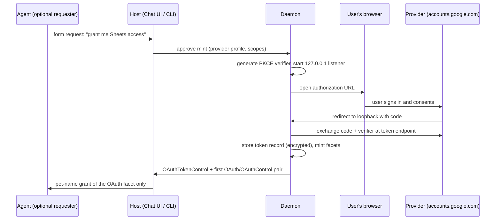
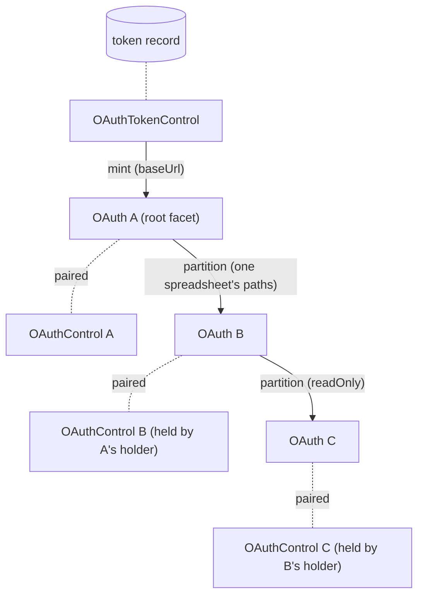

# EndoClaw: OAuth / Credential Capability

| | |
|---|---|
| **Created** | 2026-03-03 |
| **Updated** | 2026-07-10 |
| **Author** | Kris Kowal (prompted) |
| **Status** | Not Started |
| **Parent** | [endoclaw](endoclaw.md) |

## Summary

An `OAuth` capability lets an agent make authenticated HTTP requests to
a third-party API without ever seeing the credential. The host performs
the OAuth flow once, stores the token durably, and grants the agent an
`OAuth` exo that proxies requests with the token injected. The agent
calls `E(gmail).fetch('/gmail/v1/users/me/messages')`; the credential
is structurally inaccessible.

This design is also the **credential foundation for domain connectors**:
[exo-google-sheets](exo-google-sheets.md) (proposed in
endojs/endo-but-for-bots#612) and its future Gmail and Calendar siblings
consume an already-minted `OAuth` exo as an injected fetch power and
narrow it with typed, attenuable facets. The 2026-07-07 revision settles
the first-mint flow, restructures the token/facet layering so one
credential can back several facets, and pins the surface connectors may
rely on (§ The Connector Contract), per review of #612. The 2026-07-10
revision adds holder-driven recursive **partition**: any facet holder
can mint a monotonically-narrowed child `OAuth`/`OAuthControl` pair and
delegate it, composed with the existing caretaker controls
(§ Partition and Delegation), per review of #621. The composite is the
named [caretaker-attenuation](caretaker-attenuation.md) pattern; this
design is its first full instance.

## What is the Problem Being Solved?

Handing an agent a raw OAuth token grants the whole account surface and
lets the agent exfiltrate the credential. The ocap answer is a proxy
exo: authority to *use* the service, never authority to hold or forward
the token. [endoclaw-network-fetch](endoclaw-network-fetch.md) confines
*where* requests can go (origin allowlist); this layer adds *who the
requests act as* (token injection) and narrows *what they may do* (path
patterns, read-only mode).

Two things were unsettled while the first connector was designed
against this layer:

1. **The first mint.** The original sketch said only "browser redirect
   or device code grant". Which one the host runs, whether it is
   configurable, and whether the choice leaks to consumers is now
   settled (§ First Mint).
2. **The consumer contract.** The Sheets connector assumes a
   fetch-shaped power, structured errors it can tell apart from
   Google's, several API hosts under one credential, and durable
   formula identity. Those assumptions are now normative
   (§ The Connector Contract).

## Capability Shape

Three layers, from durable credential to granted facet:

```ts
// Host-side entry point: run the first-mint flow ONCE and return the caretaker
// over the resulting stored credential. This is the top-level operation Phase 2
// builds (§ First Mint); it is distinct from OAuthTokenControl.mint below, which
// grants cheap facets from an ALREADY-stored token. Never granted to guests.
mintOAuthToken(profile: OAuthProviderProfile): Promise<OAuthTokenControl>;

// Host-side caretaker over ONE stored credential. Never granted to guests.
interface OAuthTokenControl {
  // Grant a facet from the already-stored token (a cheap attenuation, not a new
  // consent flow). Named `mint` for the facet layer; the credential itself is
  // first-minted by mintOAuthToken above.
  mint(opts: {
    baseUrl: string,             // for example 'https://sheets.googleapis.com'
    allowedPaths?: string[],     // default: no restriction within the base URL
    readOnly?: boolean,          // default false
  }): { oauth: OAuth, control: OAuthControl };
  scopes(): string[];            // scopes the user consented to at mint
  refresh(): Promise<void>;      // force a token refresh now
  revoke(): Promise<void>;       // RFC 7009 § 2 provider revocation, delete the
                                 // stored token, sever every minted facet
  help(): string;
}

// Per-facet caretaker, paired with each granted OAuth exo.
interface OAuthControl {
  setAllowedPaths(allowedPaths: string[]): void;  // same noun as mint's option
  setReadOnly(flag: boolean): void;  // restricts to GET and HEAD (see caveat below)
  refresh(): Promise<void>;          // pure delegation to the shared token record
  revoke(): Promise<void>;           // severs THIS facet and, transitively, every
                                     // facet partitioned from it; the token and
                                     // sibling facets survive. Async for uniform
                                     // await-discipline with
                                     // OAuthTokenControl.revoke, though the sever
                                     // is local and resolves immediately.
  help(): string;                    // must not name or hint the mint flow
}

// The agent-facing (or connector-facing) capability.
interface OAuth {
  fetch(path: string, options?: FetchOptions): Promise<FetchResponse>;
  baseUrl(): string;
  scopes(): string[];                // the token's CONSENT scopes, not this
                                     // facet's effective authority (which
                                     // allowedPaths/readOnly narrow); introspection
                                     // only, scopes are not settable
  partition(opts: {                  // holder-minted child pair; recursive.
    allowedPaths?: string[],         // the child's OWN layer; effective authority
                                     // is the per-request conjunction with every
                                     // ancestor's live layer (§ Partition and
                                     // Delegation), so this can never widen
    readOnly?: boolean,              // ORed with ancestors: false here cannot
                                     // clear an ancestor's true
  }): { oauth: OAuth, control: OAuthControl };
  help(): string;                    // must not name or hint the mint flow
}

type FetchOptions = {
  method?: string;
  headers?: Record<string, string>;
  body?: string;                     // text bodies only; a bytes body is the
                                     // upload-side twin of the deferred bytes()
                                     // gap (§ The Connector Contract)
};

// A fetch-subset, deliberately NOT the global WHATWG Response (it omits
// arrayBuffer/blob, and its json() returns unknown). Named FetchResponse so the
// subset does not masquerade as the standard type.
type FetchResponse = {
  status: number;
  ok: boolean;                       // status in [200, 300); the idiomatic check
  headers: Record<string, string>;
  text(): Promise<string>;
  json(): Promise<unknown>;
};
```

Changes from the 2026-03-03 sketch:

- **`setScopes` is removed.** Scopes are fixed by the consent the user
  granted at mint time and baked into the token; they are not a local
  control knob. Widening is a re-mint (§ First Mint, incremental
  authorization); narrowing is expressed with `setAllowedPaths` and
  `setReadOnly`, which the exo can actually enforce per request.
- **The token is its own durable record** (`OAuthTokenControl`), and
  `OAuth`/`OAuthControl` pairs are cheap attenuations minted from it.
  One credential backs many facets (§ Token, Facets, and Refresh).
- **Path-pattern semantics are pinned.** A pattern is an exact path or
  a prefix ending in `*`. An **absent** `allowedPaths` (undefined) means
  no path restriction within the base URL; an **empty** list (`[]`)
  denies every path (deny-all), the explicit lock-down a caretaker sets
  with `setAllowedPaths([])`. The two are deliberately distinct, so a
  narrowing caretaker cannot accidentally widen a facet to unrestricted
  by clearing its list. Matching runs against the normalized path
  only (query string excluded), after percent-decoding the unreserved
  set and dot-segment removal, so `..` segments cannot escape a prefix.
  Encoded separators (`%2F`, `%5C`) are **not** decoded into segment
  separators; they stay percent-encoded through matching and
  forwarding, so a prefix cannot be smuggled past. The request is
  issued with **exactly the normalized path that was matched**, never
  the raw caller string, so the exo's allowlist view and the provider's
  routing view cannot diverge (the parser-differential bypass). Paths
  must begin with `/`; absolute URLs are rejected, so a facet can never
  reach past its `baseUrl` (the underlying `HttpClient` origin allowlist
  is the backstop).
- **Header hygiene.** Caller-supplied `Authorization`, `Cookie`, and
  `Proxy-Authorization` headers are rejected; the exo owns the
  credential header. Method-override headers (`X-HTTP-Method-Override`,
  `X-HTTP-Method`, `X-Method-Override`) are rejected too, so a
  `readOnly` facet cannot tunnel a write through a GET.
- **Redirects do not replay the credential.** The underlying
  `HttpClient` does **not** transparently follow provider `3xx`
  responses for a credentialed request: a redirect is returned to the
  caller as-is rather than followed with the `Authorization` header
  re-attached. Auto-following would send the token to a target
  `setAllowedPaths` never checked (path enforcement runs on the original
  request only), so following is the connector's explicit act on a fresh
  `fetch`, re-validated against `allowedPaths`.
- **Auth-layer errors are structured.** Denials and credential failures
  are thrown locally with copyable `code` properties (`'path-denied'`,
  `'method-denied'`, `'header-denied'`, `'auth-revoked'`,
  `'facet-revoked'`). Provider responses, including provider *errors*,
  pass through with status and body untouched, so a connector can map
  its service's error payloads (quota, permission) without this layer
  rewriting them.
- **`partition` is added (2026-07-10).** Any `OAuth` holder mints
  narrowed child `OAuth`/`OAuthControl` pairs, recursively, without the
  parent's controller in the loop (§ Partition and Delegation).

## First Mint

**The host runs the flow; the agent and every connector are absent from
it.** The top-level `mintOAuthToken(profile)` operation (§ Capability
Shape) runs the flow once and returns the caretaker over the resulting
stored credential; everything a consumer ever sees is a facet
`OAuthTokenControl.mint` grants after the flow completes. The word
"mint" therefore names two operations at two layers: **first-mint**
(`mintOAuthToken`, which creates the token record and its
`OAuthTokenControl`) and **facet grant** (`OAuthTokenControl.mint`,
which attenuates an already-stored token). Phase 2 builds the former;
Phase 3 builds the latter. Nothing on `OAuth`, `OAuthControl`, or
`OAuthTokenControl` (including their `help()` and `scopes()` surfaces)
names or reveals which flow produced the token. That invariant is what
lets [exo-google-sheets](exo-google-sheets.md) Resolved Question 5 defer
here: a connector composes over an already-minted `OAuth` exo and cannot
care.

**The default flow is authorization-code with PKCE (RFC 7636) against a
loopback redirect** (RFC 8252 § 7.3), opened in the user's system
browser, never an embedded webview (RFC 8252 § 8.12; Google blocks
embedded user-agents outright). This matches the decision already made
for LLM-provider subscriptions in
[endopi-provider-registry-and-oauth](endopi-provider-registry-and-oauth.md):
the redirect URI is a Familiar pane in the Electron build (the Familiar
is Endo's Electron desktop app; the pane hosts the provider's consent
page and captures the loopback redirect in-process), or a local
HTTP listener bound to `127.0.0.1` in the daemon-only build (per
[gateway-bearer-token-auth](gateway-bearer-token-auth.md)). The two
designs share this mint plumbing; they differ only in what consumes the
token.

**The device-code grant (RFC 8628) is a configured alternative, not the
default.** It exists for hosts without a local browser and for
providers that support it. It cannot be the default because of a
decisive fact for this design's founding consumers: Google's
device-code grant supports only a small scope allowlist (sign-in
scopes, Drive `drive.file` and `drive.appdata`, YouTube), which
excludes the Sheets, Gmail, and Calendar scopes. The Google connectors
therefore always mint over the redirect flow.

**The flow is configured per provider, not per consumer.** A durable
provider profile record carries everything the mint procedure needs:

```ts
type OAuthProviderProfile = {
  name: string,                      // 'google'
  authorizationEndpoint: string,
  tokenEndpoint: string,
  revocationEndpoint?: string,       // RFC 7009, when the provider has one
  clientId: string,
  clientSecret?: string,             // installed-app secrets are not confidential
  flow: 'redirect' | 'device-code',  // 'redirect' unless the host cannot
  scopes: string[],                  // requested at consent
};
```

The mint sequence is driven through the daemon's existing structured-ask
channel ([daemon-form-request](daemon-form-request.md)) when an agent
is the requester, or the CLI/Chat UI when the human is:



**Re-consent and widening.** When a new grant needs scopes the stored
token lacks, the host re-runs the flow with incremental authorization
(Google's `include_granted_scopes`), producing a token whose scope set
covers old and new; the token record updates in place and existing
facets keep working.

Considered and rejected: device-code as default (Google's scope
allowlist excludes every founding connector; worse phishing profile).
Out-of-band copy/paste (deprecated and disabled by Google in 2022).
Embedded webview (RFC 8252 § 8.12; providers block it).

## Token, Facets, and Refresh

The stored token is one durable formula; granted capabilities are
attenuations of it:

- **Token record** (`oauth-token` formula): provider profile reference,
  access and refresh tokens, granted scopes, expiry. Encrypted at rest
  in the daemon's formula store, per the credential-storage posture of
  [endopi-provider-registry-and-oauth](endopi-provider-registry-and-oauth.md).
- **Facet** (`oauth` formula): token reference, `baseUrl`,
  `allowedPaths`, `readOnly`. Minted by `OAuthTokenControl.mint` at
  negligible cost, durable, independently revocable.

One credential backing many facets is load-bearing for the connectors:
the Sheets connector's `SheetsService` needs the Drive API host for
listing and the Sheets API host for values, two `baseUrl`s under one
Google consent; the Gmail and Calendar siblings are further facets of
the same token. Without token sharing, each would force a separate
browser consent for the same account.

Refresh belongs to the token record, not the facet: refreshes are
single-flight per token (concurrent expired-token requests across all
facets await one refresh), transparent to callers, and forcible via
either control facet. A refresh that fails with the provider's
`invalid_grant` (user revoked consent, refresh token expired) marks the
token dead and surfaces `'auth-revoked'` on every facet until the host
re-mints.

Revocation is two distinct acts. `OAuthControl.revoke()` severs one
facet, and with it everything partitioned from that facet
(§ Partition and Delegation), leaving the token and the facet's
siblings intact (a caretaker cutting one grant). `OAuthTokenControl.revoke()`
revokes the token with the provider (RFC 7009 § 2, where a revocation
endpoint exists), deletes the stored record, and severs every facet.

## Partition and Delegation

This section instantiates the
[caretaker-attenuation](caretaker-attenuation.md) pattern: the
caretaker split above (every grant is an `OAuth`/`OAuthControl` pair)
composed with holder-driven recursive attenuation. Any holder of an
`OAuth` facet can **partition** it: mint a child `OAuth`/`OAuthControl`
pair narrowed from its own, hand the child `oauth` to a delegate, and
keep the child `control`. The partitioner thereby becomes the caretaker
of its delegate, with no round-trip to the host, the token caretaker,
or the parent's own controller. Partition is recursive; the result is a
delegation tree rooted at the token record.

`partition` and `OAuthTokenControl.mint` return the identical
`{ oauth, control }` shape but attenuate different things:
`mint` carves a **sibling facet directly off the token** and may set a
new `baseUrl` (the Sheets host versus the Drive host under one consent);
`partition` carves a **child off an existing facet**, inheriting that
facet's `baseUrl` and `scopes`, and can only narrow. Both are cheap,
synchronous local attenuations on the near side; reached over CapTP
through `E(oauth).partition(...)` the call resolves to a
`Promise<{ oauth, control }>` whose facets are themselves eventual
references, so a connector author awaits (or promise-pipelines) the
result rather than treating it as an immediate value.



**Monotonicity invariant.** A child's effective authority is always a
subset of its parent's *current* effective authority: narrowed from
parent to child, never widened. The invariant is dynamic, not
mint-time-only: when an ancestor's caretaker later calls
`setAllowedPaths` or `setReadOnly`, or revokes, every descendant
shrinks with it. A live child never out-lives or out-scopes a shrinking
parent.

**Enforcement is per-request conjunction (logical AND) along the
ancestor chain, not a snapshot intersection at partition time.** Each
facet (root or child) carries its own live constraint layer
(`allowedPaths`, `readOnly`), and a request through a child is checked
against the child's layer AND every ancestor's layer AND the token
record:

- `allowedPaths` intersect by conjunction: the request path must match
  every layer in the chain that declares a path restriction (an absent
  layer waives its clause; an empty `[]` layer denies unconditionally).
- `readOnly` ORs across the chain: any ancestor's `true` binds the
  whole subtree; a child's `setReadOnly(false)` clears only its own
  layer.
- `baseUrl` and `scopes()` are inherited unchanged from the root facet.
  A new base URL comes only from `OAuthTokenControl.mint` (a sibling
  facet), never from partition. Note the disclosure consequence:
  `scopes()` reports the *token's* consent set, so a narrowed delegate
  can read which scopes back the credential it was carved from —
  including sibling-provider scopes it cannot itself exercise. This is
  consent-only introspection (never effective authority), but a
  deployment that does not want a Gmail delegate to learn a Sheets scope
  exists should mint per-provider tokens (a distinct consent per
  provider) rather than partition across providers from one broadly
  consented token. `scopes()` remains non-attenuable by design so the
  reported value cannot lie about the token; narrowing what a delegate
  may *do* is `allowedPaths`/`readOnly`, not `scopes`.

The live constraint layer and the revoked bit live on the **facet
record** (what a child references), not merely on the transient control
object, so an ancestor's `setAllowedPaths`/`setReadOnly`/`revoke` is
visible to every descendant's request-time walk; this is the single
point on which both dynamic monotonicity and subtree revocation rest.

A snapshot intersection computed at partition time would go stale the
moment an ancestor's caretaker narrows; conjunction makes the invariant
unconditional. It also means `partition` performs **no subset
validation**: a child declaring paths outside its parent's live set is
legal, and that surplus is **dormant, not discarded** — inert while an
ancestor's narrower layer denies it, but it re-arms if that ancestor
later *restores* (widens its own layer back, a first-class caretaker
power). Effective authority still never exceeds the live ancestor
conjunction, so this is not escalation; but security reasoning over a
delegation tree must treat an over-broad child declaration as latent
authority gated on the ancestor, not as authority that was thrown away.
A caretaker that wants a child's breadth permanently gone `revoke()`s
the child. Denial errors carry the same uniform codes as the root
facet's (`'path-denied'`, `'method-denied'`, `'facet-revoked'`) and do
not disclose which ancestor's layer denied.

**Child controls are layer-local.** A child `OAuthControl`'s
`setAllowedPaths`/`setReadOnly` adjust only the child's own layer;
`refresh()` delegates to the shared token record like any facet's;
`revoke()` severs the child and, structurally, its whole subtree
(descendants' requests pass through the revoked layer and fail with
`'facet-revoked'`). No control anywhere in the tree can widen anything;
widening remains an incremental-authorization re-mint at the root
(Design Decision 4). The caretaker "restore" power (relax a narrowing it
made itself) is `setAllowedPaths`/`setReadOnly` widening a node's *own*
layer back toward — never past — the ancestor conjunction; there is
deliberately **no un-revoke**, since `revoke()` is the one-way, terminal
sever.

**Durability and cost.** A child facet is an `oauth` formula like any
other, referencing its **parent facet's** formula id (root facets
reference the token record), so the tree persists across daemon
restarts and each node is independently petnameable and revocable.
References run child-to-parent only; no parent-to-child index is
required for enforcement. Enforcement cost is O(depth) string matching
per request, and delegation chains are expected shallow; an
implementation may cache a flattened conjunction as a pure optimization,
never as semantics, provided the cache key participates in **every**
only-shrinking mutation along the chain — `setAllowedPaths`,
`setReadOnly`, and (critically) `revoke` must each bump the ancestor's
epoch, or a stale cached conjunction could serve an allow after a
narrow or a sever.

**Why first-class.** A holder can always delegate opaquely by wrapping
`fetch` in its own exo; partition does not create a new power — it makes
the inevitable one legible: the child is a durable formula the host can
inspect; it composes with refresh, the two revocations, and structured
errors; and the delegator gets a real caretaker over its delegate rather
than an ad-hoc wrapper with none.

## The Connector Contract

What a domain connector ([exo-google-sheets](exo-google-sheets.md) and
siblings) may rely on, stated once so connector designs reference
rather than re-derive it:

1. **A fetch-shaped power.** The connector's plain client (for example
   `@endo/google-sheets`) takes an injected `(path, options) =>
   Promise<FetchResponse>`. The host composes the connector stack in the
   same vat (the isolated execution context that runs the exo) as the
   `OAuth` exo, closing over its `fetch`; no CapTP (the object-capability
   RPC transport) hop per request. The `OAuth` exo remains a passable
   capability for the direct-grant case (`E(gmail).fetch(...)`).
2. **The credential is invisible, in both directions.** No method
   returns or forwards the token, and the flow that minted it is not
   observable, including through the `help()` and `scopes()` surfaces,
   which name neither the flow nor the credential. A connector built on a
   redirect-minted token is indistinguishable from one built on a
   device-code-minted token.
3. **Errors are separable.** Auth-layer denials arrive as structured
   local errors with `code` properties; provider responses pass through
   untouched, so the connector owns the mapping of its service's error
   payloads (for example Sheets quota errors to
   `{ code: 'quota-exceeded', retryAfterSeconds }`).
4. **Several hosts, one consent.** A connector needing more than one
   API host under one credential asks the host for sibling facets of
   the same token record.
5. **Durable composition.** Tokens and facets are formulas; a connector
   formula (for example `google-sheet` capturing
   `{ oauthFormulaId, spreadsheetId, ... }`) references the facet by
   formula id and survives daemon restarts.
6. **Defense in depth is layered, not duplicated.** The facet carries
   `setAllowedPaths` pinned to the connector's resources (for example
   the granted spreadsheet ids) and `setReadOnly` where the grant is
   read-only; the connector layers its own finer attenuation (tabs,
   ranges, append-only) above; the `HttpClient` origin allowlist sits
   below. Rate limiting lives in the connector (domain-aware token
   bucket) and in `HttpClient` (`setMaxRequestsPerMinute`); this layer
   adds none.
7. **Delegation is first-class where the exo is held.** A consumer
   holding the `OAuth` exo itself (the direct-grant case) partitions
   monotonically-narrowed child pairs for its own delegates without any
   host round-trip (§ Partition and Delegation). A connector composed
   over a closed-over fetch power (item 1) does not see `partition` and
   layers its own attenuation instead (item 6); a connector that wants
   to hand out per-resource sub-credentials asks to hold the exo.

Gap noted, deferred until a connector needs it, on both directions of
binary media: `FetchResponse` exposes `text()` and `json()` only, and
`FetchOptions.body` is `string` only. A connector moving binary media
(Drive file download, Gmail raw attachments outside JSON) will want a
`bytes()` accessor on the response, and a bytes/stream upload body will
want the matching input shape; adding both is additive and breaks
nothing.

## Endo Idiom

**The agent never sees the token.** The `OAuth` interface has no method
that returns the credential. The agent can *use* the service but cannot
extract the token to forward it elsewhere or use it on a different
endpoint: authority to use, not authority to delegate outside the
capability graph.

**Path restrictions.**
`OAuthControl.setAllowedPaths(['/gmail/v1/users/me/messages*'])` limits
the agent to specific API endpoints. An agent with Gmail read access
cannot call the Calendar API on the same credential.

**Read-only mode.** `setReadOnly(true)` restricts to GET and HEAD. The
agent can read emails but not send them. This is a *method* restriction,
so it is exact only where the provider maps reads to GET/HEAD and writes
to other verbs. Some Google reads are POST (Sheets
`values:batchGetByDataFilter`, Gmail `messages:batchGet`), so a read-only
grant on those APIs pairs `setReadOnly` with `setAllowedPaths` pinned to
the read endpoints rather than leaning on the verb alone; method-override
headers are rejected (§ Capability Shape) so the verb cannot be spoofed.

**Caretaker revocation.** Facet revocation cuts one grant instantly,
and with it everything partitioned from that grant; token revocation
cuts the credential itself, at the provider.

**Partition and delegate.** An agent holding a Gmail facet carves a
child for a summarizer sub-agent:
`E(gmail).partition({ allowedPaths: ['/gmail/v1/users/me/messages*'], readOnly: true })`,
hands the child `oauth` down, keeps the child `control`, and revokes it
when the sub-task ends. If the host meanwhile narrows or revokes the
agent's own facet, the sub-agent's child shrinks or dies with it
([caretaker-attenuation](caretaker-attenuation.md)).

## Use Cases

- Gmail: read emails, draft responses, label messages
- Google Calendar: read events, create events
- Google Sheets: the [exo-google-sheets](exo-google-sheets.md)
  connector's injected fetch power
- Notion, Todoist, GitHub: any OAuth2-compatible API

## Dependencies

| Design | Relationship |
|--------|-------------|
| [caretaker-attenuation](caretaker-attenuation.md) | **Pattern.** The named composite this design instantiates: caretaker control facets composed with holder-driven recursive partition under monotone narrowing. |
| [endoclaw-network-fetch](endoclaw-network-fetch.md) | **Depends on.** The origin-allowlist `HttpClient` under every facet. |
| [daemon-form-request](daemon-form-request.md) | **Depends on (implemented).** The structured-ask channel through which an agent requests a grant and the host approves a mint. |
| [gateway-bearer-token-auth](gateway-bearer-token-auth.md) | **Precedent.** The daemon-only build's loopback redirect listener. |
| [endopi-provider-registry-and-oauth](endopi-provider-registry-and-oauth.md) | **Sibling.** LLM-provider subscription OAuth; shares the first-mint plumbing (PKCE, Familiar pane or loopback listener, encrypted storage), differs in consumer. |
| [exo-google-sheets](exo-google-sheets.md) | **Dependent.** First domain connector riding this layer (proposed in #612); Gmail and Calendar siblings follow its template. |
| [daemon-web-gateway](daemon-web-gateway.md) | **Future.** A public gateway route as redirect URI for remote hosts (Open Question 1). |

Distinct from the `gateway-oauth-bonding` gap tracked in the
[README](README.md) (bonding an OAuth *login identity* to a public-key
identity): that is who the *user* is; this is a credential an *agent*
uses without holding.

## Implementation Phases

1. **Token store and provider profiles (S).** `oauth-token` and
   provider-profile formula types, encrypted at rest; no flows yet,
   records seeded by hand for tests.
2. **First-mint flows (S-M).** Authorization-code with PKCE over the
   loopback listener; device-code behind the same mint procedure for
   providers that support it. No heavyweight OAuth client dependency:
   both flows are small over `fetch`.
3. **Facets (S-M).** `OAuthTokenControl.mint`, `OAuth`/`OAuthControl`
   with path normalization and matching, method and header enforcement,
   structured errors, single-flight refresh, the two revocations, and
   `partition` with per-request ancestor-chain conjunction and
   subtree-wise sever. Tested against a stub provider; no network.
4. **Daemon integration (S).** Pet-name grants, the form-request mint
   path, CLI and Chat UI entry points, incremental re-consent.

## Design Decisions

1. **The host runs authorization-code with PKCE against a loopback
   redirect by default** (RFC 8252 § 7.3), in the system browser. The
   device-code grant (RFC 8628) is a per-provider-profile alternative
   for browserless hosts, unavailable for the founding Google
   connectors because Google's device flow excludes their scopes.
2. **The flow is invisible to consumers.** Mint-time concern only;
   no surface names it. This is the invariant the connector designs
   defer to.
3. **One token record, many facets.** The credential is a durable
   record; grants are cheap attenuations binding base URL, paths, and
   read-only mode. Multi-host services and sibling connectors share one
   consent.
4. **Scopes are consent, not configuration.** `setScopes` is removed;
   widening is an incremental-authorization re-mint, narrowing is
   `setAllowedPaths`/`setReadOnly`, which are enforceable per request.
5. **Pass-through provider errors, structured local errors.** The layer
   never rewrites the service's responses; its own denials carry
   copyable `code` properties.
6. **Refresh is the token's job, single-flight,** with `invalid_grant`
   surfacing as `'auth-revoked'` on every facet rather than a retry
   loop.
7. **Two revocations.** Facet revocation (local caretaker) and token
   revocation (RFC 7009 § 2 plus store deletion) are distinct acts on
   distinct controls. Facet revocation is subtree-wise: it severs the
   facet and everything partitioned from it.
8. **Any facet holder may partition, without the parent's controller in
   the loop.** `OAuth.partition` mints a narrowed child
   `OAuth`/`OAuthControl` pair; the partitioner keeps the child control
   and becomes the caretaker of its delegate. A holder can always
   delegate opaquely by proxying `fetch`; first-class partition makes
   that inevitable delegation durable, inspectable, and correctly
   composed with refresh, revocation, and errors
   ([caretaker-attenuation](caretaker-attenuation.md)).
9. **Monotonicity is enforced by per-request conjunction along the
   ancestor chain, never by a partition-time snapshot intersection.**
   Paths conjoin, `readOnly` ORs, `baseUrl`/`scopes` inherit; a child's
   effective authority is a subset of its parent's *live* authority
   even as ancestors narrow or revoke, and no control facet anywhere in
   the tree can widen.

## Open Questions

1. **How does a remote, headless daemon run the redirect flow?** The
   loopback listener works when the browser and daemon share a machine.
   When the daemon is remote, the redirect must land on a URL the
   user's browser can reach: a gateway route
   ([daemon-web-gateway](daemon-web-gateway.md)) registered as a
   web-application redirect URI is the natural shape once public
   hosting (M5) exists. Until then: mint on a machine with a browser,
   or device-code where the provider's scopes permit. Recommend
   deferring the gateway route to a follow-up design when M5 lands (to
   be filed).
2. **Who registers the OAuth client?** Every provider requires a
   registered client id (and for Google installed apps, a
   non-confidential client secret). Registration is itself a
   capability, not a Daemon primitive: an Agent can be endowed with an
   **OAuth client registrar** that is powerless beyond its `HttpClient`
   dependency — it can register (or reuse) a client with a provider and
   do nothing else. The Daemon does not supply this capability by
   default; a particular deployment of the daemon supplies it in
   concert — a gateway such as minion.town, or the Familiar app — and
   the implementation varies with the environment (a hosted gateway may
   register a client per tenant against its own provider account; a
   local Familiar may walk the operator through a one-time console
   registration and capture the id). Consumers never see it: like the
   mint flow (Design Decision 2), client registration is a
   deployment-time concern attenuated to a single HTTP dependency. Open:
   the registrar facet's exact shape and its per-environment
   implementations (gateway vs. Familiar) are a follow-up design.
3. **Should a grantor be able to mint a facet without `partition`?** A
   `delegable: false` option on `mint`/`partition` cannot prevent
   delegation (a holder proxies `fetch` regardless); it would only
   remove the legible, durable path and push delegation into opaque
   wrappers. Is that legibility knob worth the surface, for hosts that
   want the delegation tree to be the *only* convenient path and treat
   opaque proxying as an audit smell?
4. **What is the GC policy for revoked subtrees?** Facet formulas
   reference child-to-parent, so severing is structural and lazy
   (descendants fail on next use through the revoked layer). Are the
   descendant formula records of a revoked facet deleted eagerly at
   revocation (requiring a parent-to-child index or a store scan),
   tombstoned and swept later, or left to the daemon's general formula
   GC once nothing pins them? Lazy-plus-sweep is the presumptive
   answer; the store's existing GC posture should decide.

Resolved in the body (formerly open): first-mint flow (§ First Mint,
Design Decisions 1-2), scope control (Design Decision 4), multi-host
credentials (Design Decision 3).

## Prompt

The 2026-03-03 original was authored from the
[endoclaw](endoclaw.md) parent survey. The 2026-07-07 revision responds
to review of endojs/endo-but-for-bots#612:

> Refine `designs/endoclaw-oauth.md` so it is a solid foundation for
> domain connectors that ride it (exo-google-sheets, and its Gmail /
> Calendar siblings). In particular, settle the first-mint OAuth flow:
> browser redirect against a localhost callback or the device-code
> grant; which does the host run, is it configurable, and is that
> choice fully hidden from connectors (they consume an already-minted
> OAuth exo and should not care)? Confirm the OAuth/OAuthControl
> surface (setAllowedPaths, setReadOnly, token refresh, revocation) is
> sufficient as the credential layer the Sheets connector narrows on
> top of, and note any gaps the connector designs currently assume.

The 2026-07-10 revision responds to kriskowal's review of
endojs/endo-but-for-bots#621:

> This design presumes a capability and a controller facet. This is
> useful because the controller can adjust the attenuation dynamically.
> However, it's also useful for the holder of a capability to partition
> that capability recursively. It is a little complex but possible to
> do both at the same time. That is, allow a capability to partition
> and delegate. It is even possible to produce a child capability and
> controller facet, provided that the capabilities are narrowed from
> parent to child, never expanding. Please do another round of design
> with this in mind.
