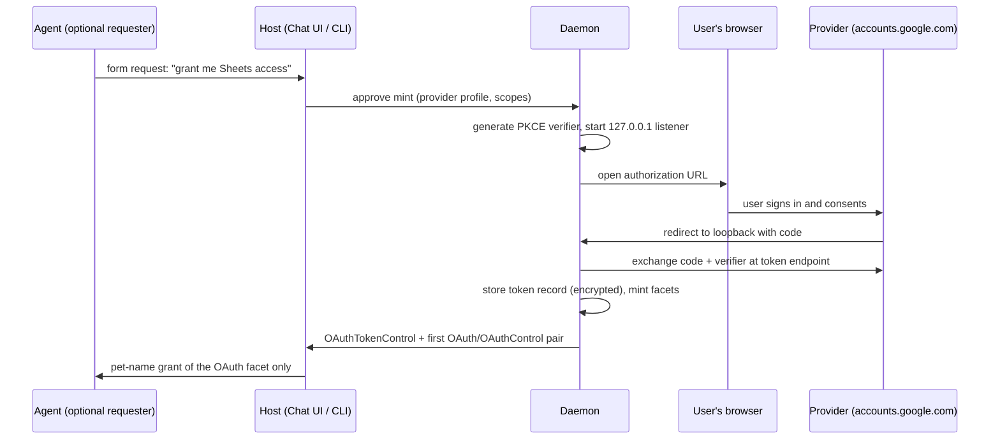

# EndoClaw: OAuth / Credential Capability

| | |
|---|---|
| **Created** | 2026-03-03 |
| **Updated** | 2026-07-07 |
| **Author** | Kris Kowal (prompted) |
| **Status** | Not Started |
| **Parent** | [endoclaw](endoclaw.md) |

## Summary

An `OAuth` capability lets an agent make authenticated HTTP requests to
a third-party API without ever seeing the credential. The host performs
the OAuth flow once, stores the token durably, and grants the agent an
`OAuth` exo that proxies requests with the token injected. The agent
calls `E(gmail).fetch('/gmail/v1/users/me/messages')`; the credential
is structurally inaccessible.

This design is also the **credential foundation for domain connectors**:
[exo-google-sheets](exo-google-sheets.md) (proposed in
endojs/endo-but-for-bots#612) and its future Gmail and Calendar siblings
consume an already-minted `OAuth` exo as an injected fetch power and
narrow it with typed, attenuable facets. The 2026-07-07 revision settles
the first-mint flow, restructures the token/facet layering so one
credential can back several facets, and pins the surface connectors may
rely on (§ The Connector Contract), per review of #612.

## What is the Problem Being Solved?

Handing an agent a raw OAuth token grants the whole account surface and
lets the agent exfiltrate the credential. The ocap answer is a proxy
exo: authority to *use* the service, never authority to hold or forward
the token. [endoclaw-network-fetch](endoclaw-network-fetch.md) confines
*where* requests can go (origin allowlist); this layer adds *who the
requests act as* (token injection) and narrows *what they may do* (path
patterns, read-only mode).

Two things were unsettled while the first connector was designed
against this layer:

1. **The first mint.** The original sketch said only "browser redirect
   or device code grant". Which one the host runs, whether it is
   configurable, and whether the choice leaks to consumers is now
   settled (§ First Mint).
2. **The consumer contract.** The Sheets connector assumes a
   fetch-shaped power, structured errors it can tell apart from
   Google's, several API hosts under one credential, and durable
   formula identity. Those assumptions are now normative
   (§ The Connector Contract).

## Capability Shape

Three layers, from durable credential to granted facet:

```ts
// Host-side caretaker over ONE stored credential. Never granted to guests.
interface OAuthTokenControl {
  mint(opts: {
    baseUrl: string,             // for example 'https://sheets.googleapis.com'
    allowedPaths?: string[],     // default: no restriction within the base URL
    readOnly?: boolean,          // default false
  }): { oauth: OAuth, control: OAuthControl };
  scopes(): string[];            // scopes the user consented to at mint
  refresh(): Promise<void>;      // force a token refresh now
  revoke(): Promise<void>;       // RFC 7009 § 2 provider revocation, delete the
                                 // stored token, sever every minted facet
  help(): string;
}

// Per-facet caretaker, paired with each granted OAuth exo.
interface OAuthControl {
  setAllowedPaths(patterns: string[]): void;
  setReadOnly(flag: boolean): void;  // restricts to GET and HEAD
  refresh(): Promise<void>;          // delegates to the shared token record
  revoke(): void;                    // severs THIS facet; the token survives
  help(): string;
}

// The agent-facing (or connector-facing) capability.
interface OAuth {
  fetch(path: string, options?: FetchOptions): Promise<Response>;
  baseUrl(): string;
  scopes(): string[];                // introspection; scopes are not settable
  help(): string;
}

type FetchOptions = {
  method?: string;
  headers?: Record<string, string>;
  body?: string;
};

type Response = {
  status: number;
  headers: Record<string, string>;
  text(): Promise<string>;
  json(): Promise<unknown>;
};
```

Changes from the 2026-03-03 sketch:

- **`setScopes` is removed.** Scopes are fixed by the consent the user
  granted at mint time and baked into the token; they are not a local
  control knob. Widening is a re-mint (§ First Mint, incremental
  authorization); narrowing is expressed with `setAllowedPaths` and
  `setReadOnly`, which the exo can actually enforce per request.
- **The token is its own durable record** (`OAuthTokenControl`), and
  `OAuth`/`OAuthControl` pairs are cheap attenuations minted from it.
  One credential backs many facets (§ Token, Facets, and Refresh).
- **Path-pattern semantics are pinned.** A pattern is an exact path or
  a prefix ending in `*`. Matching runs against the normalized path
  only (query string excluded), after percent-decoding and dot-segment
  removal, so `..` segments cannot escape a prefix. Paths must begin
  with `/`; absolute URLs are rejected, so a facet can never reach past
  its `baseUrl` (the underlying `HttpClient` origin allowlist is the
  backstop).
- **Header hygiene.** Caller-supplied `Authorization`, `Cookie`, and
  `Proxy-Authorization` headers are rejected; the exo owns the
  credential header.
- **Auth-layer errors are structured.** Denials and credential failures
  are thrown locally with copyable `code` properties (`'path-denied'`,
  `'method-denied'`, `'header-denied'`, `'auth-revoked'`,
  `'facet-revoked'`). Provider responses, including provider *errors*,
  pass through with status and body untouched, so a connector can map
  its service's error payloads (quota, permission) without this layer
  rewriting them.

## First Mint

**The host runs the flow; the agent and every connector are absent from
it.** The result of a mint is a stored token record and its
`OAuthTokenControl`; everything a consumer ever sees is minted after
the flow completes. Nothing on `OAuth`, `OAuthControl`, or
`OAuthTokenControl` names or reveals which flow produced the token.
That invariant is what lets [exo-google-sheets](exo-google-sheets.md)
Resolved Question 5 defer here: a connector composes over an
already-minted `OAuth` exo and cannot care.

**The default flow is authorization-code with PKCE (RFC 7636) against a
loopback redirect** (RFC 8252 § 7.3), opened in the user's system
browser, never an embedded webview (RFC 8252 § 8.12; Google blocks
embedded user-agents outright). This matches the decision already made
for LLM-provider subscriptions in
[endopi-provider-registry-and-oauth](endopi-provider-registry-and-oauth.md):
the redirect URI is a Familiar pane in the Electron build, or a local
HTTP listener bound to `127.0.0.1` in the daemon-only build (per
[gateway-bearer-token-auth](gateway-bearer-token-auth.md)). The two
designs share this mint plumbing; they differ only in what consumes the
token.

**The device-code grant (RFC 8628) is a configured alternative, not the
default.** It exists for hosts without a local browser and for
providers that support it. It cannot be the default because of a
decisive fact for this design's founding consumers: Google's
device-code grant supports only a small scope allowlist (sign-in
scopes, Drive `drive.file` and `drive.appdata`, YouTube), which
excludes the Sheets, Gmail, and Calendar scopes. The Google connectors
therefore always mint over the redirect flow.

**The flow is configured per provider, not per consumer.** A durable
provider profile record carries everything the mint procedure needs:

```ts
type OAuthProviderProfile = {
  name: string,                      // 'google'
  authorizationEndpoint: string,
  tokenEndpoint: string,
  revocationEndpoint?: string,       // RFC 7009, when the provider has one
  clientId: string,
  clientSecret?: string,             // installed-app secrets are not confidential
  flow: 'redirect' | 'device-code',  // 'redirect' unless the host cannot
  scopes: string[],                  // requested at consent
};
```

The mint sequence, driven through the daemon's existing structured-ask
channel ([daemon-form-request](daemon-form-request.md)) when an agent
is the requester, or the CLI/Chat UI when the human is:



**Re-consent and widening.** When a new grant needs scopes the stored
token lacks, the host re-runs the flow with incremental authorization
(Google's `include_granted_scopes`), producing a token whose scope set
covers old and new; the token record updates in place and existing
facets keep working.

Considered and rejected: device-code as default (Google's scope
allowlist excludes every founding connector; worse phishing profile).
Out-of-band copy/paste (deprecated and disabled by Google in 2022).
Embedded webview (RFC 8252 § 8.12; providers block it).

## Token, Facets, and Refresh

The stored token is one durable formula; granted capabilities are
attenuations of it:

- **Token record** (`oauth-token` formula): provider profile reference,
  access and refresh tokens, granted scopes, expiry. Encrypted at rest
  in the daemon's formula store, per the credential-storage posture of
  [endopi-provider-registry-and-oauth](endopi-provider-registry-and-oauth.md).
- **Facet** (`oauth` formula): token reference, `baseUrl`,
  `allowedPaths`, `readOnly`. Minted by `OAuthTokenControl.mint` at
  negligible cost, durable, independently revocable.

One credential backing many facets is load-bearing for the connectors:
the Sheets connector's `SheetsService` needs the Drive API host for
listing and the Sheets API host for values, two `baseUrl`s under one
Google consent; the Gmail and Calendar siblings are further facets of
the same token. Without token sharing, each would force a separate
browser consent for the same account.

Refresh belongs to the token record, not the facet: refreshes are
single-flight per token (concurrent expired-token requests across all
facets await one refresh), transparent to callers, and forcible via
either control facet. A refresh that fails with the provider's
`invalid_grant` (user revoked consent, refresh token expired) marks the
token dead and surfaces `'auth-revoked'` on every facet until the host
re-mints.

Revocation is two distinct acts. `OAuthControl.revoke()` severs one
facet and leaves the token and its sibling facets intact (a caretaker
cutting one grant). `OAuthTokenControl.revoke()` revokes the token with
the provider (RFC 7009 § 2, where a revocation endpoint exists),
deletes the stored record, and severs every facet.

## The Connector Contract

What a domain connector ([exo-google-sheets](exo-google-sheets.md) and
siblings) may rely on, stated once so connector designs reference
rather than re-derive it:

1. **A fetch-shaped power.** The connector's plain client (for example
   `@endo/google-sheets`) takes an injected `(path, options) =>
   Promise<Response>`. The host composes the connector stack in the
   same vat as the `OAuth` exo, closing over its `fetch`; no CapTP hop
   per request. The `OAuth` exo remains a passable capability for the
   direct-grant case (`E(gmail).fetch(...)`).
2. **The credential is invisible, in both directions.** No method
   returns or forwards the token, and the flow that minted it is not
   observable. A connector built on a redirect-minted token is
   indistinguishable from one built on a device-code-minted token.
3. **Errors are separable.** Auth-layer denials arrive as structured
   local errors with `code` properties; provider responses pass through
   untouched, so the connector owns the mapping of its service's error
   payloads (for example Sheets quota errors to
   `{ code: 'quota-exceeded', retryAfterSeconds }`).
4. **Several hosts, one consent.** A connector needing more than one
   API host under one credential asks the host for sibling facets of
   the same token record.
5. **Durable composition.** Tokens and facets are formulas; a connector
   formula (for example `google-sheet` capturing
   `{ oauthFormulaId, spreadsheetId, ... }`) references the facet by
   formula id and survives daemon restarts.
6. **Defense in depth is layered, not duplicated.** The facet carries
   `setAllowedPaths` pinned to the connector's resources (for example
   the granted spreadsheet ids) and `setReadOnly` where the grant is
   read-only; the connector layers its own finer attenuation (tabs,
   ranges, append-only) above; the `HttpClient` origin allowlist sits
   below. Rate limiting lives in the connector (domain-aware token
   bucket) and in `HttpClient` (`setMaxRequestsPerMinute`); this layer
   adds none.

Gap noted, deferred until a connector needs it: `Response` exposes
`text()` and `json()` only. A connector moving binary media (Drive file
download, Gmail raw attachments outside JSON) will want `bytes()`;
adding it is additive and breaks nothing.

## Endo Idiom

**The agent never sees the token.** The `OAuth` interface has no method
that returns the credential. The agent can *use* the service but cannot
extract the token to forward it elsewhere or use it on a different
endpoint: authority to use, not authority to delegate outside the
capability graph.

**Path restrictions.**
`OAuthControl.setAllowedPaths(['/gmail/v1/users/me/messages*'])` limits
the agent to specific API endpoints. An agent with Gmail read access
cannot call the Calendar API on the same credential.

**Read-only mode.** `setReadOnly(true)` restricts to GET and HEAD. The
agent can read emails but not send them.

**Caretaker revocation.** Facet revocation cuts one grant instantly;
token revocation cuts the credential itself, at the provider.

## Use Cases

- Gmail: read emails, draft responses, label messages
- Google Calendar: read events, create events
- Google Sheets: the [exo-google-sheets](exo-google-sheets.md)
  connector's injected fetch power
- Notion, Todoist, GitHub: any OAuth2-compatible API

## Dependencies

| Design | Relationship |
|--------|-------------|
| [endoclaw-network-fetch](endoclaw-network-fetch.md) | **Depends on.** The origin-allowlist `HttpClient` under every facet. |
| [daemon-form-request](daemon-form-request.md) | **Depends on (implemented).** The structured-ask channel through which an agent requests a grant and the host approves a mint. |
| [gateway-bearer-token-auth](gateway-bearer-token-auth.md) | **Precedent.** The daemon-only build's loopback redirect listener. |
| [endopi-provider-registry-and-oauth](endopi-provider-registry-and-oauth.md) | **Sibling.** LLM-provider subscription OAuth; shares the first-mint plumbing (PKCE, Familiar pane or loopback listener, encrypted storage), differs in consumer. |
| [exo-google-sheets](exo-google-sheets.md) | **Dependent.** First domain connector riding this layer (proposed in #612); Gmail and Calendar siblings follow its template. |
| [daemon-web-gateway](daemon-web-gateway.md) | **Future.** A public gateway route as redirect URI for remote hosts (Open Question 1). |

Distinct from the `gateway-oauth-bonding` gap tracked in the
[README](README.md) (bonding an OAuth *login identity* to a public-key
identity): that is who the *user* is; this is a credential an *agent*
uses without holding.

## Implementation Phases

1. **Token store and provider profiles (S).** `oauth-token` and
   provider-profile formula types, encrypted at rest; no flows yet,
   records seeded by hand for tests.
2. **First-mint flows (S-M).** Authorization-code with PKCE over the
   loopback listener; device-code behind the same mint procedure for
   providers that support it. No heavyweight OAuth client dependency:
   both flows are small over `fetch`.
3. **Facets (S-M).** `OAuthTokenControl.mint`, `OAuth`/`OAuthControl`
   with path normalization and matching, method and header enforcement,
   structured errors, single-flight refresh, the two revocations.
   Tested against a stub provider; no network.
4. **Daemon integration (S).** Pet-name grants, the form-request mint
   path, CLI and Chat UI entry points, incremental re-consent.

## Design Decisions

1. **The host runs authorization-code with PKCE against a loopback
   redirect by default** (RFC 8252 § 7.3), in the system browser. The
   device-code grant (RFC 8628) is a per-provider-profile alternative
   for browserless hosts, unavailable for the founding Google
   connectors because Google's device flow excludes their scopes.
2. **The flow is invisible to consumers.** Mint-time concern only;
   no surface names it. This is the invariant the connector designs
   defer to.
3. **One token record, many facets.** The credential is a durable
   record; grants are cheap attenuations binding base URL, paths, and
   read-only mode. Multi-host services and sibling connectors share one
   consent.
4. **Scopes are consent, not configuration.** `setScopes` is removed;
   widening is an incremental-authorization re-mint, narrowing is
   `setAllowedPaths`/`setReadOnly`, which are enforceable per request.
5. **Pass-through provider errors, structured local errors.** The layer
   never rewrites the service's responses; its own denials carry
   copyable `code` properties.
6. **Refresh is the token's job, single-flight,** with `invalid_grant`
   surfacing as `'auth-revoked'` on every facet rather than a retry
   loop.
7. **Two revocations.** Facet revocation (local caretaker) and token
   revocation (RFC 7009 § 2 plus store deletion) are distinct acts on
   distinct controls.

## Open Questions

1. **How does a remote, headless daemon run the redirect flow?** The
   loopback listener works when the browser and daemon share a machine.
   When the daemon is remote, the redirect must land on a URL the
   user's browser can reach: a gateway route
   ([daemon-web-gateway](daemon-web-gateway.md)) registered as a
   web-application redirect URI is the natural shape once public
   hosting (M5) exists. Until then: mint on a machine with a browser,
   or device-code where the provider's scopes permit. Recommend
   deferring the gateway route to a follow-up design when M5 lands (to
   be filed).
2. **Who registers the OAuth client?** Every provider requires a
   registered client id (and for Google installed apps, a
   non-confidential client secret). Options: each host registers its
   own (a documented setup step, provider-profile form); or Endo ships
   a first-party client id in the Familiar. Recommend per-host
   registration for v1 (no shared quota, no verification gate on the
   project) and revisit a first-party id when the Familiar wants a
   zero-setup experience.
3. Resolved in the body: first-mint flow (§ First Mint, Design
   Decisions 1-2), scope control (Design Decision 4), multi-host
   credentials (Design Decision 3).

## Prompt

The 2026-03-03 original was authored from the
[endoclaw](endoclaw.md) parent survey. The 2026-07-07 revision responds
to review of endojs/endo-but-for-bots#612:

> Refine `designs/endoclaw-oauth.md` so it is a solid foundation for
> domain connectors that ride it (exo-google-sheets, and its Gmail /
> Calendar siblings). In particular, settle the first-mint OAuth flow:
> browser redirect against a localhost callback or the device-code
> grant; which does the host run, is it configurable, and is that
> choice fully hidden from connectors (they consume an already-minted
> OAuth exo and should not care)? Confirm the OAuth/OAuthControl
> surface (setAllowedPaths, setReadOnly, token refresh, revocation) is
> sufficient as the credential layer the Sheets connector narrows on
> top of, and note any gaps the connector designs currently assume.
