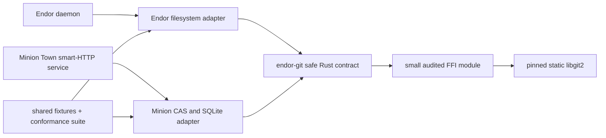

# Endor In-Process Git Bindings

| | |
|---|---|
| **Created** | 2026-07-15 |
| **Updated** | 2026-08-22 |
| **Author** | Kris Kowal (prompted) |
| **Status** | In Progress |

## Status

The initial `rust/endor-git` tranche implements the safe object/ref contract,
filesystem and custom ODB/refdb backends, SHA-1/SHA-256 conformance tests,
bounded async bridge, vendored static dependency profile, linkage and
reproducibility audits, and the release build matrix scaffolding.
The x86_64 Linux glibc and musl Zig artifacts build and run.
The first Windows GNU attempt reaches the final link after compiling vendored
libgit2, but Zig 0.15.2 cannot satisfy Rust's `msvcrt` import-library link,
confirming the design's escalation trigger.

Streaming writes, bounded pack ingestion, the Endor tree-to-`ContentStore`
adapter, ARM and platform-native corpus runs, macOS SDK lane, and Minion Town
smart-HTTP integration remain.
The structured evidence and target gaps are maintained in
[`rust/endor-git/GAPS.md`](../rust/endor-git/GAPS.md).

## Revision context

The original version selected pure-Rust `gix` and rejected libgit2 after the
2026-07-26 review of
[PR #740](https://github.com/endojs/endo-but-for-bots/pull/740).
The newer
[Minion Town review](https://github.com/kriscendobot/minion.town/pull/41#discussion_r3785717342)
(Minion Town is a separate project building a multi-tenant, Git-remote-capable
weblet host)
reopens that decision and asks Endor to lead with Rust bindings to libgit2,
provided that Zig can make the C dependency cross-compilable for Windows,
macOS, and Linux.
This revision supersedes the earlier `gix`-only decision and makes the
cross-build matrix an executable gate rather than an assumption.
The premise that Zig resolves the C cross-compile cost is the least-proven
claim in this document, so it carries an explicit escalation trigger,
mirroring the SHA-256 release-gate discipline: if any release-matrix target
cannot reach a reproducible cross-build plus a passing native run with the
pinned Zig toolchain (the Windows GNU lane is the first expected point of
failure, since `cargo-zigbuild` does not yet claim Windows support), the build
owner escalates that target to the maintainer as a blocking result and the
`gix` fallback (see Alternatives considered) is reconsidered for that target
rather than the target being quietly dropped or its C toolchain hand-patched
indefinitely.

The companion
[Minion Town Git remote design](https://github.com/kriscendobot/minion.town/blob/609fdd5251a0297ce15355acc8d902f973c99a18/designs/git-remote-capability.md#5--research--how-much-of-gits-wire-protocol-and-the-prior-art)
section 5 is the server-half and pluggable-object-database prior art for this
design.
Its review comment is also the source of the requirement that the two projects
share an implementation seam and gain shared build experience.

## Goals and scope

Endor needs in-process Git object and reference operations without executing a
host `git` program.
The binding must:

- expose a narrow, synchronous Rust interface over libgit2;
- support both Endor's daemon-owned repository and Minion Town's CAS and SQLite
  adapters;
- build one statically linked libgit2 copy from pinned source as part of Cargo;
- cross-compile release artifacts for supported Windows, macOS, and Linux
  targets with Zig as the C compiler and linker; and
- provide shared fixtures and conformance tests so a fix learned in either
  project applies to both.

The baseline is local Git storage.
It does not grant network, shell, checkout, index, hook, credential-helper, or
interactive authentication authority.
HTTPS and SSH client transports remain owned by
[daemon-git-remotes](daemon-git-remotes.md).
Serving Git smart HTTP is required by Minion Town, but is a separate layer over
the same storage boundary because libgit2 does not provide a ready-made
`upload-pack` or `receive-pack` HTTP server.

## Architecture

The reusable code lives in a new Rust crate, `rust/endor-git`, in this
repository.
Endor depends on it by workspace path.
Minion Town initially pins this repository and commit as a Cargo Git dependency;
it may switch to a published crate after the interface stabilizes.
The crate has no dependency on either daemon's database schema.



`endor-git` has three layers:

1. `GitObjectDb` is the safe Rust contract used by both applications.
2. `Libgit2Repository` implements ordinary on-disk repositories through the
   safe [`git2`](https://docs.rs/git2) crate.
3. `Libgit2Backend` installs custom object and reference databases through
   [`libgit2-sys`](https://docs.rs/libgit2-sys) for Minion Town and any later
   Endor database-backed store.

Only layer 3 contains `unsafe` code.
No raw libgit2 pointer crosses its module boundary.

## Safe Rust contract

```rust
pub trait GitObjectDb: Send + Sync {
    fn object_exists(&self, oid: &GitObjectId) -> Result<bool, GitError>;
    fn read_object(&self, oid: &GitObjectId) -> Result<GitObject, GitError>;
    fn write_object(
        &self,
        kind: GitObjectKind,
        bytes: &[u8],
    ) -> Result<GitObjectId, GitError>;
    fn read_tree(&self, oid: &GitObjectId) -> Result<Vec<GitTreeEntry>, GitError>;
    fn resolve_ref(&self, name: &GitRefName)
        -> Result<Option<GitObjectId>, GitError>;
    fn update_ref_if(
        &self,
        name: &GitRefName,
        expected: Option<&GitObjectId>,
        next: &GitObjectId,
        message: &str,
    ) -> Result<(), GitError>;
    fn verify(&self, scope: GitVerifyScope)
        -> Result<GitVerifyReport, GitError>;
}
```

`GitObjectId` carries the repository object format and fixed-width bytes.
The daemon never treats a Git object ID as an Endor `ContentStore` identifier.
Daemon-owned repositories continue to use Git's SHA-256 object format, while
authorized SHA-1 repositories remain readable.
Because libgit2 and `git2` still label SHA-256 support experimental, the Cargo
feature `unstable-sha256` and its ABI are pinned together and the SHA-256 tests
are release gates.
This is the same SHA-256 maturity risk the superseded `gix` version carried;
moving from `gix` to libgit2 neither improves nor worsens it, so the release
gate stays as the mitigation and the backend switch claims no benefit on this
axis.

`update_ref_if` is the only mutating ref operation.
It rejects symbolic refs in the writable namespace, a missing target object,
an object-format mismatch, and an unexpected current value.
Endor restricts writes to `refs/endor/`.
Minion Town scopes the same operation by partition (its tenancy boundary: the
per-tenant slice of object and ref storage that a capability URL grants access
to, so no request can read or write another tenant's Git data) before it
reaches the backend.

The C callbacks are synchronous, so adapter methods are synchronous too.
`git2::Repository` is not `Sync`, so `Libgit2Repository` serializes access to
each repository behind a mutex while allowing separate repositories to proceed
in parallel.
An async web server calls those adapter methods from a bounded blocking pool.
The blocking-pool bridge is not left to each consumer to reinvent: `endor-git`
owns it as a documented, reusable affordance (a small `spawn_blocking`-style
helper that runs a `GitObjectDb` call on a bounded pool and returns a future),
so Endor and Minion Town share one implementation of the sync-to-async seam
rather than forking two.
No Rust panic may unwind through C: every callback catches panics, stores a
sanitized Rust error in request-local state, and returns a libgit2 error code.
The FFI module owns callback allocation, pointer lifetime, shutdown ordering,
and conversion of libgit2 errors to `GitError`.

## Storage adapters

### Endor filesystem adapter

Endor opens a bare repository below the Endo state directory and uses
libgit2's bundled loose-object, pack, and filesystem-ref backends.
The repository inherits the state directory's permissions, backup policy, and
single-daemon ownership.
The existing `ContentStore` remains separate.
A `GitTreeToContentStore` adapter may materialize an immutable Git tree when a
formula consumer needs Endor's `TreeManifest` vocabulary, recording the Git ID
as provenance rather than as an alias.

### Minion Town CAS and SQLite adapter

Minion Town supplies custom `git_odb_backend` and `git_refdb_backend`
implementations, following its design's pluggable-ODB strategy.
Git object bytes go to its CAS; SQLite maps
`(partition, object-format, git-oid)` to the CAS blob and stores partitioned
refs.
Ref compare-and-swap is one SQLite transaction.
The adapter validates the partition capability before opening a repository, so
libgit2 never receives ambient access to another partition.

The custom ODB implements the whole subset exercised by the shared suite:
object reads, headers, existence and prefix checks, enumeration, streaming
writes, and pack ingestion.
Unsupported callbacks return a named error rather than silently falling back to
the filesystem.
Received packs are bounded, checksummed, indexed, and committed to the CAS
before any ref transaction can publish them.

## Smart HTTP and the shared seam

libgit2 supplies object traversal, pack construction and ingestion, ODB and
refdb extension points, and client transports.
Its transport extension points describe how libgit2 acts as a client; they are
not an HTTP server implementation.
The Minion Town service therefore owns Git protocol v2 request parsing,
capability advertisement, fetch negotiation, and receive-pack status framing.
It delegates object walks, pack production and ingestion, and atomic ref
updates to `endor-git`.

The shared boundary is deliberately below HTTP:

- Endor owns `GitObjectDb`, the libgit2 wrapper, backend callback safety, object
  validation, and the golden fixture corpus.
- Minion Town owns capability-URL authentication, HTTP routing, request limits,
  partition selection, and projection of a pushed tip into a weblet manifest (a
  weblet is a Minion Town unit of hosted web content, and its manifest is the
  deployable description Minion Town derives from the pushed Git tip).
- Protocol transcripts and packs from Minion Town become fixtures in
  `rust/endor-git/tests/fixtures/`.
- Every `endor-git` change runs both the filesystem backend suite and a generic
  in-memory backend suite. Minion Town runs the same suite against its CAS and
  SQLite adapter at its pinned Endo commit.

This arrangement transfers lessons in both directions without coupling Endor
to Minion Town's web framework or database schema.
A bug fixed in pack validation, ref transactions, object-format handling, or
FFI ownership lands in `endor-git`; Minion Town advances its pinned commit and
reruns the shared transcripts.
A Minion-only authentication or HTTP framing bug stays in Minion Town.

## Vendoring and Zig cross-compilation

Cargo pins `git2`, `libgit2-sys`, and their checksums in `Cargo.lock`.
The `vendored-libgit2` feature makes `libgit2-sys` compile the libgit2 source
included in its crate package and statically link it into `endor`.
The local-storage profile disables `https` and `ssh`, uses the bundled parser
and hashing code selected by `libgit2-sys`, and does not discover a system
libgit2 through `pkg-config`.

```toml
git2 = {
  version = "=<reviewed release>",
  default-features = false,
  features = ["vendored-libgit2", "unstable-sha256"],
}
```

`libgit2-sys` builds the vendored C sources with Rust's `cc` crate rather than
invoking libgit2's CMake project.
The release wrapper uses `cargo zigbuild` for targets it supports.
For other targets it provides checked-in target-specific compiler, archiver,
and linker wrappers over `zig cc` and `zig ar`; the Windows lane starts with
this explicit wrapper because `cargo-zigbuild` does not currently claim Windows
target support.
The builder records the exact Rust toolchain, Zig version, Cargo package
checksums, target triple, target CPU baseline, and macOS SDK identity.

| Release family | Initial target | Build lane | Native gate |
|---|---|---|---|
| Linux glibc | `x86_64-unknown-linux-gnu` and `aarch64-unknown-linux-gnu` | `cargo zigbuild`; explicit oldest supported glibc version | Run tests in containers at that glibc floor and on both architectures |
| Linux static | `x86_64-unknown-linux-musl` and `aarch64-unknown-linux-musl` | `cargo zigbuild`; no assumption that static glibc works | Run the artifact in empty musl containers |
| Windows | `x86_64-pc-windows-gnu` initially | Cargo target config plus checked-in `zig cc`/`zig ar` wrappers for Zig's MinGW-compatible target | Run tests on Windows; add MSVC artifacts only from a native MSVC lane |
| macOS | `x86_64-apple-darwin` and `aarch64-apple-darwin` | Zig with an explicitly provisioned, pinned macOS SDK; combine only after both slices pass | Run on Intel and Apple Silicon, then sign and notarize on macOS |

Zig does not remove every platform dependency.
Darwin linking still needs a legally provisioned SDK and final Apple signing.
Windows MSVC artifacts still need the MSVC toolchain if the project elects to
ship them.
Every cross-built artifact therefore runs on its native operating system before
release.

This is a smaller version of, not an escape from, the per-target C cross
toolchain burden that the 2026-07-26 review of PR #740 used to rule libgit2 out
(the objection is quoted in that PR's revision context). Zig is claimed to be
cheaper here on a specific, bounded axis rather than uniformly across the
matrix: for the two Linux families (four target triples) it supplies one
pinned `cargo zigbuild` compiler and linker in place of four native C
toolchains, which is the bulk of the matrix and where the saving is real.
The two harder lanes are conceded explicitly rather than presented as solved:
the Windows GNU lane still needs hand-maintained, checked-in `zig cc`/`zig ar`
wrappers, and the macOS lane still needs a pinned, legally provisioned SDK plus
native signing. The design accepts that residual burden because it is confined
to two lanes and gated by the escalation trigger above, not because Zig makes
it disappear; if either lane's hand-maintenance cost grows past that bound, the
escalation trigger reopens the choice for that target.

## Verification gates

| Gate | Required observation |
|---|---|
| Binding safety | Miri or sanitizer-backed callback tests cover ownership, callback panic conversion, concurrent access, and shutdown; no sanitizer finding is accepted. |
| Object formats | SHA-1 fixtures are readable; daemon-created SHA-256 objects and refs round-trip and match ordinary Git's object IDs. |
| ODB parity | Loose and packed objects, prefix lookups, streaming writes, and corrupted objects have identical results across filesystem and test backends. |
| Ref atomicity | Exactly one of two updates with the same expected old ID succeeds; external-writer races preserve the winning ref. |
| Pack resource bounds | Oversized, truncated, and adversarially malformed packs (delta bombs, declared-vs-actual size mismatch, excessive object counts) are rejected against the configured limits before indexing, in bounded memory and time, and never reach a ref transaction; this exercises the one network-supplied, guest-controlled input path (Minion Town's capability-URL git remote). |
| Smart HTTP corpus | Stock Git can clone, fetch, and push through Minion Town's service; captured protocol-v2 transcripts replay against the shared store contract. |
| Cross-build | Every matrix target builds from the canonical build host with the pinned Zig toolchain and no target C compiler installed. |
| Native execution | Each artifact runs the same object, pack, ref, corruption, and protocol corpus on its target operating system and architecture. |
| Link audit | `ldd`, `otool -L`, or `dumpbin /dependents` shows no dynamic libgit2, OpenSSL, libssh2, or unexpected zlib dependency. |
| Reproducibility | Two clean builds with the same pinned inputs produce matching normalized artifacts; any signing envelope is compared separately. |

Ordinary Git remains a test oracle only.
The released Endor and Minion Town artifacts neither spawn `git` nor discover a
system Git library at runtime.

## Phased delivery

1. Add `endor-git` with the safe contract, pinned `git2`/`libgit2-sys`, the
   filesystem backend, SHA-1 and SHA-256 object tests, and linkage audit.
2. Add the custom-backend FFI module and a generic in-memory conformance backend.
   Exercise every required ODB/refdb callback and fault path.
3. Add Endor's state-directory repository and tree-to-`ContentStore` adapter.
   Formula snapshots remain the first durable `refs/endor/` consumer, followed
   by archive imports and Git-tree materialization.
4. Add the Zig release wrapper and run the cross-build plus native-execution
   matrix before declaring any target supported.
5. Depend on the reviewed Endo commit in Minion Town; implement the CAS and
   SQLite adapter and smart-HTTP server there; and contribute its protocol
   corpus back to `endor-git`.

## Alternatives considered

- **Pure-Rust `gix`.** This avoids the C toolchain. The load-bearing technical
  reason to prefer libgit2 is that this architecture pivots on libgit2's stable
  `git_odb_backend`/`git_refdb_backend` extension points (Architecture layer 3),
  which let Minion Town supply its CAS-and-SQLite object and ref store as a
  drop-in backend behind the same object-graph, pack, and ref-transaction code.
  `gix` today exposes no equivalent published, stable custom-object-store /
  custom-ref-store plug-in seam; its object and ref database types are not a
  documented extension boundary a third-party store can implement against. That
  capability gap, not merely the 2026-08-14 direction to align Endor and Minion
  Town, is why `gix` is not the production backend. It also carries the same
  experimental SHA-256 status as libgit2, so the switch is neutral on that axis.
  Keep `gix` as a benchmark and emergency redesign option (and, per the
  escalation trigger in Revision context, the fallback for any release target
  Zig cannot cross-build), not a second production backend.
- **System libgit2.** Rejected because it makes behavior and ABI depend on the
  host and defeats the standalone artifact.
- **Prebuilt libgit2 archives.** Rejected for the first implementation because
  source builds give Cargo one auditable dependency graph. Reconsider only if a
  target cannot build reliably with Zig.
- **Subprocess Git.** Retained only as a test oracle. Runtime use violates the
  standalone and least-authority requirements.
- **A shared HTTP service binary.** Rejected because it would force Endor to
  carry Minion Town's authentication and deployment concerns. Share the storage
  crate and transcripts instead.

## Dependencies

| Design | Relationship |
|---|---|
| [daemon-endor-architecture](daemon-endor-architecture.md) | Places the in-process binding in the Rust supervisor. |
| [daemon-cas-management](daemon-cas-management.md) | Keeps Endor `ContentStore` identity and lifetime separate from Git object identity. |
| [daemon-git-capability](daemon-git-capability.md) | Public Git authority may consume this backend without exposing it directly. |
| [daemon-git-remotes](daemon-git-remotes.md) | Owns outbound transport and credential authority. |
| [Minion Town Git remote, section 5](https://github.com/kriscendobot/minion.town/blob/609fdd5251a0297ce15355acc8d902f973c99a18/designs/git-remote-capability.md#5--research--how-much-of-gits-wire-protocol-and-the-prior-art) | Supplies pluggable-ODB and server-half prior art; consumes the shared Rust crate and fixtures. |
| [Review comment that requested this revision](https://github.com/kriscendobot/minion.town/pull/41#discussion_r3785717342) | Requires libgit2, Zig cross-compilation, and shared experience between the two projects. |

## Resolved decisions

The review of 2026-08-17 closed the prior open questions:

- **Windows ABI target: deferred past the first release.** The GNU/Linux ABI is
  good enough at first pass; the standalone binary does not require native MSVC
  artifacts to ship. Windows support is a follow-up, tracked separately rather
  than blocking this design.
- **Supported glibc floor: an explicit, tested minimum is required.** Before the
  GNU/Linux artifacts are public, the release owner must choose and test an
  explicit minimum glibc version — this is a release-engineering requirement, not
  an open question.
- **Shared crate publication: not published.** `endor-git` stays a local,
  commit-pinned Cargo Git dependency shared between Endor and Minion Town. It is
  not published to a registry; revisit only if an external consumer appears.

## Prompt

> Elaborate the Endor Git bindings design: binding libgit2 from Rust; the
> cross-compilation story (Zig cc to build/cross-link libgit2's C dependency
> across Windows/macOS/Linux); and how it stays in sync with the Minion Town
> git-client-to-daemon web server so experience transfers both ways. Back
> reference Minion Town's `designs/git-remote-capability.md` section 5 and the
> originating review comment.
