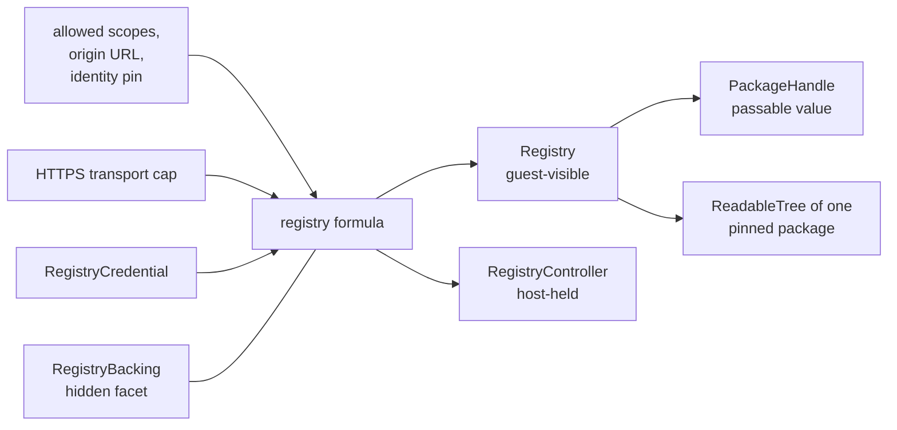

# Endor NPM Registry Capability

| | |
|---|---|
| **Created** | 2026-05-21 |
| **Updated** | 2026-05-21 |
| **Author** | 0xPatrick (prompted) |
| **Status** | Proposed |

> **Companion to [endor-npm-registry-proxy](endor-npm-registry-proxy.md).**
> That doc owns the storage layer (Rust `RegistryTable` schema, MVS resolution, `CasPackageResolver` host functions, tarball-to-CAS extraction).
> This doc owns the **capability surface**: how an agent receives, composes, and attenuates the authority to use one npm registry, in the same ocap idiom as the [daemon-mount-capabilities](daemon-mount-capabilities.md) / [daemon-git-capability](daemon-git-capability.md) / [daemon-git-remotes](daemon-git-remotes.md) trio.
> The two designs land as separate PRs against `llm`; their implementation phases are interleaved but the diff is split (storage vs cap) so reviewers can read either half in isolation.

## Summary

Define a guest-visible `Registry` capability whose authority is one npm-registry origin, derived by composing separately authorized HTTPS transport, non-extractable bearer or basic credentials, and the trusted backing handles to the proxy's `RegistryTable` and CAS.
Tarball bytes travel on the bounded HTTPS data plane and into the tar parser / CAS writer outside CapTP, mirroring the packfile path in [daemon-git-remotes](daemon-git-remotes.md).
Identity is pinned at construction time (origin URL + CA fingerprint + observed-integrity-prefix sentinel) so a swap of the upstream registry under a long-lived `Registry` cap fails closed.
Attenuation is two-axis and monotone: `readOnly()` blocks cache mutation (no new fetches, no eviction), `offline()` blocks network access but still serves cache hits.
Controllers (`RegistryController`, `RegistryCredentialController`) and a credential-rotation surface land in Phase 5, parallel to the git-remote phase split.
The resolver in [endor-npm-registry-proxy](endor-npm-registry-proxy.md) (`CasPackageResolver`) becomes an Exo facet constructed from one or more `Registry` caps; the host-function shape (`resolvePackage` / `fetchPackageJson` / `fetchModuleSource`) is preserved as the resolver's *internal* contract with the XS compartment mapper.

## What You Should Know First

This document assumes you know the following primitives in one-line form; the rest of the doc names them without re-introducing them.

- **`RegistryTable`** (storage half; see [endor-npm-registry-proxy](endor-npm-registry-proxy.md) § *Registry table*) is the SQLite `(packages, package_meta)` schema at `{statePath}/registry.sqlite`.
- **`CasPackageResolver`** (storage half; see [endor-npm-registry-proxy](endor-npm-registry-proxy.md) § *Integration with `endor run`*) is the host-function set (`resolvePackage`, `fetchPackageJson`, `fetchModuleSource`) wired into the compartment mapper's `moduleMapHook` / `importHook`.
- **MVS** (storage half; see [endor-npm-registry-proxy](endor-npm-registry-proxy.md) § *Version resolution: Minimal Version Selection*) is the Go-style minimal-version-selection algorithm.
- **`ReadableTree` / `ReadableBlob`** are the shared read-surface interfaces from [platform-fs](platform-fs.md) and [daemon-weblet-application](daemon-weblet-application.md) § *New formula: `readable-tree`*; `Registry.tree(handle)` returns one.
- **`BearerCredential` / `BasicCredential`** (from [daemon-git-remotes](daemon-git-remotes.md) § *MVP Credential Shapes*) are the non-extractable credential shapes; `RegistryCredential` reuses the same vocabulary verbatim.
- **`HttpClient`** is the Endo HTTP-transport capability shape used as the bounded outbound-network authority input; see [cli-http-client](cli-http-client.md) for the controller/client split.
- **Hidden Exo facet** is the host-private-companion pattern from [daemon-mount-capabilities](daemon-mount-capabilities.md) § *Host-Private Physical Backing*; `RegistryBacking` reuses the mechanism.

## What is the Problem Being Solved?

The [endor-npm-registry-proxy](endor-npm-registry-proxy.md) design owns the storage layer well: it specifies the SQLite schema, the MVS algorithm, the tarball-extraction-to-CAS path, and the resolver-to-compartment-mapper wiring.
It deliberately stops at the boundary where authority becomes interesting.
Today, an agent that wants to import from a private scope reaches for the same surfaces a `npm` CLI user reaches for: a registry URL in `.npmrc`, an `NPM_AUTH_TOKEN` in environment, or a `_authToken` line buried in a config file.
That posture is incompatible with Endo's capability model, the same way that ambient git configuration is incompatible with [daemon-git-remotes](daemon-git-remotes.md).

A useful agent using npm dependencies needs to:

- resolve and fetch packages from one or more origins;
- present a stable handle to a fetched package without re-running resolution per call;
- consume a fetched package's contents through the same `ReadableTree` surface that [daemon-make-archive](daemon-make-archive.md) § Phase 7 (`makeFromTree`) and [daemon-weblet-application](daemon-weblet-application.md) (the `readable-tree` formula) already consume, so the registry plugs into the CAS-app-execution side without an adapter;
- do so without ever holding the credential that authenticates the request;
- be attenuated to *offline-cache-only* (for reproducible builds) and *read-only* (for an auditor inspecting an already-populated cache) without re-issuing the underlying authority.

The vocabulary the [daemon-git-capability](daemon-git-capability.md) + [daemon-git-remotes](daemon-git-remotes.md) pair landed for the worktree-and-remote-git case (host-private `*Backing` Exo facet, capability-derived `provide*`, identity pinning at construction, non-extractable credentials fed through fd-only injection, bulk data plane separated from CapTP, controller / client facet split) ports almost verbatim to npm.
This document is the port.

## Goals

1. Define a `Registry` capability whose authority is one npm-registry origin, derived by composing separately authorized transport and credential capabilities.
2. Preserve the proxy doc's storage and resolver shape unchanged; this is a cap layer over the same Rust `RegistryTable` and the same compartment-mapper integration.
3. Make `Registry.tree(handle)` return the same `ReadableTree` / `ReadableBlob` shape the rest of the daemon already consumes, so a `PackageHandle` flows into `makeFromTree` without an adapter.
4. Pin registry identity at construction time so a swap of the upstream origin under a long-lived `Registry` cap fails closed.
5. Make `readOnly()` and `offline()` two distinct one-way attenuations; both monotone, both stored on the formula.
6. Route tarball bytes outside CapTP through a bounded HTTPS data plane straight into the tar parser and CAS writer, never as CapTP messages.
7. Keep credential material non-extractable: no `.npmrc` parsing for tokens, no env-var-leaked secrets, no argv exposure; reuse the fd-fed `GIT_ASKPASS`-style anonymous-pipe injection from [daemon-git-remotes](daemon-git-remotes.md) where a transitional native shell-out path is needed.
8. Keep policy edits (allowed scopes, rotate credential, evict cached versions, cache compaction) on a host-held `RegistryController`; the guest cap never widens.

## Non-Goals

- Re-specifying the storage layer: schema, MVS, tarball extraction, and compartment-mapper wiring live in [endor-npm-registry-proxy](endor-npm-registry-proxy.md).
- Lifecycle scripts (`preinstall`, `postinstall`, `prepare`). The proxy doc already lists these under known gaps ("intentionally omitted — Endo does not execute arbitrary install scripts"); this cap design does not add a hook for them, and any future authority to run them lives on a separate `Application`-cap design rather than on `Registry`.
- `.npmrc` parsing as the source of truth for credentials or registry URLs. `.npmrc` may be read at *host setup* time to seed the operator's `provideRegistry({...})` call, but the resulting `Registry` cap holds policy on the formula, not on a mutable text file.
- The lockfile analog (a `DependencyGraph` cap that captures resolved versions for reproducible reconstruction). See § *Open Questions* — this is a follow-up design.
- SSH-style transports for git-over-npm-like registries: out of scope, as in [daemon-git-remotes](daemon-git-remotes.md) § *MVP Transport Scope*.
- A unifying `Application` cap that composes registry, git, and mount construction sugars. The liaison's exploration flagged this as a follow-up; it stays out of scope here.

## Dependencies

| Design | Relationship |
|---|---|
| [endor-npm-registry-proxy](endor-npm-registry-proxy.md) | Required storage half: `RegistryTable`, MVS, `CasPackageResolver`, tarball-to-CAS extraction. This doc is the cap-shape companion. |
| [daemon-mount-capabilities](daemon-mount-capabilities.md) | Source of the `*Backing` hidden-Exo-facet pattern (`EndoMountBacking`) reused by `RegistryBacking`. |
| [daemon-git-capability](daemon-git-capability.md) | Source of the `provide*(cap, petName)` capability-derived construction shape, the identity-pinning idiom, and the `readOnly()` attenuation idiom. |
| [daemon-git-remotes](daemon-git-remotes.md) | Source of the `BearerCredential` / `BasicCredential` non-extractable credential shapes, the `audience()` boundary, the GIT_ASKPASS-over-anonymous-pipe credential-injection pattern, the controller / client / backing facet split, and the bulk-data-plane separation. |
| [cli-http-client](cli-http-client.md) | Controller / client split for the bounded HTTPS transport capability that `Registry` composes. |
| [daemon-make-archive](daemon-make-archive.md) | Downstream consumer: `makeFromTree(...)` (Phase 7) and `makeUnconfinedFromTree(...)` (Phase 8) accept a `ReadableTree`, which is exactly what `Registry.tree(handle)` returns. |
| [daemon-weblet-application](daemon-weblet-application.md) | Source of the `readable-tree` formula whose read surface `Registry.tree(handle)` matches. |
| [exo-zip-package](exo-zip-package.md) | Prior art for the `ReadableTree` / `ReadableBlob` adapter pattern over an archive format; the registry's tarball extraction sits in the same shape. |
| [daemon-cas-management](daemon-cas-management.md) | Source of the CAS retain / release verbs `RegistryBacking` calls. |
| [daemon-content-store-gc](daemon-content-store-gc.md) | GC contract for cached package trees; the `RegistryController.evict(handle)` method composes with the CAS GC pass. |
| [daemon-capability-bank](daemon-capability-bank.md) | Long-term home for durable credential storage; until it lands, `RegistryCredential` ships its own seal / unseal envelope (parallel to [daemon-git-remotes](daemon-git-remotes.md) § *Initial Backend*). |
| [trust-on-first-bind](trust-on-first-bind.md) | Reusable policy-binding pattern for first-seen registry origins, paralleling the git-remote use. |

## Capability Model

### Guest-Visible Facets

| Capability | Role |
|---|---|
| `Registry` | Bounded use of one configured npm-registry origin |
| `PackageHandle` | Passable, value-shaped pinned-package descriptor (name + version + integrity + tree-hash); no authority of its own |

### Construction Inputs

| Capability | Role |
|---|---|
| HTTPS transport cap | Outbound network authority bounded to the registry origin; an `HttpClient`-shaped object per [cli-http-client](cli-http-client.md) |
| `BearerCredential` / `BasicCredential` | Non-extractable authentication-use authority for the registry; same shapes as [daemon-git-remotes](daemon-git-remotes.md) § *MVP Credential Shapes* |

### Host-Private / Controller Facets

| Capability | Role |
|---|---|
| `RegistryBacking` | Hidden Exo facet on the `registry` formula. Holds the trusted handles to the SQLite `RegistryTable` (see [endor-npm-registry-proxy](endor-npm-registry-proxy.md) § *Registry table*) and the CAS retain / release verbs. Never reachable from the guest. |
| `RegistryController` | Host-held policy facet: rotate credential, edit allowed-scope policy, evict cached package versions, compact cache. Phase 1 only ships credential rotation; the rest lands in Phase 5. |
| `RegistryCredentialController` | Host-held facet that installs, rotates, or revokes credential material (parallel to `GitCredentialController` in [daemon-git-remotes](daemon-git-remotes.md)). |

The guest never observes the controller or the backing.
The agent-facing `Registry` cap can *use* the registry, not retarget it, widen its policy, or read the secret backing it.



## Proposed Public Vocabulary

### `PackageHandle`

```ts
interface PackageHandle {
  // Copyable presentation data; mount-scoped-entry analog.
  name(): string;
  version(): string;
  integrity(): string; // npm dist.integrity (sha512-…), already verified at fetch time
  treeHash(): string;  // CAS tree-hash of the extracted package; stable across restarts
}
```

`PackageHandle` is a **value**, not a handle.
The decision mirrors [daemon-mount-capabilities](daemon-mount-capabilities.md) § *Design Decision 3* (`EndoMountEntry` is a value, not a handle):

- no observational authority (no `exists()` or `stat()` method on the handle itself);
- no handle-minting (no `tree()` method on the handle itself; `Registry.tree(handle)` is the path);
- mount-lineage-equivalent provenance: the issuing `Registry`'s formula identity is stamped on the handle, and another `Registry` rejects it on identity.

This keeps both observational authority and content-reading authority concentrated on `Registry` where they can be revoked or attenuated as a unit, instead of diffusing them across handles the agent passes around.

### `Registry`

```ts
interface Registry {
  // Inspect the policy the host baked into this cap.  `audience()` matches
  // the credential's audience() boundary so a guest correlating outbound
  // calls to the registry origin does not need a separate side channel.
  inspect(): Promise<RegistryPolicy & { name: string }>;
  audience(): string;

  // Metadata.  Caches under package_meta per [endor-npm-registry-proxy].
  // Returns the cached metadata when offline() is in effect; throws
  // RegistryOfflineMiss for an uncached name.
  manifest(name: string): Promise<RegistryManifest>;

  // Pin a (name, range?) tuple to a concrete (name, version, integrity, treeHash)
  // PackageHandle, fetching the tarball into CAS if not already present.  Under
  // offline(), uses only the existing registry table and CAS; throws
  // RegistryOfflineMiss for an unresolved tuple.  range omitted means "the
  // greatest version per major satisfying any prior MVS-recorded requirement
  // visible to this Registry", matching the proxy doc's MVS semantics.
  pin(name: string, range?: string): Promise<PackageHandle>;

  // Hand a handle back as a ReadableTree of the extracted package
  // (package.json plus source, exactly the tree shape exo-zip-package and
  // daemon-make-archive already consume).  Reading the tree never touches
  // the network: the bytes are already in CAS by construction.
  tree(handle: PackageHandle): Promise<ReadableTree>;

  // Two distinct, monotone, one-way attenuations.  Composable in either
  // order: registry.readOnly().offline() and registry.offline().readOnly()
  // produce the same authority shape.
  readOnly(): Registry;
  offline(): Registry;
}
```

`tree(handle)` returns the same `ReadableTree` / `ReadableBlob` surface that `Registry`'s downstream consumers ([daemon-make-archive](daemon-make-archive.md) Phase 7 `makeFromTree`, [daemon-weblet-application](daemon-weblet-application.md) `readable-tree` formula) already accept, so no adapter is needed at the consumer.

`readOnly()` and `offline()` are deliberately separate (see § *Two attenuations, not one* below).

### `RegistryPolicy`

```ts
type RegistryPolicy = {
  origin: string;                // e.g. 'https://registry.npmjs.org/'
  allowedScopes: string[];       // e.g. ['@myorg/', ''] — empty string means "default scope"
  integrityRequired: boolean;    // reject any tarball whose dist.integrity is absent or fails verification
  // The mutability flags are observable on the cap itself; they appear on
  // RegistryPolicy so inspect() returns a consistent shape across the
  // writable and attenuated facets.
  readOnly: boolean;
  offline: boolean;
};

type RegistryManifest = {
  name: string;
  versions: string[];            // sorted ascending by semver
  // Other npm-manifest fields (dist-tags, time, deprecated, …) may appear
  // in a follow-up shape revision.  First phase returns only the version
  // list because that is what MVS needs.
};
```

`origin` is formula-owned in Phase 1 (baked at construction, immutable thereafter) and becomes controller-mediated once Phase 5's `RegistryController.setOrigin(...)` lands; the guest cannot mutate it in either phase.
`allowedScopes` is the per-cap scope discipline: a `@myorg/`-scoped private cap and a default-scope public cap are typically composed by the consuming caplet rather than merged into one over-broad `Registry`; see § *Why no `RegistryGroup`* for the rationale.

### `RegistryController`

```ts
interface RegistryController {
  inspect(): Promise<RegistryPolicy & { revoked: boolean }>;
  rotateCredential(credential: BearerCredential | BasicCredential): Promise<void>;
  setAllowedScopes(scopes: string[]): Promise<void>;
  evict(handle: PackageHandle): Promise<void>;
  compact(): Promise<{ removed: number; bytesReclaimed: number }>;
  revoke(): Promise<void>;
}
```

The controller can narrow or widen policy after creation; the guest-held `Registry` cannot.
`evict(handle)` mutates the `RegistryTable` and releases the CAS tree's retain reference; the next `pin(...)` for the same (name, version) re-fetches.

### Sample Use

```js
// One-time host setup.
const http = await E(host).provideHttpClient('npm-http', {
  allowedOrigins: ['https://registry.npmjs.org'],
});
const credential = await E(host).provideBearerCredential('npm-token', {
  audience: 'https://registry.npmjs.org',
});
const registry = await E(host).provideRegistry({
  petName: 'npm-public',
  transport: http,
  credential, // optional; public registries can omit
  policy: {
    origin: 'https://registry.npmjs.org/',
    allowedScopes: [''], // default scope only
    integrityRequired: true,
  },
});

// Agent-side use.
const handle = await E(registry).pin('lodash', '^4.17.0');
console.error(handle.treeHash(), handle.integrity());

const tree = await E(registry).tree(handle);
await E(host).makeFromTree('lodash-caplet', tree, { /* … */ });

// Hand a reproducible-build attenuation to a release-mode agent.
const frozen = await E(registry).offline();
await E(frozen).pin('lodash', '^4.17.0'); // OK — already in cache
await E(frozen).pin('left-pad', '^1.0.0'); // throws RegistryOfflineMiss

// Hand a read-only inspection cap to an auditor agent.
const ro = await E(registry).readOnly();
await E(ro).manifest('lodash'); // OK — cache read
await E(ro).pin('react', '^18'); // throws — pin() mutates cache state
```

## Capability Construction

The preferred host flow is composition, matching `provideGitRemote(...)`.

```js
const registry = await E(host).provideRegistry({
  petName: 'npm-public',
  transport: httpClient,
  credential, // BearerCredential or BasicCredential; optional for public registries
  policy: {
    origin: 'https://registry.npmjs.org/',
    allowedScopes: [''],
    integrityRequired: true,
  },
});
```

The required invariants are:

- the origin URL is formula-owned and immutable in Phase 1 (controller-mediated once Phase 5 lands);
- the transport is separately authorized and bounded *before* the registry is constructed; `provideRegistry` validates that the policy origin lies within the transport's allowed origins, and rejects construction otherwise;
- the credential, when present, is separately authorized and non-extractable; `provideRegistry` validates that the credential's `audience()` matches the policy origin;
- the agent receives `Registry` only; it cannot recover or retarget the transport or credential authority that was used to construct it;
- `RegistryBacking` is constructed as a hidden Exo facet on the same formula; trusted code reaches it through a host-private name table keyed on the formula id, parallel to [daemon-mount-capabilities](daemon-mount-capabilities.md) § *Implementation: Hidden Facet on the Mount Formula*.

Cap-passing is the only normative form on `provideRegistry`.
A pet-name-based "look up the credential and transport by name and bundle them" sugar is not part of this API: a host CLI or operator UI that needs to look up named caps uses a separate `E(host).lookup(name)` to resolve names to caps *before* calling `provideRegistry`, paralleling the ocap discipline that [daemon-git-capability](daemon-git-capability.md) § *Capability Construction* and [daemon-git-remotes](daemon-git-remotes.md) settled on.

### Read-only and offline construction paths

`provideRegistry` accepts `readOnly: true` and/or `offline: true` in its policy block.
Both construction paths and the in-place `Registry.readOnly()` / `Registry.offline()` attenuations produce **the same authority shape internally**: the formula records the flags, and both reads from a guest-side attenuation and reads from an attenuated-at-construction cap see the same `__getMethodNames__()` and reject the same set of methods.

This is the same same-authority-shape invariant from [daemon-git-capability](daemon-git-capability.md) § *Read-only construction paths* (`provideGit(readOnlyMount)` and `provideGit(writableMount).readOnly()` produce the same shape).
It lets a host hand an auditor agent an attenuated cap two different ways without callers having to know which path was used.

## Identity Pinning

The registry formula pins the registry's identity at construction time and verifies the pin on every subsequent operation that hits the network.
This defends against an upstream swap under a long-lived cap: a redirect or DNS change pointing the same origin at a different package set must fail closed rather than silently serving the new content.

### Pin tuple

The identity tuple is, in Phase 1:

- the canonicalized origin URL (`scheme + host + port + base path`, no trailing-slash variation);
- the CA fingerprint of the leaf certificate observed at first contact (TLS public-key pin, not full-chain);
- the `etag` or `last-modified` of the registry's `/` (root metadata document), captured at first contact, used as a low-cost sentinel that the origin's metadata namespace has not been wholesale replaced.

The pin is computed and stored on the formula at `provideRegistry(...)` time.
Every subsequent network request reverifies the CA fingerprint before sending credentials.
The root sentinel is checked periodically (configurable, default once per daemon restart) rather than on every request; a sentinel mismatch fails closed and surfaces a structured `RegistryIdentityMismatch` error that names the old and new sentinels.

This is intentionally the same shape as [daemon-git-capability](daemon-git-capability.md) § *Design Decision 7* (pin tuple = `--git-common-dir` + `config` digest + first-commit OID): a small canonical tuple captured at construction time and hashed into the formula state, plus structured fail-closed warnings when the runtime tuple drifts.

### Edge cases

- **Registry mirror failover.** A cap pinned to `registry.npmjs.org` whose CA fingerprint is for npm's certificate will fail-closed against an operator's CDN mirror with a different cert. This is correct: failing over to a mirror is a host-side decision that should re-derive the cap with a new pin, not silently widen the existing cap's authority.
- **CA rotation.** npm's TLS certificate rotates periodically. The host operator handles a CA rotation by calling `RegistryController.rotateCredential(...)`-style sibling `RegistryController.refreshPin()` (added in Phase 5 alongside the other controller methods), which re-captures the CA fingerprint and root sentinel against the operator's current trust judgment. Guests cannot trigger the refresh; that preserves the "guests cannot mutate the pin" invariant.
- **Re-pinning** is host-side, parallel to git's repository-identity pin.

### Alternative considered: observed-integrity ledger

A stronger pin shape would be to record every `(name@version, integrity, treeHash)` tuple observed by this `Registry` and verify any later resolution of the same `name@version` against the historical record; a tarball whose integrity changes for an already-seen version fails closed.
This is similar in spirit to Go's `go.sum`.
It is more powerful than the origin + CA + root-sentinel tuple in *what* it pins (the actual package set, not just the endpoint), but it adds a per-cap append-only ledger to the formula's state and is harder to reason about across cache eviction / compaction.
The proxy doc's `packages` table already records `integrity` per (name, version); a future Phase 6 can promote that table from "cache" to "authority ledger" by adding fail-closed reverification on every resolution.
Phase 1 stays with the lighter origin + CA + root-sentinel pin and surfaces the integrity-ledger variant under § *Open Questions*.

## Two attenuations, not one

`readOnly()` and `offline()` are deliberately distinct one-way attenuations, both monotone, both stored on the formula.

| Attenuation | What is blocked | What still works |
|---|---|---|
| `readOnly()` | Cache mutation: `pin(...)` (because pin populates), the controller side (`evict`, `compact`) is unreachable anyway because the guest never holds the controller | `manifest(name)` against the cached metadata; `tree(handle)` over already-pinned handles |
| `offline()` | Outbound network: any uncached `manifest(name)` or `pin(name, range)` throws `RegistryOfflineMiss` | All cache reads, including `tree(handle)` over already-pinned handles, and `manifest` / `pin` against cached state |

The two attenuations compose: `registry.readOnly().offline()` and `registry.offline().readOnly()` produce the same authority shape (both flags set), parallel to the order-independence design decision in [daemon-git-capability](daemon-git-capability.md) § *Design Decision 9*.

Why not fold `offline()` into `readOnly()`?
Reproducible builds want `offline()` *without* `readOnly()` on a separately-issued, mutable-by-design cap held by the build orchestrator: an agent that *does* hold authority to populate the cache but wants to assert "no further network calls this build" benefits from `offline()` as a standalone attenuation rather than having to be re-issued a fully read-only cap.
Conversely, an auditor inspecting an already-warm cache benefits from `readOnly()` without `offline()` if the operator wants the auditor to be able to demonstrate which versions resolve and fail-closed on a missing one (with `offline()` set, the same missing-version case throws `RegistryOfflineMiss`; without `offline()`, it would fetch — which is exactly what the auditor's `readOnly()` should *also* refuse, so in practice the auditor gets both flags, but the design keeps the dimensions separable for the build case above).

## Resolver integration

The proxy doc's [endor-npm-registry-proxy](endor-npm-registry-proxy.md) § *Integration with `endor run`* describes a `CasPackageResolver` host-function set (`resolvePackage` / `fetchPackageJson` / `fetchModuleSource`) wired into the compartment mapper's `moduleMapHook` and `importHook`.
The cap surface in this doc does not eliminate that host-function shape; it changes the resolver's *construction*.

Concretely:

- `CasPackageResolver` becomes a trusted Exo facet constructed from one or more `Registry` caps;
- the host-function shape (`resolvePackage(name, range)` → `{version, hash}`, `fetchPackageJson(hash)` → JSON string, `fetchModuleSource(hash, path)` → bytes) is preserved verbatim as the resolver's *internal* contract with the XS-hosted compartment mapper, because the XS side cannot literally consume an Endo `Registry` cap;
- the resolver's body becomes: for each compartment-mapper request, choose the appropriate `Registry` by scope (a `@myorg/`-prefixed name maps to the private-scope `Registry`, the default scope maps to the public-scope `Registry`), call `E(registry).pin(name, range)` to obtain a `PackageHandle`, then read through `tree(handle)` to materialize the requested file;
- the resolver itself holds a sealed reference to the `RegistryBacking` (not the public `Registry` cap) for the bulk read path on `fetchPackageJson` / `fetchModuleSource`, so per-file CapTP traffic is avoided on the hot resolution path.

This is **not** a one-line swap.
The XS-side fast path stays as-is, but the resolver's construction changes from "read `NPM_CONFIG_REGISTRY` and an `.npmrc` token at startup" to "be constructed from an explicit list of `Registry` caps".
The proxy doc's Phase 4 (compartment-mapper integration) and Phase 5 (offline mode, .npmrc) become "Phase 4: integrate the resolver with one or more `Registry` caps" and "Phase 5: surface `--offline` as `registry.offline()` at the orchestrator boundary"; the `.npmrc` parsing, where retained, moves to a *host-setup-time* read that seeds `provideRegistry(...)` rather than a runtime authority source.

## Tarball Data Plane

`Registry` is a CapTP control-plane capability; tarball bytes do not travel as CapTP messages.

The guest-visible operation is a capability invocation:

```js
const handle = await E(registry).pin('lodash', '^4.17.0');
```

That invocation carries authority and policy through CapTP:

- which registry origin the host has approved;
- which credential may be used without being exposed;
- which scope the requested name lies in;
- what summary or error is returned to the guest.

The bulk tarball exchange then happens outside CapTP through the approved HTTPS transport.
Trusted backend code runs the npm registry HTTP protocol (HTTPS GET of `/{name}` for metadata, HTTPS GET of `dist.tarball` for the tarball) using the formula-owned origin and sealed credential material.
The tarball bytes stream into the existing extraction-to-CAS pipeline ([endor-npm-registry-proxy](endor-npm-registry-proxy.md) § *Package fetching* steps 3–5) without being serialized as CapTP messages.

This mirrors the [daemon-git-remotes](daemon-git-remotes.md) § *Remote Data Plane* boundary point-for-point:
CapTP carries authority, invocation, policy, and summaries; HTTPS carries the bulk bytes.
The daemon enforces origin, scope, and credential policy *before* starting the data transfer, then summarizes the result after it completes.

## Credentials

### Required Properties

The credential capability must:

- let the backend authenticate registry requests;
- refuse export of the underlying token / password;
- be scoped to an audience (origin URL match) and registry binding;
- be revocable independently of the `Registry`;
- support rotation without replacing the guest-held `Registry`.

This is the same contract as [daemon-git-remotes](daemon-git-remotes.md) § *Required Properties*; `RegistryCredential` reuses `BearerCredential` and `BasicCredential` verbatim rather than introducing parallel shapes.

### Injection envelope

A native shell-out path is not strictly needed for npm registries the way it is for native git (npm registry requests are simple HTTPS GETs with an `Authorization: Bearer <token>` header), so the daemon's HTTP transport sets the header directly from the sealed credential's unsealer rather than feeding a child process through fds.
The "no secret in argv, in process environment, in formula state, in inspect output, in logs, or in any persisted or durable temp file" target from [daemon-git-remotes](daemon-git-remotes.md) § *Initial Backend* applies unchanged.

If a transitional path runs the underlying tarball fetch through a child process (e.g., piping through a system `curl` to amortize TLS-session reuse before the native HTTP stack lands), it follows the fd-fed `GIT_ASKPASS`-shaped pattern from [daemon-git-remotes](daemon-git-remotes.md) (anonymous pipe, no argv, no env, no temp file).
The capability contract does not change with the choice.

### Relation to OAuth and the capability bank

As in [daemon-git-remotes](daemon-git-remotes.md) § *Relation to OAuth*: this is the same authority-to-use-without-authority-to-read pattern.
Long-term durable credential storage is the [daemon-capability-bank](daemon-capability-bank.md) story; until that lands, Phase 1 ships its own seal / unseal envelope and treats bank-backed sourcing as planned follow-up.

## Why no `RegistryGroup`

The liaison's exploration brief sketched a `RegistryGroup` capability that composes per-scope `Registry`s (`@myorg/` → private, default → public).
This design omits it for now.

Reasons:

- The consuming caplet's powers cap already exposes whatever scoped `Registry`s the host chose to grant it: an agent holding both a `@myorg/`-scoped private `Registry` and a default-scoped public `Registry` can compose them in two lines of resolver-side glue (the same glue every per-scope routing layer needs anyway).
- Adding `RegistryGroup` as a guest-visible cap doubles the surface that policy edits have to flow through: the controller story would need a `RegistryGroupController` that nominates *which* member `Registry` covers a scope, and the per-scope `RegistryController`s would still need their own. Two controllers per group, one set of policy, is the kind of accidental complexity creep [daemon-git-capability](daemon-git-capability.md) § *Alternatives Considered for Tree Access Shape* explicitly warns against.
- The audit story is cleaner when each fetch is attributable to exactly one named `Registry` (one credential, one origin, one scope policy) rather than to a group that has to log "the @myorg request hit member #2".

The design panel may push back on this; § *Open Questions* surfaces it explicitly.
If a real product use case for `RegistryGroup` surfaces (the maintainer's notes on the proxy doc's known-gaps section flag scoped registries as a real Phase 5 deliverable), the separately-grantable `RegistryGroup` shape can be added without breaking `Registry` consumers; the cap split is forward-compatible.

## Endpoint Policy

### Strict mode

The default is strict, matching [daemon-git-remotes](daemon-git-remotes.md) § *Strict Mode*:

- registry URL fixed at construction;
- origin must already be allowed by the supplied HTTPS transport authority;
- allowed scopes fixed by policy;
- unknown scope requests fail closed;
- `integrityRequired: true` rejects any tarball whose `dist.integrity` is absent or fails verification.

### Trust-on-first-bind

For interactive operator setup, registry creation can optionally use the [trust-on-first-bind](trust-on-first-bind.md) pattern, the same way [daemon-git-remotes](daemon-git-remotes.md) does:

- first attempted binding to a new registry origin prompts the operator;
- approval pins the origin in controller policy;
- denial remains inspectable and revocable;
- strict remains the default for unattended agents.

This belongs in the controller layer, not in the guest-held `Registry` cap.

## Security Model

### Authority Separation

| Capability | Grants |
|---|---|
| HTTPS transport cap | Outbound network access bounded by origin policy |
| `RegistryCredential` (Bearer / Basic) | Non-extractable authentication use, audience-bound |
| `Registry` | Bounded use of one configured registry (metadata, pin, tree) |
| `RegistryController` | Host-side endpoint policy edits, credential rotation, eviction, compaction |
| `RegistryBacking` | Trusted backing handle to `RegistryTable` and CAS retain/release |

The guest-held `Registry` intentionally composes bounded local-storage use, outbound transport, scope, and credential use for one origin.
The host-held controller and backing remain separate so policy and storage state can be revoked or changed independently.

### Required Restrictions

- no origin URL supplied by the guest at call time;
- no scope-policy widening by the guest;
- no guest access to credential material;
- no fetching outside the configured allowed scopes;
- no use of a `Registry` after the credential or controller has been revoked;
- `integrityRequired: true` is honored on every fetch; a tarball failing integrity verification is not extracted into CAS and the formula records the failure for the controller's audit surface.

### Audit Surface

`RegistryController` retains an audit log of:

- registry creation and policy changes;
- credential attachment, rotation, revocation;
- `pin(...)` invocations (resolved name, version, integrity, treeHash);
- evictions and compactions;
- integrity-verification failures;
- rejected attempts (scope mismatch, offline-miss, identity-pin drift).

The guest may get summaries of its own operations; the host retains the full audit surface.
This parallels [daemon-git-remotes](daemon-git-remotes.md) § *Audit Surface*.

## Implementation Plan

### Phase 1: Cap-shape model (MVA)

- [ ] Add `Registry`, `PackageHandle`, `RegistryPolicy`, `RegistryManifest` types and interface guards.
- [ ] Add `registry` formula type bound to (transport, credential?, RegistryBacking).
- [ ] Add `provideRegistry({...})` host method with policy baked in at construction time.
- [ ] Add the hidden `RegistryBacking` Exo facet on the `registry` formula, paralleling [daemon-mount-capabilities](daemon-mount-capabilities.md) § *Implementation: Hidden Facet on the Mount Formula*.
- [ ] Validate at construction: policy origin lies within transport's allowed origins; credential audience matches policy origin.
- [ ] The minimum viable agent flow (`manifest`, `pin`, `tree`) is exercised end-to-end over the existing proxy storage layer with no controller in sight.

### Phase 2: Identity pinning and integrity enforcement

- [ ] Capture the (origin, CA fingerprint, root sentinel) tuple at `provideRegistry` time; persist on the formula.
- [ ] Reverify CA fingerprint on every outbound request; reverify root sentinel periodically.
- [ ] Fail closed with structured `RegistryIdentityMismatch` errors on drift.
- [ ] Enforce `integrityRequired: true` on every tarball extraction; record verification failures on the audit surface.
- [ ] Add restart-persistence tests: the pin tuple round-trips through formula reconstitution.

### Phase 3: Attenuations

- [ ] Implement `Registry.readOnly()` and `Registry.offline()`, both as monotone one-way attenuations stored on the formula.
- [ ] Add the order-independence invariant test: `r.readOnly().offline()` and `r.offline().readOnly()` produce caps with the same `__getMethodNames__()` and reject the same methods.
- [ ] Add `RegistryOfflineMiss` structured error for uncached requests under `offline()`.

### Phase 4: Resolver integration

- [ ] Refactor `CasPackageResolver` (storage half) to be constructed from one or more `Registry` caps.
- [ ] Preserve the existing `resolvePackage` / `fetchPackageJson` / `fetchModuleSource` host-function shape verbatim as the resolver's *internal* contract with the XS compartment mapper.
- [ ] Wire `--offline` at the orchestrator boundary into a `registry.offline()` attenuation rather than a config flag.
- [ ] Surface `.npmrc` parsing (where retained) as host-setup-time seeding of `provideRegistry(...)` rather than a runtime authority source.

### Phase 5: Controllers and revocation

- [ ] Add `RegistryController` and `RegistryCredentialController` for post-construction policy updates and revocation.
- [ ] Add `RegistryController.refreshPin()` for operator-driven CA rotation.
- [ ] Add `RegistryController.evict(handle)` (mutates RegistryTable; releases CAS retain reference) and `RegistryController.compact()`.
- [ ] Wire `revoke()` against in-flight operations (mid-`pin` abort, mid-`tree`-read continuation).
- [ ] The agent-facing surface from Phase 1 does not change; controllers add a parallel host-held authority for ops-team work.

### Phase 6: Multi-registry composition and provider hardening

- [ ] Decide between per-scope `Registry`s composed at the resolver vs. a separately-grantable `RegistryGroup`; the choice depends on whether any real use case has surfaced for the group shape (see § *Open Questions*).
- [ ] Promote the `packages` table from "cache" to "authority ledger" by adding fail-closed reverification of `(name@version, integrity, treeHash)` against the historical record on every resolution — if § *Open Questions* §§ *Identity strength* lands on the integrity-ledger variant.
- [ ] Add interactive provisioning forms / CLI flows for common registry profiles, paralleling [daemon-git-remotes](daemon-git-remotes.md) § *Phase 6: Interactive Provisioning*.

## Testing Plan

### Capability tests

- `Registry` cannot be created without an HTTPS transport;
- private-scope `Registry` cannot be created without a compatible credential;
- credential cannot be read by the guest;
- revoked credential blocks `Registry` operations;
- registry URL cannot be changed by the guest;
- `PackageHandle` from one `Registry` is rejected by another `Registry` (lineage-provenance check);
- **same-authority-shape invariant**: a read-only `Registry` obtained via `await E(reg).readOnly()` exposes the same surface and rejects the same methods as one constructed with `readOnly: true` in its policy.

### Identity-pin tests

- a TLS cert swap between construction and a later `pin(...)` fails closed with `RegistryIdentityMismatch`;
- a root-sentinel change at the next periodic check fails closed;
- `RegistryController.refreshPin()` re-captures the tuple; a subsequent `pin(...)` succeeds against the refreshed identity;
- guests cannot mutate the pin under any path.

### Attenuation tests

- `readOnly()` rejects `pin(...)` and accepts `manifest(...)` / `tree(...)`;
- `offline()` rejects an uncached `pin(...)` / `manifest(...)` with `RegistryOfflineMiss` and accepts cached reads;
- `r.readOnly().offline()` and `r.offline().readOnly()` produce caps with identical surface;
- attenuations are monotone (a cap that is `offline()` cannot be made online again from the guest side; `RegistryController.setOffline(false)` is the host-only path, added in Phase 5).

### Workflow tests

- `pin('lodash', '^4.17.0')` against a fresh cache fetches, verifies integrity, extracts to CAS, records (name, version, integrity, treeHash), returns a `PackageHandle` whose `treeHash()` reads back via `tree(...)` as the same package contents;
- `pin` is idempotent on a warm cache (no network traffic, same returned `PackageHandle`);
- `tree(handle)` flows into `makeFromTree` ([daemon-make-archive](daemon-make-archive.md) § Phase 7) without an adapter;
- integrity-verification failure on a corrupted tarball does not write to CAS and surfaces a structured error.

### Hardening tests

- guest-provided origin URL or scope is never accepted at call time;
- no ambient `NPM_CONFIG_REGISTRY` or `.npmrc` token is consulted by the runtime path;
- credential never appears in argv, process env, formula `inspect()`, logs, or any persisted temp file (the same scrape from [daemon-git-remotes](daemon-git-remotes.md) § *Spike: confirm credential-injection portability* applies);
- bulk tarball transport is only started after origin, scope, and credential policy checks pass;
- a `Registry` after `RegistryController.revoke()` rejects every operation with a structured error.

## Relationship to Existing Designs

- [endor-npm-registry-proxy](endor-npm-registry-proxy.md) owns the storage and resolver half; this doc owns the cap surface only. The two ship as separate PRs against `llm` and are wired together at Phase 4 above.
- [daemon-make-archive](daemon-make-archive.md) Phase 7 (`makeFromTree`) and Phase 8 (`makeUnconfinedFromTree`) consume the `ReadableTree` that `Registry.tree(handle)` returns; no adapter.
- [daemon-weblet-application](daemon-weblet-application.md) `readable-tree` formula is the same read surface.
- The three-doc trio [daemon-mount-capabilities](daemon-mount-capabilities.md) / [daemon-git-capability](daemon-git-capability.md) / [daemon-git-remotes](daemon-git-remotes.md) is the cap-vocabulary source; this doc is the fourth sibling in the same idiom.

## Open Questions

1. **`RegistryGroup` or per-scope composition.**
   This doc omits `RegistryGroup` and routes per-scope decisions through the resolver instead (see § *Why no `RegistryGroup`*).
   If the design panel or a real product flow (an agent that holds dozens of per-scope `Registry`s and wants one composite cap to pass around) surfaces a use case where the consuming caplet's powers cap composition is genuinely awkward, the separately-grantable `RegistryGroup` shape can be added without breaking `Registry` consumers.
   The forward-compatible split is what keeps the option open.

2. **Identity strength: origin + CA + root sentinel vs. integrity ledger.**
   Phase 1 ships the lighter pin (origin URL + CA fingerprint + root metadata sentinel).
   A stronger pin records every observed `(name@version, integrity, treeHash)` tuple and fail-closes any later resolution whose tuple drifts.
   The proxy doc's `packages` table already records `integrity` per (name, version); promoting it from cache to authority ledger is a Phase 6 candidate but requires a decision about behavior under controller-driven `evict(...)` (eviction must not silently "forget" a ledger entry; either eviction is forbidden once a ledger entry is recorded, or eviction logs a separate audit-surface entry the auditor can reconcile against).

3. **Resolver integration: facet or in-place wiring.**
   Phase 4 above describes the resolver as becoming an Exo facet constructed from `Registry` caps.
   The proxy doc's existing Phase 4 wires the host-function set into the compartment mapper directly.
   The exact granularity of the facet (one `CasPackageResolver` Exo holding multiple `Registry`s, or one resolver per scope co-managed by a router) is unresolved until the builder dispatches against this doc has the proxy-side phase-4 implementation in front of it.
   A future builder may surface that the host-function indirection is the right boundary and that turning the resolver into an Exo adds little value; if so, the resolver stays as host functions and the only structural change is that the host functions close over `Registry` caps instead of config strings.

4. **Dependency-graph capability (lockfile analog).**
   The proxy doc notes that "registry table as implicit lock file" suffices for development workflows.
   A future `DependencyGraph` capability that captures one MVS resolution pass's full transitive closure (a passable, immutable record analogous to `go.sum`) would let an agent serialize a known-good state, re-derive a reproducible build at a later host, and pass the graph between caplets without re-running resolution.
   This is genuinely a separate design (the cap surface is shaped by the graph's consumers, not the registry); flagged here so a future builder reading this doc remembers to surface the prerequisite when the consumer arrives.

5. **Lifecycle scripts: where do they live, if anywhere.**
   The proxy doc lists `preinstall` / `postinstall` / `prepare` under known gaps with "intentionally omitted — Endo does not execute arbitrary install scripts".
   This cap design preserves that stance: `Registry` does not expose a hook for script execution.
   If a future product flow surfaces a need for a vetted, capability-mediated lifecycle hook (an `Application` cap that composes `Registry`, the script invocation, and the bounded `EndoMount` the script runs against), it lives on that follow-up design, not on `Registry`.

6. **`provideRegistry` accepting a credential-less public-registry path.**
   The Phase 1 surface accepts an optional credential.
   A public registry without auth is the common case; whether `provideRegistry` should require an explicit `credential: null` (vs. allowing the field to be absent) is a minor ergonomic question.
   The current shape allows the field to be absent; if the design panel flags this as too implicit, the construction call can be tightened to require an explicit `credential: null` for the no-auth case.

## Design Decisions

1. **Registry authority composes transport + credential + backing into one guest cap.**
   The agent's mental model is "fetch from `npm-public`" / "fetch from `npm-private`", not "compose HTTPS + bearer + storage for one tarball GET".
   The composition is fixed at construction time; an agent that holds three loose caps could try to recombine them in ways the operator did not authorize.
   This is the same bundling rationale [daemon-git-remotes](daemon-git-remotes.md) § *Why bundle local + transport + credential into one `GitRemote`?* settled on.

2. **`PackageHandle` is a value, not a handle.**
   It carries pinned identity (name + version + integrity + treeHash) and mount-lineage-equivalent provenance, but no observational authority and no handle-minting.
   Both axes live on `Registry` and accept a handle as the path-bearing argument (`registry.tree(handle)`).
   This is the same authority-concentration rationale [daemon-mount-capabilities](daemon-mount-capabilities.md) § *Design Decision 3* settled on for `EndoMountEntry`.

3. **Two attenuations, both monotone, both stored on the formula.**
   `readOnly()` blocks cache mutation; `offline()` blocks network access.
   They compose order-independently and produce the same authority shape from any construction path.
   See § *Two attenuations, not one* for the reproducible-build vs. auditor split that justifies keeping them separate rather than folding into one.

4. **Identity pinned at construction.**
   The (origin URL + CA fingerprint + root sentinel) tuple is captured at `provideRegistry` time, stored on the formula, and reverified on every outbound request (CA) and periodically (sentinel).
   Drift fails closed with a structured `RegistryIdentityMismatch` error.
   Re-pinning is host-side via `RegistryController.refreshPin()`; guests cannot mutate the pin.
   This is the same shape as [daemon-git-capability](daemon-git-capability.md) § *Design Decision 7*.

5. **Tarball bytes do not travel through CapTP.**
   CapTP carries authority, invocation, policy, and summaries; HTTPS carries the bulk tarball bytes straight into the tar parser and CAS writer.
   This is the same control-plane / data-plane split as [daemon-git-remotes](daemon-git-remotes.md) § *Remote Data Plane*.

6. **Credentials are non-extractable and audience-bound.**
   `RegistryCredential` reuses `BearerCredential` / `BasicCredential` from [daemon-git-remotes](daemon-git-remotes.md) verbatim rather than introducing parallel shapes.
   No `.npmrc` parsing at runtime, no env-var-sourced secrets, no argv exposure.

7. **`RegistryGroup` deferred.**
   Per-scope composition lives at the consuming caplet's powers cap level by default; the separately-grantable `RegistryGroup` shape is forward-compatible and can be added without breaking `Registry` consumers if a real use case surfaces.
   See § *Why no `RegistryGroup`* for the rationale and § *Open Questions* §§ 1 for the reopener.

8. **Resolver becomes an Exo facet over `Registry` caps; host-function shape preserved.**
   The XS-hosted compartment mapper continues to call `resolvePackage` / `fetchPackageJson` / `fetchModuleSource` host functions; the change is that the resolver's body holds explicit `Registry` caps and routes per scope, rather than reading `NPM_CONFIG_REGISTRY` and an `.npmrc` token at startup.
   This is **not** a one-line swap on the proxy doc's Phase 4; the work is small but real.

9. **Lifecycle scripts stay out.**
   No script-execution hook on `Registry`.
   The proxy doc's existing "intentionally omitted" stance is preserved unchanged; any future hook lives on a separate `Application`-cap design and composes `Registry` with bounded `EndoMount` and execution authority explicitly.
