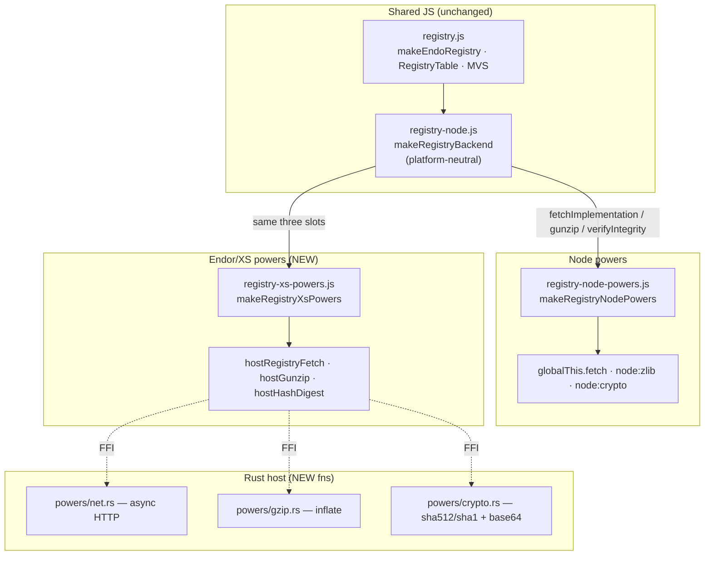
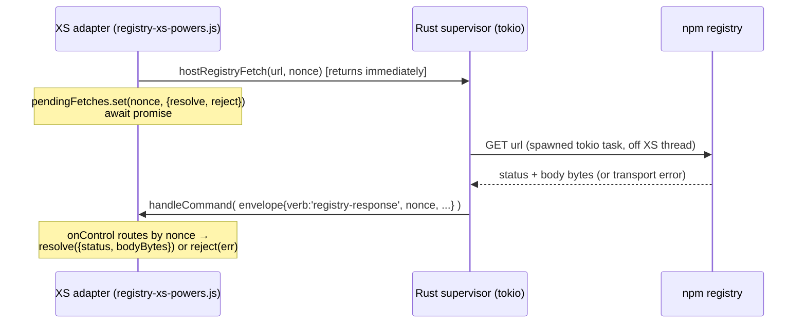

# Endor/XS Registry Transport Power

| | |
|---|---|
| **Created** | 2026-07-14 |
| **Author** | Kris Kowal (prompted) |
| **Status** | Proposed |
| **Source** | Follow-up to [registry-capability](registry-capability.md) § Two backends, one shape |

## What is the Problem Being Solved?

[registry-capability](registry-capability.md) (PR
[#671](https://github.com/endojs/endo-but-for-bots/pull/671)) landed the
`EndoRegistry` capability with its side-effecting operations factored behind a
`RegistryBackend` shape. The resolver, the `RegistryTable`, the MVS walk, and
the tarball → CAS check-in all live in platform-neutral JavaScript
(`packages/daemon/src/registry.js` and `registry-node.js`); only three
primitives are injected per platform:

- **HTTP fetch** — `fetchImplementation(url)` returning a `fetch`-shaped
  `Response` (`ok`, `status`, `json()`, `arrayBuffer()`).
- **gunzip** — `gunzip(bytes) → bytes`, npm tarballs are gzipped.
- **multi-algorithm integrity** — `createHash(algorithm)` for `algorithm` in
  `sha512` / `sha256` / `sha1`, digesting to base64 to compare against npm's
  `dist.integrity` SRI.

The Node daemon supplies these from `globalThis.fetch`, `node:zlib`, and
`node:crypto` (see `daemon-node.js`, `bus-daemon-node.js`, `daemon-go.js`, all
wiring `makeRegistryNodePowers`). The **Rust-hosted XS daemon**
(`bus-daemon-rust-xs.js`) has none of them: it wires `makeRegistryStubPowers`
(`registry-node-powers.js`), whose `fetchImplementation`, `gunzip`, and
`verifyIntegrity` all throw *"no registry transport is available on this
platform"*. Its crypto power (`makeXsCryptoPowers`) exposes **sha256 only, hex
only** (`rust/endo/xsnap/src/powers/crypto.rs`); there is no HTTP and no gzip
host function at all.

This design specifies the missing **Rust host API** and the **JS power adapter**
(`makeRegistryXsPowers`) that together let the Endor daemon serve the *same*
`RegistryBackend` shape as Node — reusing `makeRegistryBackend` from
`registry-node.js` verbatim — so `@registry` resolves and fetches on an Endor
host with no capability regression. Scope is the transport perimeter only; the
resolver, table, MVS walk, failure taxonomy, and `@registry` host wiring are
unchanged and shared.

This is deliberately **not** the [endor-npm-registry-proxy](endor-npm-registry-proxy.md)
path (a full Rust reimplementation of the table + semver + fetch in
`rust/endo/src/registry.rs`). That design predates the JS-reference-backend
decision of `registry-capability`; see § Alternatives. The two can converge
later, but the transport-power path is the minimal, parity-guaranteed cut.

## Design

### Shape: reuse the JS backend, inject three Rust-backed primitives



`makeRegistryBackend` (`registry-node.js`) is already platform-neutral: its only
platform coupling is the three injected functions plus `@endo/tar`,
`@endo/bytes`, `@endo/errors` (all pure JS available under XS). The XS adapter
therefore supplies *only* the three primitives; no backend logic is duplicated.

### Rust host API

Host functions are registered in `rust/endo/xsnap/src/powers/*.rs` and aliased
into `host<Name>` globals by `rust/endo/xsnap/src/host_aliases.js` (the same
mechanism behind `hostSha256Init`, `hostSqliteOpen`, `hostReadFileBytes`). Three
additions, two synchronous and one asynchronous:

#### 1. `hostGunzip(bytes: Uint8Array) → Uint8Array` — synchronous

gzip inflate is CPU-bound and fast, so it is a **blocking** FFI call like
`hostSha256UpdateBytes` and the `hostSqlite*` family. New `powers/gzip.rs`
backed by `flate2` (miniz backend, no C dependency); registered alongside the
crypto powers. Rejects a malformed gzip stream by returning an error string the
adapter turns into a thrown `Error` (caught nowhere in `registry-node.js`, so it
surfaces to the resolver and is wrapped as `RegistryNetworkError` — a corrupt
tarball body is a transit fault, distinct from an integrity mismatch).

#### 2. `hostHashDigest(algorithm: string, bytes: Uint8Array) → string` — synchronous

A **one-shot** multi-algorithm digest returning **base64**. Registry integrity
verification hashes the whole tarball once (`createHash(algo).update(bytes)
.digest('base64')`), so no streaming handle is needed — unlike the CAS's
`hostSha256Init/Update/Finish`, which stays as-is for streaming stores. Extend
`powers/crypto.rs` to compute `sha512` / `sha256` / `sha1` (`sha2` and `sha1`
crates) and base64-encode. An unsupported `algorithm` returns an error string;
the adapter maps it to the tampered path (see § Integrity).

Rationale for one-shot base64 rather than adding streaming `hostSha512*` /
`hostSha1*` families: the only caller is integrity verification, the tarball is
already fully in memory as a `Uint8Array` (the fetch returns whole bodies), and
`Sha512::digest(&bytes)` is a single call. This is three lines in Rust versus a
handle-table triplicate.

#### 3. `hostRegistryFetch(url, nonce) → undefined` — asynchronous (envelope-delivered)

HTTP is the one operation that must **not block the XS reactor**: an npm
packument/tarball round-trip is seconds, and a dependency resolution issues many
sequential fetches. A blocking `hostHttpFetch` would freeze the daemon's CapTP
loop (`handleCommand`) for the duration — unacceptable. Instead reuse the
**existing async-op-via-envelope pattern** already proven by worker spawn in
`bus-daemon-rust-xs.js` (`pendingSpawns`, `sendEnvelope(handle, verb, payload,
nonce)`, completion delivered into `onControl` by nonce):



The Rust side spawns a `tokio` task (the supervisor is already
`tokio = { features = ["rt-multi-thread", "net", ...] }`) running a minimal HTTP
client (`reqwest` blocking-in-task, or `hyper`/`ureq` on a worker) and, on
completion, injects a control envelope the XS loop already knows how to deliver.
The daemon keeps servicing CapTP traffic while the fetch is in flight.

Envelope contract (CBOR, mirroring the spawn payload helpers already in the
file):

| verb | fields | meaning |
|---|---|---|
| `registry-response` | `nonce`, `status:uint`, `body:bytes`, `contentType?:text` | HTTP response received (any status, incl. 404) |
| `registry-error` | `nonce`, `message:text`, `kind:text` | transport failure — no HTTP response |

`kind` ∈ `dns` / `connect` / `tls` / `timeout` / `body` / `other`, carried for
diagnostics into the wrapped error's message.

### JS power adapter: `makeRegistryXsPowers`

A new `packages/daemon/src/registry-xs-powers.js`, mirroring
`makeRegistryNodePowers` and hardened. It builds the three slots
`makeRegistryBackend` consumes, plus a `verifyIntegrity` factored to share logic
with the Node powers (see § Reuse). Sketch:

```js
export const makeRegistryXsPowers = ({ registryUrl } = {}) => {
  const pendingFetches = new Map(); // nonce -> PromiseKit
  // registered with the daemon's onControl demux (see § Wiring):
  const onRegistryEnvelope = env => {
    const kit = pendingFetches.get(env.nonce);
    if (!kit) return;
    pendingFetches.delete(env.nonce);
    if (env.verb === 'registry-response') kit.resolve(env);
    else kit.reject(makeError(X`registry: ${env.kind} — ${env.message}`));
  };

  const fetchImplementation = async url => {
    const nonce = nextNonce();
    const kit = makePromiseKit();
    pendingFetches.set(nonce, kit);
    hostRegistryFetch(url, nonce); // returns immediately
    const env = await kit.promise; // rejects on transport failure
    const status = env.status;
    return harden({
      ok: status >= 200 && status < 300,
      status,
      json: async () => JSON.parse(textFromBytes(env.body)),
      arrayBuffer: async () => env.body.buffer,
    });
  };

  const gunzip = async bytes => hostGunzip(bytes);

  const digestBase64 = (algorithm, bytes) => hostHashDigest(algorithm, bytes);
  const verifyIntegrity = makeVerifyIntegrity(digestBase64); // shared, see below

  return harden({
    registryUrl: registryUrl ?? 'https://registry.npmjs.org',
    makeRegistryBackend: powers =>
      makeRegistryBackend({ ...powers, fetchImplementation, gunzip, verifyIntegrity }),
  });
};
```

The `Response` facade need only satisfy what `registry-node.js` calls:
`.ok`, `.status`, `.json()`, `.arrayBuffer()`. `env.body` is a `Uint8Array`;
`arrayBuffer()` returns its backing buffer (the adapter must ensure the buffer
is not a shared/offset slice, copying if `byteOffset !== 0` or
`byteLength !== buffer.byteLength`, matching the Node backend's
`new Uint8Array(await response.arrayBuffer())` expectation).

### Reuse: factor `verifyIntegrity` out of `registry-node-powers.js`

`makeRegistryNodePowers` today embeds a ~25-line `verifyIntegrity` that parses
the SRI, rejects malformed/unsupported algorithms as
`makeRegistryTamperedError`, and compares a base64 digest. That logic is
algorithm-agnostic once the base64-digest primitive is a parameter. Extract:

```js
// registry-integrity.js (new, shared)
export const makeVerifyIntegrity = digestBase64 =>
  async (bytes, integrity, nameVersion) => { /* the existing body, calling
     digestBase64(algorithm, bytes) instead of createHash(...).digest('base64') */ };
```

Node supplies `digestBase64 = (algo, bytes) => { const h = createHash(algo);
h.update(bytes); return h.digest('base64'); }`; XS supplies
`(algo, bytes) => hostHashDigest(algo, bytes)`. Both then share the identical
malformed-SRI / unsupported-algorithm / mismatch behavior and the same
`RegistryTamperedError` name, which is exactly what the parity tests assert.

### Wiring into the Endor daemon

`bus-daemon-rust-xs.js` currently at its powers block:

```js
registry: makeRegistryStubPowers(config.registryUrl),
```

becomes:

```js
registry: makeRegistryXsPowers({ registryUrl: config.registryUrl }),
```

The adapter's `onRegistryEnvelope` must be reachable from the supervisor's
inbound-envelope demux. `bus-daemon-rust-xs.js` already routes control verbs by
nonce in its `onControl`/`handleControlEnvelope` path (`spawned`, `error`,
`debug-attach`); add the two `registry-*` verbs there, delegating to the
adapter's handler (returned as a fourth field from `makeRegistryXsPowers`, or
registered via a small `registerControlHandler(verb, fn)` hook to avoid a
circular import between the powers module and the daemon bootstrap). Keeping the
`pendingFetches` map inside the powers module (not module-global like
`pendingSpawns`) is preferable so multiple daemon instances in one test process
do not cross-talk; the bootstrap wires the demux edge once.

`makeRegistryStubPowers` is retained for the **web daemon**
(`bus-daemon-web.js` and any platform with genuinely no transport); it is not
removed.

### Failure surface and network error mapping

The failure taxonomy is defined once in `registry.js` (`RegistryTamperedError`,
`RegistryMissingPackageError`, `RegistryNetworkError`, `RegistryOfflineError`)
and is **not re-specified here** — the whole point is that the XS backend feeds
the same resolver, so the same wrapping applies. What this design pins is how
each Rust/transport outcome funnels into that taxonomy:

| Rust outcome | adapter behavior | `registry-node.js` | resolver (`registry.js`) result |
|---|---|---|---|
| `registry-error` (dns/connect/tls/timeout) | `fetchImplementation` **rejects** | propagates (uncaught) | `versionsFor`/`provideTree` catch → **`RegistryNetworkError`** (with `cause`) |
| `registry-response` status 404 (packument) | resolves `{status:404}` | `fetchPackument` → `undefined` | `fetchVersions` → `undefined` → **`RegistryMissingPackageError`** |
| `registry-response` non-2xx (5xx, tarball non-ok) | resolves `{ok:false,status}` | throws plain `makeError` | wrapped → **`RegistryNetworkError`** |
| `hostGunzip` malformed stream | `gunzip` **rejects** | propagates (uncaught) | wrapped → **`RegistryNetworkError`** |
| integrity mismatch / bad-SRI / unsupported algo | `verifyIntegrity` throws `RegistryTamperedError` | propagates | **`RegistryTamperedError`** (resolver's `provideTree` re-throws tagged errors as-is, not network-wrapped) |
| caller passed `offline:true` | backend never called | n/a | **`RegistryOfflineError`** (unchanged; works even with the stub) |

This exactly reproduces Node semantics, where `globalThis.fetch` rejects on
transport failure and resolves with a `Response` carrying the status otherwise.
The critical invariants: (a) transport rejections must be *thrown promise
rejections*, never a resolved error-shaped `Response`, so the resolver's
`try/catch` classifies them as network faults; and (b) a `RegistryTamperedError`
raised in `verifyIntegrity` must keep its `.name` so `provideTree`'s
`cause.name === RegistryTamperedErrorName` guard lets it pass through
un-wrapped.

**Host-level offline vs. caller-requested offline.** A sandboxed Endor host with
no network configured surfaces its fetches as `registry-error` →
`RegistryNetworkError`, *not* `RegistryOfflineError` — `offline` in `registry.js`
is a per-`resolve` caller option, not a host property. This is consistent with
Node (a machine with no network also yields network errors) and is called out in
Open questions in case a distinct host-offline signal is later wanted.

## Dependencies

| Design | Relationship |
|---|---|
| [registry-capability](registry-capability.md) | **Requires.** Defines the `RegistryBackend` shape, `@registry` host slot, and failure taxonomy this fills in for XS. This is the "Rust drop-in behind the same shape" its § Two backends promised. |
| [mvs-resolver](mvs-resolver.md) | Adjacent. The MVS walk runs unchanged over the XS backend; no coupling beyond the shared `registry.js`. |
| [endor-npm-registry-proxy](endor-npm-registry-proxy.md) | **Alternative / future-converge.** The all-Rust registry (`rust/endo/src/registry.rs`, `semver.rs`) predates the JS-reference decision; § Alternatives. |
| [daemon-endor-architecture](daemon-endor-architecture.md) | Substrate. Host-function/`host_aliases.js` registration and the supervisor envelope loop this extends. |
| [worker-rust-xs](worker-rust-xs.md) | Substrate. The XS worker/daemon powers module (`bus-daemon-rust-xs-powers.js`) this adds a sibling powers file beside. |

## Implementation phases

1. **Crypto + gzip host fns (sync).** `hostHashDigest` (sha512/sha256/sha1 →
   base64) in `powers/crypto.rs`; `hostGunzip` in new `powers/gzip.rs` (`flate2`,
   `sha1`, `sha2`, `base64` crates); alias both in `host_aliases.js`; declare in
   `bus-xs-host-globals.d.ts`. *Test:* Rust unit round-trips + a JS test that
   shims the two globals and asserts SRI verify + inflate against fixtures.
2. **Async fetch host fn.** `hostRegistryFetch` + the `registry-response` /
   `registry-error` envelope path in the supervisor (tokio task + HTTP client).
   *Test:* Rust test against a loopback HTTP server.
3. **JS adapter + shared `verifyIntegrity`.** Add `registry-xs-powers.js`;
   extract `makeVerifyIntegrity` into `registry-integrity.js`; re-point
   `registry-node-powers.js` at it (net-zero behavior). *Test:* the parity suite
   (§ Test plan) at the fake-host-globals level.
4. **Daemon wiring.** Swap `makeRegistryStubPowers` → `makeRegistryXsPowers` in
   `bus-daemon-rust-xs.js`; wire the `registry-*` control demux edge. *Test:* the
   `test:rust` integration lane against a local fixture registry.

## Test plan (XS parity coverage)

Two tiers, mirroring how `mount-platform-fs-conformance.test.js` exercises
`makeXsFilePowers` against the same contract as the Node file powers, and how
`registry-node-backend.test.js` drives the backend with a fake fetch (no
network):

- **Adapter parity (Node ava lane, default `ava`).** New
  `test/registry-xs-powers.test.js` that installs mock `globalThis.hostRegistryFetch`
  / `hostGunzip` / `hostHashDigest` (the same host-globals-shim technique the
  conformance test uses for `hostStat`), then runs `makeRegistryXsPowers`
  through `makeRegistryBackend` and asserts **byte-identical outcomes to
  `makeRegistryNodePowers`** across: packument fetch + version list, tarball
  fetch → CAS check-in, `sha512`/`sha256`/`sha1` integrity accept, integrity
  reject → `RegistryTamperedError`, malformed-SRI reject, 404 → missing,
  transport-error → network reject, gunzip-corruption → network reject. Because
  both powers feed the identical backend + resolver, the assertion table can be
  data-driven over `[nodePowers, xsPowers]` — a literal parity matrix.
- **Live integration (`test:rust` lane, `ENDO_BIN=endor`).** Extend
  `test/registry-endo.test.js` so that under the Rust binary,
  `E(host).lookup('@registry')` not only reports help/empty (today's stub-safe
  assertions) but actually `resolve`/`fetch`es a package. To avoid a live-npm
  dependency in CI, point the daemon's `registryUrl` at a **local fixture
  registry** (a tiny static server serving a canned packument + tarball), the
  same shape as the Node integration fixture. Assert the resolved `treeRef`
  reads back the expected `package.json` and the `resolutionHash` matches the
  Node lane's for the same fixture — the strongest parity signal.

The Rust host functions themselves get `#[test]` coverage in their power modules
(digest vectors, gzip round-trip, HTTP against a loopback server).

## Design decisions

1. **Reuse the JS backend; inject three primitives — do not reimplement in Rust.**
   `makeRegistryBackend` is already platform-neutral; the parity guarantee is
   *free* when both platforms run the same check-in/packument code and differ
   only in fetch/gunzip/hash. A Rust reimplementation (`endor-npm-registry-proxy`)
   would need its own parity harness against the JS reference forever.
2. **Async fetch, sync gunzip/hash.** Only network latency threatens the reactor;
   inflate and hashing of an in-memory tarball are sub-millisecond and match the
   existing blocking-FFI precedent (`hostSqlite*`, `hostSha256*`). Reusing the
   spawn envelope pattern for fetch adds no new async machinery.
3. **One-shot base64 `hostHashDigest`, not streaming sha512/sha1 families.** The
   sole caller hashes a whole in-memory tarball once; a handle triplicate would
   be dead weight. CAS streaming keeps its `hostSha256Init/Update/Finish`.
4. **Extract the shared `verifyIntegrity`.** The SRI-parse / algorithm-guard /
   compare logic is identical across platforms once the digest primitive is a
   parameter; sharing it is what makes "the same tampered behavior" a fact rather
   than a hope, and shrinks the XS powers file to plumbing.
5. **Keep `makeRegistryStubPowers`.** The web daemon has genuinely no transport;
   the stub remains the correct answer there. This design widens Endor from the
   stub to a real backend, not the stub's removal.

## Alternatives Considered

- **All-Rust registry ([endor-npm-registry-proxy](endor-npm-registry-proxy.md)).**
  Rust owns table + semver + fetch + check-in (`rust/endo/src/registry.rs` Phases
  1/3 already exist). *Rejected for now:* it forks the resolver into two
  implementations that must be kept behaviorally identical, exactly the divergence
  `registry-capability` § Two backends chose to avoid by making JS the reference.
  The two can converge later — the Rust table could back the `RegistryTable`
  interface — but that is an optimization, not the parity path.
- **Blocking `hostHttpFetch`.** Simpler (no envelope), but stalls the CapTP
  reactor for whole-seconds per fetch, serializing an entire daemon behind one
  resolution's network I/O. *Rejected:* reactor liveness is load-bearing.
- **A Passable-byte `fetch` power over CapTP to a network caplet.** Over-engineered
  for a host-owned transport that the host already trusts; the FFI perimeter is
  the right trust boundary here.

## Open questions

- Should a network-denied Endor host expose a distinct **host-offline** signal so
  a fetch attempt surfaces as `RegistryOfflineError` rather than
  `RegistryNetworkError`? (Current design: it is a network error, matching Node.)
  Resolving this may want a `registryUrl: null`/`offline` host-config knob read by
  `makeRegistryXsPowers`.
- Which HTTP client crate — `reqwest` (heavy, TLS batteries included) vs. `ureq`
  (blocking, light) vs. `hyper` + `rustls` (control, more code)? A tracking
  decision for Phase 2; `reqwest` is the low-risk default given `tokio` is already
  a dependency. To be filed against the Rust subsystem milestone (M11).
- **`.npmrc` auth tokens and scoped registries** for private packages: out of
  scope here (transport parity for the public registry only); tracked by
  [endor-npm-registry-proxy](endor-npm-registry-proxy.md) § Known gaps and to be
  filed as a follow-up once the public path lands.

## Prompt

> Design an Endor/XS registry transport power for endojs/endo-but-for-bots PR
> #671. The Node registry backend is now injected through DaemonicPowers, but the
> XS runtime currently lacks HTTP, gunzip, and multi-algorithm integrity host
> powers. Specify the Rust host API and JS power adapter needed for Endor to
> provide the same RegistryBackend shape, including network error mapping and XS
> parity test coverage. Do not modify the PR branch; produce a concrete
> implementation design.
