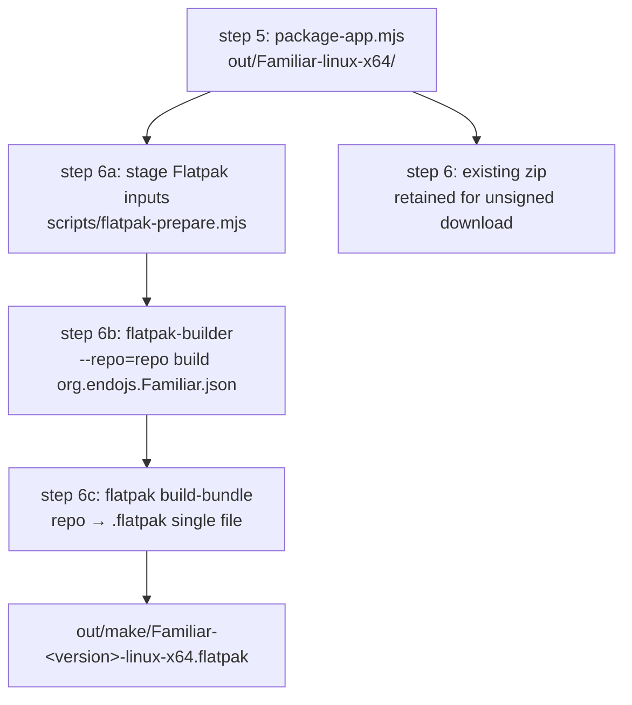

# Familiar Flatpak Packaging Pipeline

| | |
|---|---|
| **Created** | 2026-05-19 |
| **Author** | endolinbot (builder dispatch) |
| **Status** | Proposed |
| **Source** | [`familiar-release.md`](familiar-release.md) G4 (line 205): "Please dispatch a builder to propose a pipeline for Flatpack. We can defer the other packaging systems." |

## What is the Problem Being Solved?

The Familiar's `make-distributables.mjs` produces a `.zip` on Linux.
A user who unzips it gets a directory tree that includes an Electron
binary, a Chromium runtime, and `chrome-sandbox`, the latter of which
must be `chmod 4755` and chowned to root for Chromium's setuid sandbox
to engage.
A non-developer will not perform that chmod and chown; without it
Electron either refuses to launch or falls back to `--no-sandbox`,
which silently strips a meaningful layer of process isolation from
the daemon's worker tree.

The maintainer's resolution of [`familiar-release.md`](familiar-release.md)
G4 (2026-05-19) chose Flatpak as the single Linux packaging format
for MVR followups; AppImage, `.deb`, `.rpm`, and `.tar.gz` are
deferred.
Flatpak is the right pick because it ships its own setuid-capable
sandbox (`bwrap`, configured by the runtime), so the
`chrome-sandbox` chmod story collapses into the runtime's existing
sandbox setup.

This document proposes the pipeline that turns the Familiar's
existing `out/Familiar-linux-x64/` packaged-app directory into a
signed `.flatpak` single-file bundle suitable for posting to the
project's GitHub Releases page (per
[`familiar-release.md`](familiar-release.md) Open Question 1's
resolution).

## Status quo

The Familiar's existing Linux output path is:

- `node scripts/build.mjs` runs the six pipeline steps documented
  in [`familiar-release.md`](familiar-release.md) Status quo.
- The fifth step (`@electron/packager`) produces
  `packages/familiar/out/Familiar-linux-x64/` containing the
  Electron-app directory tree.
- The sixth step (`make-distributables.mjs`) currently emits
  `out/make/Familiar-<version>-linux-x64.zip` via the system `zip`.
- The CI surface
  ([`.github/workflows/familiar-release.yml`](../.github/workflows/familiar-release.yml))
  uploads the zip as a workflow artifact and attaches it to a
  draft GitHub Release.

The Flatpak pipeline grafts onto this shape between steps 5 and the
GitHub-Release upload.

## Design

### Pipeline shape



The existing `.zip` output stays for the unsigned-download case; the
Flatpak adds a sandboxed, integrity-checked alternative.
Both ride the same CI artifact list.

### Manifest shape

The canonical Flatpak manifest is a single JSON file at
`packages/familiar/flatpak/org.endojs.Familiar.json`.
The file is checked in; the build is reproducible from a checkout.

```json
{
  "app-id": "org.endojs.Familiar",
  "runtime": "org.freedesktop.Platform",
  "runtime-version": "24.08",
  "sdk": "org.freedesktop.Sdk",
  "base": "org.electronjs.Electron2.BaseApp",
  "base-version": "24.08",
  "command": "familiar",
  "separate-locales": false,
  "finish-args": [
    "--share=ipc",
    "--share=network",
    "--socket=fallback-x11",
    "--socket=wayland",
    "--socket=pulseaudio",
    "--device=dri",
    "--filesystem=xdg-data/endo:create",
    "--filesystem=xdg-config/endo:create",
    "--filesystem=xdg-state/endo:create",
    "--filesystem=xdg-cache/endo:create",
    "--talk-name=org.freedesktop.Notifications",
    "--talk-name=org.freedesktop.secrets"
  ],
  "modules": [
    {
      "name": "familiar",
      "buildsystem": "simple",
      "build-commands": [
        "install -d /app/familiar",
        "cp -a Familiar-linux-x64/. /app/familiar/",
        "install -Dm755 launcher.sh /app/bin/familiar",
        "install -Dm644 org.endojs.Familiar.desktop /app/share/applications/org.endojs.Familiar.desktop",
        "install -Dm644 org.endojs.Familiar.metainfo.xml /app/share/metainfo/org.endojs.Familiar.metainfo.xml",
        "for size in 16 32 64 128 256 512 1024; do install -Dm644 icons/icon-${size}.png /app/share/icons/hicolor/${size}x${size}/apps/org.endojs.Familiar.png; done"
      ],
      "sources": [
        { "type": "dir", "path": "build" }
      ]
    }
  ]
}
```

#### Runtime choice: `org.freedesktop.Platform//24.08`

The freedesktop runtime is the lowest-common-denominator runtime that
ships glibc, GTK pieces Electron expects, and the audio / video
libraries Chromium needs.
The 24.08 series is the current stable runtime
([Flathub runtimes page](https://docs.flatpak.org/en/latest/available-runtimes.html));
the runtime-version is pinned per Endo's external-pin discipline
([`familiar-release.md`](familiar-release.md) G5) and bumped in
lockstep with the bundled Node LTS bump.
A future runtime move (24.08 -> 25.x) is a builder pass that
revisits both the Node pin (G5) and this manifest.

#### Base: `org.electronjs.Electron2.BaseApp//24.08`

The Electron base app is published on Flathub at
`org.electronjs.Electron2.BaseApp` and pre-installs the Chromium-side
shared libraries (NSS, libdrm, libnotify, libsecret) that Electron
links against and the freedesktop runtime does not already carry.
Using the base shrinks the manifest from ~30 module entries
(each library built from source) to one `base` line.
The Electron base app's setup also takes care of the
`chrome-sandbox` setuid concern by mapping in `bwrap` from the
runtime, so the README's
`chmod 4755 chrome-sandbox` instruction becomes moot inside the
Flatpak.

#### Finish-args: capability surface justification

The `finish-args` block is the Flatpak sandbox's hole-poking list.
Each line below is justified against a specific runtime requirement
that the Familiar's existing implementation already exercises:

| Permission | Why the Familiar needs it |
|---|---|
| `--share=ipc` | Electron's renderer / utility processes use SysV IPC for shared-memory transport with the GPU process. |
| `--share=network` | The bundled `lal` agent issues `fetch` requests against `https://api.anthropic.com/`, `https://api.openai.com/`, and a user-configured LLM endpoint ([`familiar-release.md`](familiar-release.md) G12). The gateway also binds a localhost socket; localhost binds do not require `--share=network` per se (loopback is local), but the outbound LLM fetch does. |
| `--socket=fallback-x11` | X11 fallback when the host is on Xorg (older distros, NVIDIA-on-Wayland workarounds). |
| `--socket=wayland` | Wayland is the default on modern distros (Fedora, recent Ubuntu, Pop!_OS). |
| `--socket=pulseaudio` | Notification sounds when the Chat UI surfaces one (not currently emitted; surface reserved). |
| `--device=dri` | GPU acceleration for the Chromium renderer; without it Electron falls back to swrast and the chat UI's text rendering becomes janky. |
| `--filesystem=xdg-data/endo:create` | `@endo/where` resolves `whereEndoLog` (and on some XDG layouts `whereEndoCache`) under `$XDG_DATA_HOME/endo/` on Linux. |
| `--filesystem=xdg-config/endo:create` | `@endo/where` resolves `whereEndoConfig` under `$XDG_CONFIG_HOME/endo/`. |
| `--filesystem=xdg-state/endo:create` | The daemon's state directory (the CAS, the `gateway` file, the captp socket) lives under `$XDG_STATE_HOME/endo/` on Linux per `@endo/where`. This is the only `--filesystem` line that is load-bearing for daemon launch. |
| `--filesystem=xdg-cache/endo:create` | `@endo/where` resolves `whereEndoCache` under `$XDG_CACHE_HOME/endo/`. |
| `--talk-name=org.freedesktop.Notifications` | Future toast notifications from `lal` when an agent message arrives. Reserved; not currently wired. |
| `--talk-name=org.freedesktop.secrets` | Future migration of the LLM auth token from the daemon CAS to the host's libsecret (a followup to [`familiar-release.md`](familiar-release.md) G11). Reserved; not currently wired. |

Each `--filesystem=` line uses `:create` so the directory is brought
into existence inside the sandboxed view on first launch.
The `/endo` suffix scopes the permission to the project's own directory
inside each XDG root rather than handing the whole XDG root to the
sandbox.

A flatpak with `--filesystem=host` or `--filesystem=home` is
**explicitly not** what we ship.
The narrower set above is the review-gate Flathub uses; submitting
against the broader set would delay listing and weaken the security
story.

#### What the manifest excludes

- No `--talk-name=org.freedesktop.Flatpak` (no auto-update from
  inside the sandbox).
- No `--filesystem=home` (the daemon never reads user files outside
  `$XDG_*_HOME/endo/`).
- No `--device=all` (only DRI for GPU).
- No `--persist=.` (state lives in the XDG directories, not in
  `~/.var/app/`).

### Launcher and metadata files

`packages/familiar/flatpak/` holds the small companion files referenced
by the manifest:

```
packages/familiar/flatpak/
  org.endojs.Familiar.json         # the manifest above
  launcher.sh                      # /app/bin/familiar wrapper
  org.endojs.Familiar.desktop      # XDG desktop entry
  org.endojs.Familiar.metainfo.xml # AppStream metadata for Flathub
```

`launcher.sh` (executable, installed to `/app/bin/familiar`):

```sh
#!/bin/sh
# Wrapper for the Familiar Electron app under Flatpak.
# zypak intercepts Chromium's namespace-sandbox calls and routes them
# through Flatpak's bwrap, which is the host's setuid binary.
exec zypak-wrapper /app/familiar/Familiar "$@"
```

`zypak-wrapper` ships with the `org.electronjs.Electron2.BaseApp`
base; the wrapper is the standard Flathub idiom for Electron apps.
It replaces the `chrome-sandbox` chmod story entirely.

`org.endojs.Familiar.desktop`:

```ini
[Desktop Entry]
Name=Familiar
GenericName=Endo Familiar
Comment=Local-first chat with the lal agent
Exec=familiar %U
Icon=org.endojs.Familiar
Type=Application
StartupNotify=true
StartupWMClass=Familiar
Categories=Network;Chat;Development;
Keywords=endo;lal;llm;chat;agent;
```

`org.endojs.Familiar.metainfo.xml` (AppStream metadata, required by
Flathub for listing; the schema is documented at
[appstream.org](https://www.freedesktop.org/software/appstream/docs/)):

```xml
<?xml version="1.0" encoding="UTF-8"?>
<component type="desktop-application">
  <id>org.endojs.Familiar</id>
  <name>Familiar</name>
  <summary>Local-first chat with the lal agent</summary>
  <metadata_license>CC0-1.0</metadata_license>
  <project_license>Apache-2.0</project_license>
  <developer id="org.endojs">
    <name>Endo contributors</name>
  </developer>
  <description>
    <p>
      The Familiar is a desktop Electron shell for Endo Chat. It bundles
      the lal agent and a self-contained Endo daemon so a user can hold
      a persistent conversation with their own LLM provider without
      installing any developer tooling.
    </p>
  </description>
  <launchable type="desktop-id">org.endojs.Familiar.desktop</launchable>
  <url type="homepage">https://github.com/endojs/endo-but-for-bots</url>
  <url type="bugtracker">https://github.com/endojs/endo-but-for-bots/issues</url>
  <content_rating type="oars-1.1" />
  <releases>
    <release version="0.1.0" date="2026-05-19" />
  </releases>
</component>
```

### Build script: `scripts/flatpak-build.mjs`

A new script under `packages/familiar/scripts/` orchestrates the
Flatpak build.
It is invoked after `package-app.mjs` (step 5) on Linux and produces
a single `.flatpak` file under `out/make/`.

```js
// scripts/flatpak-build.mjs
/* global process */

import { execSync } from 'node:child_process';
import fs from 'node:fs';
import path from 'node:path';
import { fileURLToPath } from 'node:url';

const dirname = path.dirname(fileURLToPath(import.meta.url));
const familiarDir = path.resolve(dirname, '..');

if (process.platform !== 'linux') {
  console.log('Flatpak build only runs on Linux; skipping.');
  process.exit(0);
}

const arch = process.arch === 'arm64' ? 'aarch64' : 'x86_64';
const target = process.arch === 'arm64' ? 'linux-arm64' : 'linux-x64';

const appDir = path.join(familiarDir, `out/Familiar-${target}`);
if (!fs.existsSync(appDir)) {
  console.error(`Packaged app not found at ${appDir}.`);
  console.error('Run the package step first.');
  process.exit(1);
}

const flatpakDir = path.join(familiarDir, 'flatpak');
const stageDir = path.join(familiarDir, 'out/flatpak-stage');
const buildDir = path.join(familiarDir, 'out/flatpak-build');
const repoDir = path.join(familiarDir, 'out/flatpak-repo');
const makeDir = path.join(familiarDir, 'out/make');

fs.rmSync(stageDir, { recursive: true, force: true });
fs.rmSync(buildDir, { recursive: true, force: true });
fs.rmSync(repoDir, { recursive: true, force: true });
fs.mkdirSync(makeDir, { recursive: true });

// Stage the manifest's source dir.
// flatpak-builder reads from a single source root; we collect the
// packaged app, the launcher, the desktop file, the AppStream xml,
// and the icon set into one staging tree.
fs.mkdirSync(path.join(stageDir, 'build'), { recursive: true });
fs.cpSync(appDir, path.join(stageDir, 'build', `Familiar-${target}`), {
  recursive: true,
});
fs.cpSync(
  path.join(flatpakDir, 'launcher.sh'),
  path.join(stageDir, 'build/launcher.sh'),
);
fs.chmodSync(path.join(stageDir, 'build/launcher.sh'), 0o755);
fs.cpSync(
  path.join(flatpakDir, 'org.endojs.Familiar.desktop'),
  path.join(stageDir, 'build/org.endojs.Familiar.desktop'),
);
fs.cpSync(
  path.join(flatpakDir, 'org.endojs.Familiar.metainfo.xml'),
  path.join(stageDir, 'build/org.endojs.Familiar.metainfo.xml'),
);
fs.mkdirSync(path.join(stageDir, 'build/icons'), { recursive: true });
for (const size of [16, 32, 64, 128, 256, 512, 1024]) {
  fs.cpSync(
    path.join(familiarDir, 'assets', `icon-${size}.png`),
    path.join(stageDir, `build/icons/icon-${size}.png`),
  );
}
fs.cpSync(
  path.join(flatpakDir, 'org.endojs.Familiar.json'),
  path.join(stageDir, 'org.endojs.Familiar.json'),
);

const pkg = JSON.parse(
  fs.readFileSync(path.join(familiarDir, 'package.json'), 'utf8'),
);
const version = pkg.version || '0.0.0';

// 1. flatpak-builder produces the build tree and exports to a local repo.
execSync(
  `flatpak-builder --force-clean --repo=${JSON.stringify(repoDir)} --arch=${arch} ${JSON.stringify(buildDir)} ${JSON.stringify('org.endojs.Familiar.json')}`,
  { stdio: 'inherit', cwd: stageDir },
);

// 2. flatpak build-bundle collapses the repo into a single .flatpak.
const bundlePath = path.join(
  makeDir,
  `Familiar-${version}-${target}.flatpak`,
);
execSync(
  `flatpak build-bundle --arch=${arch} ${JSON.stringify(repoDir)} ${JSON.stringify(bundlePath)} org.endojs.Familiar`,
  { stdio: 'inherit', cwd: stageDir },
);

console.log(`Created: out/make/${path.basename(bundlePath)}`);
```

The script is wired into `make-distributables.mjs` as the Linux
branch's tail; the existing zip emission stays.
Adding the script to `package.json`:

```json
"step:flatpak": "node scripts/flatpak-build.mjs",
```

### CI workflow integration

`familiar-release.yml`'s `make` job already runs on
`ubuntu-latest` for the Linux target.
The Flatpak step grafts onto that job:

```yaml
- name: Install Flatpak toolchain
  if: matrix.target-os == 'linux'
  run: |
    sudo apt-get update
    sudo apt-get install -y flatpak flatpak-builder
    flatpak remote-add --if-not-exists --user flathub \
      https://flathub.org/repo/flathub.flatpakrepo
    flatpak install --user --noninteractive flathub \
      org.freedesktop.Platform//24.08 \
      org.freedesktop.Sdk//24.08 \
      org.electronjs.Electron2.BaseApp//24.08

- name: Build Flatpak bundle
  if: matrix.target-os == 'linux'
  run: yarn workspace @endo/familiar step:flatpak

- name: Upload Flatpak bundle
  if: matrix.target-os == 'linux'
  uses: actions/upload-artifact@<pinned-sha>
  with:
    name: familiar-${{ matrix.target-os }}-${{ matrix.target-arch }}-flatpak
    path: packages/familiar/out/make/*.flatpak
```

The existing `Upload make output` step already picks the
`out/make/` directory, so the Flatpak file is also captured by it;
the dedicated `Upload Flatpak bundle` step is for the case where
the maintainer wants to download only the Flatpak from the
workflow's artifact list without the surrounding zip.

The `if-not-exists` guard on the remote add keeps the step
idempotent if the runner image already has Flathub registered.

The `release` job (which gathers all the `familiar-*` artifacts and
attaches them to a GitHub Release) needs no change; the Flatpak file
flows through the existing `pattern: familiar-*` matcher.

### Signing posture (deferred)

Flatpak supports OpenPGP-signed repos via `flatpak build-sign` and
`flatpak build-update-repo --gpg-sign=<key>`.
The signed-repo route is the right shape if the project ever hosts
its own update repo (an "endojs Flatpak channel" parallel to a
Flathub listing).

For MVR followups, the `.flatpak` single-file bundle is the artifact;
single-file bundles are integrity-checked by the user's `flatpak
install` against their imported public key (or accepted with
`--no-gpg-verify` for one-off installs).
The signing-key story therefore parallels
[`familiar-release.md`](familiar-release.md) G2 / G3: it stays out
of MVR, gets a separate tracking issue for the key-generation and
key-distribution workflow, and lands when the maintainer is ready
to pursue it.

In the unsigned-bundle interim, the README documents that the
end-user installs via:

```sh
flatpak install --user --bundle Familiar-0.1.0-linux-x64.flatpak
flatpak run org.endojs.Familiar
```

The `--bundle` form takes a single `.flatpak` file directly; no
repository configuration is required on the user's machine.

### Flathub listing (deferred)

Posting to Flathub is the right channel for non-developer Linux
users; once the manifest is settled and the icon / AppStream
metadata pass `appstreamcli validate` and `flatpak run
org.flatpak.Builder//stable` cleanly, the project submits to
`flathub/flathub` per the Flathub submission guide.
The submission process is a separate followup; for the MVR-followup
phase, the `.flatpak` bundle attached to the GitHub Release is the
delivery channel.

## Testing

### Local build (developer host on Linux)

```sh
# Prerequisites (Ubuntu 24.04, Fedora 40+):
sudo apt install flatpak flatpak-builder
# or: sudo dnf install flatpak flatpak-builder

flatpak remote-add --if-not-exists --user flathub \
  https://flathub.org/repo/flathub.flatpakrepo
flatpak install --user --noninteractive flathub \
  org.freedesktop.Platform//24.08 \
  org.freedesktop.Sdk//24.08 \
  org.electronjs.Electron2.BaseApp//24.08

# Build the Electron app first, then the Flatpak.
cd packages/familiar
yarn build:app
yarn step:flatpak

# Install and run.
flatpak install --user --bundle \
  out/make/Familiar-0.1.0-linux-x64.flatpak
flatpak run org.endojs.Familiar
```

The launch's smoke pass: the chat window opens, the user fills the
LLM-provider form, the daemon binds its captp socket inside the
sandboxed `$XDG_STATE_HOME/endo/`, and a message exchange round-trips.

### CI smoke (matches [`familiar-release.md`](familiar-release.md) G16)

The G16 smoke test (build the app, launch it under a clean state
directory, exercise the form, observe the Primer tree appearing in
the host namespace) ports to the Flatpak target with one change:
the `clean state directory` step is `rm -rf
~/.var/app/org.endojs.Familiar` rather than `rm -rf
~/.local/state/endo/`, because Flatpak's per-app state isolation
relocates the XDG roots to `~/.var/app/<app-id>/{data,config,state,cache}`.

A Linux runner with `xvfb-run` (Electron under headless X11) can
host the same test the macOS G16 smoke runs.

### Validation gates the manifest itself must pass

Before the Flatpak workflow promotes to `release`-eligible, the
build job runs:

- `flatpak-builder --user --install --force-clean ...` (the build itself).
- `appstreamcli validate org.endojs.Familiar.metainfo.xml` (catches
  AppStream schema drift before it reaches Flathub review).
- `desktop-file-validate org.endojs.Familiar.desktop` (XDG
  desktop-entry validation).

Each is a separate CI step so a failure points at the file that
needs the fix.

## Dependencies

| Design | Relationship |
|---|---|
| [`familiar-release.md`](familiar-release.md) | Source. This document implements G4. |
| [`familiar-electron-shell.md`](familiar-electron-shell.md) | Defines the Electron-main process this manifest packages. |
| [`familiar-daemon-bundling.md`](familiar-daemon-bundling.md) | The bundled daemon + Node binary this manifest ships. |
| [`familiar-bundled-agents.md`](familiar-bundled-agents.md) | The `lal` setup and agent bundles this manifest ships. |

Out of scope (intentional):

- AppImage, `.deb`, `.rpm`, `.tar.gz` packaging
  ([`familiar-release.md`](familiar-release.md) G4 deferral).
- macOS code signing and notarization (G2).
- Windows signing (G3).
- Auto-update via `electron-updater` or Flatpak's own update
  channel (G6).
- A Flatpak signing key and Flathub listing (followup; see *Signing
  posture* and *Flathub listing* sections above).

## Design Decisions

- **Single-file `.flatpak` bundle over a hosted repo.**
  The bundle is one file that attaches to a GitHub Release; the
  user installs with `flatpak install --bundle <file>`.
  A hosted repo would let the user `flatpak install endojs
  Familiar` and pull updates automatically, but it requires a
  signing key and a public-facing repo URL.
  Per [`familiar-release.md`](familiar-release.md) G6,
  auto-update is deferred entirely; the bundle is the right
  shape for the defer-update posture.

- **`org.electronjs.Electron2.BaseApp` over hand-rolling
  Chromium's libraries.**
  The base app is maintained by the Electron-on-Flathub community
  and tracks each Electron major.
  Hand-rolling NSS, libdrm, libnotify, libsecret in module entries
  would add ~30 modules and a multi-hour build time.
  The base-app dependency is the standard Flathub Electron idiom
  and was the maintainer's implicit assumption when G4 named
  Flatpak.

- **Manifest in JSON, not YAML.**
  Both forms are valid Flatpak inputs; the JSON form parses with
  `JSON.parse` from the build script and is the form Flathub's
  automation prefers.
  The existing Endo codebase uses JSON for `package.json`,
  `tsconfig.json`, and the deferred Forge config; the manifest
  stays consistent.

- **Narrow `finish-args` (no `--filesystem=home`, no
  `--share=ipc-host`).**
  Each permission is justified per the table above.
  Flathub's reviewers will reject a broader permission set without
  a stated need; the narrow set survives review and ships a
  meaningful sandbox to the user.

- **`launcher.sh` wraps `zypak-wrapper`.**
  The Electron-base-app ships `zypak`, which intercepts Chromium's
  `chrome-sandbox` invocations and routes them through Flatpak's
  `bwrap`.
  Without `zypak`, Electron's setuid sandbox conflicts with
  Flatpak's namespace sandbox and either falls back to
  `--no-sandbox` or refuses to launch.

- **No `--persist=.`**
  The daemon's state directory is the only load-bearing persistent
  path and it lives under `$XDG_STATE_HOME/endo/`, which Flatpak
  maps to `~/.var/app/org.endojs.Familiar/state/endo/` via the
  `--filesystem=xdg-state/endo:create` line.
  `--persist=.` would relocate state into `~/.var/app/<id>/`
  opaquely and surprise developer-mode users who expect XDG paths.

- **Cross-architecture is one matrix axis, not two manifests.**
  `flatpak-builder` takes `--arch=` and the manifest is
  arch-agnostic.
  The CI matrix can fan out to `x86_64` (today) and `aarch64`
  (when the maintainer turns it on) by adding a matrix entry; no
  per-arch manifest fork is needed.

## Phased implementation

| Phase | Deliverable | Effort |
|---|---|---|
| 1 | Land this design (PR opens DRAFT for review). | This PR. |
| 2 | Land the manifest, launcher, desktop file, metainfo xml, and `flatpak-build.mjs` in `packages/familiar/flatpak/` and `packages/familiar/scripts/`. | Day (builder dispatch). |
| 3 | Wire the CI steps into `familiar-release.yml`'s Linux job. | Day (builder dispatch). |
| 4 | Validate the bundle on a clean Linux host (Ubuntu 24.04 or Fedora 40+); iterate on `finish-args` if the daemon's runtime exercises something the table above missed. | Day (manual smoke). |
| 5 | (Followup, separate issue.) Generate a signing key, sign the bundle, and submit to Flathub. | Multi-day, dominated by Flathub review latency. |

Phases 2 to 4 fall under the
[`familiar-release.md`](familiar-release.md) followups phase
budget; phase 5 is post-MVR-followups.

## Known Gaps and TODOs

- [ ] Confirm the daemon's `whereEndoLog` and `whereEndoCache`
  resolutions on Linux against `@endo/where`'s actual XDG mapping;
  this design assumes the standard XDG layout.
  If `whereEndoLog` on Linux collapses to the same
  `$XDG_STATE_HOME/endo/` as the daemon state, the
  `--filesystem=xdg-data/endo:create` line is unnecessary.
- [ ] Decide the arm64 timeline.
  The manifest supports `--arch=aarch64`; the CI matrix entry is
  one line.
  The `org.electronjs.Electron2.BaseApp` ships aarch64 builds.
  Adding the matrix entry is a builder pass when the maintainer
  wants the platform.
- [ ] Verify that the bundled Node binary executes inside the
  freedesktop runtime's glibc.
  The `nodejs.org/dist/` glibc-Linux binary is built against an
  older glibc than the runtime ships; forward-compatibility should
  hold, but the validation step is cheap and the failure mode
  (silent crash on daemon spawn) is expensive.
- [ ] Add the Flatpak smoke to the G16 packaged-build smoke test
  scaffold once it exists; today this is a manual step in the
  developer's local-build flow.

## Prompt

Per kriskowal at `designs/familiar-release.md` L205:

```
Please dispatch a builder to propose a pipeline for Flatpack.
We can defer the other packaging systems.
```
