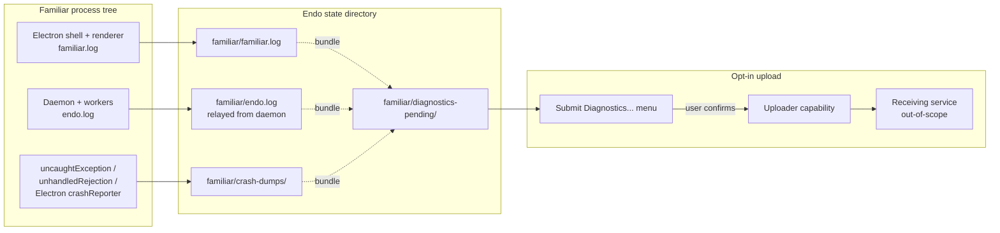
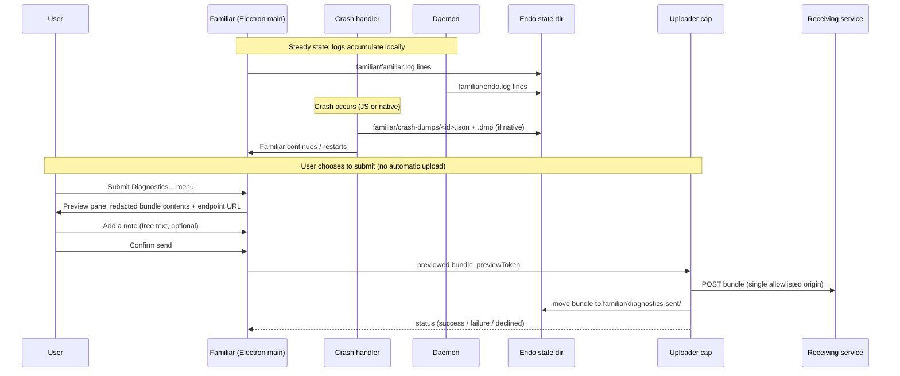

# Familiar Telemetry and Crash Reporting

| | |
|---|---|
| **Created** | 2026-05-19 |
| **Updated** | 2026-05-22 |
| **Author** | endolinbot (designer; prompted) |
| **Status** | Proposed |
| **Source** | [`familiar-release`](familiar-release.md) G13 (designer pass) |

## What is the Problem Being Solved?

The Familiar today writes structured logs to `familiar.log` (Electron shell + renderer) and `endo.log` (daemon and workers) in the Endo state directory.
No upload mechanism exists.
No in-app affordance exists to submit a log to maintainers.
No telemetry of any kind is collected.

The Familiar's release-readiness audit at [`familiar-release`](familiar-release.md) enumerates gaps `G1` through `G15`;
the gap at row `G13` ("Telemetry and Crash Reporting") classifies this work as **Nice-to-have** for the **Minimum Viable Release** ("MVR", the smallest Familiar a maintainer would ship to an early adopter).
The G13 entry stages two follow-ups:

1. Document the log locations in the README so a user can attach a file to a bug report (MVR work; this design does not block).
2. Ship an opt-in crash reporter and an opt-in telemetry pipeline (multi-week work; this design is the prerequisite shape).

This document is the second item's shape.
The maintainer asked, on the G13 review at [PR #231 line 359](https://github.com/endojs/endo-but-for-bots/pull/231): "Please dispatch a designer to flesh this out."
Anything implementable about the uploader, the consent surface, or the privacy guarantees that is not in [`familiar-release`](familiar-release.md) belongs here.

## Scope

This design covers:

- **What signals** the Familiar collects locally (always-on) versus what it transmits (opt-in).
- **Three pipelines** that share collection but differ on capture trigger, consent surface, and transmission shape: error logs, crash reports, and usage telemetry.
- **The consent surface**: where the user sees the choice, what the default is, what the opt-in covers, and how the user revokes.
- **Storage and processing locality**: what is local-first, what (if anything) crosses the network, and through which capability.
- **Capability mediation**: how the uploader is constructed so the rest of the Familiar cannot exfiltrate logs through it.

Out of scope: the receiving service.
This design names what the Familiar emits and how;
the backend that ingests crash reports is a separate question (sibling design or operator decision) and the Familiar does not couple to a particular vendor.

## Design

### Three pipelines, one collector



Three pipelines feed into a single on-disk staging directory (`<state>/familiar/diagnostics-pending/`) that the uploader consumes.
Nothing leaves the user's machine without a per-submission user click.
Nothing queues itself for retransmission across runs.

#### Pipeline 1: error logs (always local)

Already implemented in [`packages/familiar/src/logger.js`](../packages/familiar/src/logger.js): ISO-timestamped lines at `info` / `warn` / `error` written to both stderr and `familiar.log`.
The daemon's `endo.log` is the parallel shape on the daemon side.

This design relocates both files under a Familiar-owned subtree at `<state>/familiar/familiar.log` and `<state>/familiar/endo.log`, so § Storage and processing locality's claim that every Familiar diagnostic lives under `<state>/familiar/` survives.
The relocation is a one-time path move at the writer (`makeLogger`'s configured target) and the daemon's diagnostic-log target;
no change to the writers' code shape, and no log-rotation semantics change.
The MVR follow-up doc that records the path under § G13 picks up the new location.

The Electron-shell side reads `<state>/familiar/familiar.log` directly (its own log).
For `endo.log` (written by the daemon), the bundle assembler does **not** open the daemon's file directly across the process boundary.
Instead, the daemon exposes a capability the Electron shell holds, `DiagnosticLogReader`, with `readRecentLines(maxBytes: number): Promise<string>`;
the shell calls this capability when assembling a bundle.
The daemon writes the file;
the daemon owns the file;
the shell reads through a capability the daemon mediates.
This preserves the daemon's exclusive ownership of `<state>/` top level (per [`familiar-electron-shell`](familiar-electron-shell.md)) and the shell's exclusive hold on the uploader.

Rotation: a size-cap rotation (e.g., 10 MiB ceiling per file with two-generation retention) lands as a small refinement to `makeLogger`, independent of this design's telemetry posture.
It is a hygiene fix;
the telemetry posture does not depend on it.

#### Pipeline 2: crash reports (opt-in)

Two crash classes are distinct and want different treatment:

- **JS exceptions in the Electron main process or renderer.**
  Handle in JS via the existing `uncaughtException` / `unhandledRejection` paths;
  serialize stack + Electron version + OS + Familiar version into a JSON sidecar in `<state>/familiar/crash-dumps/`.
- **Native crashes (Electron child process, native module, or the bundled Node binary).**
  Use the Electron `crashReporter` module with `uploadToServer: false`.
  This writes minidumps to the same `<state>/familiar/crash-dumps/` directory;
  the Familiar's uploader (not Electron's built-in transmitter) carries them across the network if and when the user opts in.
  The point of disabling `uploadToServer` is that we route every byte through one capability whose URL the user can inspect.

Both classes feed `<state>/familiar/crash-dumps/` deterministically.
The user is not prompted at crash time (a UI surface at the moment of a crash is hostile, and the renderer may not be in a state to render anything).
The dump sits on disk until the user opens **Submit Diagnostics...** in the next session.

#### Pipeline 3: usage telemetry (opt-in)

Usage telemetry is **deferred behind an explicit later go/no-go**.
The MVR ships with no usage-telemetry collector at all.

The opt-in crash reporter is the only opt-in path the first follow-up delivers.
Usage telemetry's go/no-go is a separate decision the maintainer makes after a quarter or two of crash-reporter operation shows whether the Familiar needs more than crash signal.

When and if it ships, the shape is the same as a crash report: a JSON event with a fixed schema lands in `<state>/familiar/diagnostics-pending/`, and the same uploader carries it.
The collector itself is structurally constrained (see § Privacy guarantees): event names from a fixed allowlist;
no message bodies, no user input, no agent prompts, no file paths from outside the daemon's state directory.

### Capture flow per pipeline



The **preview pane is non-negotiable**.
The user sees exactly what is in the bundle (with secrets redacted per § Privacy guarantees) and the endpoint URL the bundle will be POSTed to, before the upload happens.
Both the body and the destination are part of the contract.
Hidden uploads are out of scope.

The preview also offers a free-text "Add a note" field;
whatever the user types is appended to the bundle's `userNote` envelope field and shown in the preview before submission (so the note itself is part of "what the user sees is what is sent").
The receiving-side triage uses this note for user-supplied correlation context (see § Triage on the receiving side).

### Capability shape

The term "exo" denotes Endo's pattern for a remotable object with a typed method-guard interface, constructed via `makeExo(name, M.interface(...), methods)` (see the project's `CLAUDE.md` § Modules and exports;
the alternative is `Far()` for lightweight remotables that do not need runtime type checking).
The uploader is an exo following the same pattern as [`endoclaw-network-fetch`](endoclaw-network-fetch.md): a structural origin allowlist of exactly one URL (the configured receiving service), no wildcards, no bypass.

```ts
interface DiagnosticsUploader {
  // Inspect what would be sent. Returns the redacted bundle plus a
  // preview token the caller must present to submit().
  preview(bundleId: string): Promise<{
    bundle: DiagnosticsBundle;
    previewToken: string;
  }>;

  // Submit a previewed bundle. The implementation refuses bundles
  // that were not previewed by the same user session, so a non-user
  // caller cannot bypass the preview gate. The previewToken is the
  // value preview() returned for this bundleId; it expires when the
  // Electron session ends or when discard() is called.
  submit(bundleId: string, previewToken: string): Promise<SubmitResult>;

  // The configured endpoint allowlist. Returns a one-element array
  // for the degenerate case; spelled plural to match the family
  // convention in sibling capabilities (HttpClient.allowedOrigins()).
  allowedEndpoints(): string[];

  // List pending bundle ids (read access for the UI).
  listPending(): Promise<string[]>;

  // Discard a pending bundle without sending it.
  discard(bundleId: string): Promise<void>;

  // Conventional human-readable summary of the capability and its
  // origin allowlist. Required on every Endo capability.
  help(): string;
}

interface DiagnosticsBundle {
  // Envelope: identity and provenance.
  id: string;
  kind: 'crash-report' | 'usage-telemetry';
  capturedAt: string;        // ISO timestamp
  byteCount: number;
  userNote?: string;         // free text from the preview pane

  // Content: the per-kind payload.
  payload: CrashReportPayload | UsageTelemetryPayload;
}

interface CrashReportPayload {
  source: 'js-uncaught' | 'js-unhandled-rejection' | 'native-minidump';
  stack?: string;
  minidumpRef?: string;      // local path under crash-dumps/
  errorLogSlice: string;     // redacted slice of familiar.log + endo.log
  platform: { os: string; arch: string };
  versions: { familiar: string; electron: string; node: string };
}

interface UsageTelemetryPayload {
  event: string;             // from a fixed allowlist
  attributes: Record<string, string | number | boolean>;
}
```

The Electron shell holds the only reference to the `DiagnosticsUploader`.
Neither the daemon, nor any guest agent (`lal` included), nor any weblet receives this capability.
An agent that wants to "ask for a bug report" can only request that the Electron shell open the **Submit Diagnostics...** UI;
the user remains the sole party who can authorize a transmission.

This is the same structural posture as the Familiar's other out-of-process integrations: capability mediation is the boundary, not policy.

The `DiagnosticsBundle.kind` enum carries only the values that correspond to bundles that ever transmit;
`'error-log'` is **not** a bundle kind, because pipeline 1's error logs never leave the machine on their own.
What flows in a crash report's `payload.errorLogSlice` is the relevant slice of `familiar.log` and `endo.log` content (redacted), riding inside a `crash-report` bundle;
the slice is content, not a separate bundle kind.

### Consent surface

Two surfaces in this design fall under the broad word "consent" but do different work, and the design names them separately to keep the posture clear:

- **Feature availability** (the first-run toggle): turns the **Submit Diagnostics...** UI on or off in the menu.
  Default: off.
  Does **not** authorize any transmission;
  authorizes only that the affordance is offered.
- **Per-act authorization** (the per-submission click): authorizes one specific bundle to leave the machine.
  Even when the feature is on, no bundle is sent without this active click on a previewed bundle.

The user encounters these at three moments:

1. **First-run preferences** (feature-availability surface), after the LLM config form completes, before the first agent interaction.
   A preferences dialog asks two yes/no questions:
   - "Make the Submit Diagnostics... menu available?" (default: no)
   - "Make the Send Usage Statistics menu available?" (default: no;
     only shown after pipeline 3 ships)

   Both choices persist in the Endo state directory under a user-readable JSON file (`<state>/familiar/familiar-prefs.json`), modifiable in the in-app preferences pane and inspectable by hand.

2. **Per-submission preview** (per-act-authorization surface).
   When the feature is available, opening **Submit Diagnostics...** previews a specific bundle.
   No bundle is sent without an explicit click on a session-level "Submit now" button after the preview pane renders.
   The first-run choice opts the user *into the UI being offered*;
   the per-submission click authorizes *this specific bundle*.
   This two-surface shape matches the Endo project's broader posture of never substituting "I agreed once" for an active per-act authorization at the moment of an action that affects the outside world.

3. **Revocation**.
   The preferences pane lets the user toggle the feature-availability choice at any time.
   Toggling off does not delete already-sent bundles (those have left the user's machine and we cannot recall them).
   Toggling off has two further effects, each named explicitly:
   - **Transmission stops.** No bundle is sent while the feature is off (there is no UI surface to authorize one).
   - **Capture continues.** Crash dumps still accumulate to disk in `<state>/familiar/crash-dumps/`.
     The dumps sit locally so a user who toggled off in error retains the option to toggle back on and submit historical material;
     the dumps are also useful to a user who attaches them manually to a bug report (the MVR-stage affordance).
     A user who wants capture to stop entirely deletes the `<state>/familiar/crash-dumps/` directory by hand and (when the implementation lands) toggles a separate "Stop capturing crash dumps" preference.

Affordance state of the **Submit Diagnostics...** menu item across the feature-availability toggle:

| Feature-availability toggle | `Submit Diagnostics...` menu item |
|---|---|
| On  | Visible and enabled |
| Off | Visible and disabled, with a tooltip pointing to the preferences pane |

The menu item is never **hidden**, because the toggle-off-then-back-on path (revocation followed by reconsideration) is invisible if the menu item disappears.
Disabled-with-tooltip is the discoverable middle ground.

The default is **opt-in, not opt-out**, throughout.
The Familiar ships with both feature-availability toggles off.

### Privacy guarantees

The Familiar makes the following commitments to the user, encoded in the redaction pipeline and the capability boundary.
Each bullet is a declarative sentence in the same shape ("The Familiar [verb] ...") so the contract reads as one promise list:

- The Familiar **transmits nothing** without an explicit per-submission click on a previewed bundle.
  The capability boundary above is the structural enforcement;
  no agent, no weblet, no daemon component can transmit a diagnostic bundle.
- The Familiar **includes no agent transcripts** in any bundle.
  The contents of conversations between the user and `lal` (or any future bundled agent) are never included in a crash report or telemetry event.
  The redactor drops every line whose source is the agent's transcript module (the daemon's CapTP traffic carrying form submissions, message bodies, or tool calls).
  This is a redaction *and* a structural exclusion: the logger module that writes `familiar.log` and `endo.log` does not receive transcript content in the first place;
  the redactor is a belt-and-braces second pass.
- The Familiar **includes no secrets**.
  The `lal` form-provisioning flow marks the LLM auth token `secret: true` ([`lal-fae-form-provisioning`](lal-fae-form-provisioning.md));
  the redactor honors `secret: true` markers and replaces matching field values with a fixed-length redaction marker.
  Pattern-based scrubbing (matching bearer-token shapes, OpenAI-key shapes, Anthropic-key shapes) backs up the structural marker for any third-party logger that did not honor it.
- The Familiar **includes no file paths outside the Endo state directory**.
  The redactor rewrites any absolute path under the user's home directory to a tokenized form (`<HOME>/...`) and drops paths outside `<HOME>` entirely.
- The Familiar **includes no environment variables**.
  The crash handler captures `process.platform`, `process.arch`, the Familiar version, the Electron version, and the Node version;
  it explicitly does not enumerate `process.env`.
- The Familiar **includes no network identifiers**.
  The bundle does not include the user's hostname, MAC address, IP address, or any persistent installation id.
  A per-bundle random id exists for the user to reference in a follow-up correspondence;
  it is not a stable device fingerprint.
- The Familiar **shows the preview as the full contract**.
  What the user sees in the preview pane is byte-for-byte what the uploader transmits, **and** the endpoint URL the uploader will POST to.
  Both the body and the destination are part of the user's authorization.
  The redactor runs once, before the preview;
  the uploader does not re-process the bundle.

### Storage and processing locality

| Stage | Where it lives | What touches it |
|---|---|---|
| Steady-state logs (shell) | `<state>/familiar/familiar.log` | Shell-side writers; shell-side bundle assembler reads directly |
| Steady-state logs (daemon) | `<state>/familiar/endo.log` | Daemon writers; shell reads via `DiagnosticLogReader` capability the daemon holds |
| Crash dumps (JS) | `<state>/familiar/crash-dumps/<id>.json` | Crash handler writes; uploader reads on user action |
| Crash dumps (native) | `<state>/familiar/crash-dumps/<id>.dmp` | Electron crashReporter writes (uploadToServer false); uploader reads on user action |
| Pending bundle (redacted) | `<state>/familiar/diagnostics-pending/<id>/` | Redactor writes; preview pane and uploader read |
| Sent bundle | `<state>/familiar/diagnostics-sent/<id>/` | Uploader moves on success; user-deletable |
| Preferences | `<state>/familiar/familiar-prefs.json` | Preferences pane reads/writes |

Every artifact the Familiar produces lives under the Endo state directory's `<state>/familiar/` subtree.
The daemon retains exclusive ownership of `<state>/` top level (per [`familiar-electron-shell`](familiar-electron-shell.md));
the `<state>/familiar/` subtree is the shell's logical home, but `endo.log` inside it is written by the daemon and read by the shell only through the `DiagnosticLogReader` capability described in § Pipeline 1.
**Nothing is hosted.**
A user who deletes the state directory deletes every diagnostic the Familiar has ever produced.
This aligns with the **local-first** posture documented in [`familiar-release`](familiar-release.md) G10 (state-directory shape) and reinforces the cleanup story the same gap describes: Purge and uninstall remove diagnostics along with everything else.

### Triage on the receiving side

The Familiar emits in a stable, documented JSON envelope so a maintainer who receives a bundle can:

- Read the kind, capture timestamp, and Familiar version without parsing the payload.
- Diff payloads across submissions from the same user (the per-bundle id is unique;
  correlation is by user-supplied context in the preview's free-text "Add a note" field, not by silent fingerprinting).
- Discard duplicates on content hash.

The receiving-service shape itself (GitHub Issues attachment? a dedicated minidump-symbolicating service? a maintainer's mailbox?) is **out of scope** for this design.
The Familiar's uploader takes a single endpoint URL and a content type;
what runs at the other end is a separate decision the maintainer makes when the uploader ships.
A reasonable starting point is "a GitHub Issue created via `gh issue create` with the bundle attached" because it requires no new infrastructure;
a "manual submission" mode (the user copies the bundle's path and attaches it to an existing issue themselves) is the fallback for any user who would rather not enable network upload at all.

## Sibling-document references

This design slots into the existing Familiar design family:

- [`familiar-release`](familiar-release.md) G13: the gap this design closes.
  The release doc's G13 entry compresses to "see [`familiar-telemetry-crash-reporting`](familiar-telemetry-crash-reporting.md)" once both documents land.
- [`familiar-electron-shell`](familiar-electron-shell.md): the Electron-shell design that owns `familiar.log`, the IPC surface the preview pane uses, and the menu structure that hosts **Submit Diagnostics...**.
  The shell holds the sole reference to the uploader capability.
  This design names `DiagnosticLogReader` as a new daemon-held capability the shell uses to read `endo.log`;
  the shell-side surface is the same IPC surface this sibling defines.
- [`lal-fae-form-provisioning`](lal-fae-form-provisioning.md): the form-provisioning flow whose `secret: true` markers the redactor honors.
  Any future field added there with `secret: true` is automatically redacted by the uploader without a code change.
- [`endoclaw-network-fetch`](endoclaw-network-fetch.md): the structural origin-allowlist pattern the uploader follows.
  The uploader is a degenerate `HttpClient` whose `allowedEndpoints()` array contains exactly one URL;
  the spelling `allowedEndpoints()` matches the sibling's `allowedOrigins()` family convention.
- [`gateway-bearer-token-auth`](gateway-bearer-token-auth.md): the bearer-token auth shape the uploader uses (if authentication to the receiving service is required) to keep auth-token handling consistent across the Familiar's outbound paths.
- [`endoclaw`](endoclaw.md): the capability-mediation framing the uploader exemplifies.

## Phased plan

### Phase 0 (MVR): documentation, no code change

Already covered in [`familiar-release`](familiar-release.md) MVR ("Document log locations and state directory in the package README").
This design does not add anything to that.

### Phase 1: crash capture without upload

- Land the JS-side `uncaughtException` / `unhandledRejection` handlers that write to `<state>/familiar/crash-dumps/`.
- Wire `Electron crashReporter` with `uploadToServer: false`.
- Relocate `familiar.log` and `endo.log` writers to the `<state>/familiar/` subtree.
- Add a log-rotation cap to `makeLogger`.
- No UI, no uploader, no consent surface yet.
  Crash dumps accumulate for users who report bugs to attach manually.
- Effort: multi-day.

### Phase 2: redactor and preview pane

- Implement the redaction pipeline (`secret:` honoring, pattern scrub, path tokenization, transcript exclusion).
- Implement the `DiagnosticLogReader` capability on the daemon side.
- Implement the bundle assembler that gathers a kind-stamped JSON envelope plus the relevant slice of `familiar.log` and `endo.log` (the daemon-side log read through `DiagnosticLogReader`).
- Implement the preview pane in the Electron shell (no transmission yet;
  copy-to-clipboard and reveal-in-file-manager as the user affordances).
- Effort: multi-day to a week.

### Phase 3: opt-in crash uploader

- Implement the `DiagnosticsUploader` capability with a single configured endpoint, the `preview` / `submit` token handshake, and `allowedEndpoints(): string[]`.
- Wire the preferences pane and the **Submit Diagnostics...** menu item (visible-and-disabled when the feature toggle is off).
- Implement the two-surface consent flow (feature-availability toggle plus per-submission preview-and-click).
- Surface the endpoint URL in the preview pane.
- Wire the receiving-service decision (the maintainer picks the endpoint shape at this phase, not before).
- Effort: multi-week including the receiving-service stand-up.

### Phase 4 (optional, gated): usage telemetry

- Decided after Phase 3 has run in production long enough to inform the question.
  Either ships using the same envelope and the same uploader, or is dropped.
- Effort: a week to land if the decision is "yes";
  zero otherwise.

## Considered and rejected

- **Automatic, silent crash uploads.**
  Rejected.
  Hidden network activity in a desktop app whose entire posture is "the user owns the capability" is a contradiction.
  The preview pane (body plus endpoint URL) is the contract.
- **A vendored SDK (Sentry, Bugsnag, etc.) as the uploader.**
  Rejected for the same reason: a third-party SDK ingests bundles through machinery the Familiar does not own and cannot inspect, defeating the capability-mediation guarantee.
  The endpoint may ultimately be a Sentry-compatible HTTP target;
  the **uploader** is the Familiar's own exo.
- **Opt-out telemetry with prominent disclosure.**
  Rejected.
  The default is no transmission.
  The user has to ask for it.
- **A persistent installation id.**
  Rejected.
  A stable device id is a tracking primitive even if technically anonymous;
  the per-bundle random id plus the user-supplied free-text note is sufficient for correlating a follow-up correspondence.
- **An in-band "Report this bug" button on the renderer's error toast** (the existing error-display surface in the renderer, where unhandled errors and rejected promises currently surface to the user;
  the toast UI is part of [`familiar-electron-shell`](familiar-electron-shell.md)'s renderer scope).
  Considered for Phase 2 and deferred.
  The **Submit Diagnostics...** menu is the discoverable surface;
  bolting a "report" button onto every toast trains the user to click it reflexively, which inverts the consent posture this design rests on.
- **A "Crash detected" notification at next startup** (a system-level Electron notification the shell could fire when it finds new dumps in `<state>/familiar/crash-dumps/`).
  Considered and deferred to a later round.
  The first-run shape ships without it;
  the **Submit Diagnostics...** menu is the only discoverability surface in Phase 3.
  If usage shows users not finding the menu, a future round can revisit.

## Open questions

1. **Endpoint discovery.**
   Does the receiving service URL ship compiled into the Familiar, or read from a config file, or entered by the user in the preferences pane?
   Hardcoded is simplest;
   user-entered preserves the capability-mediation story most cleanly (the user names the destination they trust);
   config file is a middle ground.
   The maintainer picks before Phase 3.

2. **Bundle size ceiling.**
   Some crashes (especially native ones) produce minidumps in the tens of MiB.
   Should the Familiar cap per-bundle size, refuse oversize bundles, or stream large bundles in chunks?
   A simple 10 MiB cap with a "this crash is too large to submit;
   please attach manually" fallback is the proposed default;
   the maintainer can refine.
   Open sub-question: the cap is enforced at assembly time (bundle assembler refuses to produce a bundle over the cap), not at capture time (raw dumps still land on disk) or uploader time (the uploader carries whatever the assembler produced).

3. **Receiving-service shape.**
   Out of scope per § Scope, but a sibling design (or a maintainer note) is the right place to record the choice once made.
   Candidates: GitHub Issues via `gh`, a maintainer-operated minidump-symbolicating endpoint, a mailbox.

## Prompt

> Please dispatch a designer to flesh this out.
>
> (Maintainer comment on PR #231 at [`familiar-release`](familiar-release.md) L359, the G13 entry, on 2026-05-19.)

The dispatch task asked the designer to cover: telemetry scope and opt-in posture;
the crash-reporting flow from capture through upload through triage;
the privacy guarantees and the user's consent surface;
storage and processing locality (local-first vs. hosted vs. capability-mediated);
and references to sibling designs.
Each is a top-level section above.
