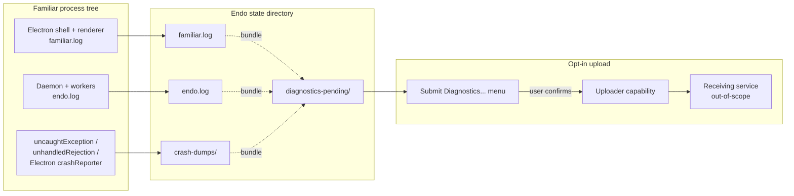
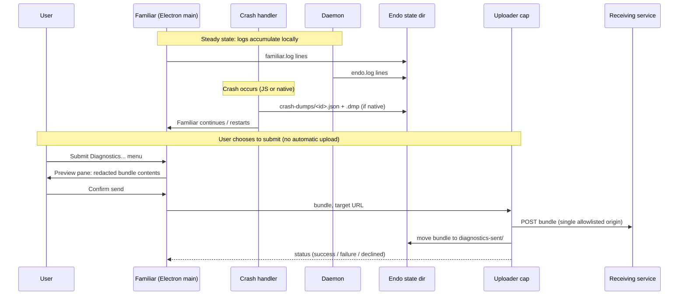

# Familiar Telemetry and Crash Reporting

| | |
|---|---|
| **Created** | 2026-05-19 |
| **Author** | endolinbot (designer; prompted) |
| **Status** | Proposed |
| **Source** | [`familiar-release`](familiar-release.md) G13 (designer pass) |

## What is the Problem Being Solved?

The Familiar today writes structured logs to `familiar.log` (Electron
shell + renderer) and `endo.log` (daemon and workers) in the Endo
state directory. No upload mechanism exists; no in-app affordance
exists to submit a log to maintainers; no telemetry of any kind is
collected.

The [`familiar-release`](familiar-release.md) gap audit (G13)
classifies this as **Nice-to-have** for the MVR and stages two
follow-ups:

1. Document the log locations in the README so a user can attach a
   file to a bug report (MVR work; this design does not block).
2. Ship an opt-in crash reporter and an opt-in telemetry pipeline
   (multi-week work; this design is the prerequisite shape).

This document is the second item's shape. The maintainer asked, on
the G13 review at [PR #231 line 359](https://github.com/endojs/endo-but-for-bots/pull/231):
"Please dispatch a designer to flesh this out." Anything implementable
about the uploader, the consent surface, or the privacy guarantees
that is not in
[`familiar-release`](familiar-release.md) belongs here.

## Scope

This design covers:

- **What signals** the Familiar collects locally (always-on) versus
  what it transmits (opt-in).
- **Three pipelines** that share collection but differ on capture
  trigger, consent surface, and transmission shape: error logs,
  crash reports, and usage telemetry.
- **The consent surface**: where the user sees the choice, what the
  default is, what the opt-in covers, and how the user revokes.
- **Storage and processing locality**: what is local-first, what (if
  anything) crosses the network, and through which capability.
- **Capability mediation**: how the uploader is constructed so the
  rest of the Familiar cannot exfiltrate logs through it.

Out of scope: the receiving service. This design names what the
Familiar emits and how; the backend that ingests crash reports is a
separate question (sibling design or operator decision) and the
Familiar does not couple to a particular vendor.

## Design

### Three pipelines, one collector



Three pipelines feed into a single on-disk staging directory
(`diagnostics-pending/`) that the uploader consumes. Nothing leaves
the user's machine without a per-submission user click; nothing
queues itself for retransmission across runs.

#### Pipeline 1: error logs (always local)

Already implemented in
[`packages/familiar/src/logger.js`](../packages/familiar/src/logger.js):
ISO-timestamped lines at `info` / `warn` / `error` written to both
stderr and `familiar.log`. The daemon's `endo.log` is the parallel
shape on the daemon side. **No change** to the steady-state writers
for MVR or for the first follow-up; the logs continue to accumulate
in the state directory.

Rotation: a size-cap rotation (e.g., 10 MiB ceiling per file with
two-generation retention) lands as a small refinement to
`makeLogger`, independent of this design's telemetry posture. It is
a hygiene fix; the telemetry posture does not depend on it.

#### Pipeline 2: crash reports (opt-in)

Two crash classes are distinct and want different treatment:

- **JS exceptions in the Electron main process or renderer.** Handle
  in JS via the existing `uncaughtException` /
  `unhandledRejection` paths; serialize stack + Electron version +
  OS + Familiar version into a JSON sidecar in `crash-dumps/`.
- **Native crashes (Electron child process, native module, or the
  bundled Node binary).** Use the Electron `crashReporter` module
  with `uploadToServer: false`. This writes minidumps to the same
  `crash-dumps/` directory; the Familiar's uploader (not Electron's
  built-in transmitter) carries them across the network if and when
  the user opts in. The point of disabling
  `uploadToServer` is that we route every byte through one capability
  whose URL the user can inspect.

Both classes feed `crash-dumps/` deterministically; the user is not
prompted at crash time (a UI surface at the moment of a crash is
hostile, and the renderer may not be in a state to render anything).
The dump sits on disk until the user opens **Submit Diagnostics...**
in the next session.

#### Pipeline 3: usage telemetry (opt-in)

Usage telemetry is **deferred behind an explicit later go/no-go**.
The MVR ships with no usage-telemetry collector at all. The
opt-in crash reporter is the only opt-in path the first follow-up
delivers; usage telemetry's go/no-go is a separate decision the
maintainer makes after a quarter or two of crash-reporter operation
shows whether the Familiar needs more than crash signal.

When and if it ships, the shape is the same as a crash report: a
JSON event with a fixed schema lands in `diagnostics-pending/`, and
the same uploader carries it. The collector itself is structurally
constrained (see § Privacy guarantees): event names from a fixed
allowlist; no message bodies, no user input, no agent prompts, no
file paths from outside the daemon's state directory.

### Capture flow per pipeline



The **preview pane is non-negotiable**. The user sees exactly what is
in the bundle (with secrets redacted per § Privacy guarantees) before
the upload happens. Hidden uploads are out of scope.

### Capability shape

The uploader is an exo following the same pattern as
[`endoclaw-network-fetch`](endoclaw-network-fetch.md): a structural
origin allowlist of exactly one URL (the configured receiving
service), no wildcards, no bypass.

```ts
interface DiagnosticsUploader {
  // Inspect what would be sent. Returns the redacted bundle.
  preview(bundleId: string): Promise<DiagnosticsBundle>;

  // Submit a previewed bundle. The implementation refuses bundles
  // that were not previewed by the same user session, so a non-user
  // caller cannot bypass the preview gate.
  submit(bundleId: string, previewToken: string): Promise<SubmitResult>;

  // The configured endpoint. Read-only.
  endpoint(): string;

  // List pending bundle ids (read access for the UI).
  listPending(): Promise<string[]>;

  // Discard a pending bundle without sending it.
  discard(bundleId: string): Promise<void>;
}

interface DiagnosticsBundle {
  id: string;
  kind: 'error-log' | 'crash-report' | 'usage-telemetry';
  capturedAt: string;        // ISO timestamp
  redactedContent: unknown;  // post-redaction payload
  byteCount: number;
}
```

The Electron shell holds the only reference to the
`DiagnosticsUploader`. Neither the daemon, nor any guest agent (`lal`
included), nor any weblet receives this capability. An agent that
wants to "ask for a bug report" can only request that the Electron
shell open the **Submit Diagnostics...** UI; the user remains the
sole party who can authorize a transmission.

This is the same structural posture as the Familiar's other
out-of-process integrations: capability mediation is the boundary,
not policy.

### Consent surface

The user encounters consent at three points:

1. **First-run preferences**, after the LLM config form completes,
   before the first agent interaction. A preferences dialog asks
   two yes/no questions:
   - "Send a crash report when Familiar crashes?" (default: no)
   - "Send usage statistics?" (default: no; only shown after
     pipeline 3 ships)
   Both choices persist in the Endo state directory under a
   user-readable JSON file (`familiar-prefs.json`), modifiable in the
   in-app preferences pane and inspectable by hand.

2. **Per-submission preview**. Even with the first-run opt-in on, no
   crash report is sent without an explicit click on a session-
   level "Submit now" button after the preview pane renders. The
   first-run choice opts the user *into the UI being offered*; the
   per-submission click authorizes *this specific bundle*. This
   two-step shape matches the Endo project's broader posture of
   never substituting "I agreed once" for an active consent at the
   moment of an action that affects the outside world.

3. **Revocation**. The preferences pane lets the user toggle the
   first-run choice at any time. Toggling off does not delete already-
   sent bundles (those have left the user's machine and we cannot
   recall them) but does (a) suppress future "Crash detected"
   notifications and (b) keep capturing crash dumps to disk (so a
   user who toggles off in error retains the option to toggle back
   on and submit historical material).

The default is **opt-in, not opt-out**, throughout. The Familiar
ships with both pipelines off.

### Privacy guarantees

The Familiar makes the following commitments to the user, encoded in
the redaction pipeline and the capability boundary:

- **Nothing leaves the machine without an explicit per-submission
  click.** The capability boundary above is the structural
  enforcement: no agent, no weblet, no daemon component can transmit
  a diagnostic bundle.
- **No agent transcripts.** The contents of conversations between
  the user and `lal` (or any future bundled agent) are never
  included in a crash report or telemetry event. The redactor
  drops every line whose source is the agent's transcript module
  (the daemon's CapTP traffic carrying form submissions, message
  bodies, or tool calls). This is a redaction *and* a structural
  exclusion: the logger module that writes `familiar.log` and
  `endo.log` does not receive transcript content in the first place;
  the redactor is a belt-and-braces second pass.
- **No secrets.** The `lal` form-provisioning flow marks the LLM
  auth token `secret: true`
  ([`lal-fae-form-provisioning`](lal-fae-form-provisioning.md));
  the redactor honors `secret: true` markers and replaces matching
  field values with a fixed-length redaction marker. Pattern-based
  scrubbing (matching bearer-token shapes, OpenAI-key shapes,
  Anthropic-key shapes) backs up the structural marker for any
  third-party logger that did not honor it.
- **No file paths outside the Endo state directory** appear in the
  bundle. The redactor rewrites any absolute path under the user's
  home directory to a tokenized form (`<HOME>/...`) and drops paths
  outside `<HOME>` entirely.
- **No environment variables.** The crash handler captures
  `process.platform`, `process.arch`, the Familiar version, the
  Electron version, and the Node version; it explicitly does not
  enumerate `process.env`.
- **No network identifiers.** The bundle does not include the
  user's hostname, MAC address, IP address, or any persistent
  installation id. A per-bundle random id exists for the user to
  reference in a follow-up correspondence; it is not a stable
  device fingerprint.
- **The preview is the contract.** What the user sees in the
  preview pane is byte-for-byte what the uploader transmits. The
  redactor runs once, before the preview; the uploader does not
  re-process the bundle.

### Storage and processing locality

| Stage | Where it lives | What touches it |
|---|---|---|
| Steady-state logs | `<state>/familiar.log`, `<state>/endo.log` | Local writers only; no remote read or write |
| Crash dumps (JS) | `<state>/crash-dumps/<id>.json` | Crash handler writes; uploader reads on user action |
| Crash dumps (native) | `<state>/crash-dumps/<id>.dmp` | Electron crashReporter writes (uploadToServer false); uploader reads on user action |
| Pending bundle (redacted) | `<state>/diagnostics-pending/<id>/` | Redactor writes; preview pane and uploader read |
| Sent bundle | `<state>/diagnostics-sent/<id>/` | Uploader moves on success; user-deletable |
| Preferences | `<state>/familiar-prefs.json` | Preferences pane reads/writes |

Every artifact lives under the Endo state directory's
`<state>/familiar/` subtree (the daemon owns `<state>/`'s top level).
**Nothing is hosted.** A user who deletes the state directory deletes
every diagnostic the Familiar has ever produced. This aligns with the
**local-first** posture documented in
[`familiar-release`](familiar-release.md) G10 (state-directory shape)
and reinforces the cleanup story the same gap describes: Purge and
uninstall remove diagnostics along with everything else.

### Triage on the receiving side

The Familiar emits in a stable, documented JSON envelope so a
maintainer who receives a bundle can:

- Read the kind, capture timestamp, and Familiar version without
  parsing the payload.
- Diff payloads across submissions from the same user (the
  per-bundle id is unique; correlation is by user-supplied context
  in the preview's free-text "Add a note" field, not by silent
  fingerprinting).
- Discard duplicates on content hash.

The receiving-service shape itself (GitHub Issues attachment? a
dedicated minidump-symbolicating service? a maintainer's mailbox?)
is **out of scope** for this design. The Familiar's uploader takes a
single endpoint URL and a content type; what runs at the other end
is a separate decision the maintainer makes when the uploader ships.
A reasonable starting point is "a GitHub Issue created via
`gh issue create` with the bundle attached" because it requires no
new infrastructure; a "manual submission" mode (the user copies the
bundle's path and attaches it to an existing issue themselves) is the
fallback for any user who would rather not enable network upload at
all.

## Sibling-document references

This design slots into the existing Familiar design family:

- [`familiar-release`](familiar-release.md) G13: the gap this design
  closes. The release doc's G13 entry compresses to "see
  [`familiar-telemetry-crash-reporting`](familiar-telemetry-crash-reporting.md)"
  once both documents land.
- [`familiar-electron-shell`](familiar-electron-shell.md): the
  Electron-shell design that owns `familiar.log`, the IPC surface
  the preview pane uses, and the menu structure that hosts
  **Submit Diagnostics...**. The shell holds the sole reference to
  the uploader capability.
- [`lal-fae-form-provisioning`](lal-fae-form-provisioning.md): the
  form-provisioning flow whose `secret: true` markers the redactor
  honors. Any future field added there with `secret: true` is
  automatically redacted by the uploader without a code change.
- [`endoclaw-network-fetch`](endoclaw-network-fetch.md): the
  structural origin-allowlist pattern the uploader follows. The
  uploader is a degenerate `HttpClient` whose allowlist contains
  exactly one URL.
- [`gateway-bearer-token-auth`](gateway-bearer-token-auth.md): the
  bearer-token auth shape the uploader uses (if authentication to
  the receiving service is required) to keep auth-token handling
  consistent across the Familiar's outbound paths.
- [`endoclaw`](endoclaw.md): the capability-mediation framing the
  uploader exemplifies.

## Phased plan

### Phase 0 (MVR): documentation, no code change

Already covered in [`familiar-release`](familiar-release.md) MVR
("Document log locations and state directory in the package
README"). This design does not add anything to that.

### Phase 1: crash capture without upload

- Land the JS-side `uncaughtException` / `unhandledRejection`
  handlers that write to `<state>/familiar/crash-dumps/`.
- Wire `Electron crashReporter` with `uploadToServer: false`.
- Add a log-rotation cap to `makeLogger`.
- No UI, no uploader, no consent surface yet. Crash dumps accumulate
  for users who report bugs to attach manually.
- Effort: multi-day.

### Phase 2: redactor and preview pane

- Implement the redaction pipeline (`secret:` honoring, pattern
  scrub, path tokenization, transcript exclusion).
- Implement the bundle assembler that gathers a kind-stamped JSON
  envelope plus the relevant slice of `familiar.log` and `endo.log`.
- Implement the preview pane in the Electron shell (no transmission
  yet; copy-to-clipboard and reveal-in-file-manager as the user
  affordances).
- Effort: multi-day to a week.

### Phase 3: opt-in crash uploader

- Implement the `DiagnosticsUploader` capability with a single
  configured endpoint.
- Wire the preferences pane and the **Submit Diagnostics...** menu
  item.
- Implement the two-step consent surface (first-run opt-in plus
  per-submission click).
- Wire the receiving-service decision (the maintainer picks the
  endpoint shape at this phase, not before).
- Effort: multi-week including the receiving-service stand-up.

### Phase 4 (optional, gated): usage telemetry

- Decided after Phase 3 has run in production long enough to inform
  the question. Either ships using the same envelope and the same
  uploader, or is dropped.
- Effort: a week to land if the decision is "yes"; zero otherwise.

## Considered and rejected

- **Automatic, silent crash uploads.** Rejected. Hidden network
  activity in a desktop app whose entire posture is "the user owns
  the capability" is a contradiction. The preview pane is the
  contract.
- **A vendored SDK (Sentry, Bugsnag, etc.) as the uploader.**
  Rejected for the same reason: a third-party SDK ingests bundles
  through machinery the Familiar does not own and cannot inspect,
  defeating the capability-mediation guarantee. The endpoint may
  ultimately be a Sentry-compatible HTTP target; the **uploader**
  is the Familiar's own exo.
- **Opt-out telemetry with prominent disclosure.** Rejected. The
  default is no transmission. The user has to ask for it.
- **A persistent installation id.** Rejected. A stable device id is
  a tracking primitive even if technically anonymous; the per-bundle
  random id plus the user-supplied free-text note is sufficient for
  correlating a follow-up correspondence.
- **An in-band "report this bug" button on the renderer's error
  toast.** Considered for Phase 2 and deferred. The Submit
  Diagnostics... menu is the discoverable surface; bolting a
  "report" button onto every toast trains the user to click it
  reflexively, which inverts the consent posture this design rests
  on.

## Open questions

1. **Endpoint discovery.** Does the receiving service URL ship
   compiled into the Familiar, or read from a config file, or
   entered by the user in the preferences pane? Hardcoded is
   simplest; user-entered preserves the capability-mediation story
   most cleanly (the user names the destination they trust); config
   file is a middle ground. The maintainer picks before Phase 3.

2. **Bundle size ceiling.** Some crashes (especially native ones)
   produce minidumps in the tens of MiB. Should the Familiar cap
   per-bundle size, refuse oversize bundles, or stream large bundles
   in chunks? A simple 10 MiB cap with a "this crash is too large to
   submit; please attach manually" fallback is the proposed default;
   the maintainer can refine.

3. **Receiving-service shape.** Out of scope per § Scope, but a
   sibling design (or a maintainer note) is the right place to record
   the choice once made. Candidates: GitHub Issues via `gh`, a
   maintainer-operated minidump-symbolicating endpoint, a mailbox.

## Prompt

> Please dispatch a designer to flesh this out.
>
> (Maintainer comment on PR #231 at
> [`familiar-release`](familiar-release.md) L359, the G13 entry, on
> 2026-05-19.)

The dispatch task asked the designer to cover: telemetry scope and
opt-in posture; the crash-reporting flow from capture through upload
through triage; the privacy guarantees and the user's consent surface;
storage and processing locality (local-first vs. hosted vs.
capability-mediated); and references to sibling designs. Each is a
top-level section above.
