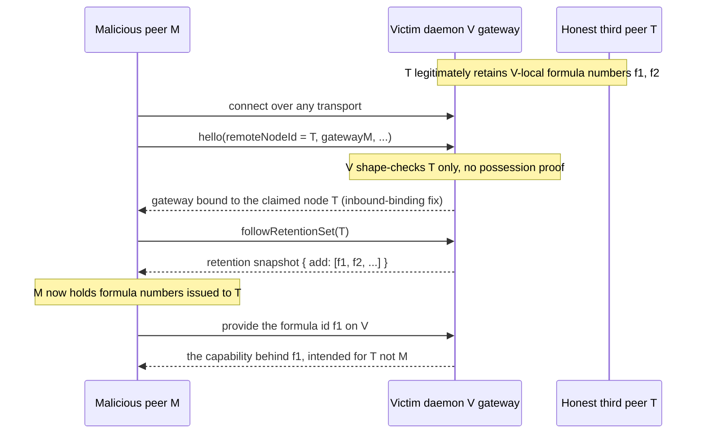
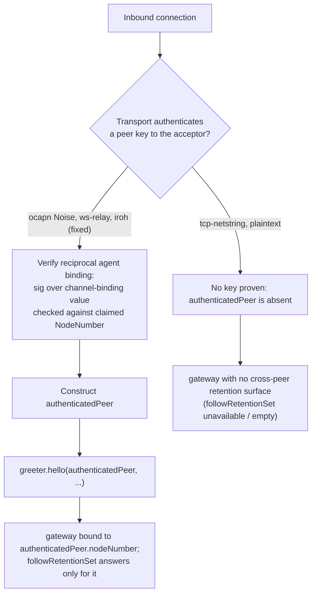

# Authenticated Peer Identity for Host `gateway()` Across All Transports

| | |
|---|---|
| **Created** | 2026-09-13 |
| **Author** | Kriscendo Bot (prompted) |
| **Status** | Proposed |
| **Security** | Under disclosure hold. See `journal/jobs/plan/endo-retention-set-disclosure-hold.md` (garden journal). Do not open a public PR or otherwise publish without maintainer authorization. |

## What is the Problem Being Solved?

The Endo daemon's host `gateway()` (the `Far('Gateway', ...)` in
`packages/daemon/src/manager.js`, and the `greeter.hello(remoteNodeId, ...)`
that hands it across) has **no authenticated peer identity** at the CapTP
layer. Every transport delivers a `remoteNodeId` to `greeter.hello` as a
plaintext argument the connecting peer asserts about itself, and no transport
verifies that the peer possesses the private key behind the NodeNumber it
claims. The gateway's enumerating method, `followRetentionSet(peerNodeNumber)`,
then answers for whatever node the caller names.

A NodeNumber is not an opaque tag: it is the hex of the daemon's root Ed25519
public key (`manager.js`, `localNodeNumber = toHex(rootKeypair.publicKey)`, near
the `provideRootKeypair` call), and the daemon holds the matching private key
and a `sign` power (the `sign:` method on the `Endo` bootstrap exo in
`manager.js`). So authenticated peer identity is *available* end to end. It is
simply not asserted on the inbound handshake on any transport.

This is the residual requirement carried out of the retention-set disclosure
hold: after [#978](https://github.com/endojs/endo-but-for-bots/pull/978) (bind
inbound `followRetentionSet` to the peer) and
[#979](https://github.com/endojs/endo-but-for-bots/pull/979) (bind the outbound
gateway to the dialed peer), the gateway a peer receives is
bound to a NodeNumber, **but that NodeNumber is still self-asserted on the
inbound path**, so the binding is only as trustworthy as the unverified claim.
Closing the gap requires the peer's NodeNumber to be *authenticated*, uniformly,
before it is used to scope a gateway.

## The Gap, Transport by Transport

Common root cause. In every CapTP transport the *accepting* side installs
`localGreeter` as its bootstrap and the *dialing* side installs `localGateway`,
then the dialer reaches across and calls
`E(remoteGreeter).hello(localNodeId, localGateway, ...)` — passing **its own**
NodeNumber. The accepting daemon validates only the *shape* of that argument
(`assertNodeNumber(remoteNodeId)` in `hello`, whose body is `isValidNumber`
in `formula-identifier.js`), never a possession proof. The two reachable
gateway methods gate on argument shape, never on caller identity:

- `Gateway.provide(requestedId)` (`manager.js`): checks `assertValidId` and
  `isLocalId` only. A bearer capability: any holder of the gateway who also
  holds a secret local formula id may fetch it.
- `Gateway.followRetentionSet(peerNodeNumber)` (`manager.js`): filters the
  daemon's formula-change stream by the `peerNodeNumber` **argument**; it does
  not even shape-check it, and never confirms the caller is that node. This is
  the one method that *reveals* formula numbers rather than requiring them.

| Transport | File | Inbound `remoteNodeId` source | Transport peer crypto | Key bound to claimed NodeNumber? |
|---|---|---|---|---|
| loopback | `networks/loopback.js` | n/a (never calls `hello`; returns the local gateway for `loop:`) | n/a (same daemon, in-process) | n/a |
| tcp-netstring | `networks/tcp-netstring.js` | self-asserted by dialer (the `hello(localNodeId, ...)` call) | none (plaintext; `setup-tcp.js` warns it exposes the peer-attachment surface) | no |
| ws-relay | `networks/ws-relay.js` | self-asserted by dialer; the relay-attested `fromNodeId` on the incoming frame is parsed and **discarded** (`const { channelId, fromNodeId: _fromNodeId } = decodeIncoming(payload)`) | daemon-to-**relay** only: a `sign(domain \|\| nonce)` challenge proves the NodeNumber to the relay | only at the relay, not peer to peer |
| iroh | `networks/iroh.js` | self-asserted by dialer; the inbound path never reads iroh's authenticated `connection.remoteNodeId()` | QUIC/TLS is mutually authenticated by Ed25519, **but the iroh secret key is derived from the (public) NodeNumber** (`deriveIrohSecretKey(nodeIdHex)` uses the NodeNumber bytes as the secret seed; `secretKey = deriveIrohSecretKey(localNodeId)`) | no, and the key material is public: the code comment says it "ties the iroh identity to the (public) NodeNumber rather than the daemon's root private key" |
| ocapn (Noise/TCP) | `networks/ocapn.js` | self-asserted by dialer (the `hello(localNodeId, ...)` call at the end of `connect`) | Noise IK over an **ephemeral** session key, plus a signed **agent binding** (`sign("endo-agent-binding\0" \|\| sessionPublicKey)` with the root key) that ties the ephemeral key to the persistent NodeNumber | **yes, but only the dialer verifies the dialed peer** (`binding.agentPublicKey === expectedNodeId` and `assertSignatureValid(agentBindingMessage(sessionPublicKey), ...)`); the *acceptor* runs no reciprocal check |

Two structural facts fall out of the table:

1. **The authentication that exists is one-directional.** OCapN authenticates
   the *responder* to the *dialer* (you learn who you connected to). Nothing
   authenticates the *dialer* to the *responder* (you never learn who connected
   to you). But `hello` runs on the *responder*, and `hello`'s `remoteNodeId`
   is precisely the dialer's identity, so the direction that is authenticated is
   the opposite of the direction the gateway needs.

2. **iroh's authentication is void for identity.** iroh proves possession of a
   key derived deterministically from the *public* NodeNumber. Anyone who knows
   a target's NodeNumber (it is published in every locator and address) can
   derive the identical iroh secret key and present the same iroh EndpointId.
   iroh's mutual QUIC authentication is therefore not evidence of NodeNumber
   ownership at all, on either direction.

## How the Missing Identity Enables Cross-Peer Retained-Formula-Number Following

The retention protocol (design `daemon-cross-peer-gc.md`, Complete) exists so a
daemon does not garbage-collect a local formula while some peer still holds a
reference to it. Each peer streams the other the set of the other's formula
numbers it is retaining, via `followRetentionSet`. Formula numbers are the
secret half of a formula id; combined with a node they form the id that
`Gateway.provide` will honor. So a formula number a peer is *not* entitled to,
learned through the retention stream, is a bearer capability that peer can then
`provide` and use.

Concretely, with no authenticated inbound identity, a malicious peer M reaches a
victim daemon V and harvests the capabilities V retains on behalf of a third
peer T:

The same reachability exists on the **outbound** side, which is the half the
disclosure hold names directly: a peer V dials receives V's gateway, and before
[#979](https://github.com/endojs/endo-but-for-bots/pull/979) that gateway was the
shared `localGateway`, so the dialed peer could call
`followRetentionSet(thirdNode)` and read a third node's retained numbers, then
`provide` them. Those two fixes narrow *which node's* set a given gateway will
enumerate. This design supplies the missing premise underneath both: that the
node a gateway is bound to is the node the peer has **proven** it is, so the
binding cannot be aimed at a victim by a self-asserted claim.

Note the local index is already protected: `localGateway.followRetentionSet`
(after the inbound-binding fix) refuses to enumerate the local node, and
`DiagnosticsInterface` is
host-only "so a guest must not be able to enumerate the host's formula graph,
peer relationships, ..." (`interfaces.js`). The remaining exposure is strictly
*cross-peer*: one peer following another peer's retained set.

## Proposed Mechanism: Authenticate the Inbound Peer, Uniformly

The fix is to make the NodeNumber that scopes a gateway an **authenticated
identity supplied by the transport**, not an argument supplied by the peer. The
handshake shape stays the same (`hello` still returns a peer-bound gateway);
what changes is that the peer's NodeNumber is proven, and `hello` no longer
takes the caller's word for it.

### The uniform primitive: a reciprocal agent binding

OCapN already has exactly the right primitive, used in one direction. Generalize
it into a **mutual** proof, and reuse the domain-separated agent-binding
signature (`sign("endo-agent-binding\0" || channelBindingBytes)` verified with
`makeOcapnPublicKey`) so there is one signature format across transports:

- Define an authenticated-peer capability the transport constructs and hands the
  greeter: `hello(authenticatedPeer, remoteGateway, cancel, cancelled)` where
  `authenticatedPeer.nodeNumber` is a value the *transport* vouches for, not the
  peer. The self-asserted `remoteNodeId` argument is removed (or retained only
  as a claim that must equal the authenticated value, then discarded).
- On a transport that already authenticates a key to the acceptor (see below),
  the transport verifies the peer's agent binding over the transport's
  channel-binding value (the Noise session key, the QUIC exporter, or the relay
  challenge nonce), checks the signature against the claimed NodeNumber, and only
  then constructs `authenticatedPeer`. This is the reciprocal of the check
  `ocapn.js` runs today, moved to run on **both** ends of the handshake.
- `followRetentionSet` takes **no argument**: it answers for
  `authenticatedPeer.nodeNumber` and nothing else. `provide` is unchanged (it is
  already a bearer capability that enumerates nothing), but it now also runs
  inside a session whose peer is known, which future policy can use.

### Per-transport realization

- **ocapn (Noise/TCP).** Symmetrize the existing binding. Today the dialer
  fetches the responder's `getAgentBinding()` and verifies it against the
  session key and the expected NodeNumber. Add the same exchange in reverse: the
  acceptor obtains the dialer's agent binding over the same session and verifies
  it before `hello`'s gateway is scoped. Because the Noise session key is the
  channel-binding value both sides already sign over, this is symmetric and adds
  no new key material.
- **ws-relay.** Two options; the design prefers (a). (a) Run the same reciprocal
  agent-binding exchange end to end over the CapTP channel, so identity does not
  depend on trusting the relay. (b) At minimum, **stop discarding the
  relay-attested `fromNodeId`**: the relay already authenticated the peer's
  NodeNumber via the `sign(domain || nonce)` challenge, so the acceptor can
  require `remoteNodeId === fromNodeId`. Option (b) moves trust to the relay and
  is only a stopgap; (a) is the end state.
- **iroh.** Two independent fixes, both required. First, **derive the iroh secret
  key from the root private key, not the public NodeNumber**, so the iroh
  EndpointId is a real possession proof (the recommended end state the code
  comment already names). Second, **bind the authenticated iroh EndpointId to
  the NodeNumber**: read `connection.remoteNodeId()` on the inbound path and
  require it match the claimed NodeNumber (or make the EndpointId *be* the
  NodeNumber once the key derivation is fixed). Until the first fix lands, iroh
  provides no identity and must be treated like tcp-netstring below.
- **tcp-netstring.** No key is proven and none can be without adding a handshake.
  This transport is documented "not for production." **Here the mechanism cannot
  be uniform:** rather than fabricate identity, the acceptor constructs no
  `authenticatedPeer`, and a session with no authenticated peer gets **no
  cross-peer retention surface** (`followRetentionSet` is unavailable or returns
  an empty set). Plain `provide` of already-held bearer ids may remain, since it
  enumerates nothing. If tcp-netstring ever needs authenticated identity, it must
  adopt the reciprocal agent-binding exchange over its CapTP channel (the
  ws-relay option (a) shape), which is the only way to get identity without
  transport crypto.
- **loopback.** Same daemon; the peer is self. No change; it keeps presenting the
  shared `localGateway`, which already refuses to enumerate the local node.

### Where it cannot be uniform (explicit)

Uniformity is achievable for the *interface* (`hello` receives an
`authenticatedPeer` or none; the gateway scopes retention to it) but not for the
*source of the proof*:

- Transports with genuine peer crypto bound to the NodeNumber (ocapn today;
  ws-relay end-to-end; iroh after the key-derivation fix) authenticate via a
  transport channel-binding signature.
- Transports with no peer crypto (tcp-netstring, and iroh until fixed) cannot
  authenticate identity at all without adding a handshake, so they receive a
  degraded gateway with no cross-peer retention surface rather than a spoofable
  one. This is a deliberate asymmetry: absence of proof yields absence of the
  enumerating capability, never a trusted-by-default identity.

## Compatibility and Migration

What breaks. Any peer running old code will send only the self-asserted
`remoteNodeId` and will not answer a reciprocal agent-binding request, and an
old acceptor will not issue one. A hard cutover (require the reciprocal proof)
severs new-to-old connections on the crypto transports.

Migration path (staged, so no flag day):

1. **Land [#978](https://github.com/endojs/endo-but-for-bots/pull/978) and
   [#979](https://github.com/endojs/endo-but-for-bots/pull/979) first** (already
   open, draft). They make the gateway
   *bound* to a NodeNumber, which is the structural precondition for
   authenticating that NodeNumber. This design assumes they are in.
2. **Additive proof, permissive.** Add the reciprocal agent-binding exchange as
   an *optional* step: an acceptor that receives a valid proof scopes the
   gateway to the *authenticated* node; one that receives none falls back to the
   self-asserted `remoteNodeId` **but marks the session unauthenticated** and
   serves it the degraded (no cross-peer retention) gateway. New peers
   interoperate with old peers at the old (degraded) privilege; nothing breaks.
3. **iroh key-derivation fix.** Change `deriveIrohSecretKey` to derive from the
   root private key. This rotates every daemon's iroh EndpointId, so published
   iroh addresses/locators change. Sequence it with a locator refresh and treat
   it as a breaking change for iroh addresses specifically (call it out in the
   changeset). Peers pinning an old iroh EndpointId must re-resolve.
4. **Flip the default.** Once the ecosystem has upgraded, make the authenticated
   proof mandatory on the crypto transports (a session with no proof no longer
   gets even the degraded surface on ocapn/ws-relay/iroh); tcp-netstring stays
   permanently degraded by construction. Gate the flip behind a config with a
   deprecation window.

The retention persistence and graph are keyed by NodeNumber already
(`retention(guest_public_key, retained_formula_number)`), so authenticating the
NodeNumber changes *which* node a session is allowed to act as, not the storage
shape. No schema migration is required.

## Dependencies

| Design | Relationship |
|---|---|
| `daemon-cross-peer-gc.md` (Complete) | Defines `followRetentionSet` and the retention persistence this hardens. |
| `daemon-agent-network-identity.md` (In Progress) | NodeNumber = Ed25519 public key; per-agent keys; network registration by key. |
| `daemon-256-bit-identifiers.md` | Establishes NodeNumber = root Ed25519 public key hex. |
| `ocapn-noise-network.md` (Complete) | The agent-binding signature this generalizes into a reciprocal proof. |
| `ocapn-network-transport-separation.md` (In Progress) | `(network, designator)` peer identity for `.np`; the identity rule this must not defeat. |
| `ocapn-iroh-netlayer.md` (Complete) / the code-referenced `designs/iroh-network-design.md` § "Identity and trust" | The iroh identity gap (secret derived from the public NodeNumber) and its recommended end state. |
| `ocapn-noise-key-only-session-boundary.md` (Proposed) | The ws-relay is a dumb ciphertext router; Noise terminates at the listener, which is where a reciprocal proof must run. |
| `gateway-bearer-token-auth.md` (Implemented) | The browser gateway's `fetch(token)` bearer model, distinct from peer identity; unaffected. |

Fork-side work already in flight (do not re-originate):
[#978](https://github.com/endojs/endo-but-for-bots/pull/978) (bind inbound
`followRetentionSet` to the authenticated peer, draft) and
[#979](https://github.com/endojs/endo-but-for-bots/pull/979) (bind the outbound
gateway to the dialed peer, draft), both under the disclosure hold.

## Open Questions

- Should the reciprocal proof reuse OCapN's `getAgentBinding` object shape and
  `"endo-agent-binding\0"` domain tag verbatim on every transport, or should each
  transport bind to its own native channel value (Noise session key, QUIC TLS
  exporter, relay nonce)? Reusing one shape is simpler to audit; native binding
  is a stronger channel-binding guarantee. Which does the maintainer want as the
  normative rule?
- For tcp-netstring, is a permanently degraded gateway (no cross-peer retention
  surface, `provide` of already-held ids only) acceptable, or should the
  transport be barred from carrying peer connections at all once the crypto
  transports are authenticated?
- The iroh secret-key re-derivation rotates every daemon's iroh EndpointId and
  breaks pinned iroh addresses. Is a coordinated locator refresh acceptable, or
  must the old EndpointId be honored for a deprecation window (dual-key iroh
  listening)?
- Migration step 4 (mandatory proof) is a breaking change for any un-upgraded
  peer on the crypto transports. What deprecation window does the maintainer
  want before the default flips?
- Does authenticating the inbound peer let us *remove* the self-asserted
  `remoteNodeId` argument from `hello` outright (cleaner), or must it stay on the
  wire as a claim for one release for backward compatibility?

## Prompt

> Design authenticated peer identity for host `gateway()` across ALL transports.
> The gap: host `gateway()` has no authenticated peer identity on any transport,
> which keeps the cross-peer retained-formula-number following gap open — a peer
> cannot be held to an identity, so retained formula numbers can be followed
> across peers. Deliverables: (1) characterize the gap per transport with
> file:line grounding and what an unauthenticated peer can reach; (2) explain the
> link to cross-peer retained-formula-number following concretely; (3) propose
> the mechanism, uniform across transports where possible, explicit where it
> cannot be; (4) assess compatibility and the migration path. This is a design,
> not a build. Origin: retention-set disclosure hold; disclosure timing held
> separately — do not open a public PR or publish without further maintainer
> authorization.
