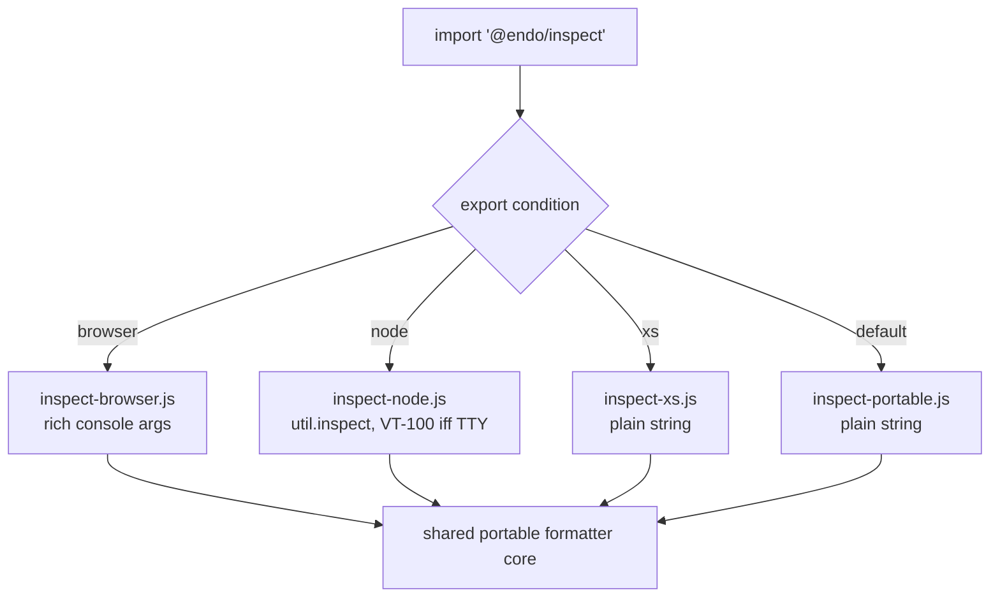

# `@endo/inspect`: a portable, safe object inspector shim

| | |
|---|---|
| **Created** | 2026-07-12 |
| **Updated** | 2026-07-12 |
| **Author** | Kris Kowal (prompted) |
| **Status** | Not Started |

## What is the Problem Being Solved?

Endo has no first-class, portable object inspector. When code under SES wants
to render an object for a human (a `console.log` argument, an assertion detail,
a REPL result), the only tool inside `packages/ses` is
`bestEffortStringify` (`packages/ses/src/error/stringify-utils.js`), a
deliberately minimal, `JSON.stringify`-based formatter whose own doc comment
warns it "has an imprecise specification and may change over time" and "possibly
emits too many 'seen' markings." It produces flat, un-styled, cycle-lossy text
and knows nothing of the host's rendering capabilities.

Meanwhile each host has a *good* inspector that Endo cannot portably reach:

- **Node** ships `util.inspect`, which colorizes with VT-100/ANSI escapes when
  writing to a TTY and emits bare text otherwise.
- **Browsers** have a *rich* console: passing a live object to `console.log`
  (or via the `%o`/`%O` format directives) yields an interactive, expandable
  tree the developer can drill into.
- **XS** has no `console` and no inspector at all; a formatter there must
  degrade to plain string production (or a no-op sink).

We want one package, `@endo/inspect`, that exposes a single inspection surface
and selects the right host behavior at build/bundle time, plus an
`@endo/inspect/shim.js` that can be **incorporated into the base of SES** so the
tamed console and assertion machinery render through it instead of through
`bestEffortStringify`. The target environment is selected by an **export
condition** (`node` / `browser` / `xs`), so the same source resolves differently
under Node's `-C`/`--conditions` flag, a browser bundler's conditions, and the
`compartment-mapper` conditions used to build for XS.

### The Proxy hazard (why this cannot be done faithfully today)

An inspector's job is to read an object's shape: walk own keys, read property
values, follow prototypes. But under SES *as written* that walk is not safe: a
**Proxy** can masquerade as an object with plain data properties, and reading
one of those "data" properties actually invokes the `get` trap, which may
**throw** or, worse, **re-enter** the caller. `bestEffortStringify` already
flinches at exactly this; its fallback comment (`stringify-utils.js`, in the
`catch` of the top-level `stringifyJson`) reads: *"the caught thing might be a
proxy or other exotic object rather than an error. The proxy might throw
whenever it is possible for it to."* So it wraps the whole render in one
`try/catch` and gives up with `[Something that failed to stringify]` on any
failure.

We cannot do better *faithfully* in engine-portable code because **standard
JavaScript has no Proxy brand check**: proxies are specified to be fully
transparent, so no supported predicate answers "is this value a Proxy?", and
`passStyleOf`'s existing defense (reject accessor properties) does not cover a
proxy pretending to hold data properties. Node is the one exception:
`util.types.isProxy` is a public, native, internal-slot brand check, which is
why the Node entry below can quarantine proxies today. Nothing equivalent
exists for XS, for a string-mode browser render, or for pure SES userland.
Repairing that gap is tracked upstream along two distinct lines (a stamping
power, and a non-trapping integrity trait) and is a hard **dependency** of a
*faithful* portable inspector; see Dependencies below. The maintainer has asked
that **@erights** and **@mhofman** be tagged on this design for the
capability-security review of that gap.

## Design

### Package surface

`@endo/inspect` exports one primary function plus its options type:

```js
import { inspect } from '@endo/inspect';

inspect(value, options); // -> the host-appropriate rendering
```

- On **node**, `inspect` returns a **string**; `options.colors` defaults to
  "detect from the destination TTY" and may be forced on/off. Semantically this
  is a thin, safety-hardened wrapper over `util.inspect` (depth, breakLength,
  `getters: false`, `customInspect: false` by default; see "Avoiding triggered
  behavior").
- On **browser**, `inspect` returns a **render request**, by default an array
  of `console` arguments (a format string plus the live values) so the caller
  can splat it into `console.log(...inspect(value))` and preserve the rich,
  expandable tree. A `{ as: 'string' }` option forces flat text for
  non-console sinks.
- On **xs**, `inspect` returns a **plain string** produced by the internal
  portable formatter (no ANSI, no host inspector), and the console-binding entry
  is a no-op sink because XS has no `console`.

The three behaviors share one internal, dependency-free **portable formatter**
(the evolution of `bestEffortStringify`, with cycle marking, depth limiting, and
typed-value tags) so that `{ as: 'string' }` output is identical across hosts
and XS has a real implementation rather than a stub.

### Condition-parameterized resolution

The package is built once and resolved per target through `exports`
conditions, mirroring how `packages/ses` already splits `xs` from `default`
(`packages/ses/package.json` `exports`, for example `"./lockdown-shim.js"`
resolving to `{ "xs": "./src-xs/...", "default": "./..." }`):

```jsonc
"exports": {
  ".": {
    "browser": "./src/inspect-browser.js",
    "xs":      "./src/inspect-xs.js",
    "node":    "./src/inspect-node.js",
    "default": "./src/inspect-portable.js"
  },
  "./shim.js": {
    "browser": "./shim-browser.js",
    "xs":      "./shim-xs.js",
    "node":    "./shim-node.js",
    "default": "./shim-portable.js"
  }
}
```

`default` is the portable (string-only, capability-free) formatter, so any host
that selects no condition still gets a correct, if plain, result. Node's `-C
node` / `--conditions=node`, a bundler's `browser` condition, and the
`compartment-mapper` `xs` condition each steer to the matching entry.



### The shim and SES integration

`@endo/inspect/shim.js` is a vetted shim in the sense of the other
`*-shim.js` entries: importing it for side effect installs the inspector as the
formatter SES uses. Concretely, SES's console taming
(`packages/ses/src/error/tame-console.js` and `console.js`) and its assertion
quoting currently reach `bestEffortStringify`; the shim provides a
`setInspector`-style seam so that, when loaded, those code paths delegate to
`@endo/inspect` instead. Incorporating it "in the base of SES" means the shim is
part of the SES bootstrap for a given target build, selected by the same export
condition, so a Node build ships the VT-100-aware inspector, a browser build
ships the rich-console inspector, and an XS build ships the plain formatter, all
without SES taking a static dependency on any host inspector.

The default SES build (no `@endo/inspect/shim.js`) keeps `bestEffortStringify`
unchanged, so this is strictly additive and opt-in per build.

### Avoiding triggered behavior (the safety contract)

The inspector must **carefully avoid triggering behaviors of the logged
objects**: reading a value must not run guest getters or proxy traps whose
side effects (throwing, re-entrancy, mutation, timing signals) could subvert the
logger or leak authority.

#### What can be read without triggering anything

The portable core restricts itself to a graded vocabulary of operations:

- **Trap-free on every value, including proxies:** `typeof`, identity
  (`===`, `Object.is`), `Array.isArray` (which follows a proxy to its target
  without running handler code), and, critically, **WeakMap/WeakSet lookup**,
  which is keyed on identity and consults the collection's own state, never
  the key's. Identity-keyed lookup is the primitive that makes proxy
  *stamping* (endojs/endo#1756) a sound defense, and it is why an inspector
  could consult an existing registry (for example the `passStyleMemo` inside
  `passStyleOf`) without touching the value.
- **Getter-free on ordinary objects but trap-firing on proxies:**
  `Object.getOwnPropertyDescriptor(s)`, `Reflect.ownKeys`,
  `Object.getPrototypeOf`, `Object.isFrozen`, and internal-slot brand probes
  (for example applying `Date.prototype.getTime` to classify a suspected
  `Date`; these throw on brand mismatch and are wrapped). On a non-proxy these
  read engine-internal state without running guest code, and descriptor reads
  let the renderer show `[Getter]` without calling it. On a proxy, every one
  of them enters the handler; endojs/endo#1912 makes the point that even
  integrity queries like `Object.isFrozen` are observable probes.
- **Never used on guest values:** property Gets through the object
  (`value[key]`), `toString`, `Symbol.toPrimitive`, `toJSON`,
  `Symbol.for('nodejs.util.inspect.custom')` and any other custom-inspection
  hook, and any accessor invocation.

The contract, in descending order of what we can guarantee today:

1. **Never invoke `customInspect` / `Symbol.for('nodejs.util.inspect.custom')`
   / `Symbol.toPrimitive` / `toString` on guest objects** by default. On Node
   this is `util.inspect(v, { customInspect: false, getters: false })`.
2. **Quarantine detectable proxies before reading them.** Where the selected
   condition supplies a brand check (Node's `util.types.isProxy` today; a
   stamping predicate or non-trapping trait check portably, once a dependency
   lands), test first, and render a detected proxy opaquely (`Proxy` plus its
   `typeof`), disclosing proxy-ness without entering the handler. This matches
   the direction Node itself took in nodejs/node#61029.
3. **Prefer own-enumerable data descriptors** obtained via
   `getOwnPropertyDescriptor`; render accessor properties as `[Getter]` /
   `[Setter]` **without calling them** unless the caller opts in.
4. **Treat every remaining read as fallible:** wrap each property read in
   `try/catch` and render a failed read as a typed placeholder (for example
   `[Getter threw]`) rather than propagating, so one hostile property cannot
   abort or hijack the whole render.
5. **The faithful portable guarantee is not available.** Where no brand check
   exists, we cannot distinguish a proxy-with-a-throwing-`get` from a plain
   data object *before* touching it; steps 1-4 reduce but do not eliminate the
   hazard (a proxy can still make `getOwnPropertyDescriptor` itself throw, lie,
   or re-enter). The residual risk is the subject of the upstream dependencies
   below and the reason for the @erights / @mhofman review.

#### How far each environment can go

| Environment | Proxy brand check | Faithfulness achievable today |
|---|---|---|
| node | Yes: `util.types.isProxy`, a public native internal-slot check | Near-faithful: quarantine proxies before delegating to `util.inspect`; residual exposure is Node's own inspect internals |
| browser | None in userland; the devtools console has engine access and already renders proxies safely itself | Faithful *by delegation* for the rich path: the pass-through design hands the live value to the host console and never reads it in our code; getters render unevaluated until the developer clicks. The `{ as: 'string' }` path falls back to the portable core and inherits its limits |
| xs | None today. Endo co-maintains the XS lockdown integration (`packages/ses/src-xs`), so a native predicate could be requested from Moddable as future work | Best-effort via the portable core |
| default (pure SES userland) | None; this is the gap | Best-effort only, per steps 1, 3, and 4 |

## Dependencies

| Design / Issue | Relationship |
|---|---|
| [endojs/endo#1756: Repair `Proxy` with stamping power](https://github.com/endojs/endo/issues/1756) | **Blocking for the *faithful* portable safety contract.** Proposes that Hardened JS replace the `Proxy` constructor with one that stamps every instance into a WeakSet and expose a start-compartment predicate. Identity-keyed lookup is trap-free, so the predicate lets the inspector detect and quarantine proxies before reading them. Explicitly motivated by `passStyleOf`-style traversals. |
| [Agoric/agoric-sdk#3905: Stamp proxies to prevent reentrancy / interleaving](https://github.com/Agoric/agoric-sdk/issues/3905) | **The agoric-sdk twin of endojs/endo#1756.** Untrusted code can hand trusted code a proxy of a hardened object that behaves identically but lets the attacker observe and interleave on every property access (reentrancy against marshal's serializer, the virtual object manager, and `passStyleOf` traversal). The same attack applies verbatim to an inspector's walk. |
| [tc39/proposal-stabilize](https://github.com/tc39/proposal-stabilize) (Stage 1) | **The standards-track repair.** Adds integrity traits including **non-trapping**: a proxy whose target is non-trapping never calls its handler. Champions include Mark S. Miller and Mathieu Hofman, the reviewers this design tags. If hardened values become non-trapping, the hazard disappears for hardened inputs wholesale, subsuming the stamping predicate for most inspector inputs. |
| [endojs/endo#2673: feat(non-trapping-shim): opt-in shim of the non-trapping integrity trait](https://github.com/endojs/endo/pull/2673) (open PR) | **In-flight Endo shim of that trait** (`isNonTrapping` / `suppressTrapping`, placeholder names pending tc39/proposal-stabilize naming). A portable inspector should bind to this seam when present. |
| [endojs/endo#2675: feat(ses,pass-style): use non-trapping integrity trait for safety](https://github.com/endojs/endo/pull/2675) (open PR) | **The systemic adoption direction:** `harden` suppresses trapping at each step and `passStyleOf` checks non-trapping where it checked `isFrozen`. The preparatory refactor already merged as [endojs/endo#2679](https://github.com/endojs/endo/pull/2679). This design's faithful phase should align with whichever of stamping (#1756) or non-trapping (#2673/#2675) lands. |
| [endojs/endo#1912: harden as a new integrity level](https://github.com/endojs/endo/issues/1912) | **Why even probing is triggering:** observes that integrity queries such as `Object.isFrozen` fire proxy traps, so an inspector cannot even safely ask about integrity. Precursor framing for tc39/proposal-stabilize. |
| [endojs/endo#819: Propose ECMA 262 language invariant for proxy handlers](https://github.com/endojs/endo/issues/819) | **Related soundness precondition.** SES's proxy defenses rest on the handler-interaction invariant; a brand check or trait check is only sound while that invariant holds. Surfaced so the safety review considers both together. |
| Node precedent: [nodejs/node#6464](https://github.com/nodejs/node/issues/6464), fixed by [nodejs/node#6465](https://github.com/nodejs/node/pull/6465); [nodejs/node#60964](https://github.com/nodejs/node/issues/60964), fixed by [nodejs/node#61029](https://github.com/nodejs/node/pull/61029) | **Prior art for both halves of the contract.** Node's `console.log` originally re-entered proxy traps and crashed (#6464); the fix introduced native proxy detection and the `showProxy` inspect option (#6465), and `util.types.isProxy` is public API. The 2025 refinement (#61029, follow-up [nodejs/node#61077](https://github.com/nodejs/node/pull/61077)) labels proxies even when `showProxy` is off: safe inspection must both *avoid traps* and *disclose proxy-ness*. |
| SES console prior art: [endojs/endo#945](https://github.com/endojs/endo/issues/945), [endojs/endo#636](https://github.com/endojs/endo/issues/636), [endojs/endo#944](https://github.com/endojs/endo/issues/944), [endojs/endo#1530](https://github.com/endojs/endo/issues/1530), [endojs/endo#2941](https://github.com/endojs/endo/issues/2941) | **The pain this package retires.** The causal-console/taming split and its constraints (#945); Node's inspector confused by SES-tamed `constructor` accessors (#636) and bare `Error` logging as `{}` under lockdown (#944); `bestEffortStringify` performance (#1530); SES error censorship yielding useless output (#2941). |
| `packages/ses/src/error/stringify-utils.js` (`bestEffortStringify`) | **Superseded as SES's formatter** *when the shim is loaded*; remains the default fallback. The inspector's portable core is its successor. |
| SES `exports` conditions in `packages/ses/package.json` (the `xs`/`default` split) | **Prior art** for condition-parameterized resolution; `@endo/inspect` follows the same pattern extended with `node`/`browser`. |
| `packages/ses/console-shim.js` and the console-taming seam (`packages/ses/src/error/tame-console.js`) | **Adjacent.** The shim's SES seam lives next to the existing console taming; coordinate the `setInspector` hook with the console-shim surface. |

## Phased implementation

1. **Portable core.** Extract and harden a depth-limited, cycle-marking,
   typed-tag formatter from `bestEffortStringify` as `inspect-portable.js`;
   ship `default` + `xs` entries. No host dependency. Unit tests pin output for
   cycles, bigints, symbols, errors, functions, and accessor placeholders.
2. **Node entry.** `inspect-node.js` wrapping `util.inspect` with the safety
   defaults and TTY-driven `colors`, quarantining proxies via
   `util.types.isProxy` before delegation. Test both TTY (ANSI present) and
   non-TTY (bare) rendering, and proxy disclosure.
3. **Browser entry.** `inspect-browser.js` returning console-argument arrays;
   `{ as: 'string' }` falls back to the portable core.
4. **SES seam + shim.** Add the `setInspector` hook to console taming and
   assertion quoting; ship `@endo/inspect/shim.js` per-target; wire an
   optional SES base build that includes it. Guard behind the condition so the
   default SES build is byte-for-byte unchanged.
5. **Faithful Proxy handling (deferred).** When a portable brand check exists
   (the endojs/endo#1756 stamping power, or the non-trapping trait via
   endojs/endo#2673 / endojs/endo#2675), tighten the safety contract from
   best-effort to faithful and remove the residual-risk caveat. Tracked as a
   follow-up to be filed against this design once one of those lands.

## Design Decisions

1. **No `exo-` prefix.** `@endo/inspect` exports no passable interfaces over
   CapTP (it is a local diagnostic formatter), so the `exo-` naming rule does
   not apply. The name `@endo/inspect` is the maintainer's.
2. **Condition selection over runtime detection.** Behavior is chosen by build
   condition, not by sniffing `typeof window` / `process` at runtime, so an XS
   build carries no Node code and a browser build carries no ANSI logic. Runtime
   TTY detection is confined to the already-Node-only entry.
3. **Return shape differs by host on purpose.** Node/XS return strings; browser
   returns console arguments so the rich, expandable tree survives. A uniform
   `{ as: 'string' }` escape hatch exists for callers that need flat text
   everywhere.
4. **Default is the safe, plain formatter.** Selecting no condition yields the
   capability-free portable core, never a host inspector.
5. **Best-effort now, faithful later.** We ship the try/catch-guarded contract
   immediately and upgrade to the faithful contract behind the Proxy-repair
   dependencies rather than blocking all value on them.
6. **Disclose, never touch.** Wherever a proxy is detectable, the inspector
   reports proxy-ness and stops rather than inspecting through the handler,
   matching Node's direction in nodejs/node#61029. Considered and rejected:
   rendering through the traps under try/catch when detection is available,
   because a well-behaved-during-render proxy still gains an interleaving
   channel.

## Open questions

- What exact seam should SES expose for the shim to install the inspector:
  a `setInspector(inspect)` mutator on a module singleton, an option threaded
  through `lockdown({ consoleTaming, inspector })`, or endowment via the
  console-shim? Which keeps the taming code free of a static `@endo/inspect`
  import?
- Which faithful substrate should the inspector bind to: the **stamping power**
  of endojs/endo#1756, or the **non-trapping integrity trait**
  (tc39/proposal-stabilize, shimmed in endojs/endo#2673 and adopted by SES and
  pass-style in endojs/endo#2675)? They compose (stamping *detects*,
  non-trapping *prevents*), but the endowment shape differs: a predicate power
  handed to the inspector versus a global trait check any code may consult.
  This is the specific question on which the design requests @erights /
  @mhofman guidance.
- Until either lands, may the inspector treat membership in existing
  identity-keyed registries (for example `passStyleOf`'s internal
  `passStyleMemo`, consulted trap-free via WeakMap lookup) as a partial
  "previously validated" stamp set? Honest limit: membership proves a value
  once passed validation, not that it is proxy-free; a proxy can behave during
  validation and misbehave later (the Agoric/agoric-sdk#3905 interleaving
  attack), so this weaker signal must not be presented as the faithful
  contract.
- Should the browser entry default to console-argument arrays or to a
  DOM/`%c`-styled string? The rich tree argues for arrays, but some callers
  (assertion messages) need a string; is the `{ as: 'string' }` opt-out
  sufficient, or should the assertion path force it?
- Does XS want a true no-op console sink, or should `@endo/inspect` on XS feed
  strings into whatever XS diagnostic channel exists (for example `print`
  under `xst`, `trace` under the Moddable runtime)? Relatedly, should Endo
  request a native proxy brand check from Moddable for the `xs` entry?
- Should `@endo/inspect` re-export a Node-`util.inspect`-compatible signature
  (`inspect(value, showHidden?, depth?, colors?)`) for drop-in familiarity, or
  keep only the single options-bag form?

## Prompt

> Please post a follow-up design to produce an `@endo/inspect` package and
> `@endo/inspect/shim.js` such that the shim can be incorporated in the base of
> `SES` and parameterized for target environment with `-C` condition. This
> should have different behavior on `browser` (where the console is rich) and
> `node` where the console is VT-100 if a `tty` and should be bare text
> otherwise, and `xs` where the console does not exist. The inspector should
> carefully avoid triggering behaviors of the logged objects. We cannot avoid
> these faithfully on SES as written since we do not have a `Proxy` brand check,
> so tag `@erights` and `@mhofman` on that design PR for assistance. Please
> research existing concerns about Proxy in SES. There are existing issues
> regarding proxy stamping that we should surface as a dependency.
>
> -- kriskowal, [endojs/endo-but-for-bots#187 (comment)](https://github.com/endojs/endo-but-for-bots/pull/187#issuecomment-4951950042)
