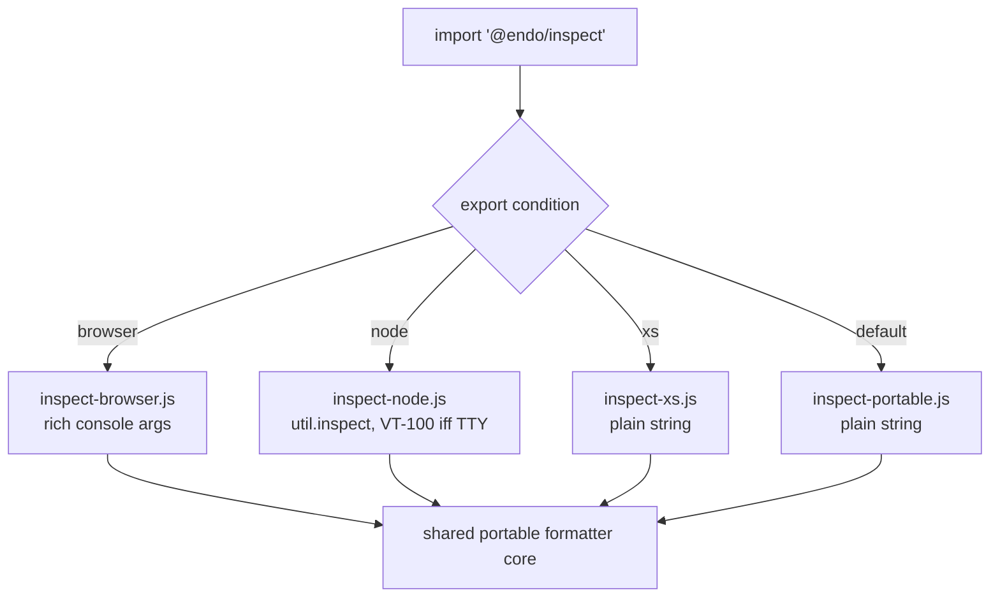

# `@endo/inspect` — a portable, safe object inspector shim

| | |
|---|---|
| **Created** | 2026-07-12 |
| **Author** | Kris Kowal (prompted) |
| **Status** | Not Started |

## What is the Problem Being Solved?

Endo has no first-class, portable object inspector. When code under SES wants
to render an object for a human — a `console.log` argument, an assertion detail,
a REPL result — the only tool inside `packages/ses` is
`bestEffortStringify` (`packages/ses/src/error/stringify-utils.js`), a
deliberately minimal, `JSON.stringify`-based formatter whose own doc comment
warns it "has an imprecise specification and may change over time" and "possibly
emits too many 'seen' markings." It produces flat, un-styled, cycle-lossy text
and knows nothing of the host's rendering capabilities.

Meanwhile each host has a *good* inspector that Endo cannot portably reach:

- **Node** ships `util.inspect`, which colorizes with VT-100/ANSI escapes when
  writing to a TTY and emits bare text otherwise.
- **Browsers** have a *rich* console: passing a live object to `console.log`
  (or via the `%o`/`%O` format directives) yields an interactive, expandable
  tree the developer can drill into.
- **XS** has no `console` and no inspector at all; a formatter there must
  degrade to plain string production (or a no-op sink).

We want one package, `@endo/inspect`, that exposes a single inspection surface
and selects the right host behavior at build/bundle time, plus an
`@endo/inspect/shim.js` that can be **incorporated into the base of SES** so the
tamed console and assertion machinery render through it instead of through
`bestEffortStringify`. The target environment is selected by an **export
condition** (`node` / `browser` / `xs`), so the same source resolves differently
under Node's `-C`/`--conditions` flag, a browser bundler's conditions, and the
`compartment-mapper` conditions used to build for XS.

### The Proxy hazard (why this cannot be done faithfully today)

An inspector's job is to read an object's shape — walk own keys, read property
values, follow prototypes. But under SES *as written* that walk is not safe: a
**Proxy** can masquerade as an object with plain data properties, and reading
one of those "data" properties actually invokes the `get` trap, which may
**throw** or, worse, **re-enter** the caller. `bestEffortStringify` already
flinches at exactly this — its fallback comment (`stringify-utils.js`, in the
`catch` of the top-level `stringifyJson`) reads: *"the caught thing might be a
proxy or other exotic object rather than an error. The proxy might throw
whenever it is possible for it to."* So it wraps the whole render in one
`try/catch` and gives up with `[Something that failed to stringify]` on any
failure.

We cannot do better *faithfully* because **SES has no Proxy brand check**: there
is no supported predicate that answers "is this value a Proxy?" Proxies are
specified to be fully transparent, so `passStyleOf`'s existing defense (reject
accessor properties) does not cover a proxy pretending to hold data properties.
Repairing this is tracked upstream and is a hard **dependency** of a *faithful*
inspector — see Dependencies below. The maintainer has asked that **@erights**
and **@mhofman** be tagged on this design for the capability-security review of
that gap.

## Design

### Package surface

`@endo/inspect` exports one primary function plus its options type:

```js
import { inspect } from '@endo/inspect';

inspect(value, options); // → the host-appropriate rendering
```

- On **node**, `inspect` returns a **string**; `options.colors` defaults to
  "detect from the destination TTY" and may be forced on/off. Semantically this
  is a thin, safety-hardened wrapper over `util.inspect` (depth, breakLength,
  `getters: false`, `customInspect: false` by default — see "Avoiding triggered
  behavior").
- On **browser**, `inspect` returns a **render request** — by default an array
  of `console` arguments (a format string plus the live values) so the caller
  can splat it into `console.log(...inspect(value))` and preserve the rich,
  expandable tree. A `{ as: 'string' }` option forces flat text for
  non-console sinks.
- On **xs**, `inspect` returns a **plain string** produced by the internal
  portable formatter (no ANSI, no host inspector), and the console-binding entry
  is a no-op sink because XS has no `console`.

The three behaviors share one internal, dependency-free **portable formatter**
(the evolution of `bestEffortStringify`, with cycle marking, depth limiting, and
typed-value tags) so that `{ as: 'string' }` output is identical across hosts
and XS has a real implementation rather than a stub.

### Condition-parameterized resolution

The package is built once and resolved per target through `exports`
conditions, mirroring how `packages/ses` already splits `xs` from `default`
(`packages/ses/package.json` `exports`, e.g. `"./lockdown-shim.js"` →
`{ "xs": "./src-xs/...", "default": "./..." }`):

```jsonc
"exports": {
  ".": {
    "browser": "./src/inspect-browser.js",
    "xs":      "./src/inspect-xs.js",
    "node":    "./src/inspect-node.js",
    "default": "./src/inspect-portable.js"
  },
  "./shim.js": {
    "browser": "./shim-browser.js",
    "xs":      "./shim-xs.js",
    "node":    "./shim-node.js",
    "default": "./shim-portable.js"
  }
}
```

`default` is the portable (string-only, capability-free) formatter, so any host
that selects no condition still gets a correct, if plain, result. Node's `-C
node` / `--conditions=node`, a bundler's `browser` condition, and the
`compartment-mapper` `xs` condition each steer to the matching entry.



### The shim and SES integration

`@endo/inspect/shim.js` is a vetted shim in the sense of the other
`*-shim.js` entries: importing it for side effect installs the inspector as the
formatter SES uses. Concretely, SES's console taming
(`packages/ses/src/error/tame-console.js` → `console.js`) and its assertion
quoting currently reach `bestEffortStringify`; the shim provides a
`setInspector`-style seam so that, when loaded, those code paths delegate to
`@endo/inspect` instead. Incorporating it "in the base of SES" means the shim is
part of the SES bootstrap for a given target build, selected by the same export
condition, so a Node build ships the VT-100-aware inspector, a browser build
ships the rich-console inspector, and an XS build ships the plain formatter — all
without SES taking a static dependency on any host inspector.

The default SES build (no `@endo/inspect/shim.js`) keeps `bestEffortStringify`
unchanged, so this is strictly additive and opt-in per build.

### Avoiding triggered behavior (the safety contract)

The inspector must **carefully avoid triggering behaviors of the logged
objects** — reading a value must not run guest getters or proxy traps whose
side effects (throwing, re-entrancy, mutation, timing signals) could subvert the
logger or leak authority. The contract, in descending order of what we can
guarantee today:

1. **Never invoke `customInspect` / `Symbol.for('nodejs.util.inspect.custom')`
   / `Symbol.toPrimitive` / `toString` on guest objects** by default. On Node
   this is `util.inspect(v, { customInspect: false, getters: false })`.
2. **Read via reflective, trap-aware operations** and treat every read as
   fallible: wrap each property read in `try/catch` and render a failed read as
   a typed placeholder (e.g. `[Getter threw]`) rather than propagating, so one
   hostile property cannot abort or hijack the whole render.
3. **Prefer own-enumerable data descriptors** obtained via
   `getOwnPropertyDescriptor`; render accessor properties as `[Getter]` /
   `[Setter]` **without calling them** unless the caller opts in.
4. **The faithful guarantee — a Proxy brand check — is not available.** Without
   it we cannot distinguish a proxy-with-a-throwing-`get` from a plain data
   object *before* touching it; steps 1–3 reduce but do not eliminate the
   hazard (a proxy can still make `getOwnPropertyDescriptor` itself throw or
   lie). The residual risk is the subject of the upstream dependency below and
   the reason for the @erights / @mhofman review.

## Dependencies

| Design / Issue | Relationship |
|---|---|
| [endojs/endo#1756 — Repair `Proxy` with stamping power](https://github.com/endojs/endo/issues/1756) | **Blocking for the *faithful* safety contract.** Provides the "is this a Proxy?" brand check (stamp proxies into a WeakMap; expose a start-compartment predicate) that lets the inspector detect and quarantine proxies before reading them. Until it lands, `@endo/inspect` can only offer the best-effort, try/catch-guarded contract above. |
| [endojs/endo#819 — Propose ECMA-262 language invariant for proxy handlers](https://github.com/endojs/endo/issues/819) | **Related.** The integrity of SES's proxy defenses rests on the handler-interaction invariant; a brand check is only sound while that invariant holds. Surfaced so the safety review considers both together. |
| `packages/ses/src/error/stringify-utils.js` (`bestEffortStringify`) | **Supersedes as SES's formatter** *when the shim is loaded*; remains the default fallback. The inspector's portable core is its successor. |
| SES `exports` conditions in `packages/ses/package.json` (the `xs`/`default` split) | **Prior art** for condition-parameterized resolution; `@endo/inspect` follows the same pattern extended with `node`/`browser`. |
| `@endo/console-tools` / `packages/ses/console-shim.js` | **Adjacent.** The shim's SES seam lives near the existing console taming; coordinate the `setInspector` hook with the console-shim surface. |

## Phased implementation

1. **Portable core.** Extract and harden a depth-limited, cycle-marking,
   typed-tag formatter from `bestEffortStringify` as `inspect-portable.js`;
   ship `default` + `xs` entries. No host dependency. Unit tests pin output for
   cycles, bigints, symbols, errors, functions, and accessor placeholders.
2. **Node entry.** `inspect-node.js` wrapping `util.inspect` with the safety
   defaults and TTY-driven `colors`. Test both TTY (ANSI present) and non-TTY
   (bare) rendering.
3. **Browser entry.** `inspect-browser.js` returning console-argument arrays;
   `{ as: 'string' }` falls back to the portable core.
4. **SES seam + shim.** Add the `setInspector` hook to console taming and
   assertion quoting; ship `@endo/inspect/shim.js` per-target; wire an
   optional SES base build that includes it. Guard behind the condition so the
   default SES build is byte-for-byte unchanged.
5. **Faithful Proxy handling (deferred, tracking #1756).** When the brand check
   exists, tighten the safety contract from best-effort to faithful and remove
   the residual-risk caveat. Tracked as a follow-up to be filed against this
   design once #1756 lands.

## Design Decisions

1. **No `exo-` prefix.** `@endo/inspect` exports no passable interfaces over
   CapTP — it is a local diagnostic formatter — so the `exo-` naming rule does
   not apply. The name `@endo/inspect` is the maintainer's.
2. **Condition selection over runtime detection.** Behavior is chosen by build
   condition, not by sniffing `typeof window` / `process` at runtime, so an XS
   build carries no Node code and a browser build carries no ANSI logic. Runtime
   TTY detection is confined to the already-Node-only entry.
3. **Return shape differs by host on purpose.** Node/XS return strings; browser
   returns console arguments so the rich, expandable tree survives. A uniform
   `{ as: 'string' }` escape hatch exists for callers that need flat text
   everywhere.
4. **Default is the safe, plain formatter.** Selecting no condition yields the
   capability-free portable core, never a host inspector.
5. **Best-effort now, faithful later.** We ship the try/catch-guarded contract
   immediately and upgrade to the faithful contract behind #1756 rather than
   blocking all value on the Proxy repair.

## Open questions

- What exact seam should SES expose for the shim to install the inspector —
  a `setInspector(inspect)` mutator on a module singleton, an option threaded
  through `lockdown({ consoleTaming, inspector })`, or endowment via the
  console-shim? Which keeps the taming code free of a static `@endo/inspect`
  import?
- Should the browser entry default to console-argument arrays or to a
  DOM/`%c`-styled string? The rich tree argues for arrays, but some callers
  (assertion messages) need a string; is the `{ as: 'string' }` opt-out
  sufficient, or should the assertion path force it?
- For the faithful contract (post-#1756), does the Proxy predicate belong in
  `@endo/inspect` (endowed by the start compartment) or should the inspector
  receive an already-configured `passStyleOf`/predicate? (Ties to how #1756
  proposes to endow the predicate into compartments.)
- Does XS want a true no-op console sink, or should `@endo/inspect` on XS feed
  strings into whatever XS diagnostic channel exists (e.g. `print`)?
- Should `@endo/inspect` re-export a Node-`util.inspect`-compatible signature
  (`inspect(value, showHidden?, depth?, colors?)`) for drop-in familiarity, or
  keep only the single options-bag form?

## Prompt

> Please post a follow-up design to produce an `@endo/inspect` package and
> `@endo/inspect/shim.js` such that the shim can be incorporated in the base of
> `SES` and parameterized for target environment with `-C` condition. This
> should have different behavior on `browser` (where the console is rich) and
> `node` where the console is VT-100 if a `tty` and should be bare text
> otherwise, and `xs` where the console does not exist. The inspector should
> carefully avoid triggering behaviors of the logged objects. We cannot avoid
> these faithfully on SES as written since we do not have a `Proxy` brand check,
> so tag `@erights` and `@mhofman` on that design PR for assistance. Please
> research existing concerns about Proxy in SES. There are existing issues
> regarding proxy stamping that we should surface as a dependency.
>
> — kriskowal, [endojs/endo-but-for-bots#187 (comment)](https://github.com/endojs/endo-but-for-bots/pull/187#issuecomment-4951950042)
