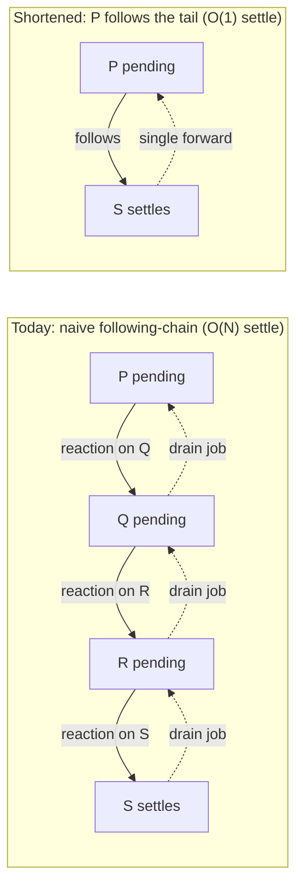

# Ironhorse Promise Resolution Chain Shortening

| | |
|---|---|
| **Created** | 2026-09-17 |
| **Author** | Kris Kowal (prompted) |
| **Status** | Reference |

> **Reference / exploratory.** This is a feasibility survey, not an
> implementation target. It surveys the current promise-resolution code in
> `rust/engine/ironhorse-vm` against tree `387ea6614` and reaches a
> **recommendation to defer** (§ Recommendation) with named trigger
> conditions. No code is proposed for landing now; the mechanism sketch
> (§ What shortening would mean here) exists so a future builder inherits a
> starting point rather than a blank page.

## What is the problem being solved?

When a promise `P` is resolved with another promise/thenable `Q`, and `Q`
is resolved with yet another `R`, and so on, a naive implementation builds
an ever-growing **following-chain**: settling the tail costs work
proportional to the chain length, and the intermediate promises are all
retained until the tail settles. Real engines (V8's "fast async" work is
the well-known precedent) implement **chain shortening** — collapsing a
`P → Q → R → …` following-chain so `P` points directly at the tail, making
settlement O(1) in chain length and keeping internal state bounded on a
long or cyclic-looking chain.

Two things make this worth a deliberate look for Ironhorse rather than a
reflexive port:

- **The metering doctrine** ([ironhorse-engine](ironhorse-engine.md)
  § Metering): every observable step should cost a deterministic, bounded
  computron amount. A resolution chain is exactly the kind of structure
  that could hide either a metering blind spot (settling for free) or a
  pathological worst case (unbounded internal growth). We need to establish
  which, if either, Ironhorse actually has.
- **Endo's CapTP / eventual-send usage**, where promise pipelining
  routinely chains resolutions — the realistic workload this optimization
  targets, not just a synthetic worst case. Whether that chaining is even
  *local to one VM* (and therefore shortenable in `promise.rs` at all) is
  the CapTP question below.

## Current state (surveyed, not assumed)

The in-VM promise implementation is a close port of Moddable **XS**
(`xsPromise.c`), living in
`rust/engine/ironhorse-vm/src/interp/natives/promise.rs`. XS uses the
naive per-link spec algorithm, and so, today, does Ironhorse. Concretely:

- **Representation.** A promise is an ordinary heap slot plus a side-table
  record `PromiseData` (`state`, `result`, `reactions: Vec<PromiseReaction>`,
  `ever_handled`) held in a `HashMap<SlotIndex, PromiseData>`
  (`PromiseData` in `interp.rs`; the `promises` table in `state.rs`). It is
  **not** a dedicated arena. Crucially, the `[[AlreadyResolved]]` guard is
  **not** in `PromiseData`: it lives per resolving-function *pair* in a
  separate `promise_guards: Vec<bool>`. A promise resolved with a thenable
  acquires a *second* resolving pair with its own fresh guard while staying
  pending — the **two-level guard structure** any collapse must preserve.
- **Resolving `P` with `Q`** (`settle_promise`). After the observable
  `Get(Q, "then")` probe (behind a native-try, so a throwing accessor
  rejects `P`), there are two branches:
  - **`Q` is a native promise with the intrinsic `then`** → **adoption**:
    a pass-through `User` reaction (whose `resolve`/`reject` are `P`'s
    second pair) is registered *on `Q`* via `register_native_reaction`.
    `P` stays pending; when `Q` settles, its drain job forwards the
    settlement to `P`. Adoption is **deliberately kept asynchronous even
    when `Q` is already settled** (the code comment is explicit).
  - **`Q` is an arbitrary callable thenable** → `adopt_thenable`, the
    `PromiseResolveThenableJob` equivalent: it builds `P`'s second pair and
    enqueues a count-3 `PromiseJob::Thenable`; at the drain,
    `run_thenable_job` calls `then.call(Q, resolve, reject)`.
- **No chain shortening exists.** An N-deep following-chain produces **N
  reactions + N FIFO microtask jobs**, drained one crank-cycle per link.
  Nothing copies an already-settled `Q`'s state directly into `P`, and
  nothing collapses `resolve(resolve(resolve(…)))` toward the tail. The
  only synchronous short-circuit in the file is
  `ReactionKind::CombineDirect` (a `Promise.all/any/allSettled` element
  fold, explicitly "not a promise-resolution boundary") — a precedent for
  the *shape* of a synchronous fold, not general shortening.
- **The handler-throw path is fully implemented.** `run_promise_job`
  routes a throwing reaction handler to *reject* the derived promise
  (`Err(thrown) => (thrown, true)`), and a throwing `then` rejects via the
  reject function. The note in
  [ironhorse-debugger-recovery-and-uncaught](ironhorse-debugger-recovery-and-uncaught.md)
  § Ironhorse Decisions that "Ironhorse's promise-reaction throw path is
  not implemented yet (`Halt::Unsupported("promise:handler-throw")`)" is
  **stale** as of `387ea6614`: no such label exists in `promise.rs` or the
  halt-label registry. This exploration assumes the promise implementation
  is as far along as the code shows, not as far as that note implies — a
  correction that removed one of the prompt's premises (chain shortening is
  *not* blocked on promise-reaction-throw landing; it already landed).

## The metering doctrine already bounds the worst case

This is the load-bearing finding for the recommendation. The prompt worried
about a "metering blind spot or a pathological worst case." Ironhorse has
**neither**, because the drain is metered per link:

- Each reaction job charges a full `PROMISE_JOB_FRAME_METERING` (393752) or
  `PROMISE_JOB_PASSTHROUGH_FRAME_METERING`; each thenable job charges
  `PROMISE_THENABLE_JOB_FRAME_METERING` (393216); adoption charges
  `PROMISE_RESOLVE_THENABLE_METERING` and slot allocations. An N-deep chain
  therefore costs a **deterministic ~O(N)·394k computrons**, not free work.
- `drain_promise_jobs` calls `check_meter()` **between every job** and
  returns `Halt::MeterAbort` on refusal. A pathological or cyclic-looking
  chain does not hang or grow unbounded — it is **charged per link and
  aborts deterministically** once the crank limit is reached. The armed
  embedder (`MeterBounds`, [ironhorse-engine](ironhorse-engine.md)
  § Metering) makes this the shipped behavior.

So today's cost is honest and bounded. The genuine residuals a collapse
would address are narrower than "blind spot / DoS":

1. **Retained state while pending.** A deep *pending* following-chain holds
   O(N) `PromiseData` records + O(N) guard entries alive until the tail
   settles (bounded by what the program created, but real).
2. **Settle latency and cost.** Settling the tail is O(N) crank-cycles and
   O(N)·394k computrons — a program that legitimately builds a deep chain
   pays linearly to unwind it, and may hit `MeterAbort` at a depth a
   collapsing engine would survive.
3. **Debugger legibility** (ties to the siblings below): the
   pending-promise panel would show N chained entries where a shortened
   chain is one.

## What shortening would mean here (mechanism sketch)

Against Ironhorse's index/side-table model specifically — not V8 in the
abstract — the minimal collapse is a **follow-target forward pointer**:

- Add an optional `follows: Option<SlotIndex>` to `PromiseData` (or a
  parallel side table), set when `P` adopts a native promise `Q`: instead
  of only registering a pass-through reaction on `Q`, record `P` follows
  `Q`. This is the `[[PromiseFollowing]]`/redirection idea in engine terms.
- **Path-compress at registration.** When `P` would adopt `Q` and `Q`
  already `follows` some `R` (i.e. `Q` is a pending forwarder), register
  `P`'s pass-through reaction on the **transitive tail** `R` and set
  `P.follows = R`, so `P → Q → R` collapses to `P → R`. Settling the tail
  then forwards to all followers in O(1)-per-follower rather than walking
  the chain link by link.
- **Preserve the two-level guard invariant.** The tail-collapse must still
  give `P` its own second resolving pair + fresh guard (the async-adoption
  and self-resolution-`TypeError` semantics depend on it); only the
  *forwarding topology* changes, never `P`'s guard identity.
- **Cost of the collapse operation itself** must be a metered, bounded
  charge (a new `PROMISE_FOLLOW_COMPRESS_METERING` weight per compressed
  link), so path compression cannot become a new unmetered step. Because
  compression removes per-link `PROMISE_JOB_FRAME_METERING` charges, the
  net computron total for a chain **drops** — which is precisely why this
  is a **meter-version-breaking change** (§ Metering interaction).
- **Precedents to build on, not invent:** `CombineDirect` shows the
  synchronous-fold shape; `compact_reaction_arenas` in `gc.rs` shows the
  live-set + `repoint` machinery for relocating resolution state under GC —
  a follow-pointer participates in the same compaction discipline.

**What must *not* be shortened:** a non-intrinsic `then` (own or inherited
override) — assimilation of a user thenable is observable and must run the
guest `then`. Only native promises with the intrinsic `then` (the existing
adoption branch's exact guard) are collapse-eligible.

## Metering interaction

Collapse changes the computron count of a chain (fewer jobs → fewer
charges) and changes the **observable microtask tick count** of the drain.
Under the accuracy-over-parity doctrine that is *permitted*, but it is not
free:

- It must ship as a new `ironhorse-meter-N` release with a re-pinned
  cost-table digest and an explicit golden-corpus update; snapshots refuse
  a meter-version mismatch, so this is a coordinated fleet change, not a
  silent optimization.
- The **oracle is result-only**, so XS-computron parity is not a gate — but
  results (settled value, error identity, and any *observable* ordering
  test262 pins) must be unchanged. The existing native-promise adoption
  branch already deviates one tick from the pure-spec `PromiseResolveThenableJob`
  path and mirrors XS; a collapse deepens that deviation, so its
  result/ordering transparency against the XS oracle and the test262
  promise-tick suite is the acceptance question, not its computron delta.

## CapTP interaction (explicitly not silently scoped away)

A chain that crosses a vat boundary **cannot be collapsed locally.**
`ironhorse-vm` is a single-realm engine with no vat/CapTP concept
(confirmed: no `vat`/`captp`/`handoff` references in the crate). CapTP
promise pipelining lives in separate packages (`packages/captp`,
`packages/thixotrope`, `packages/ocapn/src/captp`): a cross-vat resolution
arrives as a `CTP_RESOLVE` message whose handler settles a *local* promise;
the VM only ever sees local promises. Consequences:

- A VM-local follow-pointer shortens only **intra-vat** following-chains.
  The portion of a pipelined chain that lives on the far side of a vat
  boundary is opaque to it.
- **Cross-vat chain shortening is a different, harder problem** — promise
  **redirection / three-party handoff** at the CapTP/OCapN layer (forwarding
  a promise's resolution to a third vat without round-tripping the
  originator). That is out of scope for this VM-local design and should be
  flagged wherever CapTP pipelining performance is discussed; it is not
  solved by anything in `promise.rs`.

## Test coverage

- **Synthetic worst-case generator.** Build a depth-N native following-chain
  with `let p = new Promise(res => res(prev))` per link (note
  `Promise.resolve(nativePromise)` returns it unchanged and does *not*
  chain), then assert on settlement: (a) the settled value is correct;
  (b) the retained `promises`-table size and guard-arena length after the
  drain are **O(1)** with collapse vs **O(N)** without (the
  `reaction_arena_pruning.rs` harness already measures arena lengths across
  cranks — extend it); (c) the total computrons match the pinned
  meter-version golden vector; (d) a chain deep enough to `MeterAbort`
  without collapse survives with it (the concrete payoff).
- **Real pipelining fixtures.** Reuse `packages/captp` pipelining tests as
  the realistic workload to confirm the intra-vat portion collapses and the
  cross-vat portion is unaffected (and correct).
- **Passing bar under the metering doctrine:** computron-deterministic
  per release (differential harness + golden vectors stable), result parity
  with the XS oracle unchanged, and the meter-version bump landed with its
  corpus update. `hardened262` (available once
  endojs/endo-but-for-bots#1040 merges) is the vehicle for ratcheting the
  test262 promise-tick coverage this change most stresses.

## Recommendation

**Defer. Do not build deep chain collapse now.** Reasoning:

1. **The worst case is already bounded.** Per-link metering +
   between-job `MeterAbort` means there is no blind spot and no DoS — the
   premise that most motivated urgency does not hold at Ironhorse's model.
2. **It is not a parity gap.** Ironhorse is XS-derived; XS does not do
   V8-style collapse, so no oracle or conformance obligation demands it.
3. **The correct-and-cheap version is subtle.** The two-level guard
   structure + async-adoption + result/tick transparency against the oracle
   make a *correct* collapse real work, and it is a meter-version-breaking
   change requiring a coordinated `ironhorse-meter-N` bump.
4. **Conformance debt should land first.** There are 13 open promise
   defects (`F111`–`F129`, six of them P1) in
   [ironhorse-known-defects](ironhorse-known-defects.md) that are
   correctness gaps; shortening is an optimization on top of a surface that
   is not yet fully conformant.

**Build it only when** profiling of real CapTP-pipelining or agent
workloads shows deep *intra-vat* following-chains as a **measured** hotspot
(retained-promise pressure or `MeterAbort` at legitimate depths), and even
then scope it to the follow-pointer memory/latency win above — not a
speculative rewrite. The mechanism sketch is recorded here so that build
starts from a design, not from scratch.

## Open questions

- Does the existing native-promise adoption branch's one-tick deviation
  from the pure-spec `PromiseResolveThenableJob` path already sit inside a
  test262 skip/expectation, or does it pass because XS and Ironhorse agree?
  The answer bounds how much tick-observability headroom a deeper collapse
  has. (To be settled against the `hardened262` promise-tick corpus once
  endojs/endo-but-for-bots#1040 merges.)
- Is retained-promise pressure from pending following-chains observed in any
  real Endo/CapTP workload today, or is this purely theoretical? Without a
  measured hotspot the recommendation stays "defer".
- Should the debugger's pending-promise panel
  ([pass-style-promise](pass-style-promise.md) § Debug view;
  [ironhorse-panic](ironhorse-panic.md)) represent a following-chain as one
  logical entry regardless of whether the engine collapses it — i.e. is
  chain legibility a *debugger* concern that can be solved without a VM
  collapse at all?

## Alternatives considered

- **Collapse arbitrary (non-native) thenables.** Rejected: assimilating a
  user thenable runs the observable guest `then`; only the intrinsic-`then`
  native-promise case is safe to short-circuit.
- **Synchronous adoption of an already-settled source** (drop the forced
  async in the adoption branch). Rejected as part of *this* work: it changes
  observable ordering and is a separate spec-timing decision, not chain
  shortening.
- **Rely on GC arena compaction alone** (`compact_reaction_arenas`).
  Considered and rejected as sufficient: compaction bounds the *side arenas*
  but does not remove the O(N) `PromiseData`/guard records or the O(N)
  drain-cycle settle latency of a live pending chain.

## Dependencies and related designs

- [ironhorse-engine](ironhorse-engine.md) § Metering — the determinism
  doctrine any charge for collapse or per-link cost must fit inside; a
  collapse is a meter-version bump.
- [ironhorse-panic](ironhorse-panic.md) — a chain-shortening bug is a
  plausible source of the "reference error panics with heap frozen at the
  fault site" scenario; the `raise_js`/panic seam is adjacent to the
  reaction-throw path this design surveyed as already-landed.
- [ironhorse-debugger-recovery-and-uncaught](ironhorse-debugger-recovery-and-uncaught.md)
  — its stale "promise-reaction throw not implemented" note is corrected
  here; its pending-promise/unhandled-rejection concerns are the debugger
  side of the legibility open question.
- [pass-style-promise](pass-style-promise.md) § Debug view for long-pending
  promises — the debugger-panel tie-in.
- [ironhorse-known-defects](ironhorse-known-defects.md) `F111`–`F129` — the
  conformance debt that outranks this optimization.

## Prompt

Exploratory design: survey the feasibility and tradeoffs of promise
resolution chain shortening (V8 "fast async"–style collapse of
`P → Q → R → …` following-chains) for the Ironhorse engine — current state
of the promise implementation, the mechanism against Ironhorse's
index/side-table heap model, the CapTP cross-vat interaction, test coverage
under the metering doctrine, and a build/defer recommendation. Parked/
deferred, no urgency; deliverable is a design document or a shorter finding
if the survey concludes it is premature. No code.
