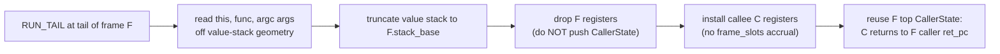

# Ironhorse Proper Tail Calls (PTC): Feasibility

| | |
|---|---|
| **Created** | 2026-09-17 |
| **Author** | Kris Kowal (prompted) |
| **Status** | Proposed |

Exploratory feasibility survey, not an implementation commitment. Its
verdict: **worth building, but sequenced with the debugger row, not
urgently** — because the two costs everyone expects (recognizing tail
position without breaking oracle byte-identity, and a frame
representation that can drop the caller) are *already paid* in the
current engine, and the test harness already carries the exact
oracle-substitute the feature needs.

## What is the Problem Being Solved?

ECMA-262 requires proper tail calls: a call in tail position of a strict
function must reuse the caller's frame so unbounded tail recursion runs
in bounded stack. Ironhorse's test262 skip list excludes
`tail-call-optimization`
([`DEFAULT_ENDOR_SKIP_FEATURES`](../rust/engine/ironhorse-262/src/xst.rs)),
mirroring XS's `xst262.c` `gxFeatures` exclusion — XS, the parity oracle,
has the tail-call *opcodes* but never reuses the frame, so a
`tail-call-optimization` case overflows XS's fixed 4096-slot stack.
Ironhorse skips-by-default for XS-parity.

But PTC is a real, spec-legal capability gap versus the *full language*,
not merely versus XS, and [ironhorse-engine](ironhorse-engine.md)'s
**accuracy-over-parity** doctrine already blesses exceeding XS where it is
cheap and correct — the `XS_CODE_RETHROW` hook and target-opcode-peek
classifier of
[ironhorse-debugger-recovery-and-uncaught](ironhorse-debugger-recovery-and-uncaught.md)
are precedent. This survey asks whether PTC is one of those cheap wins.

## Feasibility Verdict: cheaper than assumed

Two assumptions make PTC look invasive. The engine already refutes both.

### 1. Tail-position recognition already exists in oracle-locked bytecode

The compiler already emits a distinct opcode for tail calls. `code_return`
([`ironhorse-compile/src/coder.rs`](../rust/engine/ironhorse-compile/src/coder.rs),
XS's `fxReturnNodeCode` / `mxTailRecursionFlag`) marks the return
expression for tail emission when the return is **strict**,
**non-generator**, and its branch target is **not rerouted through a
`try`/`finally`** (`node.flags & STRICT != 0 && node.flags & GENERATOR ==
0 && self.targets[rt].original.is_none()`). The flag threads down through
`&&`, `||`, `??`, `?:`, and the comma operator (`code_and`, `code_or`,
`code_coalesce`, `code_question_mark`, `code_expressions`) to the actual
tail-position operand, which then emits the
`XS_CODE_RUN_TAIL` / `RUN_TAIL_1` / `RUN_TAIL_2` / `RUN_TAIL_4` (and
`XS_CODE_EVAL_TAIL`) family instead of `RUN` / `EVAL`.

This is XS's own behavior, transliterated byte-for-byte. **No compiler
change is needed and no oracle byte-identity is at risk** — the tail
opcodes are exactly the strict-mode spec tail positions, decided by the
same coder XS pins. Today the VM maps the whole `RUN_TAIL*` family to the
same match arm as `RUN*`
([`interp/dispatch.rs`](../rust/engine/ironhorse-vm/src/interp/dispatch.rs)):
the distinction is compiled but unused. PTC is precisely the act of giving
that arm a different frame path.

### 2. Ironhorse's frame model already separates the caller — dropping it is a *subtraction*

The engine-design prose ("frames are stack slots… fixed offsets… because
the debugger's frame walk observes that geometry",
[ironhorse-engine](ironhorse-engine.md) § Interpreter and dispatch) is a
simplification. The implemented model is a **hybrid split** — this is the
crux the debugger-conflict framing depends on, and it resolves in PTC's
favor:

- The **live** frame's registers (`locals`, `args`, `result`, `env`,
  `this_val`, `cur_func`, scope) are fields on `Interp`, not inline stack
  slots.
- **Suspended** frames are `CallerState` records in
  `call_stack: Vec<CallerState>`
  ([`interp/frames.rs`](../rust/engine/ironhorse-vm/src/interp/frames.rs)),
  each carrying the caller's saved registers plus its `ret_pc` and
  `stack_base`.
- The **value stack** (`self.stack`) holds only operands and the transient
  call geometry `[THIS, FUNCTION, RESULT, FRAME]` at a call *site*;
  `enter_call` moves args off it into `self.args` and `truncate`s.

So a frame is *already* a heap record in a `Vec`, not a region of a
contiguous C stack. An ordinary `enter_call` **pushes** a `CallerState`
and accrues `frame_slots` (the overflow accounting). A proper tail call is
the same entry with two deletions: **do not push** the suspended caller,
and **do not accrue** its slots.

Concretely, a `enter_call_tail` variant in `frames.rs`, dispatched from
the `RUN_TAIL*` arm:

1. Compute `base = stack.len() − argc − 4`; read `this`, `func`, `args`
   exactly as `enter_call` does. For a genuine tail return `base` equals
   the current frame's `stack_base` (the coder guarantees the tail
   expression is the whole return operand), so `truncate(base)` discards
   F's frame region.
2. **Do not** save F's registers into a new `CallerState`; **do not**
   `call_stack.push(...)`; **do not** add to `frame_slots`. The existing
   top `CallerState` already names F's caller's `ret_pc` and `stack_base`.
3. Overwrite the `Interp` live registers with C's fresh ones (scope, env,
   `args`, `this_val`, `cur_func`, `result = undefined`, strict flag),
   discarding F's.
4. Return C's `body_start`.

When C reaches `END`, `leave_call_to_frame_base` pops the reused
`CallerState`, truncates to F's caller's `stack_base`, and lands C's
result exactly where F's caller expected F's — control resumes at F's
caller directly. F never existed on the stack. The net cost of the feature
is **removing** two operations from the entry path, gated on an opcode the
compiler already distinguishes.

## Frame-walk, exception chain, and CatchJump across a reused frame

This is the conflict the brief flags as sharpest. It resolves because the
exception machinery binds to frames by an **index**, not by stack geometry.

- `CatchJump` ([`interp.rs`](../rust/engine/ironhorse-vm/src/interp.rs))
  records `call_depth` (the `call_stack` length when the `catch` was
  established) alongside `stack_len` / `locals_len`. Because a tail call
  **reuses** the slot rather than pushing, `call_depth` values for all
  *outer* handlers stay valid — the callee runs at the same depth the
  caller occupied.
- A genuine spec tail position has **no live handler in the reused
  frame**: `return f()` inside a `try` with a `catch`/`finally` is not a
  tail position, and the coder's `original.is_none()` guard already
  refuses to emit `RUN_TAIL` there. So at a correct `RUN_TAIL` there is no
  `CatchJump` with `call_depth == current depth`. **Belt-and-suspenders
  requirement:** `enter_call_tail` must drop any `jumps` entry whose
  `call_depth` equals the current depth before installing C (their
  `stack_len`/`locals_len` refer to F's now-discarded state); for
  well-formed bytecode this drops nothing, and it fails safe if the
  invariant is ever violated.
- **Frame walk (debugger).** The debugger row is **not on the branch** —
  no `ironhorse-debug` crate exists yet; it is being re-derived fresh (see
  [ironhorse-debugger-recovery-and-uncaught](ironhorse-debugger-recovery-and-uncaught.md)
  Part 1). The frame walk it will add reads `call_stack` + live registers,
  so a PTC-elided frame is simply **absent** from the walk — which is
  *spec-correct*: PTC means the caller frame is genuinely gone, and a stack
  trace showing fewer frames than XS is the accuracy-over-parity divergence
  the doctrine permits ("the Ironhorse debugger protocol may express state
  that xsbug cannot", engine § Debugger). Because the row is being written,
  not retrofitted, the only requirement is a **sequencing** one: the
  debugger build must be told frames can be tail-elided so it never
  synthesizes a phantom caller frame. This is the design's single real
  coupling and the reason for its recommended ordering.

## Metering interaction: provably neutral

Eliminating the frame push/pop **does not change** the computron count.

- The `RUN_TAIL*` family already maps to `WorkModel::CallArgs` — the exact
  same cost model as `RUN*`
  ([`ironhorse-vm/src/cost.rs`](../rust/engine/ironhorse-vm/src/cost.rs)).
- Frame push/pop is **not metered**: the call frame "lives on the value
  stack (metered by dispatch only)" (dispatch.rs, `XS_CODE_CALL`). Only
  opcode dispatch and built-in steps are charged; `frame_slots` is
  Rust-side overflow bookkeeping, invisible to the meter.

So a tail call charges identical computrons whether or not the frame is
reused, and the frozen per-release cost table (§ Metering) is untouched —
no `ironhorse-meter-N` bump is required. The **one** observable change is a
*result*, not a cost: a program that infinitely tail-recurses today aborts
with `Halt::StackOverflow` (as `frame_slots` crosses the fixed budget);
with PTC it runs unbounded, hitting the armed meter's `MeterAbort`
(a different halt kind) or completing. That is the spec-correct outcome,
and it is a deterministic per-release function of the meter policy.

## Snapshot / heap-format interaction: nil

PTC introduces no new machine state. A tail-reused frame is simply an
**absent** `call_stack` entry, so the `CallStack` snapshot table
([`ironhorse-snapshot`](../rust/engine/ironhorse-snapshot/src/format.rs),
`CANONICAL_ATOM_ORDER`) is merely *shorter*; the `Jumps` table is
unchanged. Nothing new must be represented. The brief's worry — "XS never
produces this shape" — is moot: Ironhorse's snapshot format is its own
`XS_M`-shaped container with its own discriminator (§ Snapshots), not
XS-byte-compatible, and no use case migrates a live XS heap (resolved
question 3). There is no XS snapshot of a PTC frame to import, and the
Rust-native writer already serializes whatever `call_stack` length results.

## Test262 validation without the oracle: the harness already carries it

The dual-run differential cannot validate PTC by agreement — XS overflows
where a PTC engine completes, so a real dual-run diverges **by design**.
The harness already has the exact substitute:

- A `tail-call-optimization` positive case (e.g.
  [`return/tco.js`](../packages/test262-runner/test262/test/language/statements/return/tco.js))
  is `flags: [onlyStrict]`, calls a function `$MAX_ITERATIONS` (100000)
  deep in tail position, and asserts completion (`assert.sameValue(callCount, 1)`).
- With PTC, Ironhorse completes; XS aborts with
  `XS_JAVASCRIPT_STACK_OVERFLOW_EXIT` (a resource abort). The harness
  classifies this as `Agreement::IronhorseOnlyComplete` and, via
  `oracle_host_aborted`, returns
  `Verdict::RunSkip("oracle-host-stack-limit")`
  ([`xst.rs`](../rust/engine/ironhorse-262/src/xst.rs), `evaluate_positive`)
  — an **oracle host limitation, explicitly not an Ironhorse
  over-acceptance**. The symmetric twin of the `ironhorse-aborted-limit`
  skip already exists for exactly this direction.
- Crucially, the case is still **single-engine validated**: the test's own
  `assert.sameValue(...)` runs *inside* Ironhorse. Had it failed, Ironhorse
  would throw `Test262Error` and the run would not be
  `IronhorseOnlyComplete`. So a `tail-call-optimization` case reaching
  `oracle-host-stack-limit` **is** a pass of the test's embedded contract,
  with the oracle unable to corroborate.

So validation needs no new oracle substitute: **remove
`"tail-call-optimization"` from `DEFAULT_ENDOR_SKIP_FEATURES`** (the
`--features-include` plumbing already supports opting it back in for
staging) and the 38 tagged cases self-validate single-engine. Two polish
items: (a) optionally promote the feature-tagged, host-stack-limit skip to
a positively-counted outcome (a `single-engine-covered` verdict) so these
read as passes, not skips, in the report; (b) conformance runs must keep
the meter unarmed (or a high limit) so the 100000-iteration loop is not
cut short by `MeterAbort` — an existing property of the runner, called out
so it is not silently violated.

## The one real correctness hazard: async/generator frames

The coder gate excludes generators but **not async functions**. A strict
async function's `return f()` carries `STRICT`, is not a generator, and its
target is a direct branch, so `code_return` marks it tail and the VM emits
`RUN_TAIL` (verified: an async body leads with `XS_CODE_START_ASYNC`, and
the non-`is_async_gen` return arm still flows through the tail-marking
path). This is harmless in XS (RUN_TAIL == RUN) but **a hazard for frame
reuse**: an async activation carries promise-resolution continuation state,
and reusing its frame for the callee would discard the resolve step
(async/generator nests run on the real thread via `step_async` /
`resume_generator`, frames.rs depth note). Per spec, an async function's
`return f()` is **not** in tail position anyway.

**Requirement:** `enter_call_tail` must additionally gate on the current
activation being an **ordinary synchronous function** — checkable from the
callee/current `FunctionInfo` async/generator flags — and fall back to a
normal `enter_call` (no reuse) otherwise. This makes the runtime path
robust to the coder's over-broad tail flag without a compiler change.
See Open questions.

## Recommendation

**Worth building; sequence it with the debugger row; not urgent.** The
implementation is a bounded, high-confidence VM-side change — one
`enter_call_tail` variant in `frames.rs` dispatched from the already-distinct
`RUN_TAIL*` / `EVAL_TAIL` arm — with **zero** compiler change, **zero**
metering change, **zero** snapshot change, and a test harness that already
carries both the validation carve-out and 38 ready cases. Its invasiveness
is low and its value (closing a real full-language conformance gap, in the
accuracy-over-parity spirit) is real, so it clears the "cheap and correct
to exceed XS" bar.

It is **not urgent** — consistent with its parked/deferred posting — and it
has exactly one coupling: the debugger frame-walk must be authored knowing
frames can be tail-elided. Since that row is being re-derived fresh (and is
the higher-priority stage-7 work), PTC should land **with or just after**
the debugger row, so the walk is designed for elided frames rather than
retrofitted. Building PTC *before* the debugger row is also safe (the walk
does not exist to break); the ordering is about not designing the walk in
ignorance of PTC, not a hard dependency.

## Dependencies

| Design | Relationship |
|---|---|
| [ironhorse-engine](ironhorse-engine.md) | PTC lives in § Interpreter and dispatch; the accuracy-over-parity § Metering doctrine authorizes exceeding XS; snapshot neutrality rests on § Snapshots |
| [ironhorse-debugger-recovery-and-uncaught](ironhorse-debugger-recovery-and-uncaught.md) | The debugger frame-walk (row not yet on the branch) is PTC's single coupling; sequence PTC with its recovery so the walk accounts for tail-elided frames |

## Phased Implementation

Small enough to be one builder slice; listed as steps, not separate PRs.

1. **VM tail-enter.** Add `enter_call_tail` to `frames.rs`; dispatch the
   `RUN_TAIL*` / `EVAL_TAIL` arm to it. Gate on ordinary-sync activation
   (fall back to `enter_call` for async/generator); drop any
   `call_depth == depth` `jumps` entry defensively.
2. **Unskip and validate.** Remove `"tail-call-optimization"` from
   `DEFAULT_ENDOR_SKIP_FEATURES`; run the 38 cases single-engine; confirm
   they land as `oracle-host-stack-limit` (or the new
   `single-engine-covered` outcome) with the meter unarmed.
3. **Metering-neutrality test.** Assert computron-exactness between a
   tail-recursive run and its non-tail transcription up to the point the
   non-tail version overflows — the same equal-computron bar shape the
   stepping seam holds.
4. **(Coordination, not code)** Feed the debugger-recovery build the
   requirement that a tail-elided frame is absent from the frame walk.

## Design Decisions

1. **No compiler change.** The oracle-locked coder already emits
   `RUN_TAIL*` in exactly the strict spec tail positions; PTC is a VM
   dispatch change on an opcode that already exists, preserving byte
   identity with the oracle.
2. **Reuse by subtraction.** The split frame model (registers on `Interp`,
   suspended frames in `call_stack`) means a tail call omits the
   `CallerState` push and `frame_slots` accrual — two deletions, not a new
   representation.
3. **Bind exceptions by `call_depth`, not geometry.** `CatchJump` indexes
   frames, so frame reuse leaves outer handlers valid; genuine tail
   positions carry no in-frame handler, enforced by the coder and
   double-checked at tail-enter.
4. **Metering neutrality is inherent, not engineered.** `RUN_TAIL*`
   already costs `CallArgs` and frame push/pop is unmetered, so no
   `ironhorse-meter-N` bump is needed; only the overflow *result* changes.
5. **Validation reuses `oracle-host-stack-limit`.** The harness already
   treats XS's stack-overflow abort on a source Ironhorse completes as an
   oracle host limitation, and the test's embedded assertions self-validate
   single-engine.
6. **Async frames are the one hazard**, gated at runtime rather than in the
   over-broad coder flag.

## Open questions

- Should the runtime async/generator guard be paired with **tightening the
  coder** so a strict async function's `return f()` does not emit
  `RUN_TAIL` at all? Doing so would perturb emitted bytecode and break the
  port's byte-identity acceptance bar against XS (which emits `RUN_TAIL`
  there), so the runtime guard is preferred — but confirm no other consumer
  reads the async `RUN_TAIL` as a semantic signal before finalizing.
- Is `EVAL_TAIL` (direct `eval` in tail position) ever a genuine
  frame-reuse opportunity, or should it always fall back to a normal frame?
  Direct eval installs a fresh scope over the caller's; reuse is likely
  unsafe and the conservative default is no reuse. Confirm against the
  `EVAL` dispatch path before implementing.
- Should the report gain a distinct `single-engine-covered` verdict for
  feature-tagged, oracle-host-limited passes, or is folding them into
  `oracle-host-stack-limit` acceptable coverage accounting?

## Prompt

> Exploratory design — survey feasibility and tradeoffs for Proper Tail
> Calls (PTC) in Ironhorse (endojs/endo-but-for-bots, branch `llm`); do not
> commit to implementation. Ironhorse's test262 skip list excludes
> `tail-call-optimization` mirroring XS's `gxFeatures`, but PTC is a real
> spec-legal gap versus the full language and the accuracy-over-parity
> doctrine has precedent for exceeding XS. Resolve the sharpest conflict
> first: the interpreter's XS-geometry frame invariant that the debugger's
> frame walk and the exception machinery observe, versus PTC not growing the
> frame stack. Cover feasibility in the current dispatch/stack model,
> metering interaction, snapshot-format interaction, test262 validation
> without the oracle's dual-run help, and a build/build-later/skip
> recommendation with reasoning. Deliverable: a design document (or a
> written-up finding if not worth pursuing). No code; deliberately
> parked/deferred. hardened262 (PR 1040) is available to ratchet parity and
> consolidate suites once merged.
