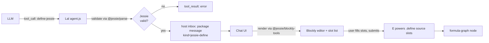

# Lal `define-jessie` Tool with Blockly Rendering

| | |
|---|---|
| **Created** | 2026-05-13 |
| **Author** | Kris Kowal (prompted) |
| **Status** | Proposed |

## What is the Problem Being Solved?

`@endo/lal` already exposes a `define(source, slots)` tool that lets the agent
propose JavaScript with named capability holes for the host to fill from their
own inventory.
The Chat UI renders the proposal in `define-form.js` as a Monaco editor over
the raw source plus a list of slots, and the host fills, edits, and submits.
This works, but the surface has two problems for non-programmer users:

1. The proposal language is unconstrained JavaScript.
   A Lal proposal may use ambient globals, control-flow that the host did not
   expect, or syntax the host cannot evaluate intuitively.
   Reviewing such a proposal is the same cognitive load as code review of
   arbitrary code, which is precisely what a capability-constrained UI ought
   to be able to avoid.
2. The text-editor presentation does not match the proposal model.
   A proposal is "this shape of expression with these slots", not "edit this
   program freely".
   A user who does not read JavaScript fluently has no way to validate the
   proposal before submitting it.

`endojs/Jessie` PR
[#127](https://github.com/endojs/Jessie/pull/127) lands a new
`packages/blockly-tools` with Blockly-based visual editors for the three
layered languages JSON, Justin, and Jessie.
The blocks are derived from the same grammars in
`packages/parse/src/quasi-*.js` that drive the textual checkers, and they
generate syntactically-valid source as users compose them.
Jessie itself is a confined subset of JavaScript that an Endo guest can
evaluate without the surface that makes free JavaScript hard to reason about
(no ambient globals, no `eval`, no `new Function`, no loops outside Justin
expressions).

This design proposes a `define-jessie` variant of Lal's `define` tool that
sits alongside the existing `define`.
A `define-jessie` proposal carries:

- Jessie source (validated against the Jessie checker from
  [endojs/Jessie#127](https://github.com/endojs/Jessie/pull/127)).
- The same `slots` shape as `define`.

The Chat UI renders a `define-jessie` proposal with the Blockly visual editor
from `@jessie/blockly-tools`, so the host sees the proposal as a tree of
labelled blocks with capability holes, edits it visually, and submits.
The result on the host side is identical to the existing `define` (a
formula-graph node with the host's chosen bindings), so the rest of the
system, follow-on use of the result, retention, GC, formula history, is
unchanged.

## Design

### Overview



The variant reuses every existing piece of plumbing.
The new code is:

- A `define-jessie` entry in Lal's tool registry (`packages/lal/agent.js`)
  with its own JSON schema and case in `executeTool`.
- A Jessie-validation step in that case, citing the checker from
  `@jessie/parse` (the parser/grammar surface that Jessie PR #127's blocks
  themselves build on).
- A new Chat UI component, `define-jessie-form.js`, that wraps
  `@jessie/blockly-tools`'s Jessie workspace and accepts/produces a
  `{ source, slots }` shape compatible with the existing `define-form.js`
  submit path.
- A small dispatch in `chat-bar-component.js` (or the equivalent message
  router) to pick `define-jessie-form` over `define-form` based on the
  proposal's tool name.

### Lal side: tool registration and validation

In `packages/lal/agent.js`, add a `define-jessie` entry to the tools array
immediately after `define`.
The shape mirrors `define` exactly, except for the tool name, the description
(which states the Jessie constraint and why), and the validation hook in
`executeTool`:

```js
// --- Define-Jessie (Jessie-only code with slots for host to fill) ---
{
  type: 'function',
  function: {
    name: 'define-jessie',
    description: `\
Same as define(), but the source must be a Jessie module. Jessie is a
confined subset of JavaScript without ambient globals, eval, new Function,
or unbounded loops outside Justin expressions. The host's Chat UI renders
this proposal as a visual block program (Blockly), which the host can
inspect and edit before filling slots and submitting.

Prefer define-jessie() over define() whenever the proposal fits inside
Jessie. The host's review burden is lower and the visual rendering helps
non-programmer hosts validate the proposal.

Example: Same as define(), but the source must parse as Jessie.
  define-jessie("E(counter).increment()", {"counter": {"label": "..."}})`,
    parameters: { /* identical to define */ },
  },
},
```

In `executeTool`, the `define-jessie` case parses with the Jessie checker
before forwarding to `E(powers).define`:

```js
case 'define-jessie': {
  const { source, slots } = args;
  if (source === undefined) {
    throw new Error('source is required');
  }
  if (slots === undefined) {
    throw new Error('slots is required');
  }
  // Validate against the Jessie grammar.
  const { parseJessie } = await import('@jessie/parse');
  try {
    parseJessie(source);
  } catch (parseError) {
    throw makeError(X`Jessie validation failed: ${q(parseError.message)}`);
  }
  // Tag the proposal so the host's Chat UI can route to the Blockly form.
  return E(powers).define(source, harden(slots), { language: 'jessie' });
}
```

The third argument to `E(powers).define` is the proposed extension point.
If the daemon's `define` cannot accept an extra argument without a wider
refactor, the alternative is to tag the proposal via the slots map itself
(a reserved `__language__` key) or to add a sibling `defineJessie` host
method that records the language tag in the resulting package message.
The recommended approach is to add an optional `options` parameter to
`define` rather than a sibling method, since the daemon-side machinery is
otherwise identical (see "Open questions" below for the host-API surface).

The Jessie checker import path (`@jessie/parse` vs
`@endojs/jessie-parse` vs whatever PR #127 lands) is pinned at design
time once Jessie #127 merges and publishes; see "Open questions".

### Host side: package message tagging

`define` today produces a daemon-side package message whose body contains
the source and the slot manifest.
The Chat UI's message-router today picks `define-form` for any package
message whose kind is `define`.

The minimum host-side change is to carry a `language: 'jessie'` tag on the
package message produced by a `define-jessie` proposal, so the Chat UI's
router can pick the Blockly form when `language === 'jessie'` and the
existing `define-form` otherwise.
The tag travels with the package message; nothing about retention, formula
construction, or eval on submit changes.

### Chat UI: `define-jessie-form.js`

A new component, `packages/chat/define-jessie-form.js`, mirrors the API of
`define-form.js`:

```js
/** @typedef {import('./define-form.js').DefineFormData} DefineFormData */
/** @typedef {import('./define-form.js').DefineFormAPI} DefineFormAPI */

/**
 * Create the Jessie-Blockly define form modal component.
 *
 * @param {object} options
 * @param {HTMLElement} options.$container
 * @param {(data: DefineFormData) => Promise<void>} options.onSubmit
 * @param {() => void} options.onClose
 * @returns {Promise<DefineFormAPI>}
 */
export const createDefineJessieForm = async ({ $container, onSubmit, onClose }) => { /* ... */ };
```

The component embeds the Jessie workspace from `@jessie/blockly-tools`.
Initial source from the LLM is parsed and reconstructed as a Blockly
workspace via Blockly's standard
[JSON serialization format](https://developers.google.com/blockly/guides/configure/web/serialization)
(the same format the PR #127 tests use as fixtures).
Slot variables in the source are surfaced as **slot blocks** in a dedicated
toolbox category; the user does not edit slot identifiers directly.

The slot list panel from the existing `define-form.js` is preserved
verbatim, since the slot model is identical; only the source editor differs.

#### Slot blocks

A slot in a Jessie program is a free variable in the source whose value the
host will bind at submit time.
In the Blockly workspace, slots appear as a custom block type
(`jessie_slot`) with a single dropdown field naming the slot and an output
shaped like a value (no statement plug).
The block's code generator emits the slot identifier as a bare reference.
Adding a slot in the slot panel adds a draggable instance of that block to
the toolbox; removing a slot removes the toolbox entry and (with
confirmation) any uses of the slot in the workspace.

This keeps slots in lockstep between the visual program and the slot panel
without needing a parallel free-variable analysis on the generated source.

#### Validation errors

Two validation surfaces:

1. **Lal-side validation** (above) catches a malformed proposal before it
   ever reaches the host's inbox.
   The LLM sees the validation error as a normal `tool_result` error and
   retries.
2. **Host-side editing** in the Blockly workspace cannot produce invalid
   Jessie by construction: the block grammar is a subset of Jessie's, and
   the code generator emits valid Jessie for any composable workspace.
   The exception is slot identifiers; a slot referenced in the workspace
   that has been removed from the slot panel produces a code-generation
   warning shown inline in the slot panel and blocks the submit button
   until the user resolves it.

A "View source" toggle in the form footer reveals the generated Jessie
source as read-only text, so power users can audit the rendering.
There is no "edit as text" mode in v1; if a user wants to free-edit, they
should use the existing `define` (the LLM should propose `define` instead
of `define-jessie` when the program does not fit the Jessie subset, and
the system prompt should say so).

### LLM system-prompt change

In `agent.js`'s `systemPrompt`, add a short paragraph after the existing
`define()` guidance:

> Prefer `define-jessie()` over `define()` when your proposed program is a
> Jessie module (no ambient globals, no `eval`/`new Function`, no loops
> outside Justin expressions). The host's review surface is lighter for
> Jessie proposals because the Chat UI renders them as visual block
> programs. Fall back to `define()` only when your program genuinely
> requires JavaScript features Jessie excludes.

### Dependencies

| Design | Relationship |
|--------|--------------|
| [lal-fae-form-provisioning](lal-fae-form-provisioning.md) | Defines the manager/worker split that owns Lal's tool surface. `define-jessie` is added to the same surface. |
| [chat-slot-slash-commands](chat-slot-slash-commands.md) | Sibling: a user-driven path for inlining anonymous values into slots. `define-jessie`'s slot panel uses the same slot-value model and benefits if slash-slot fillers are available. |
| [chat-markdown-render](chat-markdown-render.md) | Independent. Slot labels and the form's chrome use the standard Chat Markdown renderer. |
| [endojs/Jessie#127](https://github.com/endojs/Jessie/pull/127) | Upstream dependency. The `@jessie/blockly-tools` package and the underlying `@jessie/parse` checker land here. Implementation of this design waits on Jessie #127 merging and publishing the relevant packages. |

### Phased implementation

1. **Phase 1: Lal tool registration.**
   Add the `define-jessie` entry to `agent.js`'s tool array, the
   `executeTool` case, and the `@jessie/parse` import (gated on the Jessie
   package being published).
   The tool call works end-to-end through the existing `define-form` (the
   Chat UI does not yet know about `language: 'jessie'`).
   This phase is mergeable on its own and gives Lal a Jessie-validating
   tool even before the Blockly UI lands.

2. **Phase 2: Host-side language tag.**
   Extend `E(powers).define` (or the package-message construction
   downstream of it) to carry the `language` tag.
   Wire the Chat UI message-router to read the tag and choose between
   `define-form` and (still-stub) `define-jessie-form`.

3. **Phase 3: Blockly form component.**
   Implement `define-jessie-form.js`.
   Embed the `@jessie/blockly-tools` Jessie workspace.
   Wire slot blocks, source view toggle, and slot panel.
   Add the system-prompt nudge that steers the LLM towards
   `define-jessie`.

4. **Phase 4: Tests and docs.**
   Vitest fixtures from PR #127's `test/test-data.json` (where applicable)
   cover the source-to-workspace and workspace-to-source round trip.
   Update `packages/lal/primer/tools.md` to document `define-jessie`.
   Update `packages/chat`'s component index to list the new form.

Phases 1 and 2 are S-sized (one day each).
Phase 3 is M-sized (3 days; the Blockly integration is mostly wiring, but
the slot-block design needs care to keep the workspace and slot panel in
sync).
Phase 4 is S-sized (one day).

Total estimate: M-sized, ~5 days.

## Alternatives Considered

- **Replace `define` with `define-jessie` outright.**
  Rejected.
  The existing `define` is in use by Lal and removing it would break
  proposals that rely on JavaScript features Jessie excludes (e.g., a
  `for-of` loop over an array the agent has reason to believe is short).
  The two coexist; the system prompt steers the LLM towards
  `define-jessie` first, and the LLM falls back to `define` when needed.

- **Validate as Justin instead of Jessie.**
  Rejected.
  Justin is the pure-expression subset (no statements, no `const`/`let`,
  no imports), which is too narrow for most proposals.
  Jessie is the natural module-level subset; the Blockly tooling in PR
  #127 already supports it.
  If a Justin-only variant becomes useful later, it can be added as
  `define-justin` following the same pattern.

- **Render Jessie source in Monaco with a Jessie-aware linter rather than
  Blockly.**
  Rejected for v1.
  This addresses problem 1 (Jessie subset) but not problem 2 (text-editor
  presentation does not match the proposal model).
  Blockly is the documented user-facing tool from PR #127 and is the more
  ambitious bet on visual review.
  A Monaco-with-Jessie-linter mode could be added later as a power-user
  toggle without revisiting this design.

- **Embed the Blockly workspace inline in the chat message bubble rather
  than as a modal form.**
  Rejected for v1.
  The existing `define-form` is a modal because slot filling needs the
  user's full focus.
  Inline Blockly in the conversation flow is interesting (the proposal
  becomes part of the transcript visually), but it complicates editing,
  keyboard focus, and message threading.
  Worth revisiting once Phase 3 lands and we have real usage data.

- **Build Lal-specific Blockly blocks that bake in Endo capability
  references (e.g., a `lookup-petname` block) rather than reusing PR
  #127's vanilla Jessie blocks.**
  Rejected for v1.
  This couples Lal's tool surface to Blockly block definitions and
  diverges from the Jessie tooling that students and other Jessie users
  will share.
  v1 reuses PR #127's blocks unchanged, with capability holes surfaced as
  slot blocks.
  A future "capability-aware" block palette could be a follow-up design.

## Open Questions

These need maintainer input or an upstream landing before implementation
can start:

1. **`@jessie/parse` package name and checker API.**
   The Lal-side validation step imports a parser from
   `endojs/Jessie`'s `packages/parse`.
   PR #127 builds blocks against the grammars there; what does the
   checker's import path and call signature look like after PR #127 lands
   and is published?
   Worst case: bundle a small Jessie-validation function inside Lal
   itself, derived from the same grammar source.

2. **`E(powers).define` extension for the `language` tag.**
   Today `define(source, slots)`.
   The cleanest extension is a third optional `options` argument
   (`define(source, slots, options?)` with `options.language`), but this
   touches the daemon's `EndoGuest` interface.
   Alternative: encode the language tag in a reserved slot key
   (`{ __language__: { label: 'jessie' }, ...realSlots }`) to avoid the
   interface change.
   The recommended approach is the explicit `options` argument; the
   reserved-key alternative is the fallback if the daemon refactor is
   undesirable in the same PR cycle.

3. **`@jessie/blockly-tools` packaging for embedded use.**
   PR #127 ships a Vite app, not a library export.
   Embedding the Jessie workspace inside Chat needs either a library
   build of `@jessie/blockly-tools` (preferred) or a copy of the block
   and generator modules into `packages/chat` (less preferred; duplicates
   maintenance).
   Either way, the Chat UI's existing esbuild bundle absorbs the cost.

4. **Slot block design (custom block vs. variable block).**
   Blockly has built-in support for "variable" blocks; the proposed
   `jessie_slot` block is a custom alternative that ties slot identity
   to the slot panel rather than to Blockly's variable registry.
   The trade-off is between reusing Blockly's variable UX (familiar to
   Blockly users) and keeping the slot panel as the single source of
   truth for slot identity.
   The recommended approach is the custom `jessie_slot` block, but the
   maintainer may prefer the standard variable approach for consistency
   with PR #127's tooling.

5. **System-prompt steering effectiveness.**
   "Prefer `define-jessie` over `define` when ..." is a soft nudge.
   If LLMs systematically pick the wrong one, we may need a harder rule
   (e.g., reject `define()` proposals that would have validated as Jessie
   and return a tool error suggesting `define-jessie` instead).
   This is a Phase 4+ tuning question, not a blocker for the initial
   design.

## Prompt

> Draft a design under `packages/lal` (or `packages/chat`, designer's
> call) for a `define-jessie` variant of Lal's `define` tool. The variant
> validates the proposal as Jessie (per the parser/checker landing in
> endojs/Jessie#127) and the Chat UI renders the proposal using the
> Blockly visual editor from that same PR's new `packages/blockly-tools`.
> Cover: where the validation hook fits in Lal's tool-call routing, what
> the Chat UI needs (new component, Blockly integration, message
> rendering), how validation errors surface to the user, and whether the
> variant replaces or coexists with the existing `define`. Open in draft,
> design-only, no implementation.
