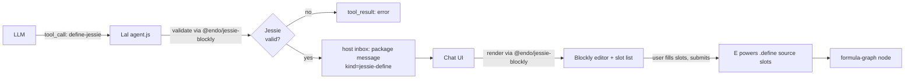

# Lal `define-jessie` Tool with Blockly Rendering

| | |
|---|---|
| **Created** | 2026-05-13 |
| **Updated** | 2026-05-14 |
| **Author** | Kris Kowal (prompted) |
| **Status** | Proposed |

## Background

This design uses terminology from several adjacent projects.
A reader new to Lal and the Endo monorepo can decode the rest of the
document from this glossary.

- **Lal**: the LLM-driven agent shipped in `@endo/lal` (`packages/lal/`).
  Lal proposes structured tool calls to the host on behalf of an LLM
  conversation; the host's Chat UI renders those proposals for human
  review before they execute.
- **The `define` tool**: a tool that Lal exposes to the LLM, taking a
  source string and a `slots` map of named capability holes the host
  fills from their own inventory.
  `define`'s proposal arrives in the host's inbox as a package message;
  the Chat UI renders it in `define-form.js` as a Monaco editor over the
  raw source plus a list of slots, and the host fills slots, optionally
  edits, and submits.
  On submit the proposal becomes a formula-graph node bound to the
  host's chosen slot values.
- **Jessie**: a confined subset of JavaScript that an Endo guest can
  evaluate safely (no ambient globals, no `eval`, no `new Function`, no
  loops outside Justin expressions).
  The Jessie grammar and parser live in `endojs/Jessie`.
- **Justin**: the pure-expression sub-language of Jessie (no statements,
  no `const`/`let`, no imports).
  Justin underpins Jessie's expression-level grammar but is too narrow
  for whole-module proposals.
- **Slots (= capability holes)**: named placeholders in a `define`
  proposal that stand in for capabilities the host owns.
  This document uses "slots" and "capability holes" interchangeably; the
  capability-hole framing is the original mental model from Endo's
  capability literature and the `slots` term is the in-code identifier.

## What is the Problem Being Solved?

`@endo/lal` already exposes a `define(source, slots)` tool that lets the agent
propose JavaScript with named capability holes for the host to fill from their
own inventory.
The Chat UI renders the proposal in `define-form.js` as a Monaco editor over
the raw source plus a list of slots, and the host fills, edits, and submits.
This works, but the surface has two problems for non-programmer users:

1. The proposal language is unconstrained JavaScript.
   A Lal proposal may use ambient globals, control-flow that the host did not
   expect, or syntax the host cannot evaluate intuitively.
   Reviewing such a proposal is the same cognitive load as code review of
   arbitrary code, which is precisely what a capability-constrained UI ought
   to be able to avoid.
2. The text-editor presentation does not match the proposal model.
   A proposal is "this shape of expression with these slots", not "edit this
   program freely".
   A user who does not read JavaScript fluently has no way to validate the
   proposal before submitting it.

`endojs/Jessie` PR
[#127](https://github.com/endojs/Jessie/pull/127) lands a new
`packages/blockly-tools` with Blockly-based visual editors for the three
layered languages JSON, Justin, and Jessie.
The blocks are derived from the same grammars in
`packages/parse/src/quasi-*.js` that drive the textual checkers, and they
generate syntactically-valid source as users compose them.
Jessie itself is a confined subset of JavaScript that an Endo guest can
evaluate without the surface that makes free JavaScript hard to reason about
(no ambient globals, no `eval`, no `new Function`, no loops outside Justin
expressions).

This design proposes a `define-jessie` variant of Lal's `define` tool that
sits alongside the existing `define`.
A `define-jessie` proposal carries:

- Jessie source (validated against the Jessie checker from
  [endojs/Jessie#127](https://github.com/endojs/Jessie/pull/127)).
- The same `slots` shape as `define`.

The Chat UI renders a `define-jessie` proposal with the Blockly visual editor
from a new `@endo/jessie-blockly` package (which vendors the upstream
Jessie tooling until it publishes), so the host sees the proposal as a
tree of labelled blocks with capability holes, edits it visually, and
submits.
The result on the host side is identical to the existing `define` (a
formula-graph node with the host's chosen bindings), so the rest of the
system, follow-on use of the result, retention, GC, formula history, is
unchanged.

Two surfaces change to support the variant:

- A new `language` option on `define` itself.
  `E(powers).define(source, slots, options?)` carries `options.language`
  so the Chat UI can route the proposal to the right renderer.
  The option is open-ended (`'jessie'` initially, room for future
  language tags) and the absence of the option is treated as the
  existing `define` behavior, so the change is fully back-compatible.
  See Open Question 2 for the maintainer-confirmed shape.
- A new `@endo/jessie-blockly` package that bundles the Jessie
  parser/checker and the Blockly workspace tools.
  See Open Question 3.

## Design

### Overview



Diagram key.
`JV` is the Jessie-validity gate (Lal's `parseJessie` call against the
proposed source).
`TR` is the `tool_result` error the LLM sees if `JV` rejects.
`HM` is the host's inbox package message that carries an accepted
proposal forward.
`BE` is the Blockly editor plus slot-list panel the host interacts with.
`Eval` is the `E(powers).define(source, slots)` call the host submits
once slots are filled.

The variant reuses every existing piece of plumbing.
The new code is:

- A new `@endo/jessie-blockly` package (`packages/jessie-blockly/`)
  that bundles the Jessie parser/checker and the Blockly workspace
  tools.
  Lal imports the parser from this package; the Chat package imports
  the Blockly workspace from the same place.
  The package vendors content from `endojs/Jessie#127` until that PR
  lands and `@jessie/parse` / `@jessie/blockly-tools` publish on npm,
  at which point `@endo/jessie-blockly` becomes a thin re-export.
- A `define-jessie` entry in Lal's tool registry (`packages/lal/agent.js`)
  with its own JSON schema and case in `executeTool`.
- A Jessie-validation step in that case, citing the checker from
  `@endo/jessie-blockly` (the parser/grammar surface that Jessie PR
  #127's blocks themselves build on, re-exported from the new package).
- A new Chat UI component in the Chat package,
  `packages/chat/define-jessie-form.js`, that wraps
  `@endo/jessie-blockly`'s Jessie workspace and accepts/produces a
  `{ source, slots }` shape compatible with the existing `define-form.js`
  submit path.
- A small dispatch in `chat-bar-component.js` (or the equivalent message
  router) to pick `define-jessie-form` over `define-form` based on the
  proposal's tool name.

### Lal side: tool registration and validation

In `packages/lal/agent.js`, add a `define-jessie` entry to the tools array
immediately after `define`.
The shape mirrors `define` exactly, except for the tool name, the description
(which states the Jessie constraint and why), and the validation hook in
`executeTool`:

```js
// --- Define-Jessie (Jessie-only code with slots for host to fill) ---
{
  type: 'function',
  function: {
    name: 'define-jessie',
    description: `\
Same as define(), but the source must be a Jessie module. Jessie is a
confined subset of JavaScript without ambient globals, eval, new Function,
or unbounded loops outside Justin expressions. The host's Chat UI renders
this proposal as a visual block program (Blockly), which the host can
inspect and edit before filling slots and submitting.

Prefer define-jessie() over define() whenever the proposal fits inside
Jessie. The host's review burden is lower and the visual rendering helps
non-programmer hosts validate the proposal.

Example: Same as define(), but the source must parse as Jessie.
  define-jessie("E(counter).increment()", {"counter": {"label": "..."}})`,
    parameters: { /* identical to define */ },
  },
},
```

In `executeTool`, the `define-jessie` case parses with the Jessie checker
before forwarding to `E(powers).define`:

```js
case 'define-jessie': {
  const { source, slots } = args;
  if (source === undefined) {
    throw new Error('source is required');
  }
  if (slots === undefined) {
    throw new Error('slots is required');
  }
  // Validate against the Jessie grammar.
  const { parseJessie } = await import('@endo/jessie-blockly');
  try {
    parseJessie(source);
  } catch (parseError) {
    throw makeError(X`Jessie validation failed: ${q(parseError.message)}`);
  }
  // Tag the proposal so the host's Chat UI can route to the Blockly form.
  return E(powers).define(source, harden(slots), { language: 'jessie' });
}
```

The third argument to `E(powers).define` is the agreed extension point:
`define(source, slots, options?)` with `options.language` (maintainer
decision 2026-05-14, see Open Question 2 below).
The reserved-slot-key and sibling-method alternatives were considered
and dropped in favor of the explicit `options` bag, which is also the
natural carrier for future per-proposal flags.

The Lal-side validator imports from `@endo/jessie-blockly`, the new
Endo-monorepo package that vendors the Jessie parser until upstream
publishes; see Open Question 3 below for the eject-back plan.

### Host side: package message tagging

`define` today produces a daemon-side package message whose body contains
the source and the slot manifest.
The Chat UI's message-router today picks `define-form` for any package
message whose kind is `define`.

The minimum host-side change is to carry a `language: 'jessie'` tag on the
package message produced by a `define-jessie` proposal, so the Chat UI's
router can pick the Blockly form when `language === 'jessie'` and the
existing `define-form` otherwise.
The tag travels with the package message; nothing about retention, formula
construction, or eval on submit changes.

### Chat UI: `define-jessie-form.js`

A new component, `packages/chat/define-jessie-form.js`, mirrors the API of
`define-form.js`:

```js
/** @typedef {import('./define-form.js').DefineFormData} DefineFormData */
/** @typedef {import('./define-form.js').DefineFormAPI} DefineFormAPI */

/**
 * Create the Jessie-Blockly define form modal component.
 *
 * @param {object} options
 * @param {HTMLElement} options.$container
 * @param {(data: DefineFormData) => Promise<void>} options.onSubmit
 * @param {() => void} options.onClose
 * @returns {Promise<DefineFormAPI>}
 */
export const createDefineJessieForm = async ({ $container, onSubmit, onClose }) => { /* ... */ };
```

The component embeds the Jessie workspace from `@endo/jessie-blockly`
(which vendors the upstream Jessie tooling until it publishes).
Initial source from the LLM is parsed and reconstructed as a Blockly
workspace via Blockly's standard
[JSON serialization format](https://developers.google.com/blockly/guides/configure/web/serialization)
(the same format the PR #127 tests use as fixtures).
Slot variables in the source are surfaced as **slot blocks** in a dedicated
toolbox category; the user does not edit slot identifiers directly.

The slot list panel from the existing `define-form.js` is preserved
verbatim, since the slot model is identical; only the source editor differs.

#### Slot blocks

A slot in a Jessie program is a free variable in the source whose value the
host will bind at submit time.
Two candidate representations land in Phase 3 behind a feature flag and
are bake-off-compared (see Open Question 4):

1. **Custom `jessie_slot` block.**
   A custom block type with a single dropdown field naming the slot and
   an output shaped like a value (no statement plug).
   The block's code generator emits the slot identifier as a bare
   reference.
   Adding a slot in the slot panel adds a draggable instance of that
   block to the toolbox; removing a slot removes the toolbox entry and
   (with confirmation) any uses of the slot in the workspace.
   Keeps slots in lockstep between the visual program and the slot
   panel without needing a parallel free-variable analysis on the
   generated source.

2. **Standard Blockly variable blocks.**
   Slots are surfaced through Blockly's built-in variable category, so
   the visual UX matches `endojs/Jessie#127`'s Blockly editor for users
   who have seen Jessie tooling elsewhere.
   The slot panel reflects the variable registry rather than acting as
   the source of truth.

The winner is picked in a follow-up commit on this design before Phase
3 freezes.

#### Validation errors

Two validation surfaces:

1. **Lal-side validation** (above) catches a malformed proposal before it
   ever reaches the host's inbox.
   The LLM sees the validation error as a normal `tool_result` error and
   retries.
2. **Host-side editing** in the Blockly workspace cannot produce invalid
   Jessie by construction: the block grammar is a subset of Jessie's, and
   the code generator emits valid Jessie for any composable workspace.
   The exception is slot identifiers; a slot referenced in the workspace
   that has been removed from the slot panel produces a code-generation
   warning shown inline in the slot panel and blocks the submit button
   until the user resolves it.
   Caveat: the by-construction claim depends on the block grammar
   shipped in `@endo/jessie-blockly` matching the Jessie grammar that
   `endojs/Jessie#127` settles on.
   The vendor package's `parseJessie` validator is the binding
   correctness check on the Lal side; Lal-side validation (above) is the
   contract that fails closed if the block grammar and the parser drift
   in `@endo/jessie-blockly`.

A "View source" toggle in the form footer reveals the generated Jessie
source as read-only text, so power users can audit the rendering.
There is no "edit as text" mode in v1; if a user wants to free-edit, they
should use the existing `define` (the LLM should propose `define` instead
of `define-jessie` when the program does not fit the Jessie subset, and
the system prompt should say so).

### LLM System-Prompt Change

In `agent.js`'s `systemPrompt`, add a short paragraph after the existing
`define()` guidance:

> Prefer `define-jessie()` over `define()` when your proposed program is a
> Jessie module (no ambient globals, no `eval`/`new Function`, no loops
> outside Justin expressions). The host's review surface is lighter for
> Jessie proposals because the Chat UI renders them as visual block
> programs. Fall back to `define()` only when your program genuinely
> requires JavaScript features Jessie excludes.

### Dependencies

| Design | Relationship |
|--------|--------------|
| [lal-fae-form-provisioning](lal-fae-form-provisioning.md) | Defines the manager/worker split that owns Lal's tool surface. `define-jessie` is added to the same surface. |
| [chat-slot-slash-commands](chat-slot-slash-commands.md) | Sibling: a user-driven path for inlining anonymous values into slots. `define-jessie`'s slot panel uses the same slot-value model and benefits if slash-slot fillers are available. |
| [chat-markdown-render](chat-markdown-render.md) | Independent. Slot labels and the form's chrome use the standard Chat Markdown renderer. |
| [endojs/Jessie#127](https://github.com/endojs/Jessie/pull/127) | Upstream dependency. The `@jessie/blockly-tools` package and the underlying `@jessie/parse` checker land here, eventually. Until they publish on npm (neither was published as of 2026-05-14), the new `@endo/jessie-blockly` package in this monorepo vendors the equivalent surface so this design is not gated on Jessie #127's merge timeline. |

### Phased Implementation

1. **Phase 0: `@endo/jessie-blockly` package.**
   Create `packages/jessie-blockly/` with the Jessie parser/checker and
   the Blockly workspace tools, vendored from `endojs/Jessie#127` (or
   re-bundled from scratch against the same grammars).
   The package exposes a `parseJessie` validator for Lal and a Blockly
   workspace factory for the Chat package.
   Mergeable on its own; gives downstream phases a single import surface.

2. **Phase 1: Lal tool registration.**
   Add the `define-jessie` entry to `agent.js`'s tool array, the
   `executeTool` case, and the `@endo/jessie-blockly` import.
   The tool call works end-to-end through the existing `define-form` (the
   Chat UI does not yet know about `language: 'jessie'`).
   This phase is mergeable on its own and gives Lal a Jessie-validating
   tool even before the Blockly UI lands.

3. **Phase 2: Host-side language tag.**
   Extend `E(powers).define` to accept the `options?` bag with
   `options.language` (per Open Question 2's resolution), and wire the
   package-message construction downstream to carry the tag.
   Wire the Chat UI message-router to read the tag and choose between
   `define-form` and (still-stub) `define-jessie-form`.
   Back-compat invariant: the new third parameter is optional and the
   daemon-side `EndoGuest.define` implementation treats an absent
   `options` argument identically to its prior two-argument behavior.
   Every existing two-argument caller of `E(powers).define` continues
   to work without change, and the package-message body carries no
   `language` tag in the absent-options case (so the Chat UI router
   defaults to `define-form`).

4. **Phase 3: Blockly form component in the Chat package.**
   Implement `packages/chat/define-jessie-form.js`.
   Embed the `@endo/jessie-blockly` Jessie workspace.
   Wire slot blocks, source view toggle, and slot panel.
   Add the system-prompt nudge that steers the LLM towards
   `define-jessie`.

5. **Phase 4: Tests and docs.**
   AVA fixtures from `endojs/Jessie#127`'s `test/test-data.json` (where
   applicable, mirrored into `@endo/jessie-blockly`) cover the
   source-to-workspace and workspace-to-source round trip.
   Add a Lal-side validation-error fixture that feeds a non-Jessie source
   (one with an ambient global, an `eval` call, or a `for-of` loop
   outside a Justin expression) to the `define-jessie` `executeTool`
   case and asserts the call surfaces a normal `tool_result` error whose
   message matches the `Jessie validation failed: ...` shape produced by
   `makeError(X\`Jessie validation failed: ${q(parseError.message)}\`)`.
   This fixture pins the design's claim that the LLM sees the validation
   error as a tool error and retries.
   Update `packages/lal/primer/tools.md` to document `define-jessie`.
   Update `packages/chat`'s component index to list the new form.

Phase 0 is S-sized (one day; the package is mostly vendoring and a
build wire-up).
Phases 1 and 2 are S-sized (one day each).
Phase 3 is M-sized (3 days; the Blockly integration is mostly wiring,
but the slot-block design needs care to keep the workspace and slot
panel in sync).
Phase 4 is S-sized (one day).

Total estimate: M-sized, ~6 days (Phase 0 adds one day for the
`@endo/jessie-blockly` package; the original ~5-day estimate is
otherwise intact).

## Alternatives Considered

- **Replace `define` with `define-jessie` outright.**
  Rejected.
  The existing `define` is in use by Lal and removing it would break
  proposals that rely on JavaScript features Jessie excludes (e.g., a
  `for-of` loop over an array the agent has reason to believe is short).
  The two coexist; the system prompt steers the LLM towards
  `define-jessie` first, and the LLM falls back to `define` when needed.

- **Validate as Justin instead of Jessie.**
  Rejected.
  Justin is the pure-expression subset (no statements, no `const`/`let`,
  no imports), which is too narrow for most proposals.
  Jessie is the natural module-level subset; the Blockly tooling in PR
  #127 already supports it.
  If a Justin-only variant becomes useful later, it can be added as
  `define-justin` following the same pattern.

- **Render Jessie source in Monaco with a Jessie-aware linter rather than
  Blockly.**
  Rejected.
  Deferred to a possible later power-user toggle; not in v1.
  This addresses problem 1 (Jessie subset) but not problem 2 (text-editor
  presentation does not match the proposal model).
  Blockly is the documented user-facing tool from PR #127 and is the more
  ambitious bet on visual review.
  A Monaco-with-Jessie-linter mode could be added later as a power-user
  toggle without revisiting this design.

- **Embed the Blockly workspace inline in the chat message bubble rather
  than as a modal form.**
  Rejected.
  Deferred to a possible later iteration; not in v1.
  The existing `define-form` is a modal because slot filling needs the
  user's full focus.
  Inline Blockly in the conversation flow is interesting (the proposal
  becomes part of the transcript visually), but it complicates editing,
  keyboard focus, and message threading.
  Worth revisiting once Phase 3 lands and we have real usage data.

- **Build Lal-specific Blockly blocks that bake in Endo capability
  references (e.g., a `lookup-petname` block) rather than reusing PR
  #127's vanilla Jessie blocks.**
  Rejected.
  Deferred to a possible follow-up design; not in v1.
  This couples Lal's tool surface to Blockly block definitions and
  diverges from the Jessie tooling that students and other Jessie users
  will share.
  v1 reuses PR #127's blocks unchanged, with capability holes surfaced as
  slot blocks.
  A future "capability-aware" block palette could be a follow-up design.

## Open Questions

These need maintainer input or an upstream landing before implementation
can start:

1. **`@jessie/parse` package name and checker API.** Resolved
   2026-05-14: as of this date, `@jessie/parse` is not on npm
   (`npm view @jessie/parse` returns 404), and `endojs/Jessie#127` has
   not yet landed.
   The Lal-side validation step therefore depends on whichever Jessie
   parser surface lands first.
   Practical path: bundle the validator inside the new
   `@endo/jessie-blockly` package (see Q3 below) so Lal can import the
   parser and the Chat UI can import the blocks from the same place.
   When the upstream Jessie packages publish, `@endo/jessie-blockly`
   re-exports the upstream parser and the eventual eject-back is a
   single-package rename rather than two.

2. **`E(powers).define` extension for the `language` tag.** Resolved
   2026-05-14: extend `define` with an optional options bag, so the
   signature becomes `define(source, slots, options?)` with
   `options.language`.
   The reserved-slot-key alternative is dropped.
   The daemon-side `EndoGuest` interface change is in scope for this
   prototype; the same `options` bag is the natural carrier for future
   per-proposal flags (e.g. confinement hints, presentation hints) so
   the cost is paid once.

3. **Packaging the Blockly tools for embedded use.** Resolved
   2026-05-14: create a new `@endo/jessie-blockly` package in
   `packages/jessie-blockly/` to keep this prototype moving while the
   upstream Jessie tooling stabilizes.
   The package bundles the Jessie parser/checker and the Blockly
   workspace tools that Lal and the Chat package need, vendored from
   `endojs/Jessie#127` until that PR lands and the upstream packages
   publish.
   The Chat UI's existing esbuild bundle absorbs the cost.
   Once `@jessie/parse` and `@jessie/blockly-tools` publish on npm,
   `@endo/jessie-blockly` becomes a thin re-export and can be ejected
   back out of the Endo monorepo with a single-package rename.

4. **Slot block design (custom block vs. variable block).** Resolved
   2026-05-14: run a bake-off of the two implementations under Phase 3
   rather than picking on paper.
   Build both variants behind a feature flag in `define-jessie-form.js`:
   one wires `jessie_slot` as a custom block keyed to the slot panel,
   the other reuses Blockly's standard variable blocks keyed to the
   variable registry.
   Compare on three axes: (a) consistency with `endojs/Jessie#127`'s
   tooling for users who have seen Jessie's editor elsewhere, (b)
   round-trip stability between the slot panel and the workspace under
   slot rename and removal, and (c) the size of the implementation in
   `@endo/jessie-blockly`.
   Run the bake-off on at least three real proposals (the slot-heavy
   counter example, a small Lal-defined formula, and one capability
   composition) and pick the winner in a follow-up commit on this
   design before Phase 3 freezes.
   The fallback if both work is to ship the standard variable approach
   for consistency with PR #127's tooling.

5. **System-prompt steering effectiveness.**
   "Prefer `define-jessie` over `define` when ..." is a soft nudge.
   If LLMs systematically pick the wrong one, we may need a harder rule
   (e.g., reject `define()` proposals that would have validated as Jessie
   and return a tool error suggesting `define-jessie` instead).
   This is a Phase 4+ tuning question, not a blocker for the initial
   design.

## Prompt

> Draft a design under `packages/lal` (or `packages/chat`, designer's
> call) for a `define-jessie` variant of Lal's `define` tool. The variant
> validates the proposal as Jessie (per the parser/checker landing in
> endojs/Jessie#127) and the Chat UI renders the proposal using the
> Blockly visual editor from that same PR's new `packages/blockly-tools`.
> Cover: where the validation hook fits in Lal's tool-call routing, what
> the Chat UI needs (new component, Blockly integration, message
> rendering), how validation errors surface to the user, and whether the
> variant replaces or coexists with the existing `define`. Open in draft,
> design-only, no implementation.
