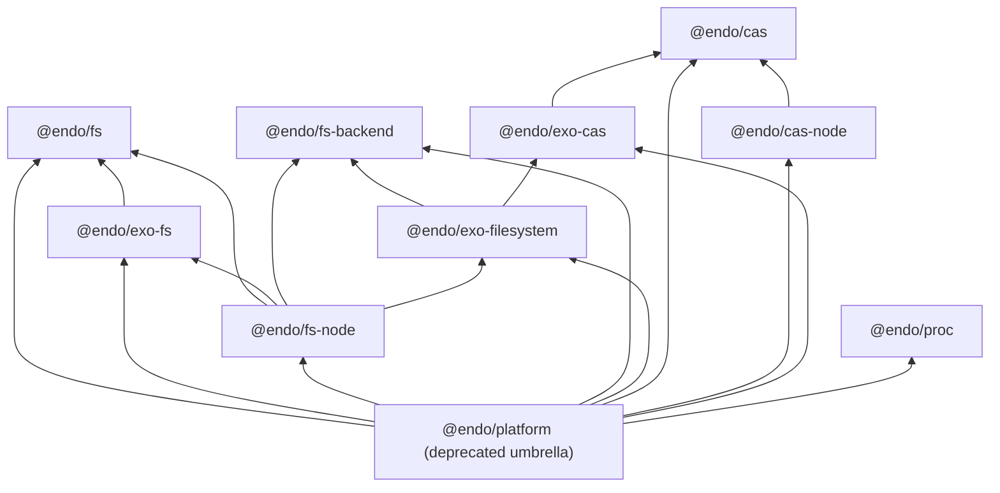

# Explode `@endo/platform` into per-dimension endo/exo package pairs

| | |
|---|---|
| **Created** | 2026-07-10 |
| **Author** | Kris Kowal (prompted) |
| **Status** | Not Started |
| **Source** | Garden job `design-explode-platform-into-dimension-packages` |

## Summary

`@endo/platform` has grown into a monolith holding several unrelated platform
dimensions behind one package boundary. This design splits it into focused
packages, one per dimension actually present in its source, each shipped as a
parallel pair: a plain `@endo/<dim>` package (pure logic and platform binding,
no exo machinery) and an `@endo/exo-<dim>` package (the passable facet:
interface guards and `makeExo` factories). The split follows the precedent
already in the tree: `@endo/http-confine` (pure core) under
`@endo/exo-http-client` (passable facet). `@endo/platform` survives the
transition as a thin, deprecated umbrella of one-line re-export shims so no
consumer breaks mid-flight; its removal is reserved for a next-major bump.

## What is the Problem Being Solved?

One package currently hosts four unrelated surfaces: a content-addressed
snapshot model, its Node.js powers, a pipelinable `Filesystem` capability with
pluggable backends, and child-process helpers. Consequences:

- **Dependency over-coupling.** A consumer that wants only `systemCapture`
  (`packages/chat/vite-endo-plugin.js`) drags in `@endo/exo`,
  `@endo/exo-stream`, `@endo/stream-node`, and the whole filesystem surface.
- **No enforced endo/exo seam.** Exo minting is scattered: `snapshot-store.js`
  and `fs-node/local-blob.js` call `makeExo` directly inside otherwise-plain
  modules, so there is no package boundary a pure consumer can stand behind,
  unlike the `http-confine` / `exo-http-client` pair.
- **A leaky deep-wildcard export.** `"./fs/extended/*": "./src/fs/extended/*"`
  exposes every source file as public API; consumers already import
  `shared/helpers.js` and `type-guards.js` directly, so the package has no
  meaningful interior.
- **The extended surface already wants out.** `src/fs/extended/DESIGN.md`
  describes itself as a standalone package, and
  [endo-fs-backend-seam](endo-fs-backend-seam.md) already built the internal
  three-layer seam (pure `FsBackend` protocol below, exo upper layer above)
  that this split promotes to a package boundary.

## The dimensions, derived from source

The original prompt guessed `fs`, `cas`, `net`, `http`. The source says
otherwise. From `packages/platform`'s `exports` map and `src/` layout:

| Dimension | Source today | What it is |
|---|---|---|
| fs, snapshot tier ("lite") | `src/fs/` | Content-addressed snapshot model: `SnapshotStore` / `SnapshotBlob` / `SnapshotTree` types and method suites, `checkin` / `checkout`, `reader-byte-length` |
| fs, exo facet | `src/exo-fs.js` + `src/fs/interfaces.js` | `makeSnapshotBlob` / `makeSnapshotTree` exo factories and the `@endo/patterns` interface guards |
| fs, Node binding | `src/fs-node/` | `local-blob`, `local-tree`, `tree-writer` (Node-backed snapshot powers) and `content-store-powers` |
| fs, extended | `src/fs/extended/` | The pipelinable `Filesystem` capability: pure `FsBackend` protocol plus backends below, `wrapBackend` exo upper layer plus combinators (`compose`, `layer`, `readonly`, `cached-fs`) above |
| cas | `src/fs/extended/cas.js`, `src/fs-node/content-store-powers.js`, `src/fs/extended/shared/blobref.js` | Content-addressed store: the `makeMemoryCas` / `cacheBackedRead` consumer, the `ContentStoreFilePowers` / `ContentStoreCryptoPowers` contracts (typedefs currently in `src/fs/types.d.ts`), and the passable `BlobRef` handle |
| proc | `src/proc.js` | Child-process helpers: `systemCapture`, `waitForExit`, `waitForMessage`, `waitForSpawn`, `waitForExitOrCancel` |

**Findings that reshape the prompt:**

- **There is no `net` or `http` dimension in `@endo/platform`.** Those already
  shipped as the exploded pair `@endo/http-confine` + `@endo/exo-http-client`.
  They are the precedent for this design, not part of its work.
- **`cas` is real but not a top-level export.** It is smeared across three
  files in two directories, and its filesystem-backed store already escaped to
  `@endo/daemon-cas` ("extracted as an intermediate seam before the Phase 5
  Rust CAS swap"). Consolidating the remaining contract, memory
  implementation, Node powers, and passable handle is part of this split.
- **`proc` has no exo facet and should not grow one here.** Its passable
  process-facing relatives already exist as their own packages
  (`@endo/exo-shell`, `@endo/host-spawner`, `@endo/endo-fs-exec`).

## The endo/exo boundary rule

The load-bearing rule, applied uniformly (mirroring `http-confine` /
`exo-http-client`):

> `@endo/<dim>` defines **no** interface guards and calls **no** exo maker.
> `@endo/exo-<dim>` owns every `M.interface` guard and every `makeExo` /
> `Far` call for the dimension, and depends on `@endo/<dim>` for the method
> suites and types it wraps.

Two clarifications the current code forces:

1. **Method suites are the seam.** `exo-fs.js` already has the right shape:
   `makeSnapshotBlob(store, sha256)` wraps a plain method suite
   (`snapshotBlobMethods`) in an exo. The split extracts the stray `makeExo`
   call sites out of `snapshot-store.js`, `local-blob.js`, `local-tree.js`,
   and `tree-writer.js` into the exo package, leaving plain method-suite
   factories behind.
2. **Platform-binding packages may consume exo factories but define none.**
   `@endo/fs-node` mints `LocalBlob` / `LocalTree` by composing its Node-backed
   method suites with `@endo/exo-fs` factories. The endo/exo axis (who defines
   guards and exos) is orthogonal to the platform axis (who imports `node:*`).

## Target package set

| Package | Contents (moved from `packages/platform/src/`) | Workspace dependencies |
|---|---|---|
| `@endo/fs` | `fs/` snapshot model minus `interfaces.js` and the `makeExo` sites in `snapshot-store.js`; scalar helpers such as `toSafeNumber` (from `fs/extended/shared/helpers.js`); the snapshot-side typedefs of `fs/types.d.ts` | errors, harden, stream, exo-stream, base64, hex, eventual-send |
| `@endo/exo-fs` | `exo-fs.js`, `fs/interfaces.js`, the exo-minting factory extracted from `snapshot-store.js`, plus `LocalBlob` / `LocalTree` / `ReadableBlobRange` guards and factories extracted from `fs-node/` | fs, exo, patterns, harden |
| `@endo/fs-node` | `fs-node/` method suites (`local-blob`, `local-tree`, `tree-writer`) minus exo minting; later (child C4) also `fs/extended/backends/node-fs-backend.js` as `./backend` and the `node-fs.js` / `node-fs-module.js` conveniences | fs, exo-fs, stream-node, hex, harden, base64, exo-stream; after C4 also fs-backend, exo-filesystem |
| `@endo/fs-backend` | `fs/extended/backend-types.js`, `backends/in-memory-backend.js`, `backends/from-mount-backend.js`, and the pure parts of `fs/extended/shared/` (`path-tables`, `stat-table`, `qid`, scalar helpers not claimed by `@endo/fs`) | errors, eventual-send, harden |
| `@endo/exo-filesystem` | `fs/extended/wrap-backend.js`, `type-guards.js`, `attach.js`, the combinators (`compose.js`, `layer.js`, `readonly.js`, `cached-fs.js`, `in-memory.js`, `from-mount.js`, and their `*-module.js` twins except the node ones), the exo-defining `shared/` modules (`cursor-exo`, `watcher-exo`, `xattrs-exo`, `lock-table`), and the passable-bytes plumbing from `shared/helpers.js` (`walk`, `collectBytes`, `collectStream`, `makeBytesReaderFromBytes`) | fs-backend, exo-cas, exo, exo-stream, patterns, errors, eventual-send, base64, harden |
| `@endo/cas` | `fs/extended/cas.js` (`makeMemoryCas`, `cacheBackedRead`) plus the `ContentStoreFilePowers` / `ContentStoreCryptoPowers` typedefs lifted out of `fs/types.d.ts` | errors, eventual-send, exo-stream, harden |
| `@endo/cas-node` | `fs-node/content-store-powers.js` | cas, stream-node, hex, harden |
| `@endo/exo-cas` | `fs/extended/shared/blobref.js` plus `BlobRefInterface` lifted from `type-guards.js` | cas, exo, patterns, base64, errors, harden |
| `@endo/proc` | `proc.js`, verbatim | harden |
| `@endo/platform` | Nothing but one-line re-export shims (below) | all nine packages above |

Any `fs/extended` module not named above follows the rule mechanically: it
defines guards or exos, so it goes to `@endo/exo-filesystem`; it imports
`node:*`, so it goes to `@endo/fs-node`; otherwise it goes to
`@endo/fs-backend`.

`@endo/daemon-cas` is repointed from `@endo/platform` to `@endo/cas` +
`@endo/cas-node` (it consumes `ContentStoreFilePowers` and the Node powers
factory) but otherwise stays as it is; folding or renaming it is out of scope
(tracking follow-up: to be filed).

### Known wart carried forward

`blobref.js` and `content-store-powers.js` import `node:crypto` for SHA-256.
The moves in this design are verbatim, so `@endo/exo-cas` initially carries a
`node:crypto` import even though nothing else about it is Node-bound. Injecting
a digest power (so `@endo/exo-cas` and `@endo/exo-filesystem` become
browser-usable) is a deliberate follow-up design, to be filed; it is not part
of this split because sync-versus-async hashing changes call shapes.

## Compatibility: the deprecated umbrella

**No consumer breaks at any point in the split.** Thirteen workspace packages
import `@endo/platform/...` today (daemon, cli, chat, agentry, agent-tools,
9p-server, exo-git, git, genie, lal, space-file-explorer, endo-fs-exec,
daemon-cas). The transition:

1. **Hollow, do not delete.** Each tranche moves module bodies into the new
   packages and replaces every moved file under `packages/platform/src/` with
   a one-line shim (`export * from '@endo/fs';`, or the narrower named
   re-export where the file held only part of a new package's surface; `.d.ts`
   shims re-export types the same way). The `exports` map keeps every current
   subpath, including the `./fs/extended/*` wildcard, because the file tree
   keeps its shape; only file bodies hollow out.
2. **Deprecate at birth.** The umbrella's `description` and README state that
   it is a transitional re-exporter and name the focused package for each
   subpath. A changeset accompanies the first tranche recording the
   deprecation policy.
3. **Repoint incrementally.** Consumers migrate per package in the final
   orchestration child (and opportunistically sooner); each repoint is
   mechanical per the table below.
4. **Remove at next major.** The umbrella's deletion is reserved for a
   next-major bump with a changeset note. Because `@endo/platform` is
   `"private": true` there are no external consumers, so the practical gate is
   in-repo: a grep for `@endo/platform` under `packages/` (excluding the
   umbrella itself) returning zero hits.

This is deliberately consistent with
[inter-package-plain-re-exports](inter-package-plain-re-exports.md) (#543):
the umbrella is a plain re-exporter, which that design classifies as an
anti-pattern, and its prescribed staging (repoint importers, deprecate the
re-exports, then remove them) is exactly the transition above. The umbrella is
never a durable surface; it exists to make the split additive.

### Consumer repoint map

| Old import | New import |
|---|---|
| `@endo/platform/fs` (conditional, Node-only today) | `@endo/fs-node` |
| `@endo/platform/fs/lite` | `@endo/fs` |
| `@endo/platform/fs/lite/types`, `.../types.js` | `@endo/fs/types` |
| `@endo/platform/fs/node` | `@endo/fs-node` |
| `@endo/platform/exo-fs` | `@endo/exo-fs` |
| `@endo/platform/proc` | `@endo/proc` |
| `@endo/platform/fs/extended` (index) | `@endo/exo-filesystem` |
| `@endo/platform/fs/extended/backend-types.js` | `@endo/fs-backend` |
| `@endo/platform/fs/extended/type-guards.js` | `@endo/exo-filesystem/type-guards` |
| `@endo/platform/fs/extended/{in-memory,from-mount,readonly,layer,cached-fs}.js` | `@endo/exo-filesystem` (named exports) |
| `@endo/platform/fs/extended/{node-fs,node-fs-module}.js` | `@endo/fs-node` |
| `@endo/platform/fs/extended/cas.js` | `@endo/cas` |
| `@endo/platform/fs/extended/shared/blobref.js` | `@endo/exo-cas` |
| `@endo/platform/fs/extended/shared/helpers.js` | split: scalar helpers from `@endo/fs`, bytes/walk porcelain from `@endo/exo-filesystem` |

## Package scaffolding

Each new package clones the shape of `packages/http-confine` /
`packages/exo-http-client`, adjusted to platform's current conventions:

- **`package.json`**: `"type": "module"`, `"private": true` and version
  `0.1.0` matching platform today, explicit `exports` map with `types`
  conditions and **no deep wildcard** (the wildcard dies with the umbrella;
  every public module is an enumerated subpath), workspace `dependencies` per
  the table above, the standard `scripts` block (`lint:types` via `tsc`,
  `test` via ava), `"extends": ["plugin:@endo/internal"]` eslint config.
- **tsconfig**: per-package `tsconfig.json` + `tsconfig.build.json` copied
  from platform's; `tsconfig.composite.json` is generated, so each tranche
  reruns `scripts/generate-composite-tsconfigs.mjs` after editing workspace
  dependency edges.
- **Workspace wiring**: the root `workspaces: ["packages/*"]` glob picks the
  new directories up automatically. The lockfile update lands as its own
  `chore: Update yarn.lock` commit per the repo's retcon discipline.
- **Tests relocate with their subjects**: `local-blob.test.js` and
  `snapshot-hash.test.js` to `@endo/fs-node` / `@endo/fs`; `blobref.test.js`
  to `@endo/exo-cas`; `cas.test.js` to `@endo/cas`; the extended suite
  (`wrap-backend*`, `in-memory`, `node-fs`, `from-mount`, `compose`, `layer`,
  `readonly`, `cached-fs`, `cursor`, `lock`, `watch`, `pipeline*`,
  `optimal-querying`, `configurations`, `shared-helpers`) to
  `@endo/exo-filesystem`, except the node-backed cases which land in
  `@endo/fs-node`. `test/_captp-pair.js` is duplicated-or-shared as a tiny
  test helper where needed.
- **Green gates per tranche**: repo-wide `yarn build`, `yarn lint`
  (types + eslint), and `yarn test` pass at every child's completion, not just
  at the end.

## Execution plan: an orchestration

This is a multi-part refactor, so it runs as one **orchestration job** over
**serial** parked children with `--on-child-failure halt` (per the garden's
standing decomposition pattern). Serial order respects the dependency arrows:
`exo-cas` must exist before `exo-filesystem` moves, and the fs trio must exist
before `fs-node` absorbs the extended node pieces.

| Child | Work | Size |
|---|---|---|
| C1 | `@endo/proc`: move `proc.js`, hollow the shim, repoint nothing yet. Proves the umbrella pattern end to end on the smallest dimension. | S |
| C2 | `@endo/fs` + `@endo/exo-fs` + `@endo/fs-node` (snapshot tier only): extract the `makeExo` sites per the boundary rule, move `toSafeNumber` into `@endo/fs`, hollow shims. | M |
| C3 | `@endo/cas` + `@endo/cas-node` + `@endo/exo-cas`: lift the powers typedefs out of `fs/types.d.ts`, move `cas.js` and `blobref.js`, repoint platform-internal imports (extended still lives in platform and imports `BlobRef` from `@endo/exo-cas`), hollow shims. | S-M |
| C4 | `@endo/fs-backend` + `@endo/exo-filesystem`, and `@endo/fs-node` grows `./backend` plus the node conveniences: the big move, mechanical under the seam [endo-fs-backend-seam](endo-fs-backend-seam.md) already built. Hollow shims, relocate the extended test suite. | L |
| C5 | Consumer repoint sweep across all thirteen importers, umbrella deprecation notice + changeset, delete the `./fs/extended/*` wildcard from the umbrella's exports in favor of enumerated shim subpaths still in use, regenerate composite tsconfigs, and add the zero-importer grep gate to the umbrella's removal checklist. | M |

Every child hollows what it moves in the same commit series that creates the
new packages, so the tree is never in a state where an existing import path
fails to resolve. The umbrella-first property the prompt asked for is achieved
per-tranche rather than as a separate first step: hollowing is what makes each
tranche additive.

## Design Decisions

1. **Names.** `@endo/fs`, `@endo/exo-fs`, `@endo/fs-node`, `@endo/fs-backend`,
   `@endo/exo-filesystem`, `@endo/cas`, `@endo/cas-node`, `@endo/exo-cas`,
   `@endo/proc`. The `-node` suffix follows the `@endo/stream` /
   `@endo/stream-node` precedent. Considered and rejected: `@endo/endo-fs`
   (the extended surface's self-chosen name in its DESIGN.md) because the
   scope makes it stutter and because its primary surface is passable, which
   the designs style guide says demands the `exo-` prefix; `@endo/exo-fs-extended`
   because it names a tier of the old monolith rather than the surface itself.
2. **The boundary is "who defines guards and exos".** Platform-binding
   packages may consume exo factories (`@endo/fs-node` mints `LocalTree` via
   `@endo/exo-fs`) but define none. Considered and rejected: forbidding
   `-node` packages from touching exos at all. Reason: it would force a
   fourth package per dimension for the minting glue, with no consumer.
3. **Umbrella as transitional plain re-exporter, deprecated at birth.**
   Consistent with the staging in
   [inter-package-plain-re-exports](inter-package-plain-re-exports.md);
   removal reserved for next-major with a changeset note, gated in practice on
   the in-repo zero-importer grep since the package is private.
4. **`proc` ships without an exo pair.** Its passable relatives already exist
   (`@endo/exo-shell`, `@endo/host-spawner`). Inventing `@endo/exo-proc` here
   would be speculative.
5. **Moves are verbatim; refactors are confined to the boundary rule.** The
   only code changes are extracting `makeExo` call sites and guard
   definitions. The `node:crypto` digest-injection wart and any
   byte-reader-helper consolidation into `@endo/exo-stream` are named
   follow-ups (to be filed), not riders on this split.
6. **`cas` is a dimension, `net`/`http` are not.** Derived from source: cas
   material exists in platform and has an external consumer
   (`@endo/daemon-cas`); no network code does.

## Dependencies

| Design | Relationship |
|---|---|
| [platform-fs](platform-fs.md) | Built the monolith this design splits; stays Complete as history |
| [endo-fs-backend-seam](endo-fs-backend-seam.md) | Built the internal FsBackend/exo seam that becomes the `@endo/fs-backend` / `@endo/exo-filesystem` package boundary |
| [inter-package-plain-re-exports](inter-package-plain-re-exports.md) | Governs the umbrella's lifecycle: repoint, deprecate, remove |
| [fs-interface-reconciliation](fs-interface-reconciliation.md), [fs-interface-consolidation](fs-interface-consolidation.md) | In-flight interface work on the same surfaces; C2/C4 rebase over whatever has landed |
| [daemon-cas-management](daemon-cas-management.md) | `@endo/daemon-cas` consumes `@endo/cas` + `@endo/cas-node` after C3 |

## Open Questions

- Should `@endo/daemon-cas` eventually fold into `@endo/cas-node` (or rename
  to drop the `daemon-` prefix) once the umbrella is gone? Out of scope here;
  default is no change.
- Do the chosen bare names (`@endo/fs`, `@endo/cas`, `@endo/proc`) collide
  with any reserved upstream `endojs/endo` package plans? The packages are
  private on the `llm` line, so the question only bites at ferry time.
