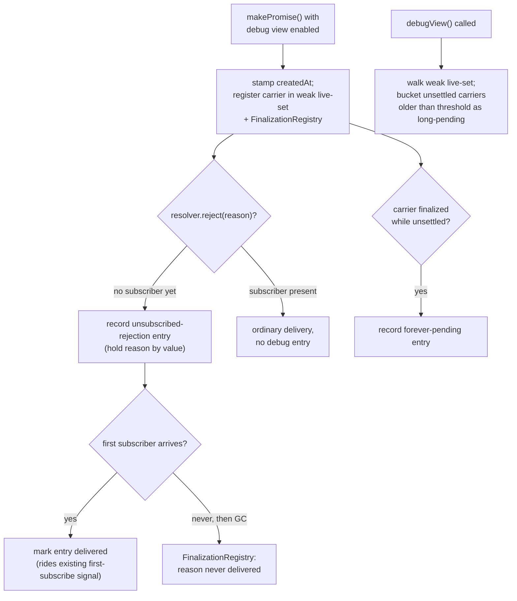

# Promise Debug View

| | |
|---|---|
| **Created** | 2026-07-12 |
| **Author** | Kris Kowal (prompted) |
| **Status** | Not Started |
| **Source** | [endojs/endo-but-for-bots#169 review](https://github.com/endojs/endo-but-for-bots/pull/169#pullrequestreview-4680376639) (inline comment on `designs/pass-style-promise.md`); tracked by [#716](https://github.com/endojs/endo-but-for-bots/issues/716) |

## What is the Problem Being Solved?

The [pass-style-promise](pass-style-promise.md) design establishes a
rejection-retention principle: when a producer rejects a pass-style
promise that no subscriber has attached to yet, the rejection is
**retained on the producer's record** and delivered to the first
subscriber that arrives, rather than either eagerly thrown to the
host's unhandled-rejection path or silently swallowed. Both of the
obvious answers are wrong: eager surfacing produces spurious noise for
a promise still in transit, and swallowing produces silent failures.

Retention is the right runtime behavior, but it opens an observability
gap. A rejection that is retained and then **never delivered** (because
a subscriber never arrives, or the carrier is dropped in transit) is
now invisible: by design there is no production log line, so a real bug
that would previously have shown up as an unhandled rejection leaves no
trace. The same gap covers two neighboring conditions that retention
does not address at all:

- **Long-pending** promises: a carrier that has stayed unsettled far
  longer than expected (a producer that forgot to resolve, a chain
  waiting on a hop that will not come).
- **Forever-pending** promises: a carrier that is garbage-collected
  while still unsettled, so it provably can never settle (the
  `new Promise(() => {})` never-settles idiom the liveSlots-equivalent
  used as a token, now expressed as a dropped pass-style carrier).

A debugger needs to see all three conditions **in transit**, without
reintroducing the per-hop noise the retention principle exists to
avoid. This design specifies a bounded, opt-in **debug-view ring
buffer** that makes the "neither swallow nor eagerly throw" state
observable to a debugger while staying invisible and near-zero-cost in
production.

This is the forward-looking follow-up recorded under "Out of Scope,
Future Work -> Debug view for long-pending and unsubscribed-rejection
promises" in [pass-style-promise](pass-style-promise.md), promoted to
its own design per the maintainer's request on the PR #169 review
("And we should post a plan to create that design"). It **layers on**
the retention contract specified there; it does not restate or modify
it.

## Design

### What the debug view observes

The debug view is a bounded, in-memory record of carriers that entered
one of three diagnostic conditions:

| Category | Condition | Signal source |
|---|---|---|
| `unsubscribed-rejection` | `resolver.reject(reason)` was called while the carrier had no subscriber. | The retention path already records this on the producer record; the debug view mirrors it. |
| `long-pending` | The carrier is still unsettled at inspection time and older than a threshold age. | Classified lazily at inspection time from a creation timestamp, not from a background timer. |
| `forever-pending` | The carrier was finalized (garbage-collected) while still unsettled. | A `FinalizationRegistry` callback, GC-driven, no timer. |

The design deliberately introduces **no periodic sweep and no timer**.
Each category is fed by an event that already happens (a reject call, a
GC finalization) or is computed on demand when a debugger asks. Nothing
wakes the process up on the debug view's behalf, so an idle production
process pays nothing for it beyond the disabled-path guard below.

### Entry shape

Each ring-buffer entry is a plain record:

| Field | Value |
|---|---|
| `category` | One of the three categories above. |
| `createdAt` | Turn counter or wall-clock stamp captured at `makePromise()` time. |
| `recordedAt` | When the entry entered the buffer (reject time, or finalization time). |
| `label` | An optional producer-supplied diagnostic string (see below), else a generated id. |
| `reason` | For `unsubscribed-rejection`: the retained rejection reason, held by value. Absent for the other categories. |
| `delivered` | For `unsubscribed-rejection`: set true once the first subscriber arrives and the reason is delivered. |
| `carrierRef` | A `WeakRef` to the carrier, so the buffer never keeps a carrier alive. |

The buffer holds the carrier **weakly** (`carrierRef`) so that the
debug view cannot itself keep a promise alive, which would both leak
memory and mask the `forever-pending` signal it is trying to surface.
The one value it holds **strongly** is the retained `reason` for an
`unsubscribed-rejection` entry, because that reason is exactly what the
debugger wants to read. Strong retention of reasons is bounded by the
ring capacity: at most `N` reasons are held, and an evicted entry
releases its reason.

### Ring-buffer semantics

The buffer is a fixed-capacity FIFO of the most recent `N` entries
(default `N` chosen small, on the order of a few dozen to a few
hundred; configurable per the env-option below). When full, adding an
entry evicts the oldest. A `forever-pending` entry may replace a
`long-pending` view of the same carrier (the carrier settled the
question by being collected); the two are the same carrier at different
lifecycle points, not two independent findings.

### When entries are recorded



- **At `makePromise()`** (only when the flag is enabled): stamp
  `createdAt`, add the carrier to a weakly-held live-set, and register
  it with a `FinalizationRegistry`. No visible entry yet.
- **At `resolver.reject(reason)` with no subscriber**: the retention
  logic (already specified in the parent design) records the reason on
  the producer record; the debug view additionally appends an
  `unsubscribed-rejection` entry.
- **At first-subscriber arrival**: the entry is marked `delivered`.
  This reuses the exact subscriber-arrival transition the resolver
  already tracks for `onFirstSubscribe` (see reconciliation below); the
  debug view adds no new subscriber-arrival plumbing.
- **At finalization** of an unsettled carrier: the
  `FinalizationRegistry` callback appends a `forever-pending` entry
  (and, if that carrier had an undelivered `unsubscribed-rejection`
  entry, that neighboring fact is the highest-signal bug the view can
  report: a rejection that was retained and can now never be
  delivered).
- **At inspection time**: `long-pending` is computed by walking the
  weak live-set and bucketing still-unsettled carriers whose
  `createdAt` is older than the threshold. Nothing is recorded eagerly
  for this category.

### Inspection surface

A debugger reads the buffer through a diagnostic accessor that returns
a **frozen snapshot** (a hardened array of plain records), never the
live buffer and never the resolvers:

```js
/**
 * Returns a hardened snapshot array of the current debug-view entries,
 * most recent last, plus lazily-classified long-pending entries. Each
 * record is a plain copy (category, createdAt, recordedAt, label,
 * reason?, delivered?); no carrier, resolver, or subscriber handle
 * escapes. Returns an empty array when the debug view is disabled.
 */
HandledPromise.debugView = () => { /* ... */ };
```

The accessor is a **host-side diagnostic power**, not a passable
capability. It is not marshaled, does not cross a cap boundary, and
exposes only copies and labels. It is reachable by whoever holds the
`HandledPromise` intrinsic in the debugging realm, the same audience
that holds `subscribe`/`settle`. Exposing it (its home, and whether it
is gated behind the same permit machinery as the parent design's new
`HandledPromise` methods) is Open Question 1.

The producer may attach a `label` when it constructs the carrier so
that entries are legible in the snapshot:

```js
const { promise, resolver } = makePromise({ debugLabel: 'kref:p-42' });
```

`debugLabel` is inert when the debug view is disabled and is the only
addition this design makes to the `makePromise()` options bag.

### Production cost and gating

The debug view is **opt-in and off by default**, following the same
`@endo/env-options` pattern the parent design uses for
`ENDO_PROMISE_DELEGATES` (and that `TRACK_TURNS`, `DEBUG`, and the
marshal message-breakpoints options use):

```js
import { getEnvironmentOption } from '@endo/env-options';

const PROMISE_DEBUG_VIEW =
  /** @type {'disabled' | 'enabled'} */
  (getEnvironmentOption(
    'ENDO_PROMISE_DEBUG_VIEW',
    'disabled',
    ['enabled'],
  )) === 'enabled';
```

When `PROMISE_DEBUG_VIEW` is `disabled`:

- `makePromise()` does not stamp a timestamp, does not register a
  `FinalizationRegistry` entry, does not touch the live-set or the
  buffer.
- The reject path's **retention behavior is unchanged** (that is the
  parent design's always-on contract); only the *extra* ring-buffer
  append is skipped.
- `HandledPromise.debugView()` returns an empty frozen array.

The guard is a single boolean read on the hot paths, so the disabled
cost is a branch, not an allocation. This is what "inspectable while
debugging without producing noise in production" means concretely: the
signal goes into a bounded in-memory ring a debugger reads on demand,
never onto the host's console or unhandled-rejection path, and the ring
is not even populated unless the flag is set.

### Native promises

Full fidelity is available only for **pass-style promises**, because
the three signals depend on producer-side machinery the platform does
not expose for native promises: there is no producer-side
subscriber-arrival hook on a native `Promise`, and its resolver is
closed over at construction. Native promises are covered
**opportunistically**: a native promise (or `HandledPromise`) that
flows through `HandledPromise.subscribe` / `HandledPromise.settle` is
visible at that point and MAY be registered for `long-pending` /
`forever-pending` tracking there. Native rejections that are eagerly
thrown are already covered by the host's own unhandled-rejection
tooling and are out of scope here. The precise extent of native-promise
coverage is Open Question 3.

## Reconciliation with the pass-style-promise contract

This design **layers on** [pass-style-promise](pass-style-promise.md);
it re-specifies none of that contract. The load-bearing reuses:

- **Rejection retention** (parent's "do not surface rejections to
  unsubscribed promises"): the debug view is the *observability* layer
  over the retention state that already exists. It reads the same
  retained-reason record and does not change the rule that a rejection
  with no subscriber is held, not thrown and not swallowed. The debug
  view never causes an eager throw and never suppresses a delivery.
- **`onFirstSubscribe` / first-subscriber transition** (parent's
  "Producer-side first-subscribe notification"): the debug view marks
  an `unsubscribed-rejection` entry `delivered` by riding the same
  once-per-carrier first-subscriber transition the resolver already
  tracks. It adds no second subscriber-arrival signal and does not
  change `onFirstSubscribe`'s fire-once, producer-scoped contract. A
  producer may still use `onFirstSubscribe` for its own lazy
  diagnostics independently; the debug view is orthogonal instrumentation
  the runtime maintains, not something the producer wires up per carrier.
- **Fire-once settlement** (parent's Open Question 3 resolution):
  because settlement is final, an entry's lifecycle is monotonic
  (pending -> settled/delivered, or pending -> finalized); the buffer
  never has to reconcile a resettled carrier.

## Dependencies

| Design or issue | Relationship |
|---|---|
| [pass-style-promise](pass-style-promise.md) | Parent design. This one implements the "Debug view" future-work item and layers on its rejection-retention and `onFirstSubscribe` contracts. Not blocked-by in the build sense: the debug view can only land after the retention path exists, so it sequences **after** the parent's Phase 3. |
| [endojs/endo#1312](https://github.com/endojs/endo/issues/1312) | The `new Promise(() => {})` never-settling token idiom the `forever-pending` category makes visible once expressed as a dropped pass-style carrier. |
| [endojs/endo#1652](https://github.com/endojs/endo/issues/1652) | Source of the `subscribe`/`settle` primitives whose first-subscriber transition the `delivered` marking rides. |
| [endojs/endo-but-for-bots#172](https://github.com/endojs/endo-but-for-bots/issues/172) | The `Promise[Symbol.for('delegate')]` follow-up; if the debug view is exposed as a delegate-adjacent op, it should compose with that surface rather than duplicate it (Open Question 1). |

## Phased Implementation

The debug view sequences after the parent design's Phase 3
(eventual-send integration), because the retention path and the
`subscribe`/first-subscriber transition it reads must exist first.

1. **Ring buffer and env-option (S).** The bounded FIFO, the
   `ENDO_PROMISE_DEBUG_VIEW` gate, the disabled-path guards, and
   `HandledPromise.debugView()` returning a frozen snapshot. Unit
   tests for capacity, eviction, and the disabled no-op.
2. **Unsubscribed-rejection recording (S).** Append on
   `resolver.reject` with no subscriber; mark `delivered` on
   first-subscriber arrival. Test the retained-reason mirror and the
   delivered transition against the parent's retention tests.
3. **Long-pending classification (XS).** Weak live-set walk at
   inspection time with a configurable threshold. No timer.
4. **Forever-pending via FinalizationRegistry (S).** Register at
   `makePromise()`, append on finalization of an unsettled carrier.
   GC-driven tests are inherently non-deterministic; gate them behind
   an explicit-`gc()` harness where available, else document as
   best-effort.
5. **SES permit (XS).** If `HandledPromise.debugView` lands on the
   `HandledPromise` intrinsic, add it to the `HandledPromise` permit
   entry in `packages/ses/src/permits.js`, the same two-line shape the
   parent design's Phase 3.5 uses for `subscribe`/`settle`. Resolving
   Open Question 1 decides whether this phase applies.
6. **Docs (XS).** A `NEWS.md` note and a short "debugging retained
   rejections" section cross-linked from the parent design.

## Design Decisions

1. **No background timer or sweep.** Every category is either
   event-driven (reject, finalization) or computed on demand
   (long-pending at inspection). This is what keeps an idle production
   process at zero incremental cost and honors "without producing noise
   in production" literally: nothing periodic runs.
2. **Weak carrier references, bounded strong reason retention.** The
   buffer must not keep carriers alive (it would mask `forever-pending`
   and leak memory), so carriers are held via `WeakRef`. Retained
   reasons are held strongly because they are the payload the debugger
   needs, and the ring capacity bounds how many are retained.
3. **Snapshot, not live buffer.** The inspection surface returns
   hardened copies so a debugger cannot mutate runtime state or reach a
   resolver, subscriber, or carrier through the debug view.
4. **Diagnostic power, not passable capability.** `debugView()` is
   host-side and never marshaled; it exposes labels and copied reasons,
   never handles that would leak authority across a cap boundary.
5. **Off by default, opt-in via env-option.** Reuses the parent
   design's `@endo/env-options` idiom for consistency and for a
   diagnosable on/off toggle.

## Open Questions

1. **Where does the inspection surface live?** `HandledPromise.debugView`
   (paired with `subscribe`/`settle`, and permit-gated the same way),
   a separate `@endo/pass-style` debug export, or a devtools-only
   global installed at a registered symbol adjacent to the
   `Promise[Symbol.for('delegate')]` direction in
   [#172](https://github.com/endojs/endo-but-for-bots/issues/172)?
   The parent design put `subscribe`/`settle` on `HandledPromise`; the
   symmetry argues for `HandledPromise.debugView`, but a purely
   diagnostic accessor arguably does not belong on the same intrinsic
   as the operational primitives.
2. **Default capacity and long-pending threshold.** What is a sensible
   default `N` for the ring, and what age (turns or milliseconds)
   counts as `long-pending`? Both are env-configurable, but the
   defaults should be chosen so the buffer is useful without being a
   memory concern when enabled.
3. **How far does native-promise coverage go?** Opportunistic tracking
   when a native promise passes through `subscribe`/`settle` is cheap;
   registering every native promise the process creates is not
   feasible and is the host tooling's job. Where exactly is the line,
   and does the design need a `HandledPromise.debugTrack(nativePromise,
   label)` opt-in for native promises a debugger cares about?
4. **Should `forever-pending` entries fan out to a host hook?** The
   `FinalizationRegistry` signal for "a rejection was retained and can
   now never be delivered" is the highest-value bug the view surfaces.
   Is a ring-buffer entry sufficient, or should an *enabled* debug view
   also offer an opt-in callback (still off in production) so a test
   harness can fail loudly on a provably-undeliverable retained
   rejection? This must not become the eager-throw the retention
   principle rejects; it would be a debug-only, explicitly-armed hook.
5. **Turn counter vs. wall-clock for `createdAt`.** A turn counter is
   deterministic and reproducible across replays; wall-clock is more
   legible to a human reading a snapshot. The buffer could carry both.

## Prompt

Requested by kriskowal in the PR #169 review
([pullrequestreview-4680376639](https://github.com/endojs/endo-but-for-bots/pull/169#pullrequestreview-4680376639)),
as an inline comment on `designs/pass-style-promise.md` at the
future-directions paragraph:

> And we should post a plan to create that design.

The "that design" is the future-work item recorded in
[pass-style-promise](pass-style-promise.md) under "Out of Scope, Future
Work -> Debug view for long-pending and unsubscribed-rejection
promises":

> Per the rejection-retention principle in the Subscription section,
> the right answer to "rejections in transit before any subscriber" is
> neither swallow nor eagerly throw. A future debug-view direction is a
> ring buffer of recent long-pending, forever-pending, and
> unsubscribed-rejection promises, inspectable while debugging without
> producing noise in production. Promises sometimes travel before they
> are subscribed; the debugger should be able to see them in transit
> without forcing a production log line on every hop. This is its own
> design and is not blocked by the present one.
