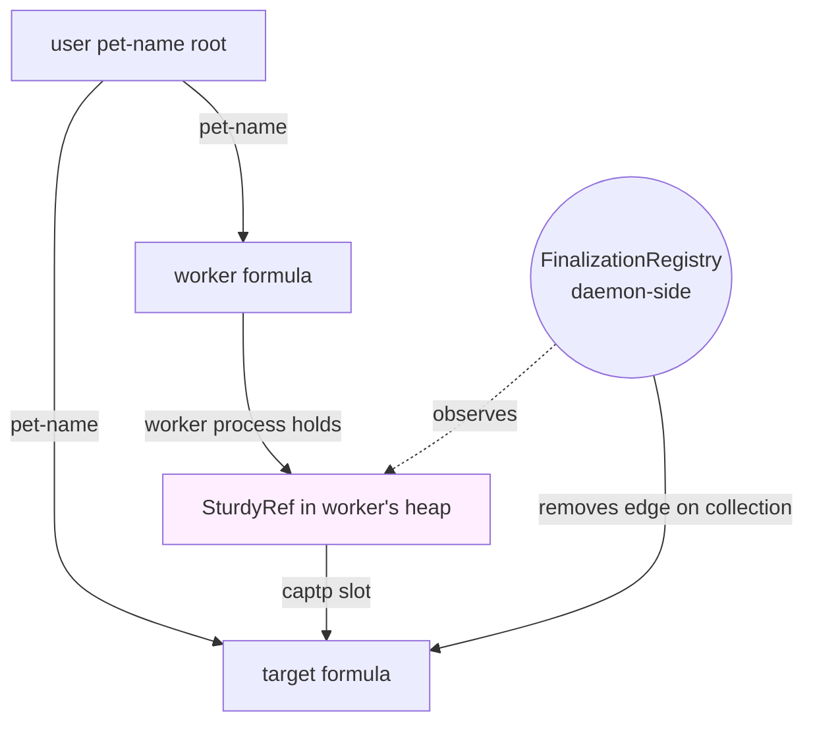

# SturdyRefs in `@endo/pass-style` + FinalizationRegistry-Tracked Worker Retention

| | |
|---|---|
| **Created** | 2026-06-22 |
| **Updated** | 2026-06-26 |
| **Author** | Kris Kowal (prompted) |
| **Status** | Proposed |

> **One of a pair of competing designs.**
> This design lives on branch `design/sturdy-refs-via-finalization-registry`.
> The competing design (designer 2, ocap-kernel-leaning) lives on
> `design/sturdy-refs-via-endor-syscall`, axis "endor retain/release syscall".
> The two designs share the **base problem** (sturdy-ref support in
> `@endo/pass-style` plus daemon ingestion) and differ on the **retention
> dilemma**.
> Comparison points are listed in [Compared to the alternative](#compared-to-the-alternative).
> Provenance: `endojs/endo-but-for-bots#500` issue comment 4775973308
> (kriskowal 2026-06-22).

## What is the Problem Being Solved?

Today the daemon's namespace is the only first-class way to refer to a
formula. Pet names act as both the **handle** a caller uses to invoke a
capability and the **retention root** that keeps the underlying formula
alive across daemon restarts. Two consequences fall out:

1. To pass a capability to a daemon method, the caller must first name
   it (or accept a presence already named in their namespace).
   PR #500 (`endojs/endo-but-for-bots#500`) is the precipitating
   example: a caplet-factory had to mint, name, use, and un-name a
   per-session powers cap to express "this capability belongs to this
   caplet", because `makeUnconfined` only accepted powers **by pet
   name**. The PR adds `makeUnconfined({ powers })` so the caplet can
   carry the cap by reference, but the underlying name-centric API
   over an id-centric core remains.
2. A confined guest or subagent that should never see a locator cannot
   refer to a formula at all unless its host first plants a pet name
   for it. The guest's vocabulary is its pet store.

Spritely Goblins and the OCapN spec already define a third primitive:
the **SturdyRef**, an opaque object bound to a locator that the bearer
can present to the OCapN bootstrap to re-acquire the live capability.
SturdyRefs are pass-style citizens: they marshal in-band, they survive
restarts on the **bearer** side without consulting any pet-name, and
their on-the-wire form has been specified in the OCapN locators draft
([spec citation](#spec-citations)).

The `@endo/ocapn` package already implements wire-level support
(`packages/ocapn/src/client/sturdyrefs.js`, the `OcapnSturdyRefCodec`
in `packages/ocapn/src/codecs/descriptors.js`, the `'sturdyref'`
extension to `ocapnPassStyleOf`). What is missing is a **first-class
pass-style category** that `@endo/pass-style` itself recognises, a
parsed representation of the OCapN locator the daemon can match
against its own formula store, daemon ingest paths that accept a
SturdyRef anywhere a pet-name-path is accepted today, and a
retention story for SturdyRefs that the user can override.

The **retention dilemma**, articulated by the maintainer:

> The hard invariant is that the user must have agency, specifically
> agency to revoke access to any locally housed value. So, it must be
> possible for the user to mention any retention root and force
> disincarnation, reincarnation, or revocation by deletion for any
> formula with a living reference. Not having a name for a reference
> becomes a problem.

This design takes the **petname-daemon-leaning axis**: it sources
implicit-retention semantics from the JavaScript `FinalizationRegistry`,
exposing **worker liveness plus reachable refs** as the *retention
root set*. The user exercises agency by disincarnating a worker the
inspector reveals as a holder. Revocation-by-deletion is preserved
because every SturdyRef still resolves through the same `formulaForId`
table that pet-name-paths resolve through; deleting the underlying
formula is the same deletion regardless of which root names it.

## Background

### What is a SturdyRef?

Drawn from Spritely Goblins and the OCapN spec: a SturdyRef is an
opaque token bound to a `(location, secret)` pair. The bearer can
present a SturdyRef to the OCapN `bootstrap.fetch(secret)` to obtain
the live capability. SturdyRefs survive daemon restarts on the bearer
side without indexing through the bearer's pet store. The `secret`
is a `swissnum`: a printable-ASCII friendly name or arbitrary bytes.

OCapN sends a SturdyRef on the wire as a Syrup record
`<ocapn-sturdyref node secret>` (see the `OcapnSturdyRefCodec` in
`packages/ocapn/src/codecs/descriptors.js`, function
`OcapnSturdyRefCodec`). The JavaScript side reifies the SturdyRef as a
`CopyTagged` with tag `'ocapn-sturdyref'` and `undefined` payload,
with the real `{ location, secret }` stored off-band in a `WeakMap`
(see `sturdyRefDetails` in `packages/ocapn/src/client/sturdyrefs.js`).
The `WeakMap` indirection prevents pass-style introspection from
leaking the secret, since the secret is the long-lived authority.

The current design therefore has no first-class pass-style category
for SturdyRefs. `passStyleOf` returns `'tagged'`; the OCapN codec
adds a `'sturdyref'` discriminator via `ocapnPassStyleOf` for codec
selection, but no other layer of the stack distinguishes a SturdyRef
from any other tagged value.

### What is a locator?

The daemon's locator is the URL `endo://{nodeKey}/?id={formulaNumber}&type={formulaType}`,
with optional `&at={hint}` connection hints
(see `designs/daemon-locator-reference.md` § Locator Format).
The locator is the daemon's **external** representation of a
formula identifier (`{number}:{node}`), suitable for sharing across
peer boundaries. The wire-format used by OCapN is `<ocapn-peer transport designator hints>`
plus the swissnum bytes
(see `packages/ocapn/src/codecs/components.js`,
`OcapnPeerCodec` for the location structure).
The Endo locator and the OCapN location are two encodings of the
same underlying concept; this design proposes a **parsed common
representation** that both can render to or read from.

### Why does pass-style need to know?

Three reasons:

1. **Marshal consistency**: pass-style is the discriminator that
   every marshaling layer keys on (the captp marshaller, the OCapN
   marshaller, the `@endo/marshal` syntactic marshaller). Pass-style
   already has a `'sturdyref'` axis in `@endo/ocapn`; first-classing
   it in `@endo/pass-style` lets the other marshalers route the same
   discriminator without re-deriving it.
2. **Identity**: the daemon's pet-name path is canonically a sequence
   of strings; a SturdyRef is a passable. A method that today
   accepts `...string[]` must distinguish a SturdyRef from a record
   from a pet-name segment. A `passStyleOf(value) === 'sturdyref'`
   check is the canonical place to make that distinction.
3. **Interface guards**: `M.interface()` patterns can match against
   pass-style. A method that wants "pet-name-path or sturdy-ref"
   needs a `M.or(M.arrayOf(M.string()), M.sturdyRef())` pattern,
   which depends on a guard primitive that knows about sturdy-refs.

## Design

### Parsed representation of a locator

Add a structured record type the daemon and pass-style both reference.
The record is the **common parsed shape** every encoding (Endo
`endo://` URL, OCapN `<ocapn-peer ...>` record, Spritely Goblins'
text form) maps to and from.

```typescript
/**
 * Parsed representation of an OCapN-compatible locator.
 *
 * The locator is the network-addressable identity of a formula on a
 * peer. The `secret` is the swissnum used by the peer's bootstrap
 * to resolve the locator into a live capability. The `transport`
 * names the netlayer (e.g., `'ocapn-noise'`, `'ocapn-tcp+syrup'`,
 * `'endo+ws'`); the `designator` is the transport-specific peer
 * identifier (typically a 64-char hex Ed25519 public key); the
 * `hints` are ephemeral connection hints (host:port pairs) that the
 * netlayer uses to find the peer.
 */
export type ParsedLocator = {
  transport: string;
  designator: string;
  hints: readonly string[];
  secret: string | Uint8Array;
  /** Optional type hint. When the locator was minted from an Endo
   * `endo://` URL this is the formula type; for a remote sturdy ref
   * it may carry some other peer-supplied interpretation hint. Absent
   * when the encoding supplies no type. */
  type?: string;
};
```

The `ParsedLocator` is **pure data**: pass-by-copy, hardened, no
remotables, no promises. It can travel through `passStyleOf` as a
`'copyRecord'`. The full SturdyRef wraps a `ParsedLocator` in a
pass-style-recognised tagged value.

### Pass-style integration

Add a new pass-style category, `'sturdyref'`, mirroring the
existing categories in `packages/pass-style/src/types.d.ts:57`:

```typescript
export type PassStyle =
  | AtomStyle
  | ContainerStyle
  | 'remotable'
  | 'error'
  | 'promise'
  | 'sturdyref';                                  // new
```

The SturdyRef helper lives in
`packages/pass-style/src/sturdyref.js`, alongside `remotable.js`
and `error.js`. It looks like:

```js
// @ts-check
import harden from '@endo/harden';
import { Fail, q } from '@endo/errors';
import { PASS_STYLE, confirmTagRecord } from './passStyle-helpers.js';

const STURDYREF_TAG = 'sturdyref';

/**
 * A SturdyRef is a pass-style tagged record with [PASS_STYLE]
 * = 'sturdyref' and [Symbol.toStringTag] = 'SturdyRef'. Its
 * locator is held off-band in a hardened WeakMap; the tagged
 * record itself is opaque.
 */
export const SturdyRefHelper = harden({
  styleName: 'sturdyref',
  confirmCanBeValid: (candidate, reject) => {
    /* same confirmTagRecord shape as RemotableHelper, but tag is
       STURDYREF_TAG and toStringTag is 'SturdyRef' */
  },
  assertRestValid: (candidate, _passStyleOfRecur) => { /* no payload */ },
});
```

Crucially:

- The off-band `WeakMap` (currently `sturdyRefDetails` in
  `packages/ocapn/src/client/sturdyrefs.js`) **moves** into
  `@endo/pass-style`. It becomes the canonical "is this a
  SturdyRef, and what does it locate?" lookup that both
  `@endo/ocapn` and the daemon consult.
- `makeSturdyRef(parsedLocator)` and `getStudyRefLocator(sturdyRef)`
  are new named exports on `@endo/pass-style`. They wrap and unwrap
  the locator; the wrap returns a hardened tagged record, the
  unwrap returns the `ParsedLocator`. Bare construction (without
  `makeSturdyRef`) is rejected by `confirmCanBeValid`: a
  `'sturdyref'`-tagged record that the helper did not mint cannot
  pass `passStyleOf` because the WeakMap does not have an entry.
- `passStyleOf(sturdyRef)` returns `'sturdyref'`.
- The OCapN extension `ocapnPassStyleOf` in
  `packages/ocapn/src/codecs/ocapn-pass-style.js` drops the
  `isSturdyRef(value)` branch and defers to `passStyleOf`. The
  three-line file becomes a re-export of `passStyleOf` plus
  the two OCapN-only `signedHandoffReceive` / `signedHandoffGive`
  branches.

### Enlivening a SturdyRef

A SturdyRef is **inert**: an opaque data box, not a reference. It
cannot receive eventual-send messages — `E(sturdyRef).method()` is
**not** a valid operation — and `@endo/eventual-send` therefore
needs no change. A SturdyRef carries no live connection, only the
off-band `(locator, secret)` that lets its bearer *re-acquire* the
live capability.

To act on the capability a SturdyRef names, the bearer first
**enlivens** it into a live presence and then sends to that
presence:

```js
const presence = await enlivenSturdyRef(sturdyRef);
const result = await E(presence).method(...args);
```

`enlivenSturdyRef` already exists in `@endo/ocapn`'s client
(`packages/ocapn/src/client/sturdyrefs.js`). It reads the locator
via `getStudyRefLocator(sturdyRef)` and dispatches: a local locator
flows to the injected `locator.get(secret)` (the daemon's own
formula store); a remote locator dials the peer via
`provideSession(location)` and calls `bootstrap.fetch(secret)`. The
enlivened presence is an ordinary CapTP presence; from there
`E(presence)` is the existing, unchanged eventual-send path.

The bearer (or `@endo/ocapn` on its behalf) may cache the
enlivenment so repeated use of one SturdyRef does not re-dial:
`sturdyRefToEnlivened: WeakMap<SturdyRef, Promise<Presence>>`. That
cache lives in `@endo/ocapn`, not in `HandledPromise`; eventual-send
remains unaware of SturdyRefs.

### Box and unbox protocol (CapTP / OCapN)

Layered responsibility, restated:

| Layer | Responsibility |
|---|---|
| `@endo/pass-style` | Classifies a SturdyRef. Owns the off-band `ParsedLocator` map. Provides `makeSturdyRef` and `getStudyRefLocator`. Does not know about wire formats. |
| `@endo/eventual-send` | No change. A SturdyRef is inert; it is enlivened to a presence before `E()` is used, and `E(presence)` is the existing path. |
| `@endo/marshal` | Reads `passStyleOf(v) === 'sturdyref'` and emits a slot; on receive, reconstructs a SturdyRef from `(slot, iface, locator)` via `makeSturdyRef`. |
| `@endo/captp` | Slot allocation per its existing protocol; SturdyRefs cross as a new slot kind `sturdyref`. |
| `@endo/ocapn` | Emits/reads `<ocapn-sturdyref node secret>` syrup records. Registers the global SturdyRef handler with `HandledPromise`. Continues to host the `enlivenSturdyRef` flow. |
| `@endo/daemon` | Accepts SturdyRefs at the boundary anywhere a pet-name-path is accepted. Reads the locator via `getStudyRefLocator` and routes to `formulaForId`. |

The wire format does not change. What changes is the **JavaScript-side
identity**: today a SturdyRef is a `CopyTagged` with tag
`'ocapn-sturdyref'` and an off-band `WeakMap` lookup; after this
design, a SturdyRef is a `'sturdyref'`-pass-style tagged record
with an off-band lookup that has moved into `@endo/pass-style`.

### OCapN's closely-held capability

The OCapN client surfaces two named exports already:

- `makeSturdyRef(location, secret)` — mints a SturdyRef from a
  locator.
- `enlivenSturdyRef(sturdyRef)` — resolves a SturdyRef to a live
  capability.

After this design they become:

- `makeSturdyRef(parsedLocator)` — delegates to `@endo/pass-style`.
  Accepts the new `ParsedLocator` record; the OCapN client builds a
  `ParsedLocator` from `(location, secret)` and forwards.
- `enlivenSturdyRef(sturdyRef)` — unchanged at the call boundary.
  Its internals consult `getStudyRefLocator(sturdyRef)` rather
  than the local-only `sturdyRefDetails` WeakMap.

The two are **closely-held**: only an agent that holds both the
SturdyRef and the OCapN client can enliven the SturdyRef into a
live capability, and only an agent that holds the OCapN client can
mint a new SturdyRef from a locator. A confined guest that holds a
SturdyRef but not the OCapN client cannot enliven it itself; it can
still hand the inert SturdyRef to a daemon method as a
pet-name-path substitute (next section), letting it refer to a
formula without ever holding or seeing the locator. This is the
disclosure asymmetry the maintainer cited ("a confined guest or
subagent, who should never see a locator, to refer to a formula
without naming it").

### Daemon: SturdyRef as pet-name-path substitute

A pet-name-path today is `string | string[]` (see
`packages/daemon/src/directory.js:309`, `storeIdentifier`).
Methods that accept a pet-name-path are listed in
`designs/daemon-locator-reference.md` § Method Taxonomy
(`identify`, `locate`, `lookup`, `list`, `listIdentifiers`,
`listLocators`, `move`, `remove`, `copy`, `storeIdentifier`,
`storeLocator`, plus the `EndoHost` and `EndoGuest` carry-ups).

This design extends every such method to accept
`string | string[] | SturdyRef` at the boundary. The internal
shape stays `formula identifier`:

```js
/**
 * Resolve a pet-name-path or a SturdyRef to an internal
 * formula identifier.
 *
 * @param {string | string[] | SturdyRef} pathOrRef
 * @returns {Promise<FormulaIdentifier>}
 */
const resolveToId = async pathOrRef => {
  if (passStyleOf(pathOrRef) === 'sturdyref') {
    const locator = getStudyRefLocator(pathOrRef);
    if (!isSelfLocation(locator)) {
      throw makeError(
        X`Cannot use a remote SturdyRef as a pet-name-path: locator ${q(locator.designator)}`,
      );
    }
    // The secret encodes a formula number; the local-only locator
    // names a local formula.
    return internalizeFromParsedLocator(locator);
  }
  // existing behavior
  return identify(...namePathFrom(pathOrRef));
};
```

The new helper `internalizeFromParsedLocator(locator)` builds a
`{ number, node: LOCAL_NODE }` formula identifier when
`isSelfLocation(locator)` (per
`designs/daemon-locator-terminology.md` § Local Keys Registry).
Remote SturdyRefs are rejected at the boundary; the daemon never
silently dials another peer on the user's behalf via a guest's
SturdyRef. (See [Why local-only at the daemon boundary](#why-local-only-at-the-daemon-boundary).)

The pet-name-path-vs-SturdyRef discrimination is a single
`passStyleOf` check; every method that accepts a pet-name-path
calls `resolveToId` at its entry point.

### Retention semantics: FinalizationRegistry tracking

**The choice of this design.** Workers (the formula type `worker`,
defined in `packages/daemon/src/formula-type.js:36`) execute guest
and subagent code. A worker can receive a SturdyRef across CapTP
and hold it. Today the daemon has no way to know which workers
hold which SturdyRefs; the workers run in separate processes
(or XS subordinate worlds) and the daemon sees only the slot
references the worker's CapTP endpoint has exported.

This design adds a **per-worker FinalizationRegistry** in the
daemon-side CapTP shim. When a SturdyRef crosses into a worker
(either as a method argument, a return value, or a resolved
promise's fulfillment), the daemon's CapTP slot table:

1. Wraps the SturdyRef in a hardened tagged record (the same shape
   that crossed the wire).
2. Registers the wrapped ref with a `FinalizationRegistry` keyed on
   the **(worker formula id, formula id the SturdyRef locates)** pair.
3. Records an in-memory edge in the daemon's formula graph:
   `holdsViaSturdyRef(workerId, targetId)`.

When the wrapped ref is collected in the worker's runtime, the
FinalizationRegistry callback (running in the daemon process, since
the registry is daemon-side at the captp boundary) removes the edge.

The user-facing affordances:

- **`E(host).listSturdyRefHolders(formulaIdentifier)`**: returns a
  list of `{ workerId, formulaPaths }` for workers currently holding
  the named formula via SturdyRef. The `formulaPaths` field is
  derived from the existing retention paths
  (`graph.js:748`, `listRetentionPaths`); the SturdyRef-via-worker
  paths appear as a new edge label `'sturdyRefHeld'`.
- **`E(host).disincarnate(workerIdentifier)`**: stops the worker
  process. Existing primitive in the daemon's worker management;
  after disincarnate, the FinalizationRegistry's keys are
  effectively dead, so the daemon removes the
  `holdsViaSturdyRef` edges synchronously rather than waiting for
  the registry's GC to fire.
- **`E(host).remove(petNamePath)`**: unchanged; removes the
  pet-name edge. If the formula's only remaining roots are
  SturdyRef-via-worker edges, the formula stays alive until the
  workers release; the user can force release by disincarnating.

The retention graph diagram:



The dashed `observes` line is the `FinalizationRegistry`
registration in the daemon's CapTP shim. The `removes edge on
collection` line is the callback path.

### Why local-only at the daemon boundary

The daemon accepts a SturdyRef as a pet-name-path substitute
**only** when `isSelfLocation(locator)`. The reasons:

1. A confined guest holding a remote SturdyRef does not need the
   daemon to dial the remote peer; the guest dials directly via
   the OCapN client it has (or does not have) been granted.
2. Allowing the daemon to dial peers under guest direction
   widens the daemon's ambient authority: the guest gets to
   choose a connection target, the daemon executes the dial.
   Local-only resolution preserves the existing rule that the
   daemon never dials on a guest's behalf without a connection
   capability the guest already holds.
3. A SturdyRef-as-pet-name-substitute is naturally local: the
   guest received the SturdyRef from its host (or from the
   formula store), the host or store named a local formula, the
   SturdyRef's locator therefore identifies a local formula by
   the daemon's own LOCAL_NODE rule
   (`designs/daemon-locator-terminology.md` § Local Keys Registry).

A remote SturdyRef the guest holds is still useful to the guest
itself: the guest enlivens it through its own OCapN client
(`E(await enlivenSturdyRef(remoteSturdyRef)).method()`), which dials
the peer. It is just not a pet-name-path substitute on the daemon's
API.

### Worker liveness as the retention root

The maintainer's framing:

> The user must have agency, specifically agency to revoke
> access to any locally housed value. So, it must be possible
> for the user to mention any retention root and force
> disincarnation, reincarnation, or revocation by deletion for
> any formula with a living reference.

Under this design the retention root set for a formula is the
union of:

- Pet-name roots (existing); reachable by `reverseLookup`,
  `reverseIdentify`, `reverseLocate`.
- Cross-peer retention edges (existing, from
  `daemon-cross-peer-gc.md`); reachable by inspecting the
  retention-accumulator.
- **Worker-via-SturdyRef edges** (new); reachable by
  `listSturdyRefHolders`.

The user exercises agency in any of three ways:

| What the user sees | What they do | Effect |
|---|---|---|
| A pet-name root | `remove name` | Removes the pet-name edge. |
| A worker holding via SturdyRef | `disincarnate workerId` | Stops the worker; the FinalizationRegistry-mediated edge drops. |
| A formula that *should* be revoked | `remove name`, then verify no other roots | If only worker roots remain, disincarnate the workers. |

The maintainer's "**revocation by deletion**" semantics are
preserved: deleting the pet-name and disincarnating all worker
holders frees the formula. The daemon's existing GC sweeps the
formula on the next collection cycle once the last edge drops.

### Migration / staged adoption

The design is additive at every layer:

1. **`@endo/pass-style`** gains a `'sturdyref'` category. The
   addition is back-compatible with existing pass-style consumers
   that switch on the result of `passStyleOf`: unknown
   discriminators fall through to the default branch, where the
   ordinary error path applies.
2. **`@endo/ocapn`** moves its WeakMap into pass-style. The exports
   `makeSturdyRef` / `enlivenSturdyRef` continue to work with the
   same signatures.
3. **`@endo/eventual-send`** is **unchanged**. A SturdyRef is inert;
   it is enlivened to an ordinary presence before any eventual-send,
   so no new `HandledPromise` surface is required.
4. **`@endo/daemon`** extends its method boundary checks; existing
   pet-name-path callers see no change. New callers (confined
   guests, subagents) pass SturdyRefs they receive.
5. The FinalizationRegistry-mediated worker retention edges are
   added incrementally: the daemon's CapTP shim wraps SturdyRefs
   on first export to a worker; existing workers that never
   receive a SturdyRef are not affected.

No state migration; the daemon's on-disk formula store is
unchanged.

## Failure modes and tradeoffs

### FinalizationRegistry non-determinism

The defining tradeoff. GC timing is unspecified by the JS spec;
a SturdyRef may persist in a worker's heap long after the worker
has stopped using it. Consequences:

- **Revocation latency.** "Remove all pet-name roots" does not
  collect the formula until every worker's GC has fired. The user
  who issued the deletion sees the formula linger for some
  indeterminate interval before its disk record disappears.
- **Race**: a `disincarnate` issued by the user can race with a
  FinalizationRegistry callback that was already scheduled. The
  daemon reconciles by treating both signals as idempotent
  removes; the `holdsViaSturdyRef` edge is gone after either
  fires.
- **No GC under lockdown**: `FinalizationRegistry` and `WeakRef`
  are available under SES lockdown (they are intrinsic to the
  realm; lockdown freezes the realm but does not remove
  finalizers). The captp finalizer uses them today (see
  `packages/captp/src/finalize.js:5`). The risk is not
  availability; it is observability of GC timing, which is the
  documented dangerous side-channel
  (`packages/captp/src/finalize.js` lines 22 to 37).
  This design only uses GC at the daemon/worker boundary, not
  inside guest code, so the side-channel concern is contained.

The maintainer's framing acknowledges this directly:

> we can either identify every worker that is holding a SturdyRef
> that has not been garbage collected (with FinalizationRegistry)
> such that the user can exercise their agency by disincarnating
> the worker that holds the SturdyRef or a live value.

The design accepts the latency cost. It buys: no new endor syscall
surface; no new retain/release dance the guest must execute; no
risk that a guest leaks references by failing to call `release`.

### Worker process death

If a worker crashes, the FinalizationRegistry never fires (the
worker's heap is gone, but the daemon-side wrapper is also gone
because the daemon's worker-process accounting tears down the
worker's CapTP slot table). The daemon detects worker death via
the existing process-monitoring path; the `holdsViaSturdyRef`
edges are removed synchronously.

### Daemon restart

On daemon restart, no worker is running. All FinalizationRegistry-
mediated edges are by definition cleared; the daemon's
`holdsViaSturdyRef` map is in-memory only and does not persist.
Workers are re-incarnated by the existing reincarnation path; if
they re-acquire SturdyRefs on startup, the daemon re-registers
the wrappers.

This is correct behavior: the user's pet-name edges are the only
persistent retention roots. Worker-held SturdyRefs are transient
by construction.

### The "user issued revoke after FinalizationRegistry fired"
race

A worker drops its last reference to a SturdyRef; the
FinalizationRegistry fires asynchronously; the edge drops from
`holdsViaSturdyRef`. The user then issues `remove name` on the
last pet-name. The daemon's GC sweeps the formula. Some time
later the worker's GC fires *again* in a different turn for an
unrelated value, and the daemon-side wrapper is collected. No
edge to remove; the callback is a no-op. (Idempotent
deregistration; see `makeFinalizingMap` in
`packages/captp/src/finalize.js:120` for the established pattern.)

### Guest cannot enumerate holders

`listSturdyRefHolders` is on `EndoHost`, not `EndoGuest`. A
confined guest cannot see which workers hold a SturdyRef it has
shared; that introspection is a host capability. The guest can
make a SturdyRef and pass it on; the host watches.

## Composition with the daemon's existing model

The maintainer's anti-pattern:

> Not having to explicitly manage retention is a virtue of
> ocap-kernel, and revocation-by-deletion is the virtue of the
> daemon. We should strive to avoid taking the advantages of
> either approach with the disadvantages of the other.

This design preserves both, with one deferred cost:

- **Revocation-by-deletion** is preserved. Every SturdyRef
  resolves through the same `formulaForId` table; deleting the
  formula by deleting all pet-name roots and disincarnating
  the workers it references is the same delete operation as today.
- **Implicit retention** is **mostly** preserved at the guest's
  view. A guest that receives a SturdyRef does not call any
  retain/release API; it holds the SturdyRef in its heap, the
  daemon's FinalizationRegistry observes, and the edge drops
  when the guest's GC fires.
- **The deferred cost** is the user's revocation latency. The
  user-facing affordance "disincarnate the holder" buys
  determinism by stopping the worker outright, at the price of
  losing whatever state the worker was holding. The competing
  design (the endor retain/release syscall) buys determinism
  by making the guest call `release()`, at the price of a new
  surface and a new failure mode (guest forgets to release).

This design takes the first tradeoff: latency is the cost of
not introducing the retain/release surface.

## Compared to the alternative

The parallel design (designer 2, ocap-kernel-leaning, branch
`design/sturdy-refs-via-endor-syscall`) makes different choices
at the points listed here. The framing is "in this design X
happens this way; the alternative would handle X by …" so the
maintainer can weigh the differences directly.

| Point | This design (FinalizationRegistry) | Alternative (endor syscall) |
|---|---|---|
| **Where retention is observed.** | Daemon-side, by a `FinalizationRegistry` registered when a SturdyRef crosses into a worker. | Guest-side, by an explicit `retain(ref)` syscall on the endor worker protocol. |
| **What the guest does.** | Holds the ref; nothing else. GC eventually fires. | Calls `retain(ref)` to keep alive, `release(ref)` to drop. The endor protocol's new syscalls. |
| **What the daemon exposes for inspection.** | `listSturdyRefHolders(formulaId) → [{ workerId, paths }]`. The list is derived from the registered FinalizationRegistry entries. | `listSturdyRefHolders(formulaId) → [{ workerId, retainCount }]`. The list is derived from the endor retain table. |
| **How the user exercises agency.** | Disincarnate the worker that holds the ref. The FinalizationRegistry-mediated edge drops; the formula's other roots determine whether it survives. | Disincarnate the worker, *or* invoke a host capability that calls `release` on the worker's behalf. The second affordance is novel and depends on the host's ability to talk to the worker. |
| **Revocation latency.** | Bounded by worker GC timing. Indeterminate. The user can force determinism by disincarnating. | Bounded by worker compliance with `release` (or by disincarnation). Determinism comes from explicit `release`. |
| **Failure mode if the guest is buggy.** | None. A guest that never drops a ref keeps the worker pinned, but the user's disincarnate authority is always available. | A guest that forgets to call `release` leaks the retention edge until the worker dies. Same recovery (disincarnate). |
| **Surface added to pass-style.** | One new pass-style category (`'sturdyref'`), one new helper file. | Same one new pass-style category. The base problem is shared. |
| **Surface added to eventual-send.** | None. A SturdyRef is inert; it is enlivened to a presence before `E()`. | None. Same. |
| **Surface added to the endor worker protocol.** | None. | Two new syscalls (`retain`, `release`); a new retain-count table per worker. |
| **Compatibility with confined guests.** | Confined guest holds the ref; nothing in the guest's API surface tells the host the guest holds it. The daemon's CapTP shim is the observer. | Confined guest must have access to the endor `retain` / `release` calls. Adds a capability the guest may or may not be granted. |
| **Cost on SES lockdown.** | Uses `FinalizationRegistry`. The captp finalizer already uses it (`packages/captp/src/finalize.js:5`). Lockdown does not remove it. | No new lockdown surface. |
| **Latency of inspection.** | `listSturdyRefHolders` walks the in-memory `holdsViaSturdyRef` map; constant-time per worker. The map may be **stale** (refs that the worker has already dropped but the GC has not fired for). | `listSturdyRefHolders` walks the endor retain table; **fresh** (explicit `retain` / `release` calls). |
| **Cost on worker death.** | Daemon's worker-process accounting tears down the slot table; edges drop synchronously. | Same. Endor retain-counts are torn down with the worker. |
| **Side-channel risk.** | GC timing is observable in principle. Contained to the daemon/worker boundary; the daemon already accepts this risk for captp slots. | No new side-channel. |
| **What does the maintainer's "ephemerally retain any reference returned by an agent method to implicitly until it is collected" thread map to?** | This *is* the design. The reference is the SturdyRef; the implicit retention is the daemon-side FinalizationRegistry; the "compensate by revealing the ephemeral worker retention roots" is `listSturdyRefHolders`. | The alternative makes the retention explicit (the endor `retain` syscall), trading implicitness for determinism. |

The competing axes the maintainer named explicitly:

> Not having to explicitly manage retention is a virtue of
> ocap-kernel, and revocation-by-deletion is the virtue of the
> daemon. We should strive to avoid taking the advantages of
> either approach with the disadvantages of the other.

This design takes the **petname-daemon's revocation-by-deletion**
and pays the cost in latency. The alternative takes
**ocap-kernel's lack of explicit retention obligation** and
pays the cost in new endor surface.

A future design may discover that the two are compositional:
guests that choose to call `retain`/`release` get determinism;
guests that do not are tracked by the FinalizationRegistry as
a safety net. That hybrid is out of scope; this design proposes
the FinalizationRegistry path alone.

## Acceptance criteria

A future builder PR that implements this design should land:

- **`@endo/pass-style`**:
  - New `packages/pass-style/src/sturdyref.js` with
    `SturdyRefHelper`, `makeSturdyRef`, `getStudyRefLocator`.
  - `passStyleOf` returns `'sturdyref'` for a hardened
    `'sturdyref'`-tagged record minted via `makeSturdyRef`.
  - `passStyleOf` rejects an `'sturdyref'`-tagged record that
    was not minted via `makeSturdyRef`.
  - Tests in `packages/pass-style/test/sturdyref.test.js`.
- **`@endo/eventual-send`**: no change. A SturdyRef is inert and is
  enlivened to a presence before any eventual-send; the existing
  `E(presence)` path is reused unchanged.
- **`@endo/ocapn`**:
  - `ocapnPassStyleOf` defers to `passStyleOf` for sturdyref.
  - `enlivenSturdyRef` reads via `getStudyRefLocator`.
  - An enlivenment cache `sturdyRefToEnlivened` reuses enlivened
    presences across calls (in `@endo/ocapn`, not eventual-send).
  - The wire codec `OcapnSturdyRefCodec` is unchanged.
- **`@endo/marshal`**:
  - Pass-style `'sturdyref'` round-trips through marshal as a
    new slot kind.
- **`@endo/daemon`**:
  - `resolveToId(pathOrRef)` helper accepting
    `string | string[] | SturdyRef`; called from every
    method that accepts a pet-name-path today (see Method
    Taxonomy in `daemon-locator-reference.md`).
  - New retention edge label `'sturdyRefHeld'` exposed by
    `listRetentionPaths`.
  - New `E(host).listSturdyRefHolders(formulaId)` returning
    `[{ workerId, paths }]`.
  - Daemon-side CapTP shim registers a SturdyRef wrapper
    crossing into a worker with a `FinalizationRegistry`.
  - Tests in `packages/daemon/test/sturdyref-pet-name-path.test.js`
    and `packages/daemon/test/sturdyref-worker-retention.test.js`.
- **Documentation**: this design's status moves to
  `In Progress`; the implementation PR cross-references.

The acceptance criteria intentionally omit performance bounds
on `listSturdyRefHolders`; the design's correctness does not
hinge on a specific latency target.

## Open questions

- Should the off-band locator map in `@endo/pass-style` be a
  hardened `WeakMap` or a hardened `Map`? `WeakMap` is the
  natural fit (the entry is gone when the SturdyRef is
  collected), but `WeakMap` cannot be enumerated, which may
  complicate a future "list all SturdyRefs in this realm"
  inspector. The current `@endo/ocapn` code uses `WeakMap`
  (`sturdyRefDetails` in `sturdyrefs.js:32`).
- Does `@endo/pass-style` becoming the home of the SturdyRef
  WeakMap create a new module-level secret that
  `lockdown()`-related audits must consider? The captp slot
  table is already an analogous module-level mutable map; we
  expect the same treatment.
- Should the daemon also accept a remote SturdyRef as a
  pet-name-path substitute, with the daemon dialing the peer
  on behalf of the guest? This design rejects remote
  SturdyRefs at the daemon boundary; an opposing position is
  that the guest already holds the SturdyRef, so dialing
  through the daemon would not widen the guest's authority.
  This is to be filed as a tracking issue if the design lands
  before the question is resolved.
- Should `listSturdyRefHolders` be on `EndoHost` only, or also
  exposed (read-only) to subagents? The host needs it for
  inspection; a subagent showing its workers what they hold
  might be useful, but conflicts with the "confined guest
  never sees a locator" rule because `paths` may include
  locator-shaped segments. The design defaults to host-only.
- What is the wire-level interaction between a SturdyRef and
  the `getRedirector` / `caretaker-pattern` revocation
  primitive (`journal/library/concepts/caretaker-pattern.md`)?
  Specifically: can a SturdyRef be revoked by replacing its
  locator's target formula with a `least-authority` exo, and
  is that the right shape for "revocation by replacement"
  semantics?
- Should there be a CLI verb `endo sturdy-ref-holders <locator>`
  paralleling `endo paths <name>` from
  `designs/daemon-retention-paths.md`? Likely yes; deferred to
  a follow-up design.
- Should we add an interface guard `M.sturdyRef()` to
  `@endo/patterns` (or `@endo/exo`'s `M`) so methods can
  pattern-match `M.or(M.arrayOf(M.string()), M.sturdyRef())`?
  Implementation deferred; this design names the need.

## Dependencies

| Design | Relationship |
|---|---|
| [daemon-locator-reference](daemon-locator-reference.md) | Provides the Endo locator format this design's `ParsedLocator` is the parsed shape of. |
| [daemon-locator-terminology](daemon-locator-terminology.md) | Defines `LOCAL_NODE`, `internalizeLocator`, and the local-key registry that `internalizeFromParsedLocator` reuses. |
| [daemon-cross-peer-gc](daemon-cross-peer-gc.md) | Provides the existing cross-peer retention edge mechanism; this design adds a sibling edge kind (`'sturdyRefHeld'`) to the same retention graph. |
| [daemon-retention-paths](daemon-retention-paths.md) | The inspector this design's `listSturdyRefHolders` extends. The new edge label `'sturdyRefHeld'` is rendered through the same paths viewer. |
| [chat-slot-slash-commands](chat-slot-slash-commands.md) | Reference for the in-memory transient-pin pattern (`captp-bounded-transient-pin` in `journal/library/concepts/`). Worker-via-SturdyRef edges are conceptually analogous: in-memory only, dropped on captp partition. |
| [daemon-endor-architecture](daemon-endor-architecture.md) | Companion design space. This design does **not** depend on endor surface changes; the alternative design does. |
| `endojs/endo-but-for-bots#500` | The precipitating PR. `makeUnconfined({ powers })` is the by-reference cap pattern this design generalises through SturdyRefs. |
| `endojs/endo-but-for-bots#521` | The in-flight implementation of the shared base problem (`feat(pass-style): first-class 'sturdyref' pass-style; ocapn defers to it`). Its review established the inert-data-box correction this design (and the sibling #510) adopts: a SturdyRef is not a presence, is not registered with `HandledPromise`, and `@endo/eventual-send` is unchanged. |
| `endojs/endo-but-for-bots#510` | The sibling design (`design/sturdy-refs-via-endor-syscall`); shares the base problem, differs on the retention axis (endor `retain`/`release` syscall vs this design's `FinalizationRegistry`). |

## Spec citations

- OCapN Locators draft specification.
  [`ocapn/draft-specifications/Locators.md` § Syrup Serialization](https://github.com/ocapn/ocapn/blob/main/draft-specifications/Locators.md#syrup-serialization).
  Already cited in `packages/ocapn/src/codecs/components.js:23`. The on-wire form is `<ocapn-sturdyref <ocapn-peer transport designator hints> swissnum>` per the spec; the JavaScript-side `OcapnSturdyRefCodec` in
  `packages/ocapn/src/codecs/descriptors.js` mirrors that shape.
- TC39 `FinalizationRegistry`, ECMAScript Language Specification, Section 27.2 *FinalizationRegistry Objects*. Used at the daemon/worker boundary to observe a worker's SturdyRef references.
- TC39 `WeakRef` and `WeakMap`, ECMAScript Language Specification, Sections 27.1 and 25.4. Used by `@endo/pass-style`'s off-band locator map.

## Prompt

> Please dispatch designers to produce a pair of competing plans
> to address the same problem.
>
> First, we need pass-style to support sturdy refs. Please look
> for relevant issues in Endo to inform the design. A sturdy ref
> is an opaque object, similar to a presence, that must be
> registered with HandledPromise, that corresponds to an OCapN
> locator. We'll need to design the parsed representation of a
> locator. A CapTP implementation including OCapN will be
> responsible for boxing and unboxing SturdyRefs. OCapN will in
> turn be responsible for providing the closely-held capability
> to either associate a SturdyRef with its locator or reveal the
> locator for a SturdyRef. SturdyRefs will be serialized in band
> in all of the supported marshaling layers, notably as already
> specified for OCapN.
>
> Then, it will naturally follow that a SturdyRef can be used as
> a place-holder for a pet-name, without having to designate a
> name. Any daemon agent method that currently accepts a
> pet-name-path should also be able to accept a sturdy-ref. This
> allows a confined guest or subagent, who should never see a
> locator, to refer to a formula without naming it.
>
> However, then we have a dilemma for the formula retention
> semantics of sturdyrefs. The hard invariant is that the user
> must have agency, specifically agency to revoke access to any
> locally housed value. So, it must be possible for the user to
> mention any retention root and force disincarnation,
> reincarnation, or revocation by deletion for any formula with
> a living reference. Not having a name for a reference becomes
> a problem. So, we have two options: we can either identify
> every worker that is holding a SturdyRef that has not been
> garbage collected (with FinalizationRegistry) such that the
> user can exercise their agency by disincarnating the worker
> that holds the SturdyRef or a live value. Or, we do not allow
> workers to retain ephemeral references to formulas and provide
> another mechanism for temporarily retaining a sturdyref.
>
> The tension in this design exercise is potentially the crux
> between the ocap-kernel and petname-formula-daemon design
> spaces. Not having to explicitly manage retention is a virtue
> of ocap-kernel, and revocation-by-deletion is the virtue of
> the daemon. We should strive to avoid taking the advantages of
> either approach with the disadvantages of the other. It may
> make sense to investigate an alternative daemon design that
> ephemerally retains any reference returned by an agent method
> to implicitly until it is collected, and compensate for this
> obligation by revealing the ephemeral worker retention roots.
> This would in turn entail an obligation for the `endor`
> worker protocol to provide a "syscall" for retaining and
> releasing references.
>
> (`endojs/endo-but-for-bots#500` issue comment 4775973308,
> kriskowal 2026-06-22.)
