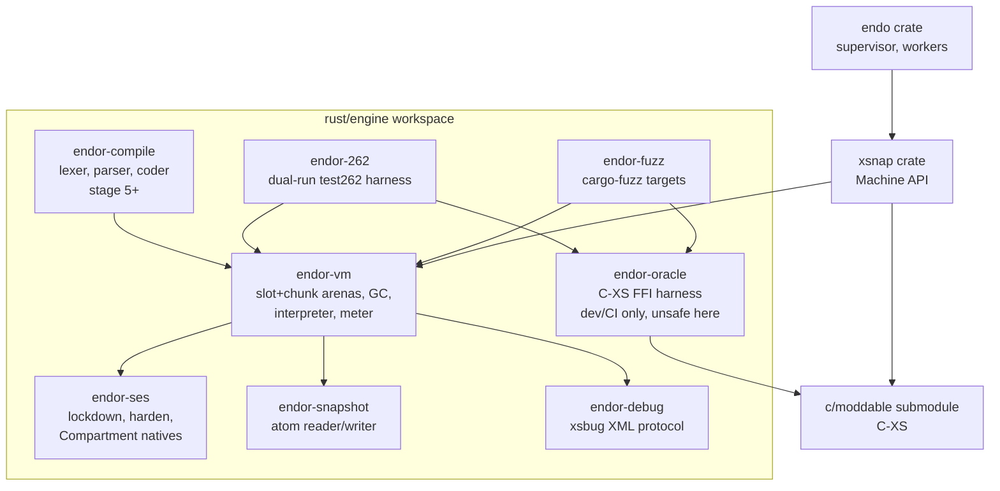

# Endor Engine: Porting XS to Rust

| | |
|---|---|
| **Created** | 2026-07-02 |
| **Author** | endolinbot (prompted) |
| **Status** | Approved (2026-07-02, program supervisor `port-xs-to-rust-memory-safe-engine`; all ten open questions resolved, see § Resolved Questions) |
| **Revised** | 2026-07-04 — **metering doctrine: accuracy over parity** (maintainer directive). The meter is endor's own release-versioned deterministic cost model, a proxy for real (wall-clock) execution cost, NOT a reproduction of XS's computron counts. The C-XS differential oracle is retained for **result** correctness only; computron comparison is demoted to advisory telemetry. This selects the "stated determinism-equivalence proof" branch the § Prompt already permitted. See § Metering (requirement 1a) and § Agoric consensus compatibility for the authoritative statement. |

Feasibility, architecture, and a staged roadmap for porting the XS
JavaScript engine to Rust as a crate the `endor` daemon embeds
in-process, replacing the C engine behind the existing `Machine`
API while preserving metering, the debugger protocol, and heap
snapshots. This document is stage 1 of the supervised program
`port-xs-to-rust-memory-safe-engine`; the implementation accretes
onto the same branch and pull request as this design.

## Feasibility Verdict

**Feasible, with the risk front-loaded into the first two stages.**
The XS engine core is roughly 75 KLOC of C (94 KLOC counting its
own RegExp and dtoa implementations), which puts a full port in the
12 to 24 month range for a single sustained lane. What makes the
project tractable rather than open-ended is that the crux — a
**result-correct** transliteration whose meter is a **deterministic,
release-versioned cost model** — is testable within weeks, not
years. Two sub-properties are separated (see § Metering): (a)
*result correctness*, the semantic port, which the differential
oracle checks against C-XS on every commit (completion kind, value,
error identity); and (b) *meter determinism per release*, which is a
construction guarantee — a frozen increment-point set with a frozen
cost table means identical inputs give identical computrons on every
host and build. The meter's *purpose* is to be the best available
deterministic proxy for real (wall-clock) execution cost, not to
reproduce XS's computron counts; XS-computron parity is an explicit
non-goal. The roadmap below front-loads a differential harness that
executes C-XS-compiled bytecode in both engines and compares
**results** on every commit; computron counts are recorded
alongside as advisory telemetry (a calibration and
allocation-faithfulness signal), never a build-gating equality
check. If stage 1 cannot hold result agreement on its corpus, or
cannot demonstrate a reproducible per-release meter, the program
stops early with a cheap, informative failure instead of a late,
expensive one.

Kill criteria, named up front:

- Stage 1 cannot reach result agreement with the oracle on the
  stage corpus after the interpreter subset is complete, or cannot
  demonstrate a deterministic-per-release meter (identical
  computrons across repeated runs of the same build).
- Stage 5 cannot reach byte-identical bytecode output against the
  oracle compiler on the conformance corpus.
- The stage 8 performance envelope (geometric mean within 2.0x of
  C-XS) proves unreachable by more than 2x after the planned
  optimization pass.

## What Is the Problem Being Solved?

Endo and agoric-sdk trust XS with their most security-critical
work: executing untrusted, guest-supplied JavaScript under
Hardened JavaScript confinement, with deterministic metering that
Agoric treats as a consensus input. That trust rests on ~94 KLOC
of memory-unsafe C that parses and executes hostile input. The
[endor architecture](daemon-endor-architecture.md) already moved
the supervisor to Rust; the engine itself remains the largest
unsafe surface in the process, and the `shared` worker platform
(XS machines inside the supervisor process) makes an engine
memory-safety bug a whole-daemon compromise.

A Rust port raises memory-safety confidence for exactly the
component that faces untrusted input, while an interpreter-only
design preserves the properties that make XS uniquely suited here
and that mainstream engines cannot offer: deterministic execution,
deterministic and reproducible computation metering (a
release-versioned cost model, § Metering), whole-heap snapshots, and
native Compartment support.

## Ground Truth: What Is Being Ported

Measured against `Moddable-OpenSource/moddable` at `48ee02d8cfe0`
(2026-06-17), the pin lineage of the `c/moddable` submodule that
`rust/endo/xsnap/build.rs` compiles today.

**Interpreter.** `fxRunID` in `xs/sources/xsRun.c` is a single
~4,000-line dispatch loop, computed-goto under GCC/Clang and a
plain `switch` otherwise, over the `XS_CODE_*` bytecode set defined
in `xsCommon.h`: 245 opcodes (many in 1/2/4-byte operand-width
variants), with per-opcode size and name tables (`gxCodeSizes`,
`gxCodeNames`). The machine is a slot-stack machine: one downward-
growing stack of `txSlot` cells holds values, call frames
(`XS_FRAME_KIND` slots linked through `next`), and scopes; the
frame geometry is fixed (result at `frame+1`, function at
`frame+2`, `this` at `frame+3`, arguments at `frame-1-i`, argument
count in `frame->ID`).

**Heap.** A `txSlot` is 32 bytes on 64-bit targets: `next` pointer,
kind byte, flag byte, 16-bit ID, and a 16-byte value union with
roughly 40 arms across ~66 slot kinds. Objects are linked lists of
property slots (no hidden classes or shapes). There are two heaps:
a slot heap of fixed-size slots that never move, and a chunk heap
of variable-size data (strings in CESU-8, ArrayBuffers, BigInt
digits, bytecode) that slide-compacts during collection. The
collector (`fxCollect` in `xsMemory.c`) is exact, non-generational
mark-and-sweep, with weak collections handled in a dedicated mark
phase.

**Metering.** Under `mxMetering`, the dispatch macro adds
`XS_CODE_METERING` (1<<16) to `the->meterIndex` before every
bytecode; built-in operation macros add `XS_BUILTIN_METERING`
(1<<14) per step via `mxMeterOne`/`mxMeterSome`, with hand-tuned
`mxMeterSome(k)` on optimized fast paths to match the unoptimized
count; the parser adds `XS_PARSE_CODE_METERING` (1<<16) units. The
meter is a 16.16 fixed-point value; the host callback installed by
`fxBeginMetering` sees `meterIndex >> 16` ("computrons"). The
check is not per-bytecode: `fxCheckMetering` runs only at
loop-closing points (backward branches, call and return, exception
catch, generator and async resume), and a false return aborts with
`XS_TOO_MUCH_COMPUTATION_EXIT`. Note the divergence: the XS fork
agoric-sdk pins today (`agoric-labs/moddable`, XS 13.3.0) meters
one integer per bytecode with no fixed point, and agoric-sdk's
consensus-facing meter version is `xs-meter-37`
(`packages/xsnap/api.js` as of 2026-07-01). Metering changes are
consensus-breaking for Agoric because computron counts feed the
swingset run policy (how many cranks fit in a block); divergent
counts across validators halt the chain (agoric-sdk issues #4911,
#5040, #6361). This paragraph describes XS and the current Agoric
fleet; endor does **not** lock its own meter to these values.
Endor's meter is its own release-versioned cost model (§ Metering),
and its consensus story rests on every validator running the same
endor release rather than on XS-computron parity (§ Agoric consensus
compatibility).

**Snapshots.** `xsSnapshot.c` writes a length-prefixed big-endian
FourCC atom container: `XS_M` wrapping `VERS` (engine version, slot
width, endianness), `SIGN` (host callback-table signature), `CREA`
(machine creation parameters), `BLOC` (chunk data), `HEAP` (slot
images), `STAC` (stack slots), `KEYS`/`NAME`/`SYMB` (key and symbol
tables). The on-disk form is position-independent: slot pointers
are projected to dense indices, chunk pointers to offsets, and
native-function pointers to indices into the engine's static
callback table plus a host-supplied callback array; the reader
rebases indices onto fresh heaps and re-hashes Maps and Sets.
xsnap restores at boot and writes on command; agoric-sdk streams
snapshots over dedicated file descriptors.

**Debugger.** `xsDebug.c` speaks the xsbug protocol: XML messages
framed by CRLF, engine-to-IDE wrapped in `<xsbug>`, parsed by a
small hand-rolled state machine. Commands include `go`, `step`,
`step-inside`, `step-outside`, `set-breakpoint` (plus condition,
hit-count, and trace variants), `select`, `toggle`, `eval`, and
profiling start/stop; responses carry `<frames>`, `<local>`,
`<global>`, `<break>`, `<log>`, and lazily expandable property
trees. Transport is host-provided through five platform hooks
(`fxConnect`, `fxDisconnect`, `fxIsConnected`, `fxReceive`,
`fxSend`), which is what lets the
[debugger design](daemon-xs-worker-debugger.md) route the protocol
over the envelope bus without touching `xsDebug.c`.

**Hardened JavaScript.** XS implements SES natively:
`xsLockdown.c` provides `lockdown` (freezes shared intrinsics and
replaces per-compartment evaluators), `harden` (transitive freeze),
and the XS extensions `petrify` and `mutabilities`; `xsModule.c`
provides the native `Compartment` constructor with `evaluate`,
`import`, `importNow`, and a per-compartment `globalThis` over
shared frozen intrinsics. XS is the only engine with a native
Hardened JavaScript implementation.

**Conformance.** On the 2026-07-02 test262.fyi run (53,404 tests),
XS passes 81.57% overall, but the number is dominated by the
deliberate absence of Intl (intl402: 25 of 3,341); its language
section is 98.2%, and Moddable's own conformance accounting
(strict and sloppy runs, implemented features only) reports 99.95%
language / 99.85% built-ins.

## Build Approach: Extend a Rust Engine, or Port XS?

Survey of Rust-native (and one Zig) engines, 2026-07-02, from
test262.fyi and source inspection:

| Engine | test262 | Metering | Snapshot | SES/Compartment | Notes |
|---|---|---|---|---|---|
| Boa | 95.4% | Loop/recursion limits; per-instruction budget only behind the `fuzz` feature | None | None; SES shim untested | MIT; most mature embedding API; `Math.random` not hookable today; Rc-style traced GC |
| Kiesel (Zig) | 93.3% | None | None | None | MIT; Boehm conservative GC precludes precise snapshots |
| Nova | 77.2% | None | None (index-arena heap is snapshot-friendly in principle) | None | MPL-2.0; RegExp non-compliant; 2026 activity slowing |
| Brimstone | >97% language (self-reported) | None | Ships a heap serializer | None | MIT; single author; "not ready for production"; copying GC in very unsafe Rust |
| XS (C) | 98.2% language | Exact, consensus-grade | Native | Native | The thing being ported |

The decisive observations:

1. **No Rust engine has deterministic metering, and endor's meter
   must be a first-class, reproducible cost model either way.**
   Under the accuracy-over-parity doctrine (§ Metering) endor's
   meter is a *new* release-versioned deterministic model whatever
   engine underlies it, so metering is no longer, by itself, the
   argument for porting XS rather than extending Boa: any base
   would need the same purpose-built meter. What porting XS *does*
   buy the meter is a well-understood, guest-reachable increment
   seam (XS's per-opcode and per-builtin-step points, whose *check*
   sites also shape observable abort behavior) that the same-ISA
   differential oracle can validate opcode-for-opcode on **results**
   — a seam a foreign engine with a different bytecode set does not
   offer. The decisive reasons to port XS are the other three
   requirements below (result-conformance semantics, native SES,
   native snapshots); metering rides along on the same ISA rather
   than driving the choice.
2. **No Rust engine has Compartment, lockdown, or harden.**
   Requirement 5 would mean either running the `ses` shim on an
   engine where lockdown has never been exercised (Boa is the only
   plausible candidate and it is untested), or implementing native
   SES in a foreign ~240 KLOC codebase we do not control.
3. **Snapshot save/restore exists nowhere except a single-author
   experimental engine.** Requirement 1's snapshot surface would
   be new work in any engine.

**Decision: port XS, as an oracle-checked transliteration.** The
Rust engine adopts XS's bytecode ISA (the 245-opcode `XS_CODE_*`
set), its meter increment *points* (as the instrumentation seam —
but **not** its weights, which become release-versioned calibration
constants of endor's own cost model, § Metering), its two-heap
object model semantics, its snapshot atom grammar, and its debugger
protocol, while re-architecting the *implementation* for safety
(index-based arenas instead of pointer graphs, safe Rust instead
of C). C-XS itself, already compiled and linked by the existing
`xsnap` crate, becomes a continuously-exercised differential
oracle in CI for **result** correctness: every conformance and
fuzz run executes both engines and compares observable results
(completion kind, value, error identity), with computron counts
recorded alongside as advisory telemetry rather than compared for
equality.

Considered and rejected: extending Boa. Reason: SES and snapshots
would be new work anyway; ~240 KLOC of foreign engine code
replaces one audit problem with another; and result-semantics
fidelity (endor is a transliteration of XS behavior) is what the
same-ISA oracle checks cheaply. (Metering is no longer a reason
either way — observation 1 — since endor's meter is a purpose-built
release-versioned model on any base.) Considered and rejected:
building on Nova's data-oriented heap. Reason: conformance is 20
points behind, RegExp is non-compliant, MPL-2.0, and the same
metering/SES gaps apply. Considered and rejected: wrapping C-XS in
a tighter sandbox (Wasm, process isolation) instead of porting.
Reason: already have process isolation (`separate` platform); the
goal is raising confidence for the in-process `shared` platform
and the long-term maintenance position, which sandboxing does not
address.

The staging is hybrid in one specific, temporary way: until the
compiler port lands (stage 5), the Rust interpreter executes
bytecode produced by the C-XS compiler through the oracle harness.
This guarantees the bytecode stream is identical during the phase
where interpreter result correctness (and the meter's
determinism/calibration against a fixed bytecode stream) are being
proven, and confines the C dependency to development and CI; no
intermediate stage
ships a mixed C/Rust engine to production.

## Architecture

### Value and heap model

The single largest safety re-architecture: XS's pointer-linked
slot graph becomes an index-based arena.

- A `SlotIndex(u32)` replaces `txSlot*`; the slot heap is a Rust
  arena of 32-byte slot records with a free list, exactly XS's
  "slots never move" semantics. Slot records pack kind, flag, ID,
  the `next` index, and a 16-byte payload, accessed only through
  typed accessors; the packing preserves XS's 32-byte-per-slot
  accounting so `currentHeapCount` and slot-growth behavior stay
  comparable.
- A `ChunkOffset(u32)` replaces chunk pointers; the chunk heap is
  a growable byte arena with the same `txChunk` header discipline
  and slide-compaction during GC (offsets are rewritten exactly
  where XS rewrites pointers).
- The GC is XS's exact, non-generational mark-and-sweep, ported
  semantically: mark from machine roots (stack, globals, keys,
  host roots), sweep slots to the free list, compact chunks,
  handle weak collections in the dedicated phase. Index arenas
  make the collector safe code: there are no raw pointers to
  invalidate, and a stale index is a logic bug caught by kind
  checks, not undefined behavior.
- Strings remain CESU-8 in chunks (the `mxCESU8` configuration the
  endor build already uses), and NaN canonicalization follows
  `mxCanonicalNaN`, preserving snapshot content and allocation
  observability.

An index arena also makes snapshots nearly structural: XS's write
path exists to *convert* pointers into indices and offsets; the
endor heap is already in that form.

### Interpreter and dispatch

A `match` over a `#[repr(u8)]` opcode enum, compiled by LLVM to a
jump table; interpreter state (stack top, frame, scope, code
cursor) lives in a small register struct threaded through the
loop, mirroring `mxSaveState`/`mxRestoreState` at allocation and
call boundaries. No JIT, ever (requirement 4): no code generation,
no execution-count-dependent behavior, no fast paths whose cost
differs from the metered count. Tail-call threaded dispatch (the
unstable `become` feature) is a possible later optimization behind
the same opcode semantics; it is explicitly not load-bearing for
the performance envelope.

The stack is a `Vec`-backed slot stack with the same frame
geometry as XS (frames are stack slots, arguments below the frame,
fixed offsets for result/function/this), because the debugger's
frame walk, the exception machinery, and several opcodes observe
that geometry.

### Metering (requirement 1a)

**Doctrine (2026-07-04, maintainer directive): accuracy over
parity.** The meter's purpose is to be the best available
**deterministic proxy for real (wall-clock) execution cost**, not
to reproduce XS's computron counts. XS-computron parity is an
explicit non-goal. Two properties are separated, and only the first
is unconditional:

- **Determinism per release (unconditional, and the property
  consensus needs).** Within a released endor version the meter is
  frozen: a fixed set of increment points with a fixed per-point
  **cost table**, so identical inputs produce identical computrons
  on every host, architecture, and build. Any two runs of the same
  release meter identically. This is a *construction* guarantee (a
  pure function of the frozen table and the deterministic
  interpreter), not a bit-exactness proven against a foreign engine
  — which is why it is cheap and total rather than a long-tail
  chase.
- **Accuracy across releases (recalibrated, versioned).** The cost
  table is a *model* of real execution cost. It is recalibrated
  between releases as measurement improves, and every recalibration
  is a meter-version bump (`endor-meter-N`) shipped with the
  release — never a silent change. Better accuracy is bought at
  release boundaries; reproducibility within a release is never
  traded for it.

The meter is a `u64` accumulator; the increment *points* are
inherited from XS as a well-understood, guest-reachable
instrumentation seam, but the *weights* are entries in endor's own
release-versioned cost table, not XS's constants:

| Event | Increment point (seam, from XS) | Weight |
|---|---|---|
| Bytecode dispatch | `mxBreak` metering variant in `xsRun.c` | cost-table entry, per opcode |
| Built-in operation step | `mxMeterOne`/`mxMeterSome` on the `mx*` operation macros | cost-table entry, per built-in step |
| Allocation | slot alloc (`XS_SLOT_ALLOCATION_METERING`) / chunk byte (`XS_CHUNK_ALLOCATION_METERING`) | cost-table entry |
| Parse unit | `fxMeterSome` calls from the parser | cost-table entry |

**Deriving and freezing the cost table.** The weights are not
hand-copied from XS; they are calibration constants derived from the
cost-calibration instrumentation (sibling plan
[xs2rust-endor-meter-opcode-cost-instrumentation](xs2rust-endor-meter-opcode-cost-instrumentation.md)),
which measures per-opcode and per-builtin-step real cost on a named
reference platform. The measured costs are reduced to a frozen integer weight
table checked into the release and stamped with an `endor-meter-N`
version. A recalibration re-runs that instrumentation and bumps the
version; the previous table remains addressable by its version so
old metered outcomes stay reproducible. Because the table is
integer and frozen per release, metering is fully deterministic
without needing to match any external reference.

**Check points and abort.** Checks happen at XS's loop-closing
points (backward branch, call, return, catch, generator iteration,
async resume): the accumulator is compared against the crank limit
and the crank aborts on refusal. The *points* are inherited because
they shape observable abort behavior; the *point at which* a given
program aborts is an endor-release-defined outcome (a function of
the endor cost table), deterministic per release, and is **not**
required to coincide with XS's abort point. A metering-limit abort
is therefore an endor-meter outcome, not an oracle-checked parity
fact.

**The oracle is result-only; computrons are advisory telemetry.**
The differential harness compares **results** (completion kind,
value, error identity) between endor and C-XS, and a result
divergence is a red build. Computron counts from both engines are
recorded *alongside*, as a comparative/calibration signal and as an
allocation-faithfulness canary (a large, unexpected computron drift
often means the allocation sequence diverged, which is itself a
*result*-relevant bug worth surfacing) — but computron **equality**
with C-XS is never an acceptance gate. XS's hand-tuned
`mxMeterSome(k)` fast-path annotations are consequently no longer a
parity obligation the port must reproduce weight-for-weight; where a
built-in's port keeps them, it is to preserve the meter's *internal*
consistency across fast and slow paths within an endor release, not
to match XS. What must hold unconditionally is that endor is
*internally* deterministic per release (the differential harness
plus cross-platform CI verify computron stability across runs and
platforms); cross-engine computron equality with C-XS is neither
required nor pursued.

The `Machine` metering API (`begin_metering`, `end_metering`,
`current_meter`, `current_computrons`, `set_meter`,
`run_promise_jobs_metered`, `set_crank_limit`) is preserved
verbatim, so the crank lifecycle, admission gate, and meter-report
envelopes of the [metering design](daemon-xs-worker-metering.md)
carry over without supervisor changes; the C callback and
thread-local `CRANK_LIMIT` become a safe closure and a machine
field.

### Agoric consensus compatibility (the doctrine's binding question)

Agoric metering is consensus-critical: computron counts drive
gas/fees and must be identical across all validators, or the chain
halts. "Accuracy over XS-parity" is safe for consensus **iff endor's
meter is itself the consensus meter and every validator runs the
same endor release** — which is exactly the *determinism per release*
property above: same release ⇒ same frozen cost table ⇒ identical
computrons ⇒ consensus holds. The doctrine does not weaken consensus
determinism; it relocates the reference from "XS's counts" to "this
endor release's counts."

**Decision — (b): endor ships its own release-versioned native meter
that consumers, Agoric included, adopt at a coordinated upgrade
boundary.** This is the same shape every XS meter change has ever
shipped as — an `xs-meter-N` bump at a coordinated chain upgrade
(§ Ground Truth) — restated for endor as `endor-meter-N`. It aligns
with, and is now load-bearing for, resolved questions 1 and 2: the
oracle is the `c/moddable` pin (for *results*), and consensus entry
is by coordinated upgrade, never mixed-fleet operation. A
bit-for-bit **XS-computron-compatible meter mode (option a) is not a
build-phase goal**, and pursuing one would re-impose the very parity
the maintainer declared a non-goal — freezing endor's meter to a
2023-era fork's weights, worse for accuracy and heavier to maintain,
to buy a continuity the coordinated-upgrade mechanism already
provides.

**The door to (a) stays open as a versioned meter, not a doctrine
change (conditional (c)).** Because the meter is release-versioned by
construction, an XS-computron-compatible table *can* be added later
as one more named meter version (`endor-meter-xs13compat`, say) if —
and only if — a concrete consensus consumer needs bit-for-bit
continuity with today's XS metering *without* a governance-approved
gas re-pricing at the switchover. That would be a bounded, optional
compatibility surface gated on a real consumer, its own design
amendment, with its own oracle pin against the agoric-labs fork; it
is explicitly out of scope now and is not what the accuracy-mode
meter is calibrated against.

**Consequence for consumers.** Switching a live chain's meter changes
gas costs, so adoption is a chain-governance / migration event, not a
drop-in. Endor therefore targets **(b) — a new endor-native metered
release consumers opt into at an upgrade boundary** — with (a)
available only as the conditional, versioned compatibility mode
above. This choice bounds the whole doctrine: endor's accuracy-mode
meter is free to model wall-clock cost as well as it can, precisely
because it is never asked to be simultaneously bit-compatible with a
legacy meter on a running fleet.

### Snapshots (requirement 1c)

Endor writes and reads the XS atom container grammar (`XS_M` over
`VERS`/`SIGN`/`CREA`/`BLOC`/`HEAP`/`STAC`/`KEYS`/`NAME`/`SYMB`)
with an endor `VERS` discriminator and the host signature scheme
unchanged (append-only callback table, signature bump on layout
change, per the [snapshot design](daemon-xs-worker-snapshot.md)).
Because the heap is index-based, the writer is a serializer, not a
relocator; reading streams through the same
`write_snapshot_to_file`/`from_snapshot_file`/`suspend_to_cas`
surface the xsnap crate exposes today, so the supervisor's
suspend/resume and CAS integration are untouched.

**The format question.** Reading *C-XS-produced* snapshots is more
tractable than it first appears, because the on-disk form is
already position-independent (indices, offsets, and callback-table
ordinals rather than raw pointers); an importer is a decoder from
32-byte slot images and chunk data into endor arenas, not a
layout-compatibility exercise. It is still real work (every slot
kind's union arm must be decoded, both endiannesses and the
version matrix handled), and no endor use case requires migrating
a live C-XS heap: the endo daemon restarts workers from durable
persistence, and agoric replays from transcripts and rebuilds
snapshots. The design therefore ships the Rust-native writer and
reader first, and treats the C-XS snapshot importer as bounded,
optional work gated on an actual migration need (resolved
question 3: out of scope for the build phase).

### Debugger (requirement 1b)

Endor implements the xsbug wire protocol byte-compatibly: the same
XML elements, the same CRLF framing, the same command set
(including breakpoint conditions, hit counts, and profiling), so
`xsbug`, the headless `xsbug-node` client, and the endo
`DebugSession` SAX parser of the
[debugger design](daemon-xs-worker-debugger.md) work unchanged.
The five C platform hooks collapse into a Rust `DebugTransport`
trait (the envelope-bus buffers of that design implement it);
"always compiled, dormant by default" becomes a runtime flag
rather than an `mxDebug` compile-time bifurcation, with the same
negligible dormant cost (one branch at debug points). The
break-on-uncaught-exceptions augmentation (the `firstJump` walk)
is carried into the port as a native feature: the Rust exception
machinery keeps the equivalent of the jump chain with its
JS-versus-host flag, and the `uncaughtExceptions` pseudo-
breakpoint lands in stage 7 rather than as a C patch.

### Hardened JavaScript and Compartment (requirement 5)

Native, from the start, as in XS: `lockdown`, `harden`, `petrify`,
and `mutabilities` port from `xsLockdown.c`; `Compartment` ports
from `xsModule.c` with per-compartment globals and evaluators over
shared frozen intrinsics. The stage 1 slice already carves the
architectural seams these need: intrinsics are created once per
machine and referenced per-realm, every evaluator is reachable for
per-compartment replacement, and `harden`'s transitive freeze
worklist operates on the slot arena. The acceptance bar is that
the endor daemon's actual boot sequence (`polyfills.js`, then
`ses_boot.js` lockdown, then the HandledPromise shim, per
[daemon-endor-architecture](daemon-endor-architecture.md) §
Unified runner) runs identically on both engines, plus the SES
test suites XS itself is exercised against.

### Minimizing `unsafe` (requirement 2)

The budget is zero in shipped engine crates, enforced by
`#![forbid(unsafe_code)]` on `endor-vm`, `endor-ses`,
`endor-snapshot`, `endor-debug`, `endor-compile`, and `endor-262`.
The index-arena design is what makes this achievable: no raw
pointers, no self-referential structures, no `unsafe` GC.

| Zone | `unsafe` allowed | Justification and containment |
|---|---|---|
| `endor-vm` and other engine crates | No (`forbid`) | The headline property; index arenas remove the need |
| `endor-oracle` | Yes | FFI to C-XS via the existing xsnap `ffi.rs`; dev and CI only, never linked into a shipped engine |
| `xsnap` crate glue | Existing FFI remains until the C engine is retired; endor paths add none | Audited seam, shrinking over time |

Any future proposal to introduce `unsafe` into an engine crate (a
measured hot path, a mmap'd snapshot reader) requires amending
this design with a per-use justification, an audit note, and Miri
coverage; it is a design change, not a code review nicety.

### Memory-safety confidence (requirement 3)

What is actually bought, stated so it can be weighed against
performance: elimination of spatial and temporal memory errors
(out-of-bounds, use-after-free, double-free, type confusion via
union misuse) in the component that parses and executes untrusted
JavaScript, under a `forbid(unsafe_code)` regime where that claim
is compiler-checked rather than audited. The historical record
this addresses is concrete: the class of bugs like the host-frame
off-by-one documented in
[daemon-rust-xs-performance](daemon-rust-xs-performance.md) (raw
slot-pointer arithmetic silently reading wrong stack slots) is
unrepresentable against typed arena accessors. CI enforcement:
Miri on the arena and GC test suites, ASAN/UBSAN on the oracle
harness (the remaining C), and the fuzz targets below. Logic bugs
(a wrong index reaching a kind-checked accessor) remain possible
and surface as deterministic panics, which the supervisor already
treats as worker death; a panic is a crashed crank, not a
compromised daemon.

### test262 conformance (requirement 6)

`endor-262` is a dual-run harness: it executes each test on endor
and on the oracle, recording four-valued **result** agreement (both
pass, both fail, endor-only fail, oracle-only fail), and — when
metering is enabled — the two engines' computron counts *alongside*
as advisory telemetry. The acceptance bar for the build phase is
**result parity with C-XS**, stated precisely: on the pinned test262
revision, endor's pass vector equals the oracle's pass vector on the
language and built-ins sections (XS deliberately omits Intl; endor
omits it identically). Computron counts are **not** part of the
acceptance bar: they are reported for calibration and as an
allocation-faithfulness canary, but a computron difference against
C-XS is not, by itself, a failing test (per the accuracy-over-parity
doctrine, § Metering). Endor's own metering acceptance is
*determinism*: the harness re-runs metered tests and confirms
identical computrons across runs and platforms for the same build.
Matching the *fail* vector matters as much as the pass vector: a
test endor passes that C-XS fails is a semantic divergence and gets
an exceptions-ledger entry or a fix, never a silent "improvement".

Coverage bootstraps by section, tracking the stage ladder:
stage-scoped curated lists (checked into `endor-262/corpora/`)
grow into whole-section runs, and CI publishes the agreement
percentage per section so progress toward parity is a monotone,
visible number.

**Corpus source: the monorepo's `packages/test262-runner`, not a
separate pinned submodule** (maintainer directive, 2026-07-03,
PR #600 review). The repo already carries a curated, pinned
test262 subset under `packages/test262-runner/test262/` (the tc39
`test` and `harness` trees plus additional Moddable and Hardened
JavaScript tests) and a `test262-harness`-driven runner that today
proves XS↔Node HardenedJS parity by running the tests marked with
the `ses-xs-parity` feature on both the `xst` (C-XS) and `node`
hosts against a SES prelude. endor-262 drives its endor↔C-XS
**pass-vector (result) parity** off that **same** tree and the
**same** `ses-xs-parity` feature markers (recording computrons as
advisory telemetry, § Metering) rather than pinning a
second, independent test262 submodule. The two parity axes then
share one corpus and one feature convention: `test262-runner`
compares XS against Node at the SES surface, and endor-262 adds
endor against C-XS at the bytecode-and-meter surface, so a single
maintained test262 subset serves both. This also inherits the
runner's stated rationale for a checked-in copy over a live
submodule (stability plus autobuild speed, the same technique V8,
JSC, and SpiderMonkey use — see `packages/test262-runner/README.md`).
Reusing the existing tree supersedes the earlier "pinned submodule
like `c/moddable`" plan. As endor's SES/Compartment surface lands
(stage 4), the `ses-xs-parity`-tagged tests become directly
runnable on endor through the runner's host abstraction (a third
host alongside `xst` and `node`); until then endor-262's curated
`corpora/` lists are the stage-scoped bootstrap that converges onto
that shared tree.

### Fuzzability (requirement 7)

cargo-fuzz (libFuzzer) targets, in the `endor-fuzz` crate:

1. **Differential source fuzzing** (the flagship): a structure-
   aware JavaScript generator (grammar-based, `arbitrary`-driven,
   with corpus splicing in the Fuzzilli style) feeds identical
   source to endor and the oracle; the comparator checks
   completion kind, result string, and error identity. A **result**
   divergence is a crash-equivalent finding. Computron and heap
   counts are collected as advisory signals, not equality
   assertions (per § Metering): a large or structured computron/heap
   divergence is triaged as a likely allocation-faithfulness or
   calibration issue — and escalated to a finding only when it
   points at a *result*-affecting bug — rather than failing the run
   for a mere weight difference against C-XS.
2. **Bytecode decoder fuzzing**: malformed and truncated bytecode
   against the loader's validity envelope (XS treats bytecode as
   trusted; endor's loader still must not panic on corrupt input
   from a bad snapshot or a buggy compiler).
3. **Snapshot round-trip and decoder fuzzing**: write/read
   round-trip invariance, plus malformed-atom inputs against the
   reader.
4. **CESU-8 codec fuzzing** (round-trip against the xsnap crate's
   existing `cesu8.rs`).
5. **RegExp differential fuzzing** against the oracle's `xsre`
   once the RegExp port lands.

Fuzzing starts in stage 1 (targets 1 and 2 exist as soon as the
interpreter subset does) and runs nightly in CI with a checked-in
corpus and a trophies ledger.

### Endor integration (requirement 8)

The seam is the existing `Machine` API in `rust/endo/xsnap/src/`
(`new`, `eval`, `define_function`, `register_powers`,
`register_worker_io`, `run_promise_jobs`, `quiesce`, metering and
snapshot methods, `run_debugger`, `import_archive`): endor
implements the same surface behind an engine selection, so the
supervisor, the worker platforms, the reactive pump, suspend and
resume, and the embedded JS bundles are engine-agnostic. Worker
platform selection (the `spawn` verb's `platform` field) gains an
orthogonal engine axis surfaced through the existing `-e` flag of
`endor worker` and `endor run` (`-e xs` today; `-e endor-rs`
selects the Rust engine), letting both engines coexist through
the whole result-parity campaign.

Reconciliation with the design cluster, per document:

| Design | Reconciliation |
|---|---|
| [daemon-endor-architecture](daemon-endor-architecture.md) | `Machine` API preserved; machine-runner threads and `!Send` pinning unchanged initially (a Send-able Rust machine is a possible later relaxation; resolved question 8 keeps `!Send`); the `shared` platform is the primary beneficiary of memory safety |
| [daemon-rust-xs-performance](daemon-rust-xs-performance.md) | The three-variant benchmark gains a fourth variant (Rust supervisor + endor engine) and is the performance-envelope harness; the `fxHasPendingJobs` check-and-reset global latch is replaced by a per-machine pending-jobs query with identical pump-loop semantics; the host-frame off-by-one bug class is designed out |
| [daemon-xs-worker-metering](daemon-xs-worker-metering.md) | Crank lifecycle, admission gate, meter-report envelope, and the `Machine` metering API unchanged; `xsnap-platform.c` helpers (`fxAbort` longjmp, metered promise drain) become safe Rust equivalents |
| [daemon-xs-worker-snapshot](daemon-xs-worker-snapshot.md) | Streaming write/read, CAS layout, callback-table signature discipline, and suspend/resume verbs unchanged; endor snapshots carry an endor `VERS` |
| [daemon-xs-worker-debugger](daemon-xs-worker-debugger.md) | Layers 2 through 6 (bus verbs, DebugSession, Debugger exo, UI, hot-attach) untouched; layer 1's C hooks become the `DebugTransport` trait; break-on-uncaught becomes native |
| [daemon-endo-rust-sqlite](daemon-endo-rust-sqlite.md) and host powers | Host functions register through the same host-function table and alias names; the snapshot callback-table (append-only, signature-bumped) discipline carries over |
| [endor-run-expanded](endor-run-expanded.md) | Archive and CAS execution paths sit above the `Machine` API and work unchanged under `-e endor-rs` |

### Performance and footprint envelope

Interpreter-only Rust versus interpreter-only C is a fair fight;
the envelope is set where the port remains an unambiguous win on
its actual goals:

- **Throughput**: geometric mean within 2.0x of C-XS on the
  four-variant daemon benchmark plus a microbenchmark corpus
  (parse, property access, calls, GC churn, string ops) at stage
  8. Computed-goto C versus `match`-jump-table Rust typically
  lands well inside this.
- **Footprint**: heap within 1.1x (the slot accounting is
  identical by construction; overhead can come only from arena
  bookkeeping); engine code size within 2x of `libxs.a`.
- **Latency**: no regression on the pump-loop properties the
  performance design fought for (no sleeps, no polling).

Performance is subordinate to safety and determinism: the envelope
is a gate against unacceptable regression, not an optimization
target, and no optimization that perturbs metering observability
is admissible.

## Staged Roadmap

Each stage lands as commits on this PR's branch, is independently
green, and names its acceptance bar. Stage 1 is the thin slice the
program brief demands: it proves the metering-determinism bar and
the Compartment seam, and bootstraps test262, before any breadth.

| Stage | Deliverable | Acceptance bar |
|---|---|---|
| 1. Thin slice: interpreter core + meter + oracle harness | `endor-vm` arenas and value model; interpreter for the arithmetic/logic/branch/call/stack opcode subset; meter with the release-versioned cost table and XS check points; `endor-oracle` compiling source with C-XS and executing bytecode on both engines; a primordial `Compartment.evaluate` (fresh globals, shared intrinsics seam, no modules); `endor-262` dual-run skeleton with the stage corpus; fuzz targets 1 and 2 | **Result** agreement with the oracle on the stage corpus; meter deterministic per release (identical computrons across repeated runs of the same build); computron-vs-C-XS recorded as advisory telemetry only; `forbid(unsafe_code)` holds outside `endor-oracle` |
| 2. Object model and control flow | Objects, prototypes, property ops, closures, exceptions (jump-chain with JS/host flags), full 245-opcode coverage (built-ins stubbed); GC v1 (mark-sweep + chunk compaction) | test262 `language/` dual-run agreement on the covered grammar; GC test suite under Miri |
| 3. Built-ins | Object/Array/String (CESU-8)/Math (canonical NaN)/JSON/Map/Set/TypedArray/BigInt; promises and job queue with the pump-loop latch semantics; RegExp port decision executed (resolved question 6: port `xsre`) | Built-ins sections dual-run **result** agreement; meter deterministic per release (computron-vs-C-XS advisory); the `mxMeterSome` fast-path annotations, where kept, preserve the meter's internal fast/slow-path consistency within an endor release rather than matching XS |
| 4. Hardened JavaScript | `lockdown`, `harden`, `petrify`, `mutabilities`; full native `Compartment` + module machinery (ModuleSource, module maps); async/generators complete | The endor daemon boot bundles (`polyfills.js`, `ses_boot.js`, HandledPromise) run identically on both engines; SES conformance suites pass |
| 5. Compiler port | `endor-compile`: lexer, parser, scoper, coder replacing the oracle compiler; parse metering | Byte-identical bytecode versus the oracle compiler on the full conformance corpus; parse metering deterministic per release (parse computrons stable across runs; computron-vs-C-XS advisory); parser fuzz target armed |
| 6. Snapshots | `endor-snapshot` atom writer/reader; `Machine` snapshot surface; suspend/resume through the supervisor; meter state across suspend | Round-trip invariance under fuzzing; supervisor suspend/resume integration test passes on `-e endor-rs` |
| 7. Debugger | xsbug protocol; `DebugTransport` over the envelope bus; instruments; break-on-uncaught | The existing 11 Rust debug-protocol tests and 16 CapTP debugger tests pass unmodified against endor; xsbug connects |
| 8. Parity closure and hardening | test262 result-parity per the requirement 6 bar; nightly differential fuzzing at full breadth; performance pass to the envelope; fourth benchmark variant wired; engine selection documented | Pass-vector (result) equality with the oracle; meter determinism verified across runs and platforms; computron-vs-C-XS characterized as calibration telemetry, not gated; envelope met |
| 9. Ecosystem validation (fork-scoped) | Differential replay of real workload corpora: endo daemon integration suites, and agoric contract corpora on the `kriscendobot/agoric-sdk` fork tooling only (no upstream interaction) | Zero **result** divergence on the corpora (computron divergence recorded as calibration telemetry, not a failure); divergences triaged to the exceptions ledger or fixed |

Stages 1 through 4 keep the oracle compiler in the loop, which is
deliberate: interpreter behavior and compiler behavior are separated
so a *result* divergence (or a flagged advisory computron/allocation
drift) always has exactly one suspect.

**Doctrine-transition note (2026-07-04).** The acceptance bars above
are restated to **result agreement + a deterministic-per-release
meter**, per the accuracy-over-parity doctrine (§ Metering),
superseding the earlier "(result, computron) parity against C-XS"
framing. The landed-stage records below (stage 2a, stage 2b, and the
in-flight stage 3) were built and accepted under the *superseded*
parity doctrine, and did in fact achieve bit-exact computron
agreement with C-XS on their covered grammars. That evidence is
**retained** — as a strong *result*-correctness and
allocation-faithfulness signal and as free calibration data — but it
is no longer the bar: those stages already satisfy, a fortiori, the
weaker result-agreement bar, and future stages are held only to
result agreement plus meter determinism. No landed work is
invalidated by the doctrine change; the historical amendment prose
below is preserved as written, with its "bit-exact computron parity"
language read as the (now advisory) evidence it produced, not as a
standing requirement.

**Stage-2 amendment (supervisor, 2026-07-02).** Stage 2 executes as two
sub-stages on this PR, because the stage-2 build established — and the
supervisor verified against the pin's `xsMemory.c` — that bit-exact
computron parity on *any* program that allocates at run time requires
the allocation-faithful object heap first: XS meters every `fxNewSlot`
(`XS_SLOT_ALLOCATION_METERING`, 1<<8), every chunk byte
(`XS_CHUNK_ALLOCATION_METERING`, 1), and built-in steps (1<<14) on the
property paths, so the count depends on the engine's exact allocation
sequence, not just its dispatch sequence. **Stage 2a (landed):** program
frame + scope/variable/loop interpreter over compiler-emitted bytecode,
GC v1 (mark-sweep + chunk slide-compaction, Miri-green), real
`Compartment.evaluate` global binding, and the instruction-length
walker; its new grammar is verified for **result agreement only** and
deliberately kept out of the bit-exact corpus rather than faked.
**Stage 2b (next):** the object model — instances, prototypes, property
behaviors, closures via heap cells, exceptions' jump-chain, call/return
frame switching, full 245-opcode coverage (built-ins stubbed) — with
allocation-faithful metering; the original stage-2 acceptance bar
(bit-exact test262 `language/` dual-run agreement on the covered
grammar) is 2b's bar, and the 2a grammar graduates into the bit-exact
corpus as the heap makes its computrons faithful. Meter-check placement
moves with the frame machinery: per the pin's `xsRun.c`, checks belong
at the `mxFirstCode` sites (call entry, return-into-a-JS-caller, catch
resume) and at backward branches; C-XS runs **no** check when
END/RETURN exits to the C caller, and `fxBeginMetering` scales the
host's interval `<<16` and resets `meterIndex` — both to be matched
exactly (stage-2a review findings 1 and 2).

**Stage-2b complete (2026-07-03).** The three-part 2b orchestration landed:
child 1 the allocation-faithful object heap, child 2 call/return frame
switching and closures via heap cells, child 3 exceptions (the XS
jump-buffer chain with the JS/host flag reduced to a structural predicate:
`catch`/`uncatch`/`exception`/`throw`/`rethrow`, uncaught propagation to the
host boundary with its measured host-escape metering), full 245-opcode
decode+dispatch coverage (built-ins stubbed — each opcode executes with
faithful stack/frame/meter effects where its semantics need no built-in, or
halts `Unsupported` self-naming where they do), and the tightened
`DualRun::is_bit_exact` (a shared abort compares thrown value AND computrons,
like the completion arm). The stage-2 acceptance bar is met as the real
test262 `language/` dual-run runner (`endor_262::test262`): every test it
runs end-to-end agrees bit-exactly (result/thrown-value AND computron) with
the C-XS oracle — **zero divergence** — with the covered/skipped split
stated honestly (each skip named by the unsupported opcode or built-in gap,
never folded into a pass rate). The covered grammar is what stage 2b models;
the built-ins the bulk of `language/` needs arrive in later stages, growing
the covered count against the same zero-divergence bar. The differential
fuzz grammar now spans objects, calls, closures, and thrown-and-caught
exceptions, all bit-exact.

**Stage-3 decomposition (supervisor, 2026-07-03).** The stage-2b review
(s5, all acceptance evidence independently reproduced; all three s4
findings verified closed) accepted stage 2 and confirmed stage 3 is
monolith-sized — larger than the stage-2 monolith that twice overran the
2400s handler wall-clock — so it executes as a **seven-child serial
orchestration** (`xs2rust-endor-build-stage3`), each child independently
green on this PR against the design's stage-3 bar (built-ins sections
dual-run **result** agreement with a deterministic-per-release meter,
per the accuracy-over-parity doctrine; computron-vs-C-XS is advisory
telemetry, not gated — the doctrine-transition note above governs;
the `mxMeterSome` fast-path annotations land here, kept for the
meter's internal fast/slow-path consistency within a release):
1. **language** — chunk-backed CESU-8 string *values* (literals, concat
   with `XS_STRING_METERING`, comparison), the `global` opcode, and the
   remaining language opcodes the `language/` sweeps name as top skip
   reasons (`typeof`, `increment`/`decrement`/`to_numeric`,
   exponentiation, `this`, `let`/`const` closures, `current`/
   `refresh_local`, `delete_property`, `copy_object`/`extend`,
   `branch_coalesce`/`branch_chain`, `arguments` sloppy/strict). Also
   carries the review's parity observations: model XS's **fixed stack
   limits** (`fxOverflow`/`mxStackCount`, including the value-stack
   width-not-depth geometry) so stack-exhaustion aborts are bit-exact —
   deterministic stack overflow is consensus-relevant in the xsnap
   lineage — and decompose the measured `FUNCTION_*` definition
   constants analytically to retire the ≤~288-raw per-definition
   residuals.
2. **fundamentals** — constructor calls (`to_instance`/`new`/`target`/
   `instantiate`), Object, Function.prototype (`call`/`apply`/`bind`/
   `toString`), Boolean, Symbol, and the real Error hierarchy (which
   graduates abort-value parity from primitive throws to Error objects);
   `instanceof`/`in` completion.
3. **arrays** — the Array exotic object (length semantics), literals/
   spread/holes, the iteration protocol (`for-of`/`for-in`, array and
   string iterators; generators stay stage 4), Array.prototype methods.
4. **text-math-json** — String.prototype (CESU-8 semantics), Number,
   Math (canonical NaN), `parseInt`/`parseFloat`, JSON.
5. **collections** — Map/Set/WeakMap/WeakSet, ArrayBuffer/TypedArray/
   DataView, BigInt (`XS_BIGINT_METERING`).
6. **promises** — Promise and the job queue with the pump-loop latch
   semantics (daemon-rust-xs-performance is ground truth).
7. **xsre** — the RegExp engine port (resolved question 6; the 11.6
   KLOC cost the verdict priced in), RegExp built-in + literals, and a
   structure-aware regex fuzz target.

**GC roots contract (recorded by the s5 review).** `Heap::collect(roots)`
is deliberately standalone in stage 2 (never called mid-run; the arenas
grow without pressure). Whichever stage wires collection into the
allocation path MUST pass a root set covering the interpreter's side
tables — `functions[*].closures` environments, saved `CallerState`
activations, `CatchJump` snapshots, and `global_props` — not just the
value stack and scope, or arena-index reuse corrupts silently. The
trigger points must also be deterministic (collection fires on
allocation pressure at fixed thresholds), so that within an endor
release collection scheduling cannot perturb the meter — i.e., it
preserves determinism per release (§ Metering). If GC-driven
allocation is a metered event in the cost table, its scheduling must
be a pure function of the release's fixed thresholds, not of
wall-clock or host state.

## Dependencies

| Design | Relationship |
|---|---|
| [daemon-endor-architecture](daemon-endor-architecture.md) | Parent: defines the embedding, worker platforms, and `Machine` seam this engine slots into |
| [daemon-xs-worker-metering](daemon-xs-worker-metering.md) | Preserved surface: crank metering model and API |
| [daemon-xs-worker-snapshot](daemon-xs-worker-snapshot.md) | Preserved surface: snapshot lifecycle and CAS integration |
| [daemon-xs-worker-debugger](daemon-xs-worker-debugger.md) | Preserved surface: xsbug pass-through and debugger capability |
| [daemon-rust-xs-performance](daemon-rust-xs-performance.md) | Benchmark harness and pump-loop semantics; the performance envelope's instrument |
| [daemon-endo-rust-sqlite](daemon-endo-rust-sqlite.md) | Host-power registration pattern the engine must keep serving |
| [endor-run-expanded](endor-run-expanded.md) | Downstream consumer through the `Machine` API |

## Design Decisions

1. **Oracle-checked transliteration over engine adoption.** Same
   ISA, meter *points* (as the instrumentation seam), heap
   semantics, and protocols as XS; safety re-architecture in the
   implementation; C-XS as a permanent differential oracle in CI
   **for result correctness**. This realizes requirement 1's
   "stated determinism-equivalence proof" branch: endor's meter is
   internally deterministic per release, and the oracle certifies
   result semantics rather than computron parity.
2. **Index arenas over pointer graphs.** `SlotIndex`/`ChunkOffset`
   arenas give a safe GC, a nearly structural snapshot format, and
   `forbid(unsafe_code)` engine crates, at the cost of an index
   indirection the performance envelope absorbs.
3. **Zero `unsafe` in shipped engine crates, enforced not
   promised.** The budget is a `forbid` attribute plus a
   design-amendment process, not a count to creep.
4. **Compiler ported last, behind a byte-identity bar.** Bytecode
   identity separates interpreter behavior from compiler behavior
   and keeps the result-correctness crux isolated while it is being
   proven.
5. **Meter is a release-versioned accuracy model, not XS-parity
   (accuracy over parity, 2026-07-04).** The meter's purpose is to
   be the best available deterministic proxy for real wall-clock
   cost. Determinism is *per release* (a frozen, versioned cost
   table); the table is calibrated for accuracy and recalibrated
   across releases as an `endor-meter-N` bump. Internal determinism
   is unconditional; XS-computron parity is a non-goal; the
   `c/moddable` oracle checks *results*, with computrons kept as
   advisory telemetry (§ Metering).
6. **Rust-native snapshots first; C-XS import as optional bounded
   work.** No live-heap migration need exists in endo or agoric
   practice; the atom grammar is shared so the importer stays
   tractable if a need appears.
7. **Debugger protocol byte-compatibility over protocol
   modernization.** Every existing client (xsbug, xsbug-node, the
   DebugSession stack) keeps working; the six-layer pass-through
   design is preserved wholesale.
8. **Both engines selectable through the whole campaign.** The
   `-e` engine flag and the four-variant benchmark keep C-XS and
   endor running side by side until result parity is demonstrated,
   and after, for as long as the differential oracle earns its keep.
9. **Agoric consensus by coordinated endor-native upgrade, option
   (b).** Endor's own release-versioned meter is the consensus meter
   (every validator on the same release meters identically); Agoric
   adopts it at a coordinated upgrade boundary, exactly as every
   `xs-meter-N` bump has shipped. No XS-computron-compatible mode is
   a build-phase goal; one can be added later only as a conditional,
   versioned compatibility meter gated on a real consumer needing
   mid-flight continuity (§ Agoric consensus compatibility).

## Resolved Questions

The ten questions below were posed to the supervising agent of
program `port-xs-to-rust-memory-safe-engine` per the program
contract, and were resolved by that supervisor on 2026-07-02.
Each entry states the decision and its grounds; the decisions are
binding on the build stages, and reopening one is a design
amendment, not a code-review discussion.

**Amended 2026-07-04 by the accuracy-over-parity doctrine
(§ Metering, § Agoric consensus compatibility).** That maintainer
directive is itself the design amendment; it revises the metering
framing of questions 1, 2, 4, and 6 below (the oracle is
result-only; the meter is release-versioned, not XS-locked). The
annotations inline mark exactly what changed.

1. **Result oracle: the in-tree `c/moddable` submodule pin**
   (upstream XS semantics), not the agoric-labs fork (XS 13.3,
   integer meter, `xs-meter-37`). Grounds: the oracle must be the
   engine endor actually replaces, and the endor daemon compiles
   the in-tree pin today. *(Amended 2026-07-04: the oracle checks
   **result** correctness, not computron parity — accuracy over
   parity, § Metering. Endor's meter is its own release-versioned
   model, so no oracle pin is a "parity" target; computron
   comparison against this pin is advisory telemetry only. The
   16.16-fixed-point detail of the pin's meter is no longer
   inherited: endor uses an integer cost-table accumulator of its
   own.)* Agoric-fleet meter compatibility, if ever needed, is a
   separate later target with its own oracle pin and program
   (§ Agoric consensus compatibility, option (a)).
2. **Consensus entry is by coordinated upgrade (`endor-meter-1`),
   not mixed-fleet operation.** Endor is not required to run
   alongside C-XS validators under the same `xs-meter-N`. Grounds:
   every XS meter change has ever shipped as a coordinated
   `xs-meter-N` bump at a chain upgrade; mixed-fleet bit-exactness
   would force decision 1 onto the divergent fork oracle and make
   the strictly harder target load-bearing for no operational
   gain. What remains unconditional is internal determinism per
   release. *(Reinforced 2026-07-04: this question is now
   load-bearing for the accuracy-over-parity doctrine — it is the
   mechanism (option (b)) by which "accuracy over XS-parity" stays
   consensus-safe. The former "published equivalence corpus against
   the pinned oracle" is demoted from an obligation to advisory
   calibration telemetry; the consensus guarantee is same-release
   determinism, not cross-engine equivalence. See § Agoric consensus
   compatibility.)*
3. **The C-XS snapshot importer is out of scope for the build
   phase.** No endor or agoric use case migrates a live C-XS
   heap (workers restart from durable persistence; chains replay
   transcripts). The shared atom grammar documented in § Snapshots
   keeps a future importer bounded; building one now would spend
   a stage on a decoder with no consumer. Revisit only against an
   actual migration need, as its own design amendment.
4. **Internal string encoding is CESU-8.** The endor build
   already sets `mxCESU8`, the xsnap crate already carries the
   codec, and snapshot content stays comparable with the oracle.
   *(Amended 2026-07-04: this question's original grounds leaned
   partly on parity — "UTF-8 boundary conversion would perturb
   chunk sizes and therefore heap accounting" — which the
   accuracy-over-parity doctrine no longer treats as a constraint,
   since endor's meter is not pinned to XS's allocation-derived
   computrons. The encoding choice is therefore reopened as an
   **accuracy/simplicity** question and delegated to the sibling
   plan `xs2rust-endor-strings-utf16-replace-cesu8`, which may
   re-base string metering (and possibly the encoding) for accuracy;
   snapshot-content compatibility with the oracle remains a genuine
   consideration there, but heap-accounting parity does not. Until
   that plan lands, CESU-8 stands.)*
5. **The 32-byte slot-record layout holds.** Kind + flag + ID +
   next-index + 16-byte payload fits in 32 bytes; holding it keeps
   `currentHeapCount` semantics and snapshot slot images aligned
   with the oracle. A roomier Rust enum is not worth divergent
   heap accounting.
6. **RegExp: port `xsre`.** RegExp execution is metered and
   guest-reachable, and an off-the-shelf engine such as `regress`
   has different internals, hence subtle **semantic** drift and a
   different, un-modeled cost profile. *(Amended 2026-07-04: the
   original grounds cited the "computron-parity bar"; under accuracy
   over parity the decisive reasons are instead (i) **result**
   semantics — `xsre`'s match behavior is what the differential
   oracle checks against C-XS — and (ii) that a ported `xsre` gives
   endor's own cost model a RegExp cost surface it can calibrate,
   whereas a foreign engine's internals would be an un-modeled,
   hard-to-calibrate cost. Parity of RegExp computrons with C-XS is
   not required.)* The 11.6 KLOC cost lands in stage 3 per the
   roadmap, with the differential fuzz target (item 5 of
   § Fuzzability) as its result-level enforcement.
7. **Naming as proposed: workspace at `rust/engine/`, crates
   `endor-vm`, `endor-oracle`, `endor-262`, `endor-fuzz` (later
   `endor-compile`, `endor-ses`, `endor-snapshot`, `endor-debug`),
   engine flag value `endor-rs`.** No collision with the existing
   `endo` and `xsnap` crates, and `-e xs` / `-e endor-rs`
   distinguishes the engines permanently.
8. **Machines stay `!Send`.** Preserving thread-pinned parity
   with today's runner model keeps the port's behavior envelope
   identical; cross-thread machine migration is a separate
   scheduler design with its own determinism questions and earns
   nothing during the parity campaign.
9. **Stage 1 builds in-repo at `rust/engine/` from the first
   commit.** The program binds design and implementation to this
   branch and PR, and the oracle harness consumes the existing
   xsnap crate as a path dependency; an incubation directory would
   only defer the integration it exists to prove.
   *Amended by supervisor ruling, 2026-07-02 (stage-1 review):*
   the oracle links the C-XS sources directly — reusing xsnap's
   audited platform layer (`xsnap-platform.{c,h}`) and identical
   feature defines — rather than through a Cargo path dependency
   on `xsnap`, because xsnap's `lib.rs` embeds gitignored generated
   SES bundles absent from a fresh checkout and its `ffi.rs`
   declares the pre-drift argument-free `fxInitializeSharedCluster`.
   The recorded `c/moddable` submodule gitlink (`5516726…`, not
   fetchable upstream) is deliberately **not** bumped by this
   program: correcting it requires the matching `xsnap` `ffi.rs`
   arity fix and belongs to a dedicated maintenance change. The
   oracle's build pin remains `48ee02d8cfe0` per § Ground Truth,
   with the reproduction procedure in `rust/engine/README.md`.
10. **Intl is omitted (`intl402` stays out), matching the
    oracle.** Parity with C-XS is the acceptance bar and XS
    deliberately omits Intl. Adding an ICU4X-backed Intl later is
    meter-affecting and therefore version-gated behind a meter
    bump; no seam is reserved for it beyond that rule.

## Prompt

> Port XS (Moddable's interpreted JS engine, as consumed by Endo's
> xs-worker / agoric-sdk xsnap) to Rust, as a crate endor embeds,
> to raise confidence in memory safety while preserving what makes
> XS uniquely suited to Endo/agoric. The design must carry ALL of
> these hard requirements: (1) preserve metering, debugger,
> snapshot-persistence; metering reproduced EXACTLY versus C-XS (a
> consensus requirement) or a stated determinism-equivalence
> proof; decide the snapshot FORMAT question. (2) Minimize
> `unsafe`: an unsafe budget plus per-use justification, isolated
> behind audited modules. (3) Increase memory-safety confidence:
> the headline metric, weighed against perf. (4) No JIT, ever.
> (5) HardenedJS / Compartment first-class. (6) High test262
> coverage to parity with C-XS; test262 parity is the acceptance
> bar for the build phase. (7) Fuzzability: cargo-fuzz/libFuzzer,
> structure-aware parser+interpreter fuzzing, differential fuzzing
> versus C-XS. (8) Better endor integration: embed as a Rust crate
> instead of the C xsnap subprocess; reconcile with the
> daemon-endor-architecture, daemon-rust-xs-performance,
> daemon-endo-rust-sqlite, and daemon-xs-worker-* design cluster.
> Investigation to weigh: build approaches (from-scratch versus
> extend a Rust engine like Boa versus hybrid), the
> determinism/metering bar (the crux), snapshot compatibility and
> debugger protocol, and the footprint/perf envelope. Deliverable
> is a feasibility verdict + architecture design + a STAGED
> roadmap (a thin first slice proving the metering-determinism +
> Compartment bar and bootstrapping test262 coverage, then
> iterate).
