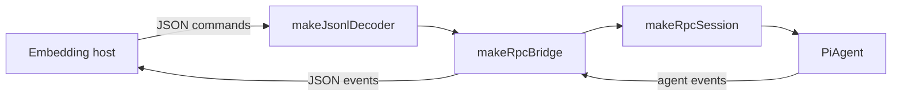

# @endo/agentry

Shared infrastructure for building agentic harnesses across endo packages.

The package is intended to grow as a small library of capabilities that more
than one agent harness in the monorepo needs.
Each surface is opt-in via its own subpath export.

## Current surfaces

- `@endo/agentry` (root) — `defineAgent` plus the harness primitives
  (marshalling, the credential seam, model resolution, and the pi-agent
  builder).
- `@endo/agentry/define-agent` — `defineAgent(config)`, which returns a maker
  function: the powerless definition is the closure, and calling the returned
  maker with a powers handle is the powered stage.
- `@endo/agentry/harness` — the code-mode-independent primitives the harness is
  built from: `toolResultToSmallcaps` + the SmallCaps codec, `makeEnvCredentials`
  (the single reader of `process.env`), `resolveModel`/`defineModels`, and
  `makePiAgent`. `@endo/lal` imports these directly.
- `@endo/agentry/execute` — the execute-only code-mode tool and its presets
  (`makeCodeModeAgent`, `makeCodeModeGitLoopAgent`), built on `defineAgent`.
- `@endo/agentry/rpc` — the stdio JSONL RPC bridge: a language-agnostic,
  LF-delimited JSON surface that lets a spawned child drive a `PiAgent` over
  stdin and stdout. `@endo/genie` ships a genie-flavored runnable (`rpc.js`)
  wiring its own agent to these building blocks.

## defineAgent

`defineAgent(config)` returns a **maker function**. The powerless definition —
the resolved model, the system instructions, and the model-facing tool surface —
is captured in the maker's closure and holds no powers. Calling the maker with a
powers handle is the powered stage:

```js
import { defineAgent } from '@endo/agentry';

const makeAgent = defineAgent({
  model: 'sonnet', // a profile id, or a concrete pi-ai Model
  instructions: 'You are a helpful agent.',
  tools: [/* model-facing AgentTools */],
});

const agent = makeAgent(/* powers? */);
await agent.prompt('Hello.');
await agent.waitForIdle();
```

Config is scoped to `{ model, instructions, tools, endow }`. The `endow` hook
derives the powered tool surface and credential resolver from the live powers at
construction time, so the powerless definition never holds a capability.
Importing `@endo/agentry/harness` performs **no** provider registration as a
side effect; instead the harness registers pi-ai's built-in providers lazily, on
first model resolution, so a registry model resolves without any caller-side
setup:

```js
import { defineAgent } from '@endo/agentry';

const makeAgent = defineAgent({
  model: 'anthropic/claude-opus-4-5-20251101',
});
```

`actions`/`skills`/`cwd` are deferred.

## Credential seam

`@endo/agentry/harness` exports `makeEnvCredentials`, the harness's single choke
point for reading secrets. `get(name)` resolves a key out of the ambient process
environment (the default) or a caller-supplied record. Every consumer resolves
secrets through `.get()`, so swapping the env-backed provider for a
capability-scoped secret store is a local change.

## Code mode

Code mode is just an agent whose one tool is `execute`. `makeCodeModeAgent` is
the code-mode preset of `defineAgent`:

```js
import { makeCodeModeAgent } from '@endo/agentry/execute';

const { agent } = makeCodeModeAgent({
  model,
  powers: { workspace, git, gitMode: 'historyRewrite' },
});
await agent.prompt('Inspect the current branch.');
await agent.waitForIdle();
```

`gitMode` is `'readOnly'`, `'readWrite'` (the default), or
`'historyRewrite'`.
The history-rewrite mode requires a Git capability minted with explicit
history-rewrite authority and advertises the elevated `gitHistory` surface,
including amend and reword operations.

The model-facing tool surface is intentionally one tool:
`execute({ source, resultName? })`. Workspace and Git operations happen inside
the Endo Compartment through lexical caps (`workspace`, `git`, and any
configured named powers). The lexical globals are advertised to the model by
name and a one-line description only — the model discovers a capability's method
surface at runtime via `E(cap).__getMethodNames__()` rather than reading a
checked-in type declaration.

Plain-data completion values returned from `execute` are encoded for the model
with the SmallCaps marshaller (`@endo/marshal`), so BigInts and other
non-JSON-native passable values round-trip losslessly. Capability-bearing
results are not serialized; the agent keeps them live inside the Compartment and
stores them under a pet name via `resultName` when it needs them across turns.

## Stdio JSONL RPC bridge

`@endo/agentry/rpc` is the language-agnostic, LF-delimited JSON surface from
[`designs/endopi-stdio-rpc-bridge.md`](../../designs/endopi-stdio-rpc-bridge.md):
an embedding host (an IDE plug-in, a CI runner, a Familiar pane) drives a
`PiAgent` by writing one JSON command per line and reading one JSON event per
line back. Diagnostics stay on a separate error stream, so the protocol stream
carries only records. A genie-backed runnable is `@endo/genie`'s `rpc.js`; a
host that embeds the bridge directly composes the exported building blocks.

The framing follows Pi's rule exactly: records are separated by `\n` and
nothing else. A strict decoder is used rather than Node's `readline`, which
also splits on `\r`, `U+2028`, and `U+2029`; a host in another language must
not, so neither does the bridge.

Commands the bridge accepts (the optional `id` is echoed on every event a
command produces, for correlation):

```json
{"id": "1", "type": "prompt", "message": "Hello"}
{"type": "steer", "message": "Stop and do this instead"}
{"type": "abort"}
{"type": "list_models"}
{"type": "set_model", "provider": "anthropic", "model": "claude-sonnet-4-6"}
{"type": "get_status"}
```

Events the bridge emits during a round:

```json
{"type": "message_start", "message": {…}, "id": "1"}
{"type": "message_update", "delta": "…partial text…", "id": "1"}
{"type": "endo:thinking", "delta": "…reasoning…", "id": "1"}
{"type": "tool_execution_start", "toolCallId": "…", "toolName": "bash", "args": {…}, "id": "1"}
{"type": "tool_execution_end", "toolCallId": "…", "toolName": "bash", "result": {…}, "isError": false, "id": "1"}
{"type": "message_end", "message": {…}, "id": "1"}
{"type": "agent_end", "id": "1"}
```

The streaming events mirror the daemon agent's own event stream.
`endo:`-namespaced events carry Endo-only affordances the base Pi surface does
not define, per the design's posture on namespacing. The `tool_execution_*`
events appear only for a tool-bearing session; the protocol layer relays them
whenever the session has tools.

The session is single-flight: a `prompt` received while a round is still
running is rejected, and mid-round control arrives as separate `steer` and
`abort` commands. Concurrent sessions over one process (a channel id per
record) are the design's later multiplexing phase.

The exported building blocks: `makeJsonlDecoder` and `encodeRecord` (framing),
`translateAgentEvent` (event mapping), `makeRpcSession` (a session over a
`PiAgent`), `makeRpcBridge` (the dispatcher), and `serveRpc` (the stream
wiring).



## Status

This package is private to the endo monorepo. The API is best-effort stable but
pre-1.0 — breaking changes in this package can land in the same PR as their
workspace consumers.
