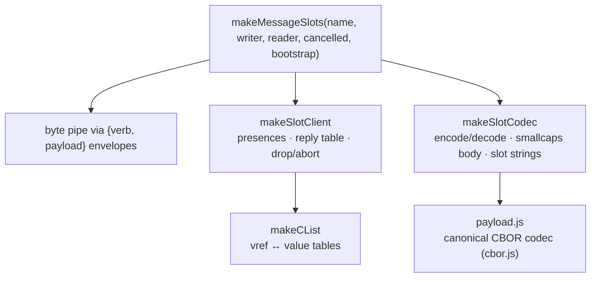

# @endo/slots

JavaScript client for the slot-machine wire protocol — a flat
four-verb (`deliver` / `resolve` / `drop` / `abort`) capability bus
designed to interoperate byte-for-byte with the Rust crate at
`rust/endo/slots`.

## Architecture



## Quick start

```js
import { makeMessageSlots } from '@endo/slots';

const { getBootstrap, closed } = makeMessageSlots(
  'my-session',
  envelopeWriter,   // .next({verb, payload}) sends a frame
  envelopeReader,   // AsyncIterable<{verb, payload}>
  cancelledP,
  rootObject,       // exported as Local Object position 1
);

const remoteRoot = getBootstrap();
const reply = await E(remoteRoot).method(args);
```

`makeMessageSlots` is a drop-in analogue for `makeMessageCapTP`
from `@endo/daemon/connection.js` — same signature, same return
shape.  See `packages/daemon/test/bench-results/slot-machine-status.md`
for the splice plan.

## Wire-protocol invariants

- **Canonical CBOR.**  Minimal-head integers (RFC 8949 §4.2), no
  indefinite-length containers, no maps, no floats.  Every encoder
  is byte-deterministic; the Rust crate produces and accepts the
  same byte sequences.
- **Descriptors.**  A descriptor is the 2-element CBOR array
  `[kindByte, position]`.  `kindByte = (kind << 1) | dir`, with
  `dir` in bit 0 (`Local=0`, `Remote=1`) and `kind` in bits 1–2
  (`Object=0`, `Promise=1`, `Answer=2`, `Device=3`).  Reserved bits
  are rejected on decode.
- **Slot strings.**  Marshal-side slot identifiers are canonical
  `/^s(0|[1-9][0-9]*)$/`.  Non-canonical forms (`s00`, `s+1`,
  `s1e2`) are rejected.
- **Position-1 root.**  Both peers export their session root as
  `{ Local, Object, position: 1 }`.  No explicit handshake — the
  Rust supervisor's kref registry unifies the two.  See
  `src/bootstrap.js`.
- **Pinned fixtures.**  Hex-equality fixtures live in both
  `test/payload.test.js` and `rust/endo/slots/src/wire/payload.rs`
  for `deliver`, `resolve`, `drop`, `abort` plus the `descriptor`
  reference and `SessionId` digests.  Either side will fail-loudly
  if the wire shape drifts.

## Daemon integration

The worker-side splice is in `packages/daemon/src/bus-worker-node-raw.js`,
gated by `ENDO_USE_SLOT_MACHINE=1`.  When the flag is unset (the
default), the worker speaks CapTP exactly as before.  The matching
daemon-side splice in `bus-daemon-rust-xs.js` is described in
`packages/daemon/test/bench-results/slot-machine-splice-plan.md`.

## Layered API

If `makeMessageSlots` is too high-level, drop down to:

- `makeSlotClient({ clist, codec, sendEnvelope })` — `HandledPromise`
  presences, reply-promise table, drop / abort routing, optional
  `FinalizationRegistry` auto-drop.
- `makeSlotCodec({ clist, makePresence })` — `@endo/marshal`
  wrapper that produces `deliver` / `resolve` payload bytes.
- `makeCList({ label })` — bidirectional value↔descriptor map with
  monotonic position counters.
- `bootstrap`, `LOCAL_ROOT`, `REMOTE_ROOT` — the position-1 root
  convention.
- `encodeDeliverPayload` / `decodeDeliverPayload` etc. — the raw
  wire codec.

## Testing

```sh
yarn test         # 74 unit tests
yarn lint         # eslint + tsc
```

Tests run under SES lockdown (`ses-ava` + `prepare-endo.js`).
